# Introduction

This reference manual is split into the following sections:
* Containers
* Controls and Display
* Menus
* Additional Widgets

Each widget has a brief description of its function and includes a screen shot of the widget, description of its constructor, list of properties and any public methods. There is also a section describing the specific Theme used for the widget, If you want to customize it for your purposes this is a great starting point

Check out the Notes section near the end, it might save you a lot of time by avoiding problems. And perhaps of But most importantly, there is a runnable code example that you can copy and it should just work.

# Contents

* [Containers](#containers)
  * [sCTk](#sctk)
  * [sCTkToplevel](#sctktoplevel)
  * [sCTkFrame](#sctkframe)
  * [sCTkScrollableFrame](#sctkscrollableframe)
* [Controls and Display](#controls-and-display)
  * [sCTkButtonPrimary](#sctkbuttonprimary)
  * [sCTkButtonSecondary](#sctkbuttonsecondary)
  * [sCTkButtonTertiary](#sctkbuttontertiary)
  * [sCTkCheckBox](#sctkcheckbox)
  * [sCTkEntryPrimary](#sctkentryprimary)
  * [sCTkEntrySecondary](#sctkentrysecondary)
  * [sCTkLabelPrimary](#sctklabelprimary)
  * [sCTkLabelSecondary](#sctklabelsecondary)
  * [sCTkLabelTertiary](#sctklabeltertiary)
  * [sCTkProgressBar](#sctkprogressbar)
  * [sCTkRadioButton](#sctkradiobutton)
  * [sCTkScrollbar](#sctkscrollbar)
  * [sCTkSegmentedButton](#sctksegmentedbutton)
  * [sCTkSlider](#sctkslider)
  * [sCTkSwitch](#sctkswitch)
  * [sCTkTabview](#sctktabview)
  * [sCTkTextboxPrimary](#sctktextboxprimary)
  * [sCTkTextboxSecondary](#sctktextboxsecondary)
* [Menus](#menus)
  * [sCTkComboBox](#sctkcombobox)
  * [sCTkOptionMenuPrimary](#sctkoptionmenuprimary)
  * [sCTkOptionMenuSecondary](#sctkoptionmenusecondary)
* [Additional Widgets Provided by sCustomTkinter](#additional-widgets-provided-by-scustomtkinter)
  * [sCTKDialBase](#sctkdialbase)
  * [sCTkDialContinuous](#sctkdialcontinuous)
  * [sCTkDialRange](#sctkdialrange)
  * [sCTkDialSelector](#sctkdialselector)
  * [sCTkFileExplorer](#sctkfileexplorer)
  * [sCTkFrameLabeledPrimary](#sctkframelabeledprimary)
  * [sCTkLabelSecondary](#sctklabelsecondary)
  * [sCTkFrameOutlined](#sctkframeoutlined)
  * [sCTkMessagebox](#sctkmessagebox)
  * [sCTkPathChooser](#sctkpathchooser)
  * [sCTkScrollArea](#sctkscrollarea)
  * [sCTkSelector](#sctkselector)
  * [sCTkSeparator](#sctkseparator)
  * [sCTkSMeter](#sctksmeter)
  * [sCTkSMeterBar](#sctksmeterbar)
  * [sCTkSpinbox](#sctkspinbox)
  * [sCTkSwitchAlt](#sctkswitchalt)
  * [sCTkTableview](#sctktableview)

---

# Containers

The following widgets are the containers that will hold your user interface. There are some additional constainers that might be of interest that are listed later in the section where we document additional widgets added with sCustomTkinter.


## sCTk

The `sCTk` is the primary main window container class wrapper for the `sCustomTkinter` workstation library ecosystem. It acts as a clean, direct pass-through equivalent to its foundational parent container layout class, `customtkinter.CTk`.

### 📌 Localized Table of Contents
* [Core Architectural Purpose](#core-architectural-purpose)
* [Constructor Reference](#constructor-reference)

---

### Core Architectural Purpose

The application base frame serves as the core master anchor for your interface tree:
1. **Decoupled User Space:** It eliminates the architectural requirement to maintain raw `import customtkinter` bindings inside your station cockpit panel code.
2. **Framework Alignment:** It standardizes the root initialization sequence pass to match the repository's native object naming conventions (`sCTkFrame`, `sCTkButtonPrimary`, etc.).

---

### Constructor Reference

It maps perfectly onto all native window properties, event loop callbacks, lifecycle handlers, and geometries tracking parameters out-of-the-box.

```python
from sCTk import sCTk
from sCTkThemes import apply_sCTkThemes

1. Initialize centralized framework look records natively on system boot
apply_sCTkThemes()

2. Instantiate your primary root application backplane directly
app = sCTk()
app.geometry("800x600")
app.title("Main Control Rig Backplane")

app.mainloop()
```


[Return to Table of Contents](#contents)


## sCTkToplevel

The `sCTkToplevel` is the secondary window container class wrapper for the `sCustomTkinter` workstation library ecosystem. It acts as a clean, direct pass-through equivalent to its foundational parent window layout class, `customtkinter.CTkToplevel`.

### 📌 Localized Table of Contents
* [Core Architectural Purpose](#core-architectural-purpose)
* [Constructor Reference](#constructor-reference)

---

### Core Architectural Purpose

The secondary window container serves as an independent, modal, or auxiliary pop-up anchor for your interface tree:
1. **Decoupled User Space:** It eliminates the architectural requirement to maintain raw `import customtkinter` bindings inside your sub-window or dialog code.
2. **Framework Alignment:** It standardizes auxiliary window initialization sequences to match the repository's native object naming conventions (`sCTkFrame`, `sCTkButtonPrimary`, etc.).

---

### Constructor Reference

It maps perfectly onto all native top-level window properties, modal behaviors, grab events, lifecycle handlers, and geometry configurations out-of-the-box.

```python
from sCTk import sCTk
from sCTkToplevel import sCTkToplevel
from sCTkThemes import apply_sCTkThemes

# 1. Initialize centralized framework look records natively on system boot
apply_sCTkThemes()

# 2. Instantiate your primary root application backplane directly
app = sCTk()
app.geometry("800x600")
app.title("Main Control Rig Backplane")

# 3. Spawn a secondary, decoupled window surface overhead
dialog = sCTkToplevel(master=app)
dialog.geometry("400x300")
dialog.title("Auxiliary Operational Panel")

app.mainloop()
```


[Return to Table of Contents](#contents)


## sCTkFrame

### Table of Contents
* [API Property Reference](#api-property-reference)
* [Constructor](#constructor)
* [Centralized Stylesheet Setup](#centralized-stylesheet-setup-sctkthemesjson)
* [Other Notes](#other-notes)
* [Implementation Example & Test Harness](#implementation-example--test-harness)

---

A clean, theme-compliant standard backplane container layout chassis widget. It functions as the geometric foundation card for stacking controls, isolating interface subsections, and grouping multi-frequency layout grids.

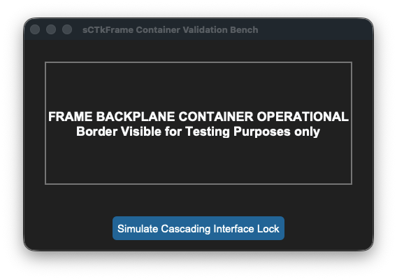
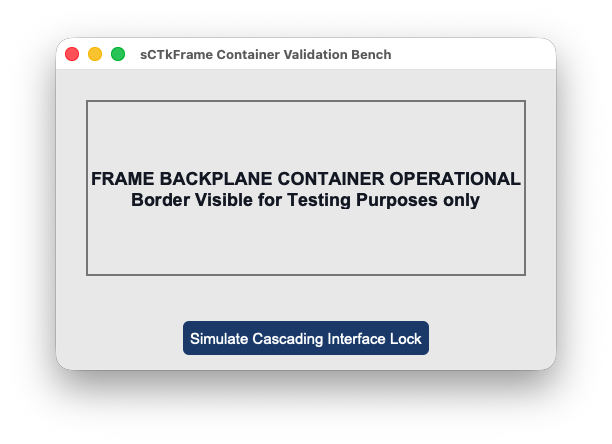


### API Property Reference

| Property / Feature | Standard CustomTkinter | Your `sCustomTkinter` Setup |
| :--- | :--- | :--- |
| **Instantiation** | `ctk.CTkFrame(master)` | `sCTkFrame(master)` *(Backplane Container Chassis)* |
| **File Mapping** | Everything runs under one core native framework layout tracker. | Streamlined and compiled programmatically across `sCTkFrame.py` and `ThemeableWidget.py`. |
| **State Lock** | *Not Supported Natively* | `base_container.state("disabled")`<br>**OR**<br>`base_container.configure(state="disabled")`<br><br>**Dual-Routing State Bypasser:** Absorbs state parameters smoothly without crashing. This prevents interface layout exceptions when cascading operational locks down across complex structural grids. |
| `get_state()` | *Not Supported Natively* | `Method -> str` explicit verification query matching system test assertions, always returning `"normal"`. |

---

### Constructor

Initialize a custom backplane container frame card instance. High-level custom configuration parameters passed by Pygubu (like `translator`, `on_first_object_cb`, `image_loader`, and `data_pool`) are automatically intercepted, processed, and purged early by the `ThemeableWidget` mixin layer before the native constructor fires. Geometry shapes, border offsets, and corner styles map cleanly out of central stylesheet parameters.

```python
# Instantiate a master panel frame container card layout
dashboard_card = sCTkFrame(
    master=root_window,
    border_width=2
)

# Render the container frame widget inside your view using geometry packers
dashboard_card.pack(expand=True, fill="both", padx=25, pady=25)
```

---

### Centralized Stylesheet Setup (`sCTkThemes.json`)
```json
{
    "sCTkFrame": {
        "fg_color": ["#F8FAFC", "#1E293B"],
        "border_color": ["#E2E8F0", "#334155"],
        "border_width": 1,
        "corner_radius": 8
    }
}
```

### Other notes
* **Bypassing the BaseUI Middleman:** This component inherits cleanly and directly from `ctk.CTkFrame` and `ThemeableWidget`, bypassing the intermediate template layout files entirely. It connects the component straight to CustomTkinter's appearance modes while using the multiple inheritance protocol layer to sanitize keyword arrays.
* **Automated Lifecycle Handshake:** At the absolute bottom of the initialization routine, the constructor fires `self._finalize_themeable_lifecycle()` to safely dispatch first-object registration notifications back up to Pygubu's master parent script controllers, unlocking full composition support.
* **Deep-Copy Dictionary Isolation Shield:** Because CustomTkinter's native container initialization loops mutate and delete attributes directly out of raw dictionary data footprints during its boot pass, the constructor clones your configurations into `self._local_defaults = dict(self.final_kw)` beforehand. This preserves your color mappings safely.
* **Passive Operation Parity:** Background chassis containers do not implement a variable `disabled_map`. They remain perpetually active (`"normal"`) to allow child inputs sitting on top of their canvas face to handle their own active drawing states independently.

---

### Implementation Example & Test Harness

Below is a complete, self-contained test execution script demonstrating how to properly embed an `sCTkFrame` asset container along with a cascading lock simulation pass.

```python
#!/usr/bin/python3

# =====================================================================
# 🛠️ TESTING HARNESS IMPORTS & SETUP for Frame
# =====================================================================

from scustomtkinter import sCTkButtonPrimary, sCTkLabelPrimary, sCTk, sCTkFrame


if __name__ == "__main__":

    root = sCTk()
    root.geometry("500x300")
    root.title("sCTkFrame Container Validation Bench")

    # Instantiate your custom theme-compliant frame element chassis
    base_container = sCTkFrame(root, border_width=2)
    base_container.pack(expand=True, fill="both", padx=30, pady=30)
#
#     # Add a simple sub-element child widget to verify structural clipping layouts
    lbl_marker = sCTkLabelPrimary(base_container, text="FRAME BACKPLANE CONTAINER OPERATIONAL\n"+
                                  "Border Visible for Testing Purposes only")
    lbl_marker.pack(expand=True)

#
#     # Standard dashboard interaction toggle simulation pass
    def toggle_panel_lock():
        current_mode = base_container.get_state()
        target = "disabled" if current_mode == "normal" else "normal"
#
#         # Explicitly testing the dual-routing capability via configure()
        base_container.configure(state=target)
        print(f"Logged Verification Hook -> base_container.get_state() = {base_container.get_state()}")

#
    btn_lock = sCTkButtonPrimary(root, text="Simulate Cascading Interface Lock", command=toggle_panel_lock)
    btn_lock.pack(side="bottom", pady=15)
#
#     # Run the interactive boot tracking logs
    print("--- BOOT INITIALIZATION PASSTHROUGH ---")
    base_container.state("disabled")
    print("state (Disabled Pass) =", base_container.get_state())  # Output: normal (Frames bypass disabled masks)

    base_container.state("normal")
    print("state (Normal Pass)   =", base_container.get_state())  # Output: normal
    print("========================================\n")

    root.mainloop()


```

[Return to Table of Contents](#contents)


## sCTkScrollableFrame

### Table of Contents
* [API Property Reference](#api-property-reference)
* [Constructor](#constructor)
* [Convenience Functions](#convenience-functions)
* [Advanced Layout Inspection API](#advanced-layout-inspection-api)
* [Centralized Stylesheet Setup](#centralized-stylesheet-setup-sctkthemesjson)
* [Other Notes](#other-notes)
* [Implementation Example & Test Harness](#implementation-example--test-harness)

---

An advanced scrollable window viewport capsule inheriting natively and directly from CustomTkinter's `ctk.CTkScrollableFrame` layouts. It streamlines geometry tracking parameters and isolates background mouse-wheel layers cleanly while leaving the application developer completely in control of child layout configuration sweeps across theme switches.


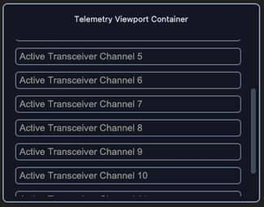
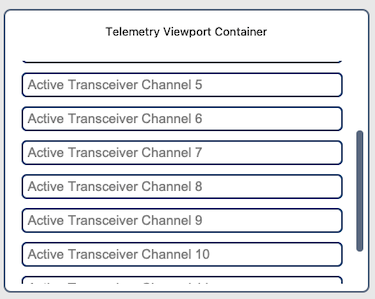


### API Property Reference

| Property / Feature | Standard CustomTkinter | Your `sCustomTkinter` Setup |
| :--- | :--- | :--- |
| **Instantiation** | `ctk.CTkScrollableFrame(master)` | `sCTkScrollableFrame(master)` *(Themed Viewport Container)* |
| **File Mapping** | Config metrics look up loose un-managed palette snapshot lists. | Streamlined and compiled programmatically across `sCTkScrollableFrame.py` and `ThemeableWidget.py`. |
| **State Lock** | *Not Supported Natively* | Passive Container Operation Parity.<br><br>**Baseline Design Workflow:** Containers remain perpetually active (`"normal"`) to allow child inputs sitting on top of their canvas face to handle their own active drawing states and color switches independently. |
| `winfo_children()` | Returns raw internal Tkinter tree widgets, including private scrollbars. | Overridden signature supporting filtered application widget lookups. |
| `get_children()` | *Not Supported Natively* | Convenience method returning clean application-level custom components. |
| `get_all_children()` | *Not Supported Natively* | Convenience method returning direct, unfiltered access to the entire core tree. |

---

### Constructor

Initialize a custom themed scrollable frame viewport layout chassis. High-level custom configuration parameters passed by Pygubu (like `translator`, `on_first_object_cb`, `image_loader`, and `data_pool`) are automatically intercepted, processed, and purged early by the `ThemeableWidget` mixin layer before the native constructor fires.

```python
# Instantiate a telemetry logging scrollable list frame card
log_viewport = sCTkScrollableFrame(
    master=dashboard,
    width=380,
    height=250,
    label_text="Telemetry Viewport Container"
)

# Render the widget inside your container panel
log_viewport.pack(padx=20, pady=20, fill="both", expand=True)
```

---

### Convenience Functions
```python
# Evaluate current container configuration attributes smoothly out of local registries
current_mode = log_viewport.get_state()      # Always returns 'normal'
```

### Advanced Layout Inspection API

To insulate your structural look configurations from breaking when cascading loops pass through composite layouts, the system overrides native Tkinter window query behaviors.

#### `winfo_children(include_private: bool = False) -> list`

* **`include_private=False` (Default):** Drops private internal wrapper artifacts from appearing in clean application loops. The method dynamically strips out underlying `CTkScrollbar`, `CTkCanvas`, and raw `Canvas` components so layout managers and state controllers only target your functional custom entries and forms.
* **`include_private=True`:** Drops the filter shield instantly, returning the raw, unmanipulated C-level native Tkinter core window lineage tree for deep forensic tracking or platform diagnostics.

```python
# Pure application-layer cascade: Targets only form entries, skipping scrollbars natively
for widget in test_frame.winfo_children():
    widget.configure(state="disabled")

# Forensic debugging pass: Uncovers the hidden internal CustomTkinter layers
print(test_frame.winfo_children(include_private=True))
```

### Centralized Stylesheet Setup (`sCTkThemes.json`)
```json
{
    "sCTkScrollableFrame": {
        "fg_color": ["#FAFAFA", "#11141A"],
        "border_color": ["#CBD5E1", "#222933"],
        "label_fg_color": ["#E2E8F0", "#1A222D"],
        "scrollbar_button_color": ["#94A3B8", "#475569"],
        "scrollbar_button_hover_color": ["#64748B", "#334155"]
    }
}
```

### Other Notes
* **Bypassing the BaseUI Skeletons:** This component avoids all autogenerated Pygubu `baseui` template classes, mapping directly to native CustomTkinter classes to keep the recursive theme broadplane completely unblocked.
* **Automated Lifecycle Handshake:** Fires `self._finalize_themeable_lifecycle()` at the absolute end of the constructor initialization track to cleanly pass instance registration hooks up to Pygubu's master parent script controllers.

### ⚠️ Critical Apple Touch & Multi-Platform Scrolling Constraint

When packing layout controls interior to an `sCTkScrollableFrame` view pane, **you must strictly avoid mixing native CustomTkinter widgets (e.g., `ctk.CTkEntry`, `ctk.CTkButton`) alongside your themed `sCustomTkinter` equivalents.**

* **The Event Swallowing Trap:** Native `ctk` elements do not participate in our repository's unified recursive event-braid mesh. Because they aggressively capture touch focus inputs on macOS, any native element will act like a layout "black hole"—completely freezing trackpads and Apple Magic Mouse swipes the moment a user hovers their mouse cursor directly over that row.
* **The Resolution Rule:** Always pack your framework's custom theme-aligned classes (e.g., **`sCTkEntryPrimary`**, **`sCTkButtonPrimary`**, **`sCTkCheckBox`**). Because they inherit from our synchronized base mixins, they naturally allow high-precision touch parameters and traditional hardware scrollwheel click ticks to bubble straight up to the master viewport coordinate canvas flawlessly across macOS, Windows, and Linux.

---

### Implementation Example & Test Harness

Below is a complete, self-contained test execution script demonstrating how to properly embed an `sCTkScrollableFrame` container layout along with an external cascade state toggle switch button.

```python
#!/usr/bin/python3
# =====================================================================
# 🛠️ TESTING HARNESS IMPORTS & SETUP for ScrollableFrame
# =====================================================================

import customtkinter as ctk
from scustomtkinter import sCTkButtonPrimary, sCTkEntryPrimary, sCTk, sCTkScrollableFrame

if __name__ == "__main__":

    root = sCTk()
    root.title("ScrollableFrame Pure Baseline Verification")
    root.geometry("450x420")

    test_frame = sCTkScrollableFrame(root, width=380, height=250, label_text="Telemetry Viewport Container")
    test_frame.pack(padx=20, pady=20, fill="both", expand=True)

    for i in range(12):
        mock_entry = sCTkEntryPrimary(test_frame, placeholder_text=f"Active Transceiver Channel {i + 1}")
        mock_entry.pack(padx=10, pady=5, fill="x")

    _is_locked = False
    def toggle_cascade_lockout():
        global _is_locked
        _is_locked = not _is_locked
        target = "disabled" if _is_locked else "normal"

        toggle_btn.configure(text="Enforce State: NORMAL" if _is_locked else "Enforce State: DISABLED")

        # 🔑 CLEAN APPLICATION-LEVEL LOOKOUT LOOP CASCADE:
        # The external control logic explicitly dictates when and how to update nested elements!
        for entry_widget in test_frame.get_children():
            if hasattr(entry_widget, "configure"):
                try:
                    entry_widget.configure(state=target)
                except Exception:
                    pass

    toggle_btn = sCTkButtonPrimary(root, text="Enforce State: DISABLED", command=toggle_cascade_lockout)
    toggle_btn.pack(side="bottom", pady=15)

    btn_theme = sCTkButtonPrimary(root, text="Toggle Theme Skin", command=lambda: ctk.set_appearance_mode(
        "Dark" if ctk.get_appearance_mode() == "Light" else "Light"))
    btn_theme.pack(side="bottom", pady=5)

    test_frame._toggle_scroll_bindings(bind=True)
    root.mainloop()
```

[Return to Table of Contents](#contents)


# Controls and Display

These are the basic everyday widgets that you will use frequently.  There are some additional selections below where we document the extra widgets included in sCustomTkinter.


## sCTkButtonPrimary

The dominant primary command execution button widget component wrapping `customtkinter.CTkButton`. It incorporates high-priority telemetry layout overrides (**Alarm Warning Blocks** and **Latching Pressed Anchors**) layered over an independent deep-copy keyword caching shield to isolate colors from native dictionary mutation failures while leveraging `ThemeableWidget` mixins to natively handle Pygubu data streams.


### API Property Reference

| Property / Feature | Standard CustomTkinter | Your `sCustomTkinter` Setup |
| :--- | :--- | :--- |
| **Instantiation** | `ctk.CTkButton(master)` | `sCTkButtonPrimary(master)` *(Dominant Action Button)* |
| **File Mapping** | Everything runs under one core native layout pipeline. | Streamlined and compiled programmatically across `sCTkButtonPrimary.py` and `ThemeableWidget.py`. |
| `state(mode)` | `self.configure(state=...)` | `Method (str)` handling layout tracking maps and toggling active canvas event binds natively. |
| `get_state()` | `self.cget("state")` | `Method -> str` explicit verification query matching system test assertions. |
| `set_pressed(bool)` | *Not Available Natively* | **Latching Hook:** Locks background contrast styles to match `pressed_map` guidelines. |
| `set_alarm_state(bool)` | *Not Available Natively* | **Priority Warning Hook:** Overrides interaction states to show a red warning panel. |

---

### Constructor

Initialize a custom primary button instance. High-level configuration variables passed from Pygubu (like `translator` and `on_first_object_cb`) are automatically intercepted, processed, and purged early by the `ThemeableWidget` mixin layer before the native constructor fires.

```python
# Instantiate a primary command action execution button
tx_trigger = sCTkButtonPrimary(
    master=control_panel,
    text="TRANSMIT EXECUTE",
    command=on_transmit_triggered
)

# Render the widget inside your parent container geometry packer panel
tx_trigger.pack(fill="x", padx=40, pady=10)
```

---

### Convenience Functions
```python
# Force an immediate priority warning red flash profile highlight
tx_trigger.set_alarm_state(True)  # Forces alarm_map layout configurations forward

# Toggle latching states or apply absolute interaction locks smoothly
tx_trigger.set_pressed(True)      # Locks background contrast styles to pressed_map rules
tx_trigger.state("disabled")      # Unbinds mouse canvas routines and applies muted gray fills
```

### Centralized Stylesheet Setup (`sCTkThemes.json`)
```json
{
    "sCTkButtonPrimary": {
        "fg_color": ["#1A4375", "#1F6AA5"],
        "hover_color": ["#112A4B", "#194A7A"],
        "text_color": ["#FFFFFF", "#FFFFFF"],
        "border_width": 0,
        "corner_radius": 6,
        "disabled_map": {
            "fg_color": ["#F3F4F6", "#1F2937"],
            "border_color": ["#E5E7EB", "#374151"],
            "text_color": ["#94A3B8", "#64748B"]
        },
        "pressed_map": {
            "fg_color": ["#0F2542", "#134267"],
            "border_color": ["#0F2542", "#134267"],
            "text_color": ["#94A3B8", "#CBD5E1"]
        },
        "alarm_map": {
            "fg_color": ["#DC2626", "#EF4444"],
            "hover_color": ["#991B1B", "#7F1D1D"],
            "text_color": ["#FFFFFF", "#FFFFFF"]
        }
    }
}
```

### Other Notes
* **Bypassing the BaseUI Skeletons:** Completely avoids transitional helper UI files, connecting straight to `ctk.CTkButton` and `ThemeableWidget` multiple inheritance pathways to avoid signature collisions.
* **Automated Lifecycle Handshake:** Triggers `self._finalize_themeable_lifecycle()` at the absolute bottom of the initialization sequence to pass object creation lifecycle hooks straight back up to Pygubu application factories.

---

### Implementation Example & Test Harness

Below is a complete, self-contained test execution script demonstrating how to properly embed an `sCTkButtonPrimary` alongside an interactive theme state track and system warning switch.

```python
# =====================================================================
# 🛠️ TESTING HARNESS IMPORTS & SETUP for Primary Button
# =====================================================================

import customtkinter as ctk
from scustomtkinter import sCTkFrame, sCTkButtonPrimary,sCTk


if __name__ == "__main__":

    root = sCTk()
    root.geometry("450x340")
    root.title("Primary Command Button Real-Time Validation Bench")

    base = sCTkFrame(root)
    base.pack(expand=True, fill="both", padx=20, pady=20)

    command_btn = sCTkButtonPrimary(base, text="Primary Action Control")
    command_btn.pack(expand=False, fill="x", padx=40, pady=10)

    def toggle_system_alarm():
        new_alarm_mode = not command_btn.is_alarm
        command_btn.set_alarm_state(new_alarm_mode)
        btn_alarm_switch.configure(text="System Alarm (ACTIVE - Click to Clear)" if new_alarm_mode else "System Alarm")

    def toggle_disabled_lock():
        target = "disabled" if command_btn.get_state() == "normal" else "normal"
        command_btn.configure(state=target)
        btn_lock.configure(text="Lock Button (Set 'disabled')" if target == "normal" else "Unlock Button (Set 'normal')")

    def toggle_skin_mode():
        current_skin = ctk.get_appearance_mode()
        ctk.set_appearance_mode("Light" if current_skin == "Dark" else "Dark")

    btn_alarm_switch = sCTkButtonPrimary(base, text="System Alarm", command=toggle_system_alarm)
    btn_alarm_switch.pack(pady=5)

    btn_lock = sCTkButtonPrimary(base, text="Lock Button (Set 'disabled')", command=toggle_disabled_lock)
    btn_lock.pack(pady=5)

    btn_theme = sCTkButtonPrimary(base, text="Simulate Global Theme Shift", command=toggle_skin_mode)
    btn_theme.pack(side="bottom", pady=10)

    root.mainloop()

```

[Return to Table of Contents](#contents)


## sCTkButtonSecondary

A specialized, theme-compliant secondary button component widget variant wrapping `customtkinter.CTkButton` designed to act as a latching status toggle selector. It implements a deep-copy keyword caching shield to preserve custom visual style parameters from native mutation traps and prevent `NoneType` canvas validation exceptions.


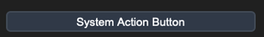
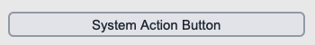


### API Property Reference

| Property / Feature | Standard CustomTkinter | Your `sCustomTkinter` Setup |
| :--- | :--- | :--- |
| **Instantiation** | `ctk.CTkButton(master)` | `sCTkButtonSecondary(master)` *(Latching Toggle Selector)* |
| **File Mapping** | Component definitions bundle under single active tracks. | Streamlined and compiled programmatically across `sCTkButtonSecondary.py` and `ThemeableWidget.py`. |
| `state(mode)` | `self.configure(state=...)` | `Method (str)` managing layout tracking maps and toggling active canvas event binds natively. |
| `get_state()` | `self.cget("state")` | `Method -> str` explicit verification query matching system test assertions. |
| `set_pressed(bool)` | *Not Available Natively* | **Latching Hook:** Dynamically updates visual button states to look locked down. |

---

### Constructor

Initialize a custom secondary latching toggle button instance. Custom parameters passed from Pygubu builder allocations (like string `translator` tracks or `data_pool` environments) are automatically intercepted, processed, and purged early by the `ThemeableWidget` mixin layer before the native constructor fires.

```python
# Instantiate a secondary latching toggle button element
vfo_lock_toggle = sCTkButtonSecondary(
    master=control_panel,
    text="LOCK ACTIVE VFO MODE",
    command=on_vfo_lock_toggled
)

# Render the widget inside your parent container geometry tracker layout
vfo_lock_toggle.pack(fill="x", padx=40, pady=10)
```

---

### Convenience Functions
```python
# Force an active button press visual accent highlight on the fly
vfo_lock_toggle.set_pressed(True)   # Shifts colors to match your pressed_map rules

# Evaluate active visual modes or apply absolute user interaction locks
current_mode = vfo_lock_toggle.get_state() # Returns 'normal' or 'disabled'
vfo_lock_toggle.state("disabled")          # Unbinds mouse canvas routines and applies muted gray fills
```

### Centralized Stylesheet Setup (`sCTkThemes.json`)
```json
{
    "sCTkButtonSecondary": {
        "fg_color": "transparent",
        "border_color": ["#CBD5E1", "#44403C"],
        "text_color": ["#334155", "#E7E5E4"],
        "border_width": 1,
        "corner_radius": 6,
        "disabled_map": {
            "fg_color": ["#F1F5F9", "#171412"],
            "border_color": ["#E2E8F0", "#292524"],
            "text_color": ["#94A3B8", "#57534E"]
        },
        "pressed_map": {
            "fg_color": ["#E2E8F0", "#44403C"],
            "border_color": ["#94A3B8", "#6B7280"],
            "text_color": ["#000000", "#FFFFFF"]
        }
    }
}
```

### Other notes
* **Bypassing the BaseUI Skeletons:** This component inherits cleanly and directly from native CustomTkinter classes and `ThemeableWidget`, completely bypassing the intermediate template layout files entirely to preserve high-DPI image scaling.
* **Canvas Interaction Toggles:** When shifted into a `disabled` state configuration, the widget explicitly unbinds mouse events (`<Enter>`, `<Leave>`, `<Button-1>`) at the canvas level to lock interactions and prevent memory leaks. Shifting back to `normal` restores the listeners seamlessly.
* **Automated Lifecycle Handshake:** At the absolute bottom of the initialization track, the constructor triggers `self._finalize_themeable_lifecycle()` to safely notify top-level Pygubu container managers that the widget is compiled.

### Implementation Example & Test Harness

Below is a complete, self-contained test execution script demonstrating how to properly embed an `sCTkButtonSecondary` alongside an interactive latch controller.

```python
#!/usr/bin/python3

# =====================================================================
# 🛠️ TESTING HARNESS IMPORTS & SETUP for Secondary Button
# =====================================================================

import customtkinter as ctk
from scustomtkinter import sCTkFrame, sCTk, sCTkButtonSecondary

if __name__ == "__main__":
    root = sCTk()
    root.geometry("450x320")
    root.title("Secondary Button Real-Time Validation Bench")

    base = sCTkFrame(root)
    base.pack(expand=True, fill="both", padx=20, pady=20)

    widget = sCTkButtonSecondary(base, text="System Action Button")
    widget.pack(padx=40, pady=10, fill="x")

    def toggle_disabled_lock():
        target = "disabled" if widget.get_state() == "normal" else "normal"
        widget.configure(state=target)
        btn_lock.configure(text="Lock Button" if target == "normal" else "Unlock Button")

    def toggle_skin_mode():
        current_skin = ctk.get_appearance_mode()
        ctk.set_appearance_mode("Light" if current_skin == "Dark" else "Dark")

    btn_lock = ctk.CTkButton(base, text="Lock Button", command=toggle_disabled_lock)
    btn_lock.pack(pady=5)

    btn_theme = ctk.CTkButton(base, text="Simulate Global Theme Shift", command=toggle_skin_mode)
    btn_theme.pack(side="bottom", pady=10)

    root.mainloop()

```

[Return to Table of Contents](#contents)


## sCTkButtonTertiary

An outline-driven custom toggle variant button widget component styled specifically for sub-presets, tuning markers, and option lock keys wrapping `customtkinter.CTkButton`. It utilizes an independent deep-copy keyword caching shield and a dynamic runtime accent fallback detector to align button typography with CustomTkinter system configurations automatically.


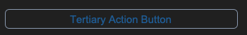
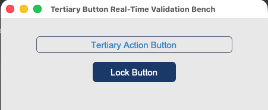


### API Property Reference

| Property / Feature | Standard CustomTkinter | Your `sCustomTkinter` Setup |
| :--- | :--- | :--- |
| **Instantiation** | `ctk.CTkButton(master)` | `sCTkButtonTertiary(master)` *(Outline Latching Button)* |
| **File Mapping** | Everything runs under one core native framework layout layer. | Streamlined and compiled programmatically across `sCTkButtonTertiary.py` and `ThemeableWidget.py`. |
| `state(mode)` | `self.configure(state=...)` | `Method (str)` handling layout tracking map transformations (`'normal'`, `'disabled'`) and canvas unbindings. |
| `get_state()` | `self.cget("state")` | `Method -> str` explicit verification query matching system test assertions. |
| `set_pressed(bool)` | *Not Available Natively* | **Latching Hook:** Locks background contrast styles to match `pressed_map` guidelines. |

---

### Constructor

Initialize a custom tertiary button instance. Custom parameters passed from Pygubu (like `translator`, `on_first_object_cb`, `image_loader`, and `data_pool`) are automatically intercepted, processed, and purged early by the `ThemeableWidget` mixin layer before the native constructor fires. If no explicit `text_color` parameters are discovered inside `sCTkThemes.json`, the constructor queries CustomTkinter's baseline colors (`["#3B8ED0", "#1F6AA5"]`) automatically to preserve unified system highlights.

```python
# Instantiate a tertiary outline latching button
preset_select = sCTkButtonTertiary(
    master=control_panel,
    text="PRESET CHANNEL A",
    command=on_preset_selected
)

# Render the widget inside your parent container geometry packer panel
preset_select.pack(fill="x", padx=40, pady=10)
```

---

### Centralized Stylesheet Setup (`sCTkThemes.json`)
```json
{
    "sCTkButtonTertiary": {
        "fg_color": "transparent",
        "border_color": ["#3B8ED0", "#1F6AA5"],
        "text_color": null,
        "border_width": 1,
        "corner_radius": 4,
        "disabled_map": {
            "fg_color": "transparent",
            "border_color": ["#CBD5E1", "#374151"],
            "text_color": ["#94A3B8", "#64748B"]
        },
        "pressed_map": {
            "fg_color": ["#3B8ED0", "#1F6AA5"],
            "border_color": ["#3B8ED0", "#1F6AA5"],
            "text_color": ["#FFFFFF", "#FFFFFF"]
        }
    }
}
```

### Other Notes
* **Bypassing the BaseUI Middleman:** This component inherits cleanly and directly from native CustomTkinter classes and `ThemeableWidget`, bypassing the intermediate template layout files entirely to avoid signature collisions.
* **Automated Lifecycle Handshake:** At the absolute bottom of the initialization track, the constructor triggers `self._finalize_themeable_lifecycle()` to safely notify top-level Pygubu container managers that the widget is compiled.

---

### Implementation Example & Test Harness

Below is a complete, self-contained test execution script demonstrating how to properly embed an `sCTkButtonTertiary` alongside latching switches.

```python
#!/usr/bin/python3

# =====================================================================
# 🛠️ TESTING HARNESS IMPORTS & SETUP for Tertiary Button
# =====================================================================

import customtkinter as ctk
from scustomtkinter import sCTkFrame, sCTk, sCTkButtonPrimary, sCTkButtonTertiary

if __name__ == "__main__":
    root = sCTk()
    root.geometry("450x320")
    root.title("Tertiary Button Real-Time Validation Bench")

    base = sCTkFrame(root)
    base.pack(expand=True, fill="both", padx=20, pady=20)

    widget = sCTkButtonTertiary(base, text="Tertiary Action Button")
    widget.pack(padx=40, pady=10, fill="x")

    def toggle_disabled_lock():
        target = "disabled" if widget.get_state() == "normal" else "normal"
        widget.configure(state=target)
        btn_lock.configure(text="Lock Button" if target == "normal" else "Unlock Button")

    def toggle_skin_mode():
        current_skin = ctk.get_appearance_mode()
        ctk.set_appearance_mode("Light" if current_skin == "Dark" else "Dark")

    btn_lock = sCTkButtonPrimary(base, text="Lock Button", command=toggle_disabled_lock)
    btn_lock.pack(pady=5)

    btn_theme = sCTkButtonPrimary(base, text="Simulate Global Theme Shift", command=toggle_skin_mode)
    btn_theme.pack(side="bottom", pady=10)

    root.mainloop()


```

[Return to Table of Contents](#contents)


## sCTkCheckBox

### Table of Contents
* [API Property Reference](#api-property-reference)
* [Constructor](#constructor)
* [Convenience Functions](#convenience-functions)
* [Centralized Stylesheet Setup](#centralized-stylesheet-setup-sctkthemesjson)
* [Other Notes](#other-notes)
* [Implementation Example & Test Harness](#implementation-example--test-harness)

---

A specialized, theme-compliant checkbox element component variant designed for binary option selections, telemetry locks, and parameter configurations. It integrates an independent deep-copy keyword caching shield and clean programmatic inheritance to preserve checkbox configurations without intermediate file middlemen.


### API Property Reference

| Property / Feature | Standard CustomTkinter | Your `sCustomTkinter` Setup |
| :--- | :--- | :--- |
| **Instantiation** | `ctk.CTkCheckBox(master)` | `sCTkCheckBox(master)` *(Binary Option Selector)* |
| **File Mapping** | Everything runs under a single active component module. | Streamlined and compiled programmatically across `sCTkCheckBox.py` and `ThemeableWidget.py`. |
| `state(mode)` | `self.configure(state=...)` | `Method (str)` handling layout tracking map transformations (`'normal'`, `'disabled'`) via sequential update passes. |
| `get_state()` | `self.cget("state")` | `Method -> str` explicit verification query matching system test assertions. |
| `get()` | `self.get()` | Returns `1` if selected, or `0` if empty. |
| `select()` / `deselect()` | Native methods | Forces check marks on or off programmatically. |

---

### Constructor

Initialize a custom checkbox option instance. Pygubu parameters (such as `translator` or `on_first_object_cb`) are stripped, isolated, and safely processed early by the `ThemeableWidget` mixin layer before the native constructor fires.

```python
# Instantiate a primary option selection checkbox
logging_toggle = sCTkCheckBox(
    master=control_panel,
    text="ENABLE LOGGING FRAMEWORK",
    command=on_logging_selection_changed
)

# Render the widget inside your parent container geometry tracker panel
logging_toggle.pack(padx=20, pady=10)
```

---

### Convenience Functions
```python
# Programmatically alter choices or evaluate state configurations on the fly
is_active = logging_toggle.get()          # Returns 1 (checked) or 0 (unchecked)
logging_toggle.select()                    # Forces the checkmark button state to fill inside the box
logging_toggle.state("disabled")           # Disables checking interaction and applies muted gray fills
```

### Centralized Stylesheet Setup (`sCTkThemes.json`)
```json
{
    "sCTkCheckBox": {
        "fg_color": ["#1A4375", "#1F6AA5"],
        "border_color": ["#94A3B8", "#4B5563"],
        "text_color": ["#111827", "#F9FAFB"],
        "checkmark_color": ["#FFFFFF", "#FFFFFF"],
        "border_width": 2,
        "corner_radius": 4,
        "disabled_map": {
            "fg_color": ["#E5E7EB", "#374151"],
            "border_color": ["#CBD5E1", "#4B5563"],
            "text_color": ["#94A3B8", "#64748B"],
            "checkmark_color": ["#94A3B8", "#4B5563"]
        }
    }
}
```

### Other notes
* **Bypassing the BaseUI Middleman:** Completely removes transitional `baseui` template classes, mapping directly to `ctk.CTkCheckBox` and `ThemeableWidget` multiple inheritance pathways to avoid signature collisions.
* **Automated Lifecycle Handshake:** Triggers `self._finalize_themeable_lifecycle()` at the absolute bottom of the initialization track to safely register instances with Pygubu layout trees out of the box.

---

### Implementation Example & Test Harness

Below is a complete, self-contained test execution script demonstrating how to properly embed an `sCTkCheckBox` alongside an interactive theme state track.

```python


# =====================================================================
# 🛠️ TESTING HARNESS IMPORTS & SETUP for CheckBox
# =====================================================================

import customtkinter as ctk
from scustomtkinter import sCTkFrame, sCTk, sCTkButtonPrimary, sCTkCheckBox

if __name__ == "__main__":

    root = sCTk()
    root.geometry("450x300")
    root.title("Checkbox Interaction Telemetry Bench")

    base = sCTkFrame(root)
    base.pack(expand=True, fill="both", padx=20, pady=20)

    widget = sCTkCheckBox(base, text="Enable Logging Framework")
    widget.configure(command=lambda: print("Checked" if widget.get() == 1 else "Unchecked"))
    widget.pack(expand=True, fill="none", padx=10, pady=10)

    def toggle_widget_state():
        current_mode = widget.get_state()
        target = "disabled" if current_mode == "normal" else "normal"
        widget.configure(state=target)
        btn_toggle.configure(text="Unlock Checkbox" if target == "disabled" else "Lock Checkbox (Set 'disabled')")
        print(f"Logged Verification Hook -> widget.get_state() = {widget.get_state()}")

    btn_toggle = sCTkButtonPrimary(base, text="Lock Checkbox (Set 'disabled')", command=toggle_widget_state)
    btn_toggle.pack(side="bottom", pady=15)

    print("--- BOOT INITIALIZATION PASSTHROUGH ---")
    widget.state("disabled")
    print("state (Disabled Pass) =", widget.get_state())

    widget.state("normal")
    print("state (Normal Pass)   =", widget.get_state())
    print("========================================\n")

    root.mainloop()
```

[Return to Table of Contents](#contents)


## sCTkEntryPrimary

### Table of Contents
* [API Property Reference](#api-property-reference)
* [Constructor](#constructor)
* [Convenience Functions](#convenience-functions)
* [Centralized Stylesheet Setup](#centralized-stylesheet-setup-themesjson)
* [Other Notes](#other-notes)
* [Implementation Example & Test Harness](#implementation-example--test-harness)

---

Dominant form input lane widget variant designed for primary user data entry (e.g., core configuration inputs, direct numeric entries, or text queries). It implements a direct native class configuration architecture combined with the `ThemeableWidget` sanitizer pass to guarantee complete safety against keyword collisions.

*For alternative helper input fields or metadata input channels, see the companion component documentation page:* [sCTkEntrySecondary](sCTkEntrySecondary.md).


### API Property Reference

| Property / Feature | Standard CustomTkinter | Your `sCustomTkinter` Setup |
| :--- | :--- | :--- |
| **Instantiation** | `ctk.CTkEntry(master)` | `sCTkEntryPrimary(master)` *(Primary form data field)* |
| **Maintenance** | Local style overrides duplicated across files manually. | Clean updates across all layouts modified directly in the JSON file. |
| **File Mapping** | Everything runs under one core native text pipeline. | Streamlined and compiled cleanly across `sCTkEntryPrimary.py` and `ThemeableWidget.py`. |
| **State Lock** | `self.configure(state="disabled")` | `input_field.state("disabled")`<br>**OR**<br>`input_field.configure(state="disabled")`<br><br>**Dual-Routing State Pipeline:** Natively handles both syntax paths. Freezes text interaction lanes, blocks keyboard event streams, and dynamically shifts colors out of `disabled_map` guidelines via strict sequential update passes. |
| `get_state()` | `self.cget("state")` | `Method -> str` explicit verification query matching system test assertions. |

---

### Constructor

Initialize a custom primary form data field instance. High-level custom configuration parameters from Pygubu (like `translator`, `on_first_object_cb`, `image_loader`, and `data_pool`) are automatically intercepted, processed, and purged early by the `ThemeableWidget` mixin layer before the native constructor fires.

```python
# Instantiate a primary frequency entry lane input field
freq_input_field = sCTkEntryPrimary(
    master=control_panel,
    placeholder_text="Enter Transceiver Frequency...",
    textvariable=vfo_string_var
)

# Render the widget inside your parent container coordinate tracker panel
freq_input_field.pack(fill="x", padx=40, pady=10)
```

---

### Convenience Functions
```python
# Selectively manipulate the internal textual elements on the fly
frequency_input.insert(0, "14.032.000") # Populates text buffer indices with data strings
frequency_input.delete(0, \"end\")         # Wipes the entry line lane completely back to empty
active_buffer = frequency_input.get()    # Queries the live active text character arrays

# Evaluate current state configurations or apply absolute user interaction locks via dual-routing syntax
current_mode = frequency_input.get_state() # Returns 'normal' or 'disabled'
frequency_input.state("disabled")          # Locks data entry tracks and applies muted gray fills
```

### Centralized Stylesheet Setup (`themes.json`)
```json
{
    "sCTkEntryPrimary": {
        "fg_color": ["#FFFFFF", "#111827"],
        "border_color": ["#1A4375", "#4B5563"],
        "text_color": ["#1F2937", "#FFFFFF"],
        "placeholder_text_color": ["#94A3B8", "#64748B"],
        "disabled_map": {
            "fg_color": ["#F3F4F6", "#1F2937"],
            "border_color": ["#E5E7EB", "#374151"],
            "text_color": ["#94A3B8", "#64748B"],
            "placeholder_text_color": ["#CBD5E1", "#475569"]
        }
    }
}
```

### Other notes
* **Bypassing the BaseUI Middleman:** This widget inherits directly from `ctk.CTkEntry` and `ThemeableWidget`, entirely removing any autogenerated Pygubu intermediate templates. This simplifies the class footprint while fully retaining dynamic string translation and lifecycle callback capabilities natively.
* **Automated Lifecycle Handshake:** At the absolute bottom of the initialization routine, the constructor fires `self._finalize_themeable_lifecycle()` to safely dispatch first-object registration notifications back up to Pygubu's master parent script systems.

---

### Implementation Example & Test Harness

Below is a complete, self-contained test execution script demonstrating how to properly embed an `sCTkEntryPrimary` input lane field along with an interactive status switch toggle.

```python
#!/usr/bin/python3
# =====================================================================
# 🛠️ TESTING HARNESS IMPORTS & SETUP for Entry Secondary
# =====================================================================

import customtkinter as ctk
from scustomtkinter import sCTkFrameLabeledSecondary, sCTkButtonPrimary, sCTk, sCTkLabelTertiary, sCTkEntrySecondary

# =====================================================================
# 🛠️ TESTING HARNESS IMPORTS & SETUP
# =====================================================================
import sCTkThemes
from sCTkFrame import sCTkFrame

if __name__ == "__main__":
    sCTkThemes.apply_sCTkThemes()

    root = ctk.CTk()
    root.geometry("500x450")
    root.title("sCTkEntryPrimary Real-Time Validation Bench")

    base = sCTkFrame(root)
    base.pack(expand=True, fill="both", padx=20, pady=20)

    widget = sCTkEntryPrimary(base, placeholder_text="Enter Transceiver Callsign...")
    widget.pack(fill="x", padx=20, pady=20)

    def toggle_logger_states():
        """Cycles operational states between active feed and locked desaturated tracks."""
        current_state = widget.get_state()
        target = "disabled" if current_state == "normal" else "normal"

        widget.configure(state=target)
        btn_toggle.configure(text="Activate Entry Field" if target == "disabled" else "Lock Entry Field")
        print(f"Logged Verification Hook -> widget.get_state() = {widget.get_state().upper()}")

    def toggle_appearance_skin():
        current_mode = ctk.get_appearance_mode()
        ctk.set_appearance_mode("Light" if current_mode == "Dark" else "Dark")

    btn_toggle = ctk.CTkButton(base, text="Lock Entry Field", command=toggle_logger_states)
    btn_toggle.pack(fill="x", padx=10, pady=5)

    btn_theme = ctk.CTkButton(base, text="Toggle Theme Skin", command=toggle_appearance_skin)
    btn_theme.pack(fill="x", padx=10, pady=5)

    root.mainloop()

```

[Return to Table of Contents](#contents)


## sCTkEntrySecondary

### Table of Contents
* [API Property Reference](#api-property-reference)
* [Constructor](#constructor)
* [Convenience Functions](#convenience-functions)
* [Centralized Stylesheet Setup](#centralized-stylesheet-setup-themesjson)
* [Other Notes](#other-notes)
* [Implementation Example & Test Harness](#implementation-example--test-harness)

---

Auxiliary / secondary metadata input lane widget variant designed for secondary data capture (e.g., logging channels, station call signs, panel notes, or sub-metadata queries).

*For dominant form input fields or direct operational data entry channels, see the primary component documentation page:* [sCTkEntryPrimary](sCTkEntryPrimary.md).


### API Property Reference

| Property / Feature | Standard CustomTkinter | Your `sCustomTkinter` Setup |
| :--- | :--- | :--- |
| **Instantiation** | `ctk.CTkEntry(master)` | `sCTkEntrySecondary(master)` *(Secondary metadata field)* |
| **Maintenance** | Local style overrides duplicated across files manually. | Clean updates across all layouts modified directly in the JSON file. |
| **File Mapping** | Everything runs under one core native text pipeline. | Streamlined and compiled cleanly across `sCTkEntrySecondary.py` and `ThemeableWidget.py`. |
| **State Lock** | `self.configure(state="disabled")` | `input_field.state("disabled")`<br>**OR**<br>`input_field.configure(state="disabled")`<br><br>**Dual-Routing State Pipeline:** Natively handles both syntax paths. Freezes text interaction lanes, blocks keyboard event streams, and dynamically shifts colors out of `disabled_map` guidelines via sequential repaint loops. |
| `get_state()` | `self.cget("state")` | `Method -> str` explicit verification query matching system test assertions. |

---

### Constructor

Initialize a custom secondary data field instance. High-level custom configuration parameters from Pygubu (like `translator`, `on_first_object_cb`, `image_loader`, and `data_pool`) are automatically intercepted, processed, and purged early by the `ThemeableWidget` mixin layer before the native constructor fires.

```python
# Instantiate a secondary metadata user entry field
callsign_input = sCTkEntrySecondary(
    master=control_panel,
    placeholder_text="Enter Station Call Sign...",
    textvariable=callsign_string_var
)

# Render the widget inside your parent container coordinate tracker panel
callsign_input.pack(fill="x", padx=40, pady=10)
```

---

### Convenience Functions
```python
# Selectively manipulate the internal textual elements on the fly
callsign_input.insert(0, "W1AW")         # Populates text buffer indices with data strings
callsign_input.delete(0, "end")          # Wipes the entry line lane completely back to empty
active_buffer = callsign_input.get()     # Queries the live active text character arrays

# Evaluate current state configurations or apply absolute user interaction locks via dual-routing syntax
current_mode = callsign_input.get_state() # Returns 'normal' or 'disabled'
callsign_input.state("disabled")           # Locks data entry tracks and applies muted gray fills
```

### Centralized Stylesheet Setup (`themes.json`)
```json
{
    "sCTkEntrySecondary": {
        "fg_color": ["#F8FAFC", "#111827"],
        "border_color": ["#94A3B8", "#374151"],
        "text_color": ["#475569", "#94A3B8"],
        "placeholder_text_color": ["#94A3B8", "#475569"],
        "disabled_map": {
            "fg_color": ["#F1F5F9", "#171412"],
            "border_color": ["#E2E8F0", "#292524"],
            "text_color": ["#94A3B8", "#57534E"],
            "placeholder_text_color": ["#E5E7EB", "#1C1917"]
        }
    }
}
```

### Other notes
* **Bypassing the BaseUI Middleman:** This component inherits cleanly and directly from `ctk.CTkEntry` and `ThemeableWidget`, bypassing the intermediate template layout files entirely. It connects the component straight to CustomTkinter's appearance modes while using the multiple inheritance protocol layer to sanitize keyword arrays.
* **Coordinated Lifehook Repaint Pass:** Implements an overridden `_set_appearance_mode()` hook that catches global theme skin shifts (via dashboard buttons or native macOS preferences), briefly toggles the widget's internal state open to redraw vector lines, and locks it back down with zero color-caching freezes.

---

### Implementation Example & Test Harness

Below is a complete, self-contained test execution script demonstrating how to properly embed an `sCTkEntrySecondary` input lane field along with an interactive status switch toggle.

```python
#!/usr/bin/python3

# =====================================================================
# 🛠️ TESTING HARNESS IMPORTS & SETUP for EntrySecondary
# =====================================================================

import customtkinter as ctk
from scustomtkinter import sCTkFrame, sCTkButtonPrimary, sCTk, sCTkLabelSecondary, sCTkEntrySecondary


if __name__ == "__main__":

    root = sCTk()
    root.geometry("450x260")
    root.title("sCTkEntrySecondary Testing Deck")

    base = sCTkFrame(root)
    base.pack(expand=True, fill="both", padx=20, pady=20)

    # Label notice layer to monitor buffer array activity
    lbl_monitor = sCTkLabelSecondary(base, text="Console monitor active...")
    lbl_monitor.pack(pady=10)

    # Instantiate your custom secondary helper field
    input_field = sCTkEntrySecondary(base, placeholder_text="Enter configuration metadata...")
    input_field.pack(expand=False, fill="x", padx=40, pady=10)

    # Monitor keystrokes live
    input_field.bind("<KeyRelease>", lambda e: lbl_monitor.configure(text=f"Live Buffer: {input_field.get()}"))

    def toggle_operational_state():
        """Toggles the helper input field between normal active and dimmed disabled profiles."""
        current_mode = input_field.get_state()
        target = "disabled" if current_mode == "normal" else "normal"

        # Explicitly testing the dual-routing capability via configure()
        input_field.configure(state=target)
        btn_toggle.configure(
            text="Lock Helper Input (Set 'disabled')" if target == "normal" else "Unlock Helper Input (Set 'normal')")
        print(f"Logged Verification Hook -> input_field.get_state() = {input_field.get_state()}")

    btn_toggle = sCTkButtonPrimary(base, text="Lock Helper Input (Set 'disabled')", command=toggle_operational_state)
    btn_toggle.pack(side="bottom", pady=15)

    # Run the interactive boot tracking logs
    print("--- BOOT INITIALIZATION PASSTHROUGH ---")
    input_field.state("disabled")
    print("state (Disabled Pass) =", input_field.get_state())  # Output: disabled

    input_field.state("normal")
    print("state (Normal Pass)   =", input_field.get_state())  # Output: normal
    print("========================================\n")

    root.mainloop()
```

[Return to Table of Contents](#contents)


## sCTkLabelPrimary

### Table of Contents
* [API Property Reference](#api-property-reference)
* [Constructor](#constructor)
* [Centralized Stylesheet Setup](#centralized-stylesheet-setup-sctkthemesjson)
* [Other Notes](#other-notes)
* [Implementation Example & Test Harness](#implementation-example--test-harness)

---

The dominant primary header typography display label widget component wrapping `customtkinter.CTkLabel`. It features an independent deep-copy keyword caching shield and an advanced multi-state color-dimming interceptor to automatically shift text contrasts when subsystem components enter disabled sequences.


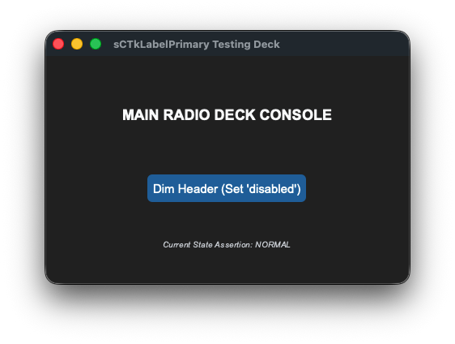


### API Property Reference

| Property / Feature | Standard CustomTkinter | Your `sCustomTkinter` Setup |
| :--- | :--- | :--- |
| **Instantiation** | `ctk.CTkLabel(master)` | `sCTkLabelPrimary(master)` *(Dominant Header Typography)* |
| **File Mapping** | Direct module definitions run without structured configuration. | Streamlined and compiled programmatically across `sCTkLabelPrimary.py` and `ThemeableWidget.py`. |
| **State Lock** | *Not Supported Natively* | `primary_label.state("disabled")`<br>**OR**<br>`primary_label.configure(state="disabled")`<br><br>**Framework-Wide State Support:** Natively supported across all label components (`Primary`, `Secondary`, `Tertiary`). It intercepts state configuration calls and dynamically dims typography layouts based on centralized `disabled_map` metrics. |
| `get_state()` | *Not Supported Natively* | `Method -> str` explicit verification query matching system test assertions. |

---

### Constructor

Initialize a custom primary header label instance. Configuration metrics map cleanly out of central stylesheet parameters and are automatically sanitized by the `ThemeableWidget` mixin layer before the native constructor fires.

```python
# Instantiate a primary dominant dashboard header label element
console_header = sCTkLabelPrimary(
    master=control_panel,
    text="MAIN RADIO DECK CONSOLE"
)

# Render the widget inside your layout panel using geometry managers
console_header.pack(expand=True, pady=10)
```
### Centralized Stylesheet Setup (`sCTkThemes.json`)
```json
{
    "sCTkLabelPrimary": {
        "fg_color": "transparent",
        "text_color": ["#1A4375", "#FFFFFF"],
        "font": ["Arial", 14, "bold"],
        "disabled_map": {
            "text_color": ["#94A3B8", "gray50"]
        }
    }
}
```

---

### Other Notes
* **Deep-Copy Dictionary Isolation Shield:** Because CustomTkinter's native geometry constructor routines mutate and drop keys directly out of parsed configuration structures during early boot phases, the constructor clones your data configurations into `self._local_defaults = dict(self.final_kw)` beforehand. This prevents layout repaints from failing.
* **Dynamic Dark Mode Pass-Through:** When returning to an active state, the visual interceptor reads directly from your protected `_local_defaults` cache. If no hardcoded text color is explicitly discovered, it hands control back to CustomTkinter's master `ThemeManager` to natively paint high-contrast system fonts.
* **Automated Lifecycle Handshake:** Triggers `self._finalize_themeable_lifecycle()` at the absolute bottom of the initialization track to cleanly pass instance registration hooks straight back up to Pygubu parent controllers.

---

### Implementation Example & Test Harness

Below is a complete, self-contained test execution script demonstrating how to properly embed an `sCTkLabelPrimary` header element along with an interactive status switch toggle.

```python
#!/usr/bin/python3

# =====================================================================
# 🛠️ TESTING HARNESS IMPORTS & SETUP for Label Secondary
# =====================================================================

from scustomtkinter import sCTkFrame, sCTkButtonPrimary, sCTkLabelSecondary,sCTk, sCTkLabelPrimary

if __name__ == "__main__":

    root = sCTk()
    root.geometry("450x280")
    root.title("sCTkLabelPrimary Testing Deck")

    container = sCTkFrame(root, fg_color="transparent")
    container.pack(expand=True, fill="both", padx=30, pady=30)

    primary_label = sCTkLabelPrimary(container, text="MAIN RADIO DECK CONSOLE")
    primary_label.pack(expand=True, pady=10)

    lbl_status = sCTkLabelSecondary(container, text="Current State Assertion: NORMAL", font=("Arial", 10, "italic"))
    lbl_status.pack(side="bottom", pady=5)

    def toggle_label_states():
        """Cycles the dominant header label states between normal and disabled profiles."""
        current_state = primary_label.get_state()
        target = "disabled" if current_state == "normal" else "normal"

        primary_label.configure(state=target)

        if target == "disabled":
            btn_toggle.configure(text="Activate Header (Set 'normal')")
            lbl_status.configure(text="Current State Assertion: DISABLED")
        else:
            btn_toggle.configure(text="Dim Header (Set 'disabled')")
            lbl_status.configure(text="Current State Assertion: NORMAL")

        print(f"Logged Verification Hook -> primary_label.get_state() = {primary_label.get_state()}")

    btn_toggle = sCTkButtonPrimary(
        container,
        text="Dim Header (Set 'disabled')",
        command=toggle_label_states,
        fg_color=("#1A4375", "#3B8ED0"),
        hover_color=("#112A4B", "#1F6AA5")
    )
    btn_toggle.pack(expand=True, pady=15)

    print("--- BOOT INITIALIZATION PASSTHROUGH ---")
    primary_label.state("disabled")
    print(f"state (Disabled Pass) = {primary_label.get_state().upper()}")

    primary_label.state("normal")
    print(f"state (Normal Pass)   = {primary_label.get_state().upper()}")
    print("========================================\n")

    root.mainloop()


```

[Return to Table of Contents](#contents)


## sCTkLabelSecondary

### Table of Contents
* [API Property Reference](#api-property-reference)
* [Constructor](#constructor)
* [Centralized Stylesheet Setup](#centralized-stylesheet-setup-sctkthemesjson)
* [Other Notes](#other-notes)
* [Implementation Example & Test Harness](#implementation-example--test-harness)

---

The intermediate sub-section display typography label widget component. It features an independent deep-copy keyword caching shield and an advanced multi-state color-dimming interceptor to automatically shift text contrasts when subsystem components enter disabled sequences.

*For dominant main dashboard header components, see the companion component documentation page:* [sCTkLabelPrimary](sCTkLabelPrimary.md).


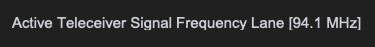
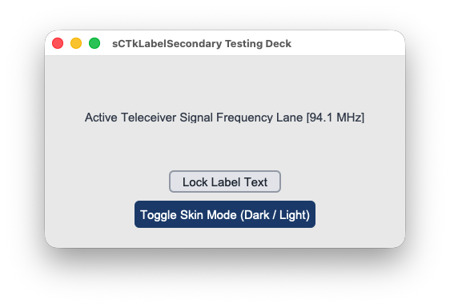


### API Property Reference

| Property / Feature | Standard CustomTkinter | Your `sCustomTkinter` Setup |
| :--- | :--- | :--- |
| **Instantiation** | `ctk.CTkLabel(master)` | `sCTkLabelSecondary(master)` *(Intermediate Section Typography)* |
| **File Mapping** | Direct module definitions run without structured configuration. | Separated safely across `sCTkLabelSecondary.py` and `ThemeableWidget.py`. |
| **State Lock** | *Not Supported Natively* | `test_label.state("disabled")`<br>**OR**<br>`test_label.configure(state="disabled")`<br><br>**Framework-Wide State Support:** Natively supported across all label components (`Primary`, `Secondary`, `Tertiary`). It intercepts state configuration calls and dynamically dims typography layouts based on centralized `disabled_map` metrics. |
| `get_state()` | *Not Supported Natively* | `Method -> str` explicit verification query matching system test assertions. |

---

### Constructor

Initialize a custom secondary intermediate label instance. Configuration metrics map cleanly out of central stylesheet parameters.

```python
# Instantiate a secondary intermediate dashboard label element
panel_sub_label = sCTkLabelSecondary(
    master=control_panel,
    text="VFO STATUS PANEL: ACTIVE"
)

# Render the widget inside your layout panel using geometry managers
panel_sub_label.pack(expand=True, pady=10)
```

---

### Centralized Stylesheet Setup (`sCTkThemes.json`)
```json
{
    "sCTkLabelSecondary": {
        "fg_color": "transparent",
        "text_color": ["#475569", "#CBD5E1"],
        "font": ["Arial", 11, "bold"],
        "disabled_map": {
            "text_color": ["#94A3B8", "gray50"]
        }
    }
}
```

### Other notes
* **Deep-Copy Dictionary Isolation Shield:** Because CustomTkinter's native geometry constructor routines mutate and drop keys directly out of parsed configuration structures during early boot phases, the constructor clones your data configurations into `self._local_defaults = dict(self.final_kw)` beforehand. This prevents layout repaints from failing.
* **Dynamic Dark Mode Pass-Through:** When returning to an active state, the visual interceptor reads directly from your protected `_local_defaults` cache. If no hardcoded text color is explicitly discovered, it hands control back to CustomTkinter's master `ThemeManager` to natively paint high-contrast system fonts.

---

### Implementation Example & Test Harness

Below is a complete, self-contained test execution script demonstrating how to properly embed an `sCTkLabelSecondary` sub-section element along with an interactive status switch toggle.

```python
#!/usr/bin/python3

# =====================================================================
# 🛠️ TESTING HARNESS IMPORTS & SETUP for Label Primery
# =====================================================================

import customtkinter as ctk
from scustomtkinter import sCTkFrame, sCTkButtonPrimary, sCTkButtonSecondary, sCTk, sCTkLabelSecondary

if __name__ == "__main__":

    root = sCTk()
    root.geometry("450x240")
    root.title("sCTkLabelSecondary Testing Deck")

    base = sCTkFrame(root)
    base.pack(expand=True, fill="both", padx=20, pady=20)

    # Instantiate your custom text component cell
    widget = sCTkLabelSecondary(base, text="Active Teleceiver Signal Frequency Lane [94.1 MHz]")
    widget.pack(expand=True, padx=20, pady=20)


    def toggle_operational_state():
        current_mode = widget.get_state()
        target = "disabled" if current_mode == "normal" else "normal"
        widget.configure(state=target)
        btn_toggle.configure(text="Lock Label Text" if target == "normal" else "Unlock Label Text")


    def toggle_appearance_skin():
        current_mode = ctk.get_appearance_mode()
        target = "Light" if current_mode == "Dark" else "Dark"
        ctk.set_appearance_mode(target)


    btn_theme = sCTkButtonPrimary(base, text="Toggle Skin Mode (Dark / Light)", command=toggle_appearance_skin)
    btn_theme.pack(side="bottom", pady=(5, 5))

    btn_toggle = sCTkButtonSecondary(base, text="Lock Label Text", command=toggle_operational_state)
    btn_toggle.pack(side="bottom", pady=(10, 5))

    root.mainloop()


```

[Return to Table of Contents](#contents)


## sCTkLabelTertiary

### Table of Contents
* [API Property Reference](#api-property-reference)
* [Constructor](#constructor)
* [Centralized Stylesheet Setup](#centralized-stylesheet-setup-sctkthemesjson)
* [Other Notes](#other-notes)
* [Implementation Example & Test Harness](#implementation-example--test-harness)

---

The fine inline description, sub-legend, or auxiliary notice typography display label widget component wrapping `customtkinter.CTkLabel`. It features an independent deep-copy keyword caching shield and an advanced multi-state color-dimming interceptor to automatically shift text contrasts when subsystem components enter disabled sequences.

*For prominent main dashboard header and mid-level sections, see the companion component pages:* [sCTkLabelPrimary](sCTkLabelPrimary.md) and [sCTkLabelSecondary](sCTkLabelSecondary.md).


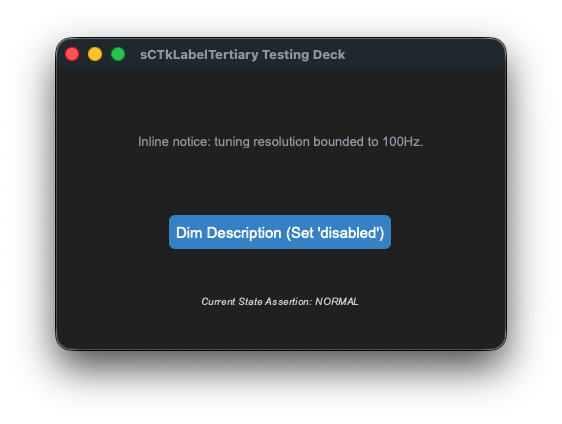
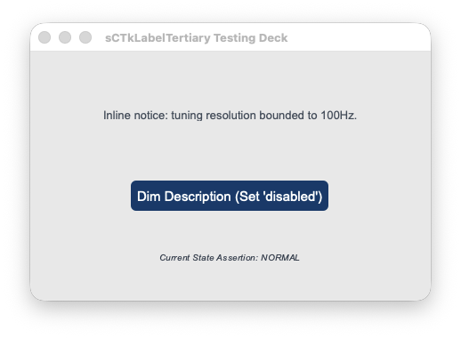


### API Property Reference

| Property / Feature | Standard CustomTkinter | Your `sCustomTkinter` Setup |
| :--- | :--- | :--- |
| **Instantiation** | `ctk.CTkLabel(master)` | `sCTkLabelTertiary(master)` *(Inline Legend/Description Typography)* |
| **File Mapping** | Direct module definitions run without structured configuration. | Streamlined and compiled programmatically across `sCTkLabelTertiary.py` and `ThemeableWidget.py`. |
| **State Lock** | *Not Supported Natively* | `tertiary_label.state("disabled")`<br>**OR**<br>`tertiary_label.configure(state="disabled")`<br><br>**Framework-Wide State Support:** Natively supported across all label components (`Primary`, `Secondary`, `Tertiary`). It intercepts state configuration calls and dynamically dims typography layouts based on centralized `disabled_map` metrics. |
| `get_state()` | *Not Supported Natively* | `Method -> str` explicit verification query matching system test assertions. |

---

### Constructor

Initialize a custom tertiary description label instance. Configuration metrics map cleanly out of central stylesheet parameters and are automatically sanitized by the `ThemeableWidget` mixin layer before the native constructor fires.

```python
# Instantiate a tertiary description dashboard label element
panel_legend = sCTkLabelTertiary(
    master=control_panel,
    text="Inline notice: tuning resolution bounded to 100Hz."
)

# Render the widget inside your layout panel using geometry managers
panel_legend.pack(expand=True, pady=10)
```
### Centralized Stylesheet Setup (`sCTkThemes.json`)
```json
{
    "sCTkLabelTertiary": {
        "fg_color": "transparent",
        "text_color": ["#64748B", "#94A3B8"],
        "font": ["Arial", 10, "italic"],
        "disabled_map": {
            "text_color": ["#CBD5E1", "#334155"]
        }
    }
}
```

---

### Other Notes
* **Deep-Copy Dictionary Isolation Shield:** Because CustomTkinter's native geometry constructor routines mutate and drop keys directly out of parsed configuration structures during early boot phases, the constructor clones your data configurations into `self._local_defaults = dict(self.final_kw)` beforehand. This prevents layout repaints from failing.
* **Dynamic Dark Mode Pass-Through:** When returning to an active state, the visual interceptor reads directly from your protected `_local_defaults` cache. If no hardcoded text color is explicitly discovered, it hands control back to CustomTkinter's master `ThemeManager` to natively paint high-contrast system fonts.
* **Automated Lifecycle Handshake:** Triggers `self._finalize_themeable_lifecycle()` at the absolute bottom of the initialization track to cleanly pass instance registration hooks straight back up to Pygubu parent controllers.

---

### Implementation Example & Test Harness

Below is a complete, self-contained test execution script demonstrating how to properly embed an `sCTkLabelTertiary` inline legend element along with an interactive status switch toggle.

```python
#!/usr/bin/python3

# =====================================================================
# 🛠️ TESTING HARNESS IMPORTS & SETUP for Label Tertiary
# =====================================================================

import customtkinter as ctk
from scustomtkinter import sCTkFrame, sCTkButtonPrimary, sCTkLabelSecondary, sCTk, sCTkLabelTertiary

if __name__ == "__main__":

    root = sCTk()
    root.geometry("450x280")
    root.title("sCTkLabelTertiary Testing Deck")

    container = sCTkFrame(root, fg_color="transparent")
    container.pack(expand=True, fill="both", padx=30, pady=30)

    tertiary_label = sCTkLabelTertiary(container, text="Inline notice: tuning resolution bounded to 100Hz.")
    tertiary_label.pack(expand=True, pady=10)

    lbl_status = sCTkLabelSecondary(container, text="Current State Assertion: NORMAL", font=("Arial", 10, "italic"))
    lbl_status.pack(side="bottom", pady=5)

    def toggle_label_states():
        """Cycles the description label states between normal and disabled profiles."""
        current_state = tertiary_label.get_state()
        target = "disabled" if current_state == "normal" else "normal"

        tertiary_label.configure(state=target)

        if target == "disabled":
            btn_toggle.configure(text="Activate Description (Set 'normal')")
            lbl_status.configure(text="Current State Assertion: DISABLED")
        else:
            btn_toggle.configure(text="Dim Description (Set 'disabled')")
            lbl_status.configure(text="Current State Assertion: NORMAL")

        print(f"Logged Verification Hook -> tertiary_label.get_state() = {tertiary_label.get_state()}")

    btn_toggle = sCTkButtonPrimary(
        container,
        text="Dim Description (Set 'disabled')",
        command=toggle_label_states,
        fg_color=("#1A4375", "#3B8ED0"),
        hover_color=("#112A4B", "#1F6AA5")
    )
    btn_toggle.pack(expand=True, pady=15)

    print("--- BOOT INITIALIZATION PASSTHROUGH ---")
    tertiary_label.state("disabled")
    print(f"state (Disabled Pass) = {tertiary_label.get_state().upper()}")

    tertiary_label.state("normal")
    print(f"state (Normal Pass)   = {tertiary_label.get_state().upper()}")
    print("========================================\n")

    root.mainloop()


```

[Return to Table of Contents](#contents)


## sCTkProgressBar

### Table of Contents
* [API Property Reference](#api-property-reference)
* [Constructor](#constructor)
* [Convenience Functions](#convenience-functions)
* [Progress Scaling & Movement Physics](#progress-scaling--movement-physics)
* [Centralized Stylesheet Setup](#centralized-stylesheet-setup-sctkthemesjson)
* [Implementation Example & Test Harness](#implementation-example--test-harness)

---

An advanced theme-compliant linear progression indicator widget. It implements custom state hooks to dynamically morph track backgrounds and progress fill lanes into desaturated gray tokens on a programmatic lock, protecting visual dashboard metrics from freezing out of theme synchronization.


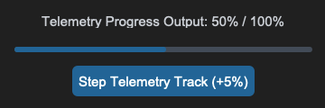
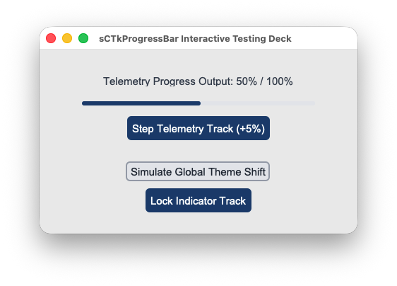


### API Property Reference

| Property / Feature | Standard CustomTkinter | Your `sCustomTkinter` Setup |
| :--- | :--- | :--- |
| **Instantiation** | `ctk.CTkProgressBar(master)` | `sCTkProgressBar(master)` *(Themed Progress Bar)* |
| **File Mapping** | Config metrics look up loose un-managed palette snapshot lists. | Separated safely across `sCTkProgressBar.py` and `ThemeableWidget.py`. |
| **State Lock** | *Not Supported Natively* | `widget.state("disabled")`<br>**OR**<br>`widget.configure(state="disabled")`<br><br>**Polymorphic State Controller:** Repaints the underlying vector fill segments to reflect a read-only lock state natively. |

---

### Constructor

Initialize a custom themed progression indicator chassis.

```python
# Instantiate a telemetry loading indicator bar
load_bar = sCTkProgressBar(master=dashboard_panel)

# FIX: Keep expand=False to prevent track heights from over-stretching vertically!
load_bar.pack(expand=False, fill="x", padx=40, pady=10)

# Feed status tracking values down the matrix (0.0 to 1.0)
load_bar.set(0.45)
```

---

### Convenience Functions
```python
# Unpack active progress metrics programmatically
current_value = load_bar.get()                # Returns float between 0.0 and 1.0


# Force-apply a new progress position value across the track index
load_bar.set(0.75)                            # Sets progress bar layout directly to 75%


# Apply an immediate visual state lock across the tracker segment
load_bar.state("disabled")                    # Repaints filled lanes to desaturated gray
```

---

### Progress Scaling & Movement Physics

The progression indicator updates its visual fill index strictly via **floating-point values ranging from `0.0` (0%) to `1.0` (100%)**. To safely translate integer step adjustments (like hardware clicks, telemetry deltas, or button taps) into smooth fractional bar movement, utilize the following resolution guidelines:

#### 1. Incrementing with Decimal Steps
To move the bar forward by a specific percentage step, extract the active position float via `.get()` and add a corresponding fractional delta (`0.01` for a 1% step, `0.05` for a 5% step, `0.10` for a 10% step):

```python
# Advance progress bar position forward by exactly +5%
current_position = load_bar.get()
next_position = current_position + 0.05

# Clamp the value at the 1.0 (100%) ceiling to prevent math layout overflow exceptions
if next_position > 1.0:
    next_position = 1.0

load_bar.set(next_position)
```

#### 2. Reversing to Percentages for Labels
To report the floating-point index back to the operator dashboard as a readable integer percentage string, multiply the float by `100` and cast it to a flat `int()` value:

```python
# Converts a position of 0.65 into a clean string layout: "65%"
percentage_string = f"{int(load_bar.get() * 100)}%"
my_dashboard_label.configure(text=percentage_string)
```

---

### Centralized Stylesheet Setup (`sCTkThemes.json`)
```json
{
    "sCTkProgressBar": {
        "fg_color": ["#E2E8F0", "#2D2D2D"],
        "progress_color": ["#3B82F6", "#1F6AA5"],
        "border_color": ["#CBD5E1", "#334155"],
        "disabled_map": {
            "fg_color": ["#E2E8F0", "#1E293B"],
            "progress_color": ["#94A3B8", "#475569"]
        }
    }
}
```

---

### Implementation Example & Test Harness

Below is a complete, self-contained interactive test execution script demonstrating how to map percentage labels and step controllers natively alongside an `sCTkProgressBar`.

```python
#!/usr/bin/python3
# =====================================================================
# 🛠️ TESTING HARNESS IMPORTS & SETUP for ProgressBar
# =====================================================================

import customtkinter as ctk
from scustomtkinter import sCTkFrame, sCTkButtonPrimary, sCTkButtonSecondary, sCTkLabelSecondary, sCTk, sCTkProgressBar

if __name__ == "__main__":

    root = sCTk()
    root.geometry("450x260")
    root.title("sCTkProgressBar Interactive Testing Deck")

    base = sCTkFrame(root)
    base.pack(expand=True, fill="both", padx=20, pady=20)

    initial_val = 0.45
    lbl_status = sCTkLabelSecondary(
        base,
        text=f"Telemetry Progress Output: {int(initial_val * 100)}% / 100%"
    )
    lbl_status.pack(pady=(10, 5))

    widget = sCTkProgressBar(base)
    widget.pack(expand=False, fill="x", padx=40, pady=10)
    widget.set(initial_val)

    def step_progress():
        if widget.get_state() == "disabled":
            print("⚠️ Cannot modify progress channel: Widget is currently locked!")
            return

        current_val = widget.get()
        next_val = current_val + 0.05
        if next_val > 1.0:
            next_val = 0.0

        widget.set(next_val)
        lbl_status.configure(text=f"Telemetry Progress Output: {int(next_val * 100)}% / 100%")

    btn_step = sCTkButtonPrimary(base, text="Step Telemetry Track (+5%)", command=step_progress)
    btn_step.pack(pady=(5, 5))

    def toggle_operational_lock():
        current_mode = widget.get_state()
        target = "disabled" if current_mode == "normal" else "normal"
        widget.configure(state=target)
        btn_lock.configure(text="Lock Indicator Track" if target == "normal" else "Unlock Indicator Track")
        btn_step.configure(state=target)

    btn_lock = sCTkButtonPrimary(base, text="Lock Indicator Track", command=toggle_operational_lock)
    btn_lock.pack(side="bottom", pady=(5, 10))

    def toggle_skin_mode():
        current_skin = ctk.get_appearance_mode()
        ctk.set_appearance_mode("Light" if current_skin == "Dark" else "Dark")

    btn_theme = sCTkButtonSecondary(base, text="Simulate Global Theme Shift", command=toggle_skin_mode)
    btn_theme.pack(side="bottom", pady=5)

    root.mainloop()
```

[Return to Table of Contents](#contents)


## sCTkRadioButton

### Table of Contents
* [System Architecture Overview](#system-architecture-overview)
* [API Constructor Reference](#api-constructor-reference)
* [Convenience Functions](#convenience-functions)
* [Centralized Stylesheet Setup](#centralized-stylesheet-setup-sctkthemesjson)
* [Other Notes](#other-notes)
* [Implementation Example & Test Harness](#implementation-example--test-harness)

---

A theme-compliant custom mutual exclusion radio selection switch component wrapping `customtkinter.CTkRadioButton`. Specially engineered for cockpit tuning tasks—such as VFO selection banks, transmitter operation modes, and antenna relay switches—it decouples low-level parameter configurations to prevent layout validation crashes while keeping disabled states 100% theme-adaptive.


---

### API Constructor Reference

```python
sCTkRadioButton(master=None, variable=None, value=None, command=None, **kwargs)
```

| Parameter Name | Data Type | Default Value | Description |
| :--- | :--- | :--- | :--- |
| `master` | `any` | *Required* | Reference pointer tracking your root window, parent layout layer, or container frame capsule. |
| `variable` | `tk.Variable` | `None` | Shared Tkinter variable tracker (e.g. `tk.StringVar`) that logically interlocks multiple radio selections together. |
| `value` | `any` | `None` | The specific absolute data value passed up to the shared variable anchor when this unique choice row is clicked. |
| `command` | `callable` | `None` | Single-click selection callback executed automatically whenever a valid, active selection shift occurs. |

---

### Convenience Functions
```python
# Evaluate current configurations or apply absolute user interaction locks via dual-routing syntax
current_mode = switch_node.get_state()      # Returns 'normal' or 'disabled'
switch_node.state("disabled")               # Freezes mouse selections and applies desaturated grays safely

# Programmatically query state tracks out of application controllers
active_choice = shared_radio_var.get()     # Extracts the active value string out of the central interlock lane
```
### Centralized Stylesheet Setup (`sCTkThemes.json`)

The component queries your centralized theme sheet profile matrix using standard `self._resolve_color()` lookup calls, ensuring that indicator dots and canvas borders translate colors smoothly across appearance updates.

To satisfy the framework configuration guidelines, ensure your theme matrix includes this structured asset block:

```json
{
    "sCTkRadioButton": {
        "fg_color": ["#1A4375", "#1F6AA5"],
        "border_color": ["#94A3B8", "#4B5563"],
        "text_color": ["#1F2937", "#FFFFFF"],
        "hover_color": ["#112A4B", "#194A7A"],
        "radiobutton_width": 22,
        "radiobutton_height": 22,
        "border_width": 3,
        "font": ["Arial", 11, "bold"],
        "disabled_map": {
            "fg_color": ["#CBD5E1", "#334155"],
            "border_color": ["#E5E7EB", "#222222"],
            "text_color": ["#94A3B8", "#4B5563"]
        }
    }
}
```

---

### Other Notes
* **Crash-Shield Parameter Interceptor:** Passing `value` or `variable` parameters directly into CustomTkinter's public `.configure()` pass after instantiation raises a fatal `ValueError`. The class overrides `.configure()` to catch these keys, assigning them safely through low-level hidden hooks to support dynamic updates without throwing errors.
* **Chassis Alignment Rule:** Because radio string fields frequently contain disparate character lengths, packing them using standard parameters causes staggered checkbox positions. Always apply `anchor="w"` paired with `fill="x"` to cleanly lock indicator circles into a flat vertical left column.
* **Automated Lifecycle Handshake:** Fires `self._finalize_themeable_lifecycle()` at the absolute end of the constructor initialization track to cleanly pass instance registration hooks straight back up to Pygubu layouts out of the box.

---

### Implementation Example & Test Harness

Below is a complete, self-contained test execution script demonstrating how to layout a mutually exclusive radio stack inside a themeable frame capsule along with real-time feedback labels.

```python
#!/usr/bin/python3
# =====================================================================
# 🛠️ TESTING HARNESS IMPORTS & SETUP for Radiobutton
# =====================================================================

import customtkinter as ctk
from scustomtkinter import sCTkFrame, sCTkButtonPrimary,sCTkLabelSecondary, sCTk, sCTkRadioButton

if __name__ == "__main__":

    root = sCTk()
    root.geometry("450x320")
    root.title("sCTkRadioButton Mutual Exclusion Validation Bench")

    base = sCTkFrame(root)
    base.pack(expand=True, fill="both", padx=20, pady=20)

    # Centralized StringVar linking both buttons together
    radio_var = ctk.StringVar(value="VFO_A")

    lbl_monitor = sCTkLabelSecondary(base, text="Active Telemetry Target: VFO_A")
    lbl_monitor.pack(pady=10)


    def print_result():
        lbl_monitor.configure(text=f"Active Telemetry Target: {radio_var.get()}")


    # 🔑 FIXED ALIGNMENT PACK ENGINE: Enforces left-anchoring with horizontal expansion
    widget = sCTkRadioButton(base, text="Primary VFO A Link Target", variable=radio_var, value="VFO_A",
                             command=print_result)
    widget.pack(expand=False, fill="x", padx=60, pady=10, anchor="w")

    widget2 = sCTkRadioButton(base, text="Secondary VFO B Link Target", variable=radio_var, value="VFO_B",
                              command=print_result)
    widget2.pack(expand=False, fill="x", padx=60, pady=10, anchor="w")


    def toggle_radio_lock():
        current_mode = widget.get_state()
        target = "disabled" if current_mode == "normal" else "normal"
        widget.configure(state=target)
        widget2.configure(state=target)
        btn_lock.configure(text="Lock Radio Switch" if target == "normal" else "Unlock Radio Switch")


    def toggle_skin_mode():
        current_skin = ctk.get_appearance_mode()
        ctk.set_appearance_mode("Light" if current_skin == "Dark" else "Dark")


    btn_lock = sCTkButtonPrimary(base, text="Lock Radio Switch", command=toggle_radio_lock)
    btn_lock.pack(pady=5)

    btn_theme = sCTkButtonPrimary(base, text="Simulate Global Theme Shift", command=toggle_skin_mode)
    btn_theme.pack(side="bottom", pady=10)

    print("--- BOOT INITIALIZATION PASSTHROUGH ---")
    widget.state("disabled")
    print("state (Disabled Pass) =", widget.get_state())
    widget.state("normal")
    print("state (Normal Pass)   =", widget.get_state())
    print("========================================\n")

    root.mainloop()
```

[Return to Table of Contents](#contents)


## sCTkScrollbar

The `sCTkScrollbar` is a high-performance, theme-adaptive custom scrollbar element designed for the `sCustomTkinter` radio desktop interface, working in tandem with the unblocked `sCTkScrollArea` viewport container frame. It inherits from `ctk.CTkScrollbar` to preserve native light/dark appearance switches while introducing specialized hardware aggregators to handle inertial gestures smoothly.


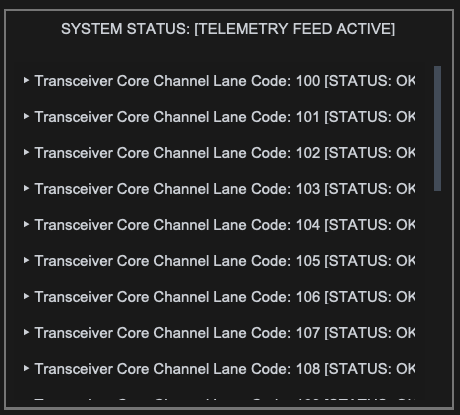
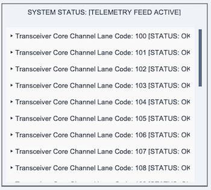


### 📌 Localized Table of Contents
* [API Constructor Reference](#-api-constructor-reference)
* [Native Viewport Alignment Handshake](#%EF%B8%8F-native-viewport-alignment-handshake)
* [Centralized Stylesheet Integration](#-centralized-stylesheet-integration-sctkthemesjson)
* [Implementation Reference Template](#-implementation-reference-template)

---

### 📋 API Constructor Reference

#### `sCTkScrollbar` Constructor
```python
scrollbar = sCTkScrollbar(master=None, orientation="vertical", **kwargs)
```

#### `sCTkScrollArea` Constructor
```python
scroll_area = sCTkScrollArea(master=None, **kwargs)
```

### API Property Reference

| Property / Feature | Standard CustomTkinter | Your `sCustomTkinter` Setup |
| :--- | :--- | :--- |
| **Instantiation** | `ctk.CTkScrollbar(master)` | `sCTkScrollbar(master)` *(Isolated External Scroll Handle)* |
| **Viewport Companion**| `ctk.CTkScrollableFrame` | `sCTkScrollArea(master)` *(Unblocked Direct Canvas Frame)* |
| **High-Precision Logic**| Coarse notched delta wheels only | **Inertial Micro-Delta Aggregator:** Smoothly captures, normalizes, and dampens Apple Magic Mouse and Trackpad sweeps natively. |
| **Event Routing** | Hardcoded internal grab hooks | **Direct Binding Pattern:** Attaches platform-synchronized event listeners across viewport and item rows automatically. |

---

### 🎛️ Native Viewport Alignment Handshake
Connecting the themeable scrollbar to the unblocked container frame involves a single architectural lifecycle call. 

When you pack the label items or tracking data lines inside the container frame, the underlying engine automatically routes vertical scroll gestures straight up into our fractional coordinate processor. This ensures that traditional mouse wheels and high-precision Apple touchpad momentum sweeps execute with perfect visual continuity.

```python
# 1. Native alignment layout handshake
scroll_view.hook_scrollbar(scrollbar)

# 2. Populate data items directly into the scrolling content frame panel
for i in range(25):
    lbl_item = sCTkLabelSecondary(scroll_view.scroll_content, text="Telemetry Row")
    lbl_item.pack()
```

[Go to Piece 2 of 2](#%F0%9F%8E%A8-centralized-stylesheet-integration-sctkthemesjson) | [Return to Table of Contents](#%F0%9F%93%8C-localized-table-of-contents)
### 🎨 Centralized Stylesheet Integration (`sCTkThemes.json`)

`sCTkScrollbar` drives its color changes straight out of your central theme file. Redundant state mappings and broken disabled maps are completely omitted, maintaining a clean, production-grade JSON dictionary footprint.

```json
{
    "sCTkScrollbar": {
        "corner_radius": 4,
        "fg_color": "transparent",
        "button_color": ["#64748B", "#4B5563"],
        "button_hover_color": ["#1A4375", "#2471A3"]
    }
}
```

---

### 💻 Implementation Reference Template

```python
#!/usr/bin/python3
# =====================================================================
# 🛠️ TESTING HARNESS IMPORTS & SETUP for Scrollbar
# =====================================================================

import customtkinter as ctk
from scustomtkinter import sCTkFrame, sCTkButtonPrimary, sCTkLabelSecondary, sCTk, sCTkScrollbar, sCTkScrollArea

if __name__ == "__main__":
    root = sCTk()
    root.geometry("480x480")
    root.title("sCTkScrollbar Unified Validation Deck")
    root.configure(fg_color=("#F1F5F9", "#1C1C1C"))

    # 2. Arrange our isolated lower button layout panel tray
    lower_tray = ctk.CTkFrame(root, fg_color="transparent")
    lower_tray.pack(side="bottom", fill="x", padx=15, pady=(0, 15))

    # 3. Mount master backplane panel frame capsule container
    main_layout = sCTkFrame(root, border_width=2)
    main_layout.pack(expand=True, fill="both", padx=15, pady=15)

    status_monitor = sCTkLabelSecondary(main_layout, text="SYSTEM STATUS: [TELEMETRY FEED ACTIVE]")
    status_monitor.pack(fill="x", padx=10, pady=(5, 10))

    def toggle_appearance_skin():
        ctk.set_appearance_mode("Light" if ctk.get_appearance_mode() == "Dark" else "Dark")

    # Pack our skin preference toggler safely inside the isolated lower tray panel
    btn_theme = sCTkButtonPrimary(lower_tray, text="Toggle UI Light/Dark Appearance", command=toggle_appearance_skin)
    btn_theme.pack(fill="x", expand=True, padx=5)

    # 4. Mount themeable custom scrollbar primitive
    scrollbar = sCTkScrollbar(main_layout, orientation="vertical")
    scrollbar.pack(side="right", fill="y", padx=(5, 10), pady=10)

    # 5. Build nested viewport container layout tracks
    content_chassis = sCTkFrame(main_layout, border_width=0, fg_color="transparent")
    content_chassis.pack(side="left", fill="both", expand=True, padx=(10, 0), pady=10)

    scroll_view = sCTkScrollArea(content_chassis)
    scroll_view.pack(fill="both", expand=True)

    # 6. Populate viewport with telemetry data and invoke the opt-in convenience propagator
    for i in range(25):
        lbl_item = sCTkLabelSecondary(scroll_view.scroll_content, text=f"▶ Transceiver Core Channel Lane Code: {100 + i} [STATUS: OK]")
        lbl_item.pack(anchor="w", padx=10, pady=4)
        scroll_view.propagate_scroll_events(lbl_item)

    # 7. Wire hardware event pipelines natively together
    scroll_view.hook_scrollbar(scrollbar)

    root.mainloop()
```

[Return to Table of Contents](#%F0%9F%93%8C-localized-table-of-contents)


## sCTkSegmentedButton

A custom, theme-compliant segmented button strip tracker widget designed for hardware-inspired radio control panel layouts. Inherits directly from `customtkinter.CTkSegmentedButton` and implements the `ThemeableWidget` mixin framework, enabling total alignment with centralized stylesheet configurations.

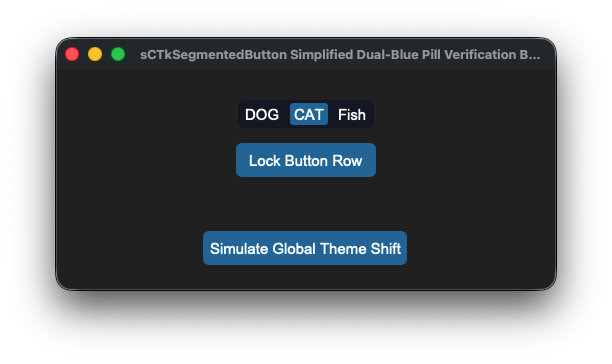
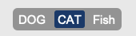


### 🛠️ Architectural Design Features

*   **Zero-Gap Contiguous Bar:** Bypasses CustomTkinter's native button spacing layout by programmatically flattening horizontal paddings down to absolute zero. Every tab segment welds tightly flush next to each other inside a single continuous capsule pill track profile.
*   **Dynamic High-Contrast Legibility:** Forcefully overrides child element text layers dynamically on click events. This ensures the active choice badge maintains crisp pure white lettering over deep accent container fills, while adjacent unselected choices cleanly snap back to your rested dark gray or blue typography targets.
*   **Pygubu Constructor Handshake Protection:** Implements an internal initialization shield gate that catches post-boot `.configure(state='disabled')` assignments passed down from Pygubu form layout engines before sub-button structures have completed generation. This prevents `AttributeError` freezes on initial application startup loops.
*   **Virtual Lock Dimming Engine:** Integrates operational mode state switches straight down to your look dictionaries. Toggling the component to a disabled track automatically applies cohesive, muted, desaturated industrial gray tones over the capsule chasses natively.

---

### 🎨 Centralized Stylesheet Setup (`sCTkThemes.json`)

To drive the dual-blue layout metrics and clear-contrast typography text shifts accurately across both look preference sweeps, ensure your centralized theme profile file includes this exact element block:

```json
{
    "sCTkSegmentedButton": {
        "fg_color": ["#4F75A2", "#2B4C7E"],
        "selected_color": ["#1A4375", "#3A6FA2"],
        "selected_hover_color": ["#112A4B", "#2B5885"],
        "unselected_color": "transparent",
        "unselected_hover_color": ["#3A5C85", "#3A5F8C"],
        "text_color": ["#FFFFFF", "#FFFFFF"],
        "text_color_disabled": ["#94A3B8", "#64748B"],
        "disabled_map": {
            "fg_color": ["#B2B9BC", "#222527"],
            "selected_color": ["#70777B", "#45494D"],
            "selected_hover_color": ["#70777B", "#45494D"],
            "unselected_color": "transparent",
            "unselected_hover_color": "transparent"
        }
    }
}
```

---

### ⚙️ Public API Methods Reference

| Method Name | Arguments | Return Type | Description |
| :--- | :--- | :--- | :--- |
| `state(mode)` | `mode: str (Optional)` | `str` | Dedicated operational state controller. If empty, returns the current active state (`'normal'` or `'disabled'`). If passed, triggers a look cascade pass. |
| `get_state()` | `None` | `str` | Explicit state tracking query synchronized with framework validation benchmarks. |
| `set(value)` | `value: str` | `None` | Programmatic value tracking setter. Updates the active button highlight and instantly swaps text colors across the live segment matrix. |
| `cget(attribute)` | `attribute: str` | `Any` | Intercept shield layer that safely bridges requests for the `'state'` string parameter out of underlying tkinter dictionaries. |

---

### 💻 Implementation Code Template

```python
#!/usr/bin/python3
# =====================================================================
# 🛠️ TESTING HARNESS IMPORTS & SETUP for SegmentedButton
# =====================================================================

import os
import customtkinter as ctk
from scustomtkinter import sCTkFrame, sCTkButtonPrimary, sCTkLabelSecondary, sCTk, sCTkSegmentedButton

if __name__ == "__main__":

    root = sCTk()
    root.geometry("500x220")
    root.title("sCTkSegmentedButton Simplified Dual-Blue Pill Verification Bench")

    base = sCTkFrame(root)
    base.pack(expand=True, fill="both", padx=20, pady=20)

    widget = sCTkSegmentedButton(base, values=["DOG", "CAT", "Fish"])
    widget.pack(expand=False, fill="none", padx=10, pady=10)
    widget.set("DOG")


    def toggle_operational_lock():
        current_mode = widget.get_state()
        target = "disabled" if current_mode == "normal" else "normal"
        widget.configure(state=target)
        btn_lock.configure(text="Lock Button Row" if target == "normal" else "Unlock Button Row")


    def toggle_skin_mode():
        current_skin = ctk.get_appearance_mode()
        ctk.set_appearance_mode("Light" if current_skin == "Dark" else "Dark")


    btn_lock = sCTkButtonPrimary(base, text="Lock Button Row", command=toggle_operational_lock)
    btn_lock.pack(pady=5)

    btn_theme = sCTkButtonPrimary(base, text="Simulate Global Theme Shift", command=toggle_skin_mode)
    btn_theme.pack(side="bottom", pady=5)

    root.mainloop()
```


## sCTkSlider

Standardized live track calibration adjustment slider providing real-time data value interception, disabled layout mapping overrides, and multi-zone Pygubu designer compatibility.


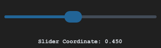
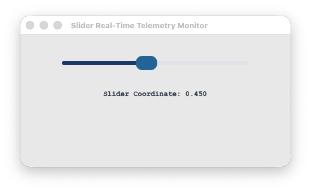


---

### 🎨 Centralized Stylesheet Setup (`themes.json`)

To drive linear progress track filling and custom knob coordinate handle styles accurately across both look preference sweeps, ensure your centralized theme profile file includes this exact element block:

```json
{
    "sCTkSlider": {
        "fg_color": ["#E2E8F0", "#4B5563"],
        "progress_color": ["#2471A3", "#3B8ED0"],
        "button_color": ["#1A4375", "#1F6AA5"],
        "button_hover_color": ["#112A4B", "#194A7A"],
        "disabled_map": {
            "fg_color": ["#CBD5E1", "#374151"],
            "progress_color": ["#94A3B8", "#4B5563"],
            "button_color": ["#94A3B8", "#4B5563"]
        }
    }
}
```

---

### ⚙️ Public API Methods Reference

| Method Name | Arguments | Return Type | Description |
| :--- | :--- | :--- | :--- |
| `state(mode)` | `mode: str (Optional)` | `str` | Dedicated operational state manager. If empty, returns the current active state (`'normal'` or `'disabled'`). If passed, shifts tracking map parameters and cleanly freezes/unfreezes input handle loops. |
| `get_state()` | `None` | `str` | Explicit state tracking query synchronized with framework validation benchmarks. |
| `set(value)` | `value: float` | `None` | Manually positions the tracking slider handle directly onto a specific floating-point decimal location coordinate. |
| `cget(attribute)` | `attribute: str` | `Any` | Intercept shield layer that safely queries current active arguments from native CustomTkinter property arrays. |

---

### 💻 Implementation Code Template

```python
#!/usr/bin/python3
# =====================================================================
# 🛠️ TESTING HARNESS IMPORTS & SETUP for Slider
# =====================================================================

import customtkinter as ctk
from scustomtkinter import sCTkFrame, sCTkLabelSecondary, sCTk, sCTkSlider

if __name__ == "__main__":

    root = sCTk()
    root.geometry("450x220")
    root.title("Slider Real-Time Telemetry Monitor")

    base = sCTkFrame(root)
    base.pack(expand=True, fill="both", padx=20, pady=20)

    lbl_telemetry = sCTkLabelSecondary(base, text="Slider Coordinate: 0.450", font=("Courier New", 12, "bold"))

    widget = sCTkSlider(base)
    widget.configure(command=lambda val: lbl_telemetry.configure(text=f"Slider Coordinate: {val:.3f}"))
    widget.pack(expand=False, fill="x", padx=40, pady=15)
    widget.set(0.450)
    lbl_telemetry.pack(pady=10)

    # Verify look states transition flawlessly on the console
    widget.state("disabled")
    print("--- DISABLED PASS ---")
    print("state (Disabled Pass) =", widget.get_state())

    widget.state("normal")
    print("\n--- NORMAL PASS ---")
    print("state (Normal Pass)   =", widget.get_state())

    root.mainloop()
```


## sCTkSwitch

The `sCTkSwitch` is a theme-compliant, standard custom toggle switch component inheriting directly from `ctk.CTkSwitch`. It guarantees absolute layout engine continuity and native rendering execution pipelines. The widget enforces custom framework state management layers, text desaturation systems, and an airtight event priority tag shield when locked, without clashing with low-level canvas polygon caching locks.


<a name="contents"></a>
### 📍 Table of Contents
* [API Constructor Reference](#constructor)
* [Dynamic Interaction Lock Tag Shield](#tag-shield)
* [Architectural Variants (Standard vs. Alt)](#variants)
* [Global Object Instance Methods](#methods)
* [Centralized Stylesheet Integration](#stylesheet)
* [Implementation Reference Template](#template)

---

<a name="constructor"></a>
### 📋 API Constructor Reference

```python
sCTkSwitch(master=None, text="", command=None, variable=None, textvariable=None, onvalue=1, offvalue=0, state="normal", font=None, **kw)
```

| Parameter Name | Data Type | Default Value | Description |
| :--- | :--- | :--- | :--- |
| `master` | `any` | `None` | Reference pointer tracking your root window or parent layout layer capsule container. |
| `text` | `str` | `""` | The descriptive typography text string label displayed natively alongside the toggle switch track. |
| `command` | `callable` | `None` | Optional event logging callback function executed instantly on state shifts, passing the active value. |
| `variable` | `Variable` | `None` | Persistent Tkinter variable tracking hook (e.g. `tk.IntVar` or `tk.StringVar`) mapped to the toggle state value. |
| `textvariable` | `Variable` | `None` | Dynamic data trace observer variable instance to update text description labels automatically. |
| `onvalue` | `any` | `1` | The value coordinate passed to callbacks and written to variables when the toggle switch is checked. |
| `offvalue` | `any` | `0` | The value coordinate passed to callbacks and written to variables when the toggle switch is unchecked. |
| `state` | `str` | `"normal"` | Execution state controller. Toggling to `"disabled"` dampens text brightness and blocks user inputs. |
| `font` | `tuple` / `str` | `None` | Typography configuration specifically assigned to resolve descriptive text labels. |

---

<a name="tag-shield"></a>
### 🛡️ Dynamic Interaction Lock Tag Shield
Natively, CustomTkinter handles `state="disabled"` passes via broad variable updates, leaving child canvas elements interactively vulnerable if theme recoloring actions occur post-initialization. 

The `sCTkSwitch` component overcomes this limitation by implementing a **High-Priority Event Capture Tag Shield**. When the widget state shifts to locked, a custom verification tag is pre-appended to the front of the sub-widget's low-level execution `bindtags` list. Clicks on the track or label instantly evaluate the blocker and return `"break"`, terminating event propagation immediately and freezing the switch toggle handle in place safely.

---

<a name="variants"></a>
### ⚡ Architectural Variants (Standard vs. Alt)
Depending on your operational interface display requirements, the library offers two parallel switch components to choose from:

1. **`sCTkSwitch` (Standard Base Variant):**
   * *Underlying Engine:* Inherits directly from `ctk.CTkSwitch` for native performance footprint rendering.
   * *Behavioral Limits:* Because CustomTkinter strictly locks down track and knob canvas polygons upon birth loop execution, this version **retains native color caching loops**. Live color shifts on the track/knob background fields are ignored when disabled; only text strings dim natively.
   * *Animations:* Preserves CustomTkinter's native smooth handle slider transition curves out-of-the-box.

2. **`sCTkSwitchAlt` (Alternative Composite Drawing Variant):**
   * *Underlying Engine:* Built as a custom composite draw frame utilising separate target capsules.
   * *Behavioral Advantages:* Grants **100% complete color rendering control** driven straight out of your central `themes.json` sheets. The background track maintains a constant unified color whether checked on or off when active, and flips entirely to distinct muted steel-gray tokens when disabled.
   * *Animations:* Bypasses the native sliding transition loop pass; the circular selector disc knob snaps coordinates instantly upon tracking clicks.

---

<a name="methods"></a>
### ⚡ Global Object Instance Methods

#### Query Dual-Routing State Parameters
```python
# Returns the active system tracking string ('normal' or 'disabled')
current_mode = switch.get_state()
```

#### Apply Absolute Operational Interaction Locks
```python
# Freezes input clicks natively while dimming text typography down to custom gray levels
switch.state("disabled")
```

#### Fetch Active State Position Values
```python
# Returns the active onvalue or offvalue coordinate matching the handle position
position_status = switch.get()
```

#### Programmatically Toggle Handle Placements
```python
# Forcefully moves the toggle switch handle to a specific value coordinate cleanly
switch.set("on")
```

---

<a name="stylesheet"></a>
### 🎨 Centralized Stylesheet Integration (`sCTkThemes.json`)

Both the standard and alternative switch widgets route look parameters natively through a single unified profile entry key block. The standard native-base version intelligently passes style tokens while ignoring the low-level track overrides it cannot natively paint.

```json
{
    "sCTkSwitch": {
        "fg_color": ["#94A3B8", "#475569"],
        "progress_color": ["#1A4375", "#1F6AA5"],
        "button_color": ["#FFFFFF", "#CBD5E1"],
        "button_hover_color": ["#E5E7EB", "#94A3B8"],
        "text_color": ["#1F2937", "#F9FAFB"],
        "font": ["Arial", 14, "normal"],
        
        "disabled_map": {
            "text_color": ["#94A3B8", "gray50"],
            "fg_color": ["#E5E7EB", "#1F2937"],
            "progress_color": ["#CBD5E1", "#334155"],
            "button_color": ["#8A94A6", "#374151"],
            "button_hover_color": ["#8A94A6", "#374151"]
        }
    }
}
```

---

<a name="template"></a>
### 💻 Implementation Reference Template

```python
#!/usr/bin/python3
# =====================================================================
# 🛠️ TESTING HARNESS IMPORTS & SETUP for Switch
# =====================================================================

import customtkinter as ctk
from scustomtkinter import sCTkFrame, sCTkButtonPrimary, sCTk, sCTkSwitch


if __name__ == "__main__":

    root = sCTk()
    root.geometry("450x240")
    root.title("sCTkSwitch Native Container Validation Bench")

    base_container = sCTkFrame(root, border_width=2)
    base_container.pack(expand=True, fill="both", padx=30, pady=30)

    widget = sCTkSwitch(base_container, text="Lock Transceiver Pre-Amp Link")
    widget.pack(expand=True, fill="none", padx=10, pady=10)

    def toggle_panel_lock():
        current_mode = widget.get_state()
        target = "disabled" if current_mode == "normal" else "normal"
        widget.configure(state=target)
        btn_lock.configure(text="Unlock Switch (Set 'normal')" if target == "disabled" else "Lock Switch (Set 'disabled')")
        print(f"Logged Verification Hook -> widget.get_state() = {widget.get_state()}")

    btn_lock = sCTkButtonPrimary(root, text="Lock Switch (Set 'disabled')", command=toggle_panel_lock)
    btn_lock.pack(side="bottom", pady=15)

    root.mainloop()

```

[Return to Table of Contents](#contents)


## sCTkTabview

The `sCTkTabview` is a theme-compliant custom multi-page dashboard deck container widget engineered specifically for the `sCustomTkinter` desktop amateur radio cockpit application. It inherits from `baseui.sCTkTabviewUI` and `ThemeableWidget` to manage dense workstation layouts cleanly. The component provides absolute palette rendering flexibility driven straight out of your central `themes.json` sheets, ensuring uniform text desaturation and track flattening when frozen or locked.


<a name="contents"></a>
### Localized Table of Contents
* [API Constructor Reference](#constructor)
* [Pygubu Designer Workspace Tab Insertion Rules](#pygubu-designer)
* [Programmatic Tab Creation & Content Hydration](#content-delivery)
* [Global Object Instance Methods](#methods)
* [Centralized Stylesheet Integration](#stylesheet)
* [Implementation Reference Template](#template)

---

<a name="constructor"></a>
### API Constructor Reference

```python
tabview = sCTkTabview(master=None, **kw)
```

| Parameter Name | Data Type | Default Value | Description |
| :--- | :--- | :--- | :--- |
| `master` | `any` | `None` | Reference pointer tracking your root window or parent layout container. |
| `kw` | `dict` | `None` | Optional keyword payload mapping standard configuration parameters natively down to the widget. |

---

<a name="pygubu-designer"></a>
### 🔌 Pygubu Designer Workspace Tab Insertion Rules
Because `sCTkTabview` derives its visual look from custom composite frames, nesting children within Pygubu-Designer layout pane requires strict structural adherence to CustomTkinter's native tab allocation slots to prevent immediate workspace crashes.

#### Adding Multi-Page Tabs in Pygubu-Designer
1. **Chassis Placement:** Locate the custom widget container on your workbench tree panel and place an instance of `sCTkTabview` right into your frame layout.
2. **Tab Component Selection:** In the Pygubu-Designer widget selector tree,  expand the CustomTkinter widger set and locate the native element named **`CTkTabview.Tab`** . 
3. **Parent Nesting Assignment:** Forcefully click and drop the **`CTkTabview.Tab`** element directly onto the parent `sCTkTabview` widget slot in your inspector tree layout.
4. **Repeat Allocation:** Repeat this step for each additional layout page slot you want to grid. The designer layout engine will handle the recursive preview sweeps smoothly. You can then name the tabs individually using the workspace property sidebars.

[Go to Piece 2 of 2](#content-delivery) | [Return to Table of Contents](#contents)
<a name="content-delivery"></a>
### Programmatic Tab Creation & Content Hydration
When crafting your radio console layouts natively via Python scripts, adding navigation tabs and stacking contents involves a simple three-step lifecycle lookup:

```python
# Step 1: Append a new structural landing tab track layer to the widget chassis
widget.add("Transceiver Settings")

# Step 2: Grab the native master frame viewport reference object assigned to that specific tab name
page_viewport = widget.tab("Transceiver Settings")

# Step 3: Instantiated any framework component (like an sCTkFrame capsule) by passing the viewport as its master parent!
inner_panel = sCTkFrame(page_viewport, border_width=1)
inner_panel.pack(expand=True, fill="both", padx=10, pady=10)
```

---

<a name="methods"></a>
### ⚡ Global Object Instance Methods

#### Unified State Gateway Handler
```python
# GETTER Pass: Returns the active operational state tracking string ('normal' or 'disabled')
current_mode = widget.state()

# SETTER Pass: Flattens menu headers, locks click selections, and dims text elements
widget.state("disabled")
```

---

<a name="stylesheet"></a>
### Centralized Stylesheet Integration (`sCTkThemes.json`)

```json
{
    "sCTkTabview": {
        "text_color": ["#1F2937", "#F9FAFB"],
        "font": ["Arial", 13, "bold"],
        "segmented_button_fg_color": ["#E2E8F0", "#1E293B"],
        "segmented_button_selected_color": ["#1A4375", "#1F6AA5"],
        "segmented_button_selected_hover_color": ["#15375B", "#1A5885"],
        "segmented_button_unselected_color": ["#F8FAFC", "#334155"],
        "segmented_button_unselected_hover_color": ["#E2E8F0", "#475569"],
        "disabled_map": {
            "text_color": ["#94A3B8", "#64748B"],
            "segmented_button_fg_color": ["#E5E7EB", "#334155"],
            "segmented_button_selected_color": ["#CBD5E1", "#475569"],
            "segmented_button_unselected_color": ["#F1F5F9", "#1F2937"]
        }
    }
}
```

---

<a name="template"></a>
### 💻 Implementation Reference Template

```python
#!/usr/bin/python3
# =====================================================================
# 🛠️ TESTING HARNESS IMPORTS & SETUP for Tabview
# =====================================================================

import customtkinter as ctk
from scustomtkinter import sCTkFrame, sCTkButtonPrimary, sCTkLabelPrimary, sCTk, sCTkTabview

if __name__ == "__main__":

    root = sCTk()
    root.geometry("560x420")
    root.title("sCTkTabview Container Validation Bench")
    root.configure(fg_color=("#F1F5F9", "#1C1C1C"))

    # 2. Mount custom master backplane frame capsule container
    base = sCTkFrame(root, border_width=2)
    base.pack(expand=True, fill="both", padx=20, pady=20)

    # 3. Instantiate our custom multi-page tab container widget cleanly
    widget = sCTkTabview(base)
    widget.pack(expand=True, fill="both", padx=10, pady=10)

    # Define our targeted operational dashboard page labels string array
    tab_pages = ["Transceiver Settings", "Audio Filters", "System Logs"]

    # 4. NESTED TAB FRAME GENERATION PASS:
    # Loops through the strings, adds the tabs, and nests an sCTkFrame containing
    # an sCTkLabelPrimary placeholder inside every viewport page cleanly!
    for page_name in tab_pages:
        # Add the structural landing track tab layer to the widget chassis
        widget.add(page_name)

        # Grab the native container reference object assigned to this specific tab page
        page_viewport = widget.tab(page_name)

        # Mount an inner sCTkFrame container capsule to pad out the sub-tab view workspace
        inner_frame = sCTkFrame(page_viewport, border_width=1, corner_radius=8)
        inner_frame.pack(expand=True, fill="both", padx=10, pady=10)

        # Drop a high-visibility sCTkLabelPrimary component right in the center slot of the sub-frame
        test_label = sCTkLabelPrimary(inner_frame, text=f"Test Contents — {page_name}")
        test_label.pack(expand=True, fill="none", padx=20, pady=20)


    # =====================================================================
    # 🛠️ INTERACTIVE BENCH OPERATION CONTROLLERS
    # =====================================================================
    def toggle_tab_lock():
        """Toggles active data page switches and flattens tab button fills."""
        current = widget.state()
        target = "disabled" if current == "normal" else "normal"
        widget.state(target)
        btn_lock.configure(
            text="Unlock Tabview Navigation" if target == "disabled" else "Lock Tabview (Set 'disabled')")
        print(f"Logged State Verification Hook -> widget.state() = {widget.state()}")


    def toggle_skin_preference():
        """Toggles between Light and Dark interface appearance preferences."""
        ctk.set_appearance_mode("Light" if ctk.get_appearance_mode() == "Dark" else "Dark")


    # Arrange test interaction buttons horizontally across the lower tray tray area
    control_tray = sCTkFrame(root, fg_color="transparent")
    control_tray.pack(side="bottom", fill="x", padx=20, pady=(0, 15))

    btn_lock = sCTkButtonPrimary(control_tray, text="Lock Tabview (Set 'disabled')", command=toggle_tab_lock)
    btn_lock.pack(side="left", expand=True, padx=5)

    btn_skin = sCTkButtonPrimary(control_tray, text="Toggle UI Light/Dark Appearance", command=toggle_skin_preference)
    btn_skin.pack(side="right", expand=True, padx=5)

    root.mainloop()


```

[Return to Table of Contents](#contents)


## sCTkTextboxPrimary

A dominant theme-compliant messaging and logging terminal console wrapper that inherits natively from `customtkinter.CTkTextbox`. It implements a specialized sequential order of operations pass to enforce native, zero-leak read-only locks while completely preventing CustomTkinter's native disabled appearance mode freezes.


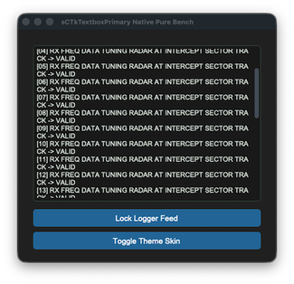
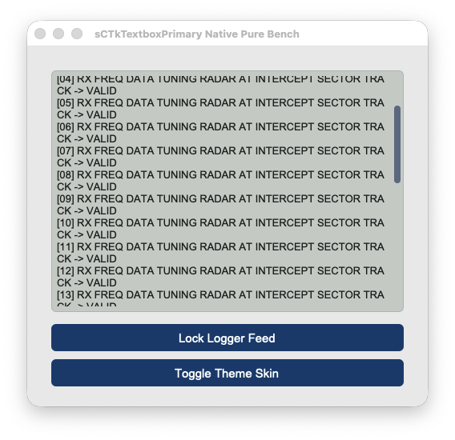


### Core Features
*   **Native Read-Only Lockout**: Leverages CustomTkinter's native text buffer lockout states when disabled to provide a secure, native typing and text insertion freeze.
*   **Standard Viewport Accessibility**: Leaves mouse wheel scrolling tracks and high-precision macOS trackpad touch gestures fully functional when locked down, matching standard native CustomTkinter behavioral layout guidelines.
*   **Sequential Repaint Engine**: Forces structural scrollbar thumb vector updates *before* applying text engine state flags, ensuring internal canvas shapes never drop theme switches or freeze their color slots when locked.
*   **ThemeableWidget Protocol Mixin**: Integrates natively with the central mixin repository layer to strip, isolate, and safely process custom Pygubu keywords (`translator`, `on_first_object_cb`, `image_loader`, `data_pool`) on startup, preventing constructor crashes.
*   **Automated Asset Upgrades**: Automatically transforms raw incoming string icon file paths from Pygubu into modern vector-scaled `ctk.CTkImage` references behind the scenes.

### Public Methods

#### `state(state_string: str = None) -> str`
Operational state management controller. Coordinates background desaturation colors and native input locks safely.
*   **Arguments**: 
    *   `state_string` (*str*, optional): The target state to enforce (`"normal"` or `"disabled"`). If omitted, returns the active virtual configuration tracker state.
*   **Returns**: The active operational state tracking string.

#### `configure(*args, **kwargs)`
Handles both programmatic keyword modifications and Pygubu designer inspector positional dictionary queries safely. Automatically populates internal lifecycle handshake hooks (`_finalize_themeable_lifecycle`).

### Theme Configuration Matrix (`themes.json`)
```json
{
  "sCTkTextboxPrimary": {
    "fg_color": ["#FFFFFF", "#1E1E1E"],
    "border_color": ["#CBD5E1", "#3F3F46"],
    "text_color": ["#000000", "#FFFFFF"],
    "scrollbar_button_color": ["#94A3B8", "#475569"],
    "scrollbar_button_hover_color": ["#64748B", "#334155"],
    "disabled_map": {
      "fg_color": ["#F1F5F9", "#18181B"],
      "border_color": ["#E2E8F0", "#27272A"],
      "text_color": ["#64748B", "#71717A"],
      "scrollbar_button_color": ["#D1D5DB", "#374151"]
    }
  }
}
```

### Implementation Example & Test Harness

Below is a complete, self-contained interactive test execution script demonstrating how to use a `sCTkTextboxPrimary`.

```python
#!/usr/bin/python3
# =====================================================================
# 🛠️ TESTING HARNESS IMPORTS & SETUP for Textbox Primary
# =====================================================================

import customtkinter as ctk
from scustomtkinter import sCTkFrame, sCTkButtonPrimary, sCTk, sCTkTextboxPrimary


if __name__ == "__main__":

    root = sCTk()
    root.geometry("500x450")
    root.title("sCTkTextboxPrimary Native Pure Bench")

    base = sCTkFrame(root)
    base.pack(expand=True, fill="both", padx=20, pady=20)

    widget = sCTkTextboxPrimary(base)
    widget.pack(expand=True, fill="both", padx=10, pady=10)

    for i in range(30):
        widget.insert("end", f"[{i:02d}] RX FREQ DATA TUNING RADAR AT INTERCEPT SECTOR TRACK -> VALID\n")


    def toggle_logger_states():
        current_state = widget.get_state()
        target = "disabled" if current_state == "normal" else "normal"
        widget.configure(state=target)

        if target == "disabled":
            btn_toggle.configure(text="Activate Logger Feed")
            print("state (Disabled Sequence) =", widget.get_state().upper())
        else:
            btn_toggle.configure(text="Lock Logger Feed")
            print("state (Normal Sequence)   =", widget.get_state().upper())


    def toggle_appearance_skin():
        current_mode = ctk.get_appearance_mode()
        target = "Light" if current_mode == "Dark" else "Dark"
        ctk.set_appearance_mode(target)


    btn_toggle = sCTkButtonPrimary(base, text="Lock Logger Feed", command=toggle_logger_states)
    btn_toggle.pack(fill="x", padx=10, pady=5)

    btn_theme = sCTkButtonPrimary(base, text="Toggle Theme Skin", command=toggle_appearance_skin)
    btn_theme.pack(fill="x", padx=10, pady=5)

    root.mainloop()

```

[Return to Table of Contents](#contents)


## sCTkTextboxSecondary

A custom, theme-compliant secondary logging and auxiliary console text display viewport built cleanly and natively on top of `customtkinter.CTkTextbox`. Designed to match the exact programmatic engine of the primary console, it uses sequential repaint loops to guarantee native read-only input locks without visual color freezes or text canvas truncation errors.


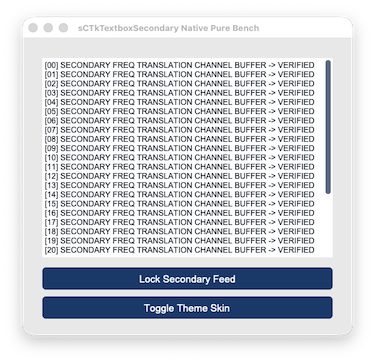


### Core Features
*   **Isolated Look Mappings**: Allows secondary terminal readouts and backup radio tracking data logs to manage distinct color desaturation maps separate from the primary dominant workspace console.
*   **Sequential Repaint Engine**: Synchronizes the base widget text engine and internal scroll handles natively, executing look updates first to bypass framework disabled white-out traps completely.
*   **Uninhibited Scroll Navigation**: Retains cross-platform mechanical mouse wheel and high-precision Apple Magic Mouse tracking loops across all states to ensure long-form system logs remain searchable.
*   **ThemeableWidget Protocol Mixin**: Implements multiple inheritance from the central mixin class to provide instant support for Pygubu string translations (`translator`) and object generation hooks (`on_first_object_cb`).

### Public Methods

#### `state(state_string: str = None) -> str`
Operational state management controller. Coordinates background desaturation colors and typing masks safely.
*   **Arguments**: 
    *   `state_string` (*str*, optional): The target state to enforce (`"normal"` or `"disabled"`). If omitted, queries the active virtual state memory slot.
*   **Returns**: The active virtual state tracking string.

### Theme Configuration Matrix (`themes.json`)
```json
{
  "sCTkTextboxSecondary": {
    "fg_color": ["#F8FAFC", "#121214"],
    "border_color": ["#E2E8F0", "#2A2A2E"],
    "text_color": ["#0F172A", "#E2E8F0"],
    "scrollbar_button_color": ["#94A3B8", "#475569"],
    "scrollbar_button_hover_color": ["#64748B", "#334155"],
    "disabled_map": {
      "fg_color": ["#E2E8F0", "#1A1A1C"],
      "border_color": ["#CBD5E1", "#222224"],
      "text_color": ["#475569", "#8E9196"],
      "scrollbar_button_color": ["#D1D5DB", "#374151"]
    }
  }
}
```

### Implementation Example & Test Harness

Below is a complete, self-contained interactive test execution script demonstrating how to use a `sCTkTextboxSecondary`.

```python
#!/usr/bin/python3
# =====================================================================
# 🛠️ TESTING HARNESS IMPORTS & SETUP for Textbox Secondary
# =====================================================================

import customtkinter as ctk
from scustomtkinter import sCTkFrame, sCTkButtonPrimary, sCTk, sCTkTextboxSecondary

if __name__ == "__main__":

    root = sCTk()
    root.geometry("500x450")
    root.title("sCTkTextboxSecondary Native Pure Bench")

    base = sCTkFrame(root)
    base.pack(expand=True, fill="both", padx=20, pady=20)

    widget = sCTkTextboxSecondary(base)
    widget.pack(expand=True, fill="both", padx=10, pady=10)

    for i in range(30):
        widget.insert("end", f"[{i:02d}] SECONDARY FREQ TRANSLATION CHANNEL BUFFER -> VERIFIED\n")


    def toggle_logger_states():
        current_state = widget.get_state()
        target = "disabled" if current_state == "normal" else "normal"
        widget.configure(state=target)

        if target == "disabled":
            btn_toggle.configure(text="Activate Secondary Feed")
        else:
            btn_toggle.configure(text="Lock Secondary Feed")


    def toggle_appearance_skin():
        current_mode = ctk.get_appearance_mode()
        target = "Light" if current_mode == "Dark" else "Dark"
        ctk.set_appearance_mode(target)


    btn_toggle = sCTkButtonPrimary(base, text="Lock Secondary Feed", command=toggle_logger_states)
    btn_toggle.pack(fill="x", padx=10, pady=5)

    btn_theme = sCTkButtonPrimary(base, text="Toggle Theme Skin", command=toggle_appearance_skin)
    btn_theme.pack(fill="x", padx=10, pady=5)

    root.mainloop()

```

[Return to Table of Contents](#contents)


# Menus
Not a lot of choices here, but they should suffice.


## sCTkComboBox

### Table of Contents
* [API Property Reference](#api-property-reference)
* [Constructor](#constructor)
* [Convenience Functions](#convenience-functions)
* [Centralized Stylesheet Setup](#centralized-stylesheet-setup-themesjson)
* [Other Notes](#other-notes)
* [Implementation Example & Test Harness](#implementation-example--test-harness)

---

A theme-compliant, prominent data-entry combo box widget variant designed for multi-frequency array indexes, input lanes, and tracking channels. It features an independent deep-copy keyword caching shield and early parameter-popping filters to safeguard dropdown sub-component properties from native mutation deletion loops.


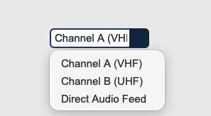


### API Property Reference

| Property / Feature | Standard CustomTkinter | Your `sCustomTkinter` Setup |
| :--- | :--- | :--- |
| **Instantiation** | `ctk.CTkComboBox(master)` | `sCTkComboBox(master)` *(Composite Dropdown Input)* |
| **File Mapping** | Component definitions bundle under single active tracks. | Streamlined and compiled programmatically across `sCTkComboBox.py` and `ThemeableWidget.py`. |
| `state(mode)` | `self.configure(state=...)` | `Method (str)` handling layout tracking map transformations (`'normal'`, `'disabled'`) via strict sequential update loops. |
| `get_state()` | `self.cget("state")` | `Method -> str` explicit verification query matching system test assertions. |
| `get()` | `self.get()` | Returns the active selected string item currently displayed inside the text frame field. |
| `set(value)` | `self.set(str)` | Programmatically injects a custom string or forces selection updates onto the view face. |

---

### Constructor

Initialize a custom combo box dropdown element instance. Custom attributes passed from Pygubu builder allocations (like string `translator` tracks or `data_pool` environments) are automatically intercepted, processed, and purged early by the `ThemeableWidget` mixin layer before the native constructor fires.

```python
# Instantiate a custom combo box dropdown element
frequency_dropdown = sCTkComboBox(
    master=control_panel,
    values=["Channel A (VHF)", "Channel B (UHF)", "Direct Audio Feed"],
    command=on_frequency_channel_changed
)

# Render the widget inside your parent container geometry packer layout panel
frequency_dropdown.pack(fill="x", padx=40, pady=10)
```

---

### Convenience Functions
```python
# Programmatically query entries or force alternative text items on the fly
active_selection = frequency_dropdown.get() # Returns current text lane string
frequency_dropdown.set("Channel B (UHF)")   # Snaps the visible box choice straight to the specified item
frequency_dropdown.state("disabled")        # Freezes entry input lanes and applies muted gray fills
```

### Centralized Stylesheet Setup (`sCTkThemes.json`)
```json
{
    "sCTkComboBox": {
        "fg_color": ["#FFFFFF", "#1E1E1E"],
        "border_color": ["#94A3B8", "#4B5563"],
        "text_color": ["#111827", "#F9FAFB"],
        "button_color": ["#1A4375", "#1F6AA5"],
        "button_hover_color": ["#112A4B", "#194A7A"],
        "dropdown_fg_color": ["#FFFFFF", "#1F2937"],
        "dropdown_text_color": ["#374151", "#F3F4F6"],
        "dropdown_hover_color": ["#F3F4F6", "#374151"],
        "border_width": 2,
        "corner_radius": 6,
        "disabled_map": {
            "fg_color": ["#F3F4F6", "#111111"],
            "border_color": ["#CBD5E1", "#333333"],
            "text_color": ["#94A3B8", "#4B5563"],
            "button_color": ["#E5E7EB", "#222222"]
        }
    }
}
```

### Other notes
* **Bypassing the BaseUI Middleman:** This component inherits cleanly and directly from native CustomTkinter classes and `ThemeableWidget`, completely bypassing the intermediate template layout files entirely to avoid argument deadlocks.
* **Automated Lifecycle Handshake:** At the absolute bottom of the initialization track, the constructor triggers `self._finalize_themeable_lifecycle()` to safely notify top-level Pygubu container managers that the widget is compiled.

---

### Implementation Example & Test Harness

Below is a complete, self-contained test execution script demonstrating how to properly embed an `sCTkComboBox` alongside an interactive theme state track.

```python

# =====================================================================
# 🛠️ TESTING HARNESS IMPORTS & SETUP for ComboBox
# =====================================================================

import customtkinter as ctk
from scustomtkinter import sCTkFrame, sCTk, sCTkButtonPrimary, sCTkComboBox

if __name__ == "__main__":

    root = sCTk()
    root.geometry("450x300")
    root.title("ComboBox Interaction Telemetry Bench")

    base = sCTkFrame(root)
    base.pack(expand=True, fill="both", padx=20, pady=20)

    widget = sCTkComboBox(
        base,
        values=["Channel A (VHF)", "Channel B (UHF)", "Direct Audio Feed"],
        command=lambda choice: print(f"ComboBox Option Latched: {choice}")
    )
    widget.pack(expand=True, fill="none", padx=10, pady=10)

    def toggle_widget_state():
        current_mode = widget.get_state()
        target = "disabled" if current_mode == "normal" else "normal"
        widget.configure(state=target)
        btn_toggle.configure(text="Unlock Dropdown" if target == "disabled" else "Lock Dropdown (Set 'disabled')")
        print(f"Logged Verification Hook -> widget.get_state() = {widget.get_state()}")

    btn_toggle = sCTkButtonPrimary(base, text="Lock Dropdown (Set 'disabled')", command=toggle_widget_state)
    btn_toggle.pack(side="bottom", pady=15)

    print("--- BOOT INITIALIZATION PASSTHROUGH ---")
    widget.state("disabled")
    print("state (Disabled Pass) =", widget.get_state())

    widget.state("normal")
    print("state (Normal Pass)   =", widget.get_state())
    print("========================================\n")

    root.mainloop()

```

[Return to Table of Contents](#contents)


## sCTkOptionMenuPrimary

### Table of Contents
* [API Property Reference](#api-property-reference)
* [Constructor](#constructor)
* [Convenience Functions](#convenience-functions)
* [Centralized Stylesheet Setup](#centralized-stylesheet-setup-themesjson)
* [Other Notes](#other-notes)
* [Implementation Example & Test Harness](#implementation-example--test-harness)

---

The dominant primary option menu selector drop-down widget component wrapping `customtkinter.CTkOptionMenu`. It incorporates early parameter popping filters and an independent value-cloned deep copy caching layer to guarantee composite drop-down states remain permanently insulated against native CustomTkinter initialization dictionary data loss.


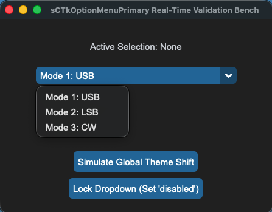


### API Property Reference

| Property / Feature | Standard CustomTkinter | Your `sCustomTkinter` Setup |
| :--- | :--- | :--- |
| **Instantiation** | `ctk.CTkOptionMenu(master)` | `sCTkOptionMenuPrimary(master)` *(Primary Drop-Down Menu)* |
| **File Mapping** | Direct layouts bundle under unconfig-managed files. | Streamlined and compiled programmatically across `sCTkOptionMenuPrimary.py` and `ThemeableWidget.py`. |
| **State Lock** | `self.configure(state="disabled")` | `menu_field.state("disabled")`<br>**OR**<br>`menu_field.configure(state="disabled")`<br><br>**Dual-Routing State Pipeline:** Natively intercepts state calls, unbinding drop-down trigger events while shifting background contrast rules safely out of `disabled_map` metrics via a strict sequential update pass. |
| `get_state()` | `self.cget("state")` | `Method -> str` explicit verification query matching system test assertions. |

---

### Constructor

Initialize a custom primary drop-down menu instance. High-level configuration parameters like `values`, `command`, and `variable` are explicitly popped early inside `__init__` to protect the layout engine from keyword collisions. Custom layout parameters passed from Pygubu are handled seamlessly by the `ThemeableWidget` mixin layer before the native constructor fires.

```python
# Instantiate a primary operational mode selection option menu
mode_dropdown = sCTkOptionMenuPrimary(
    master=control_panel,
    values=["Mode 1: Upper Sideband", "Mode 2: Lower Sideband", "Mode 3: Continuous Wave"],
    command=on_mode_selection_changed
)

# Render the widget inside your parent layout frame panel
mode_dropdown.pack(fill="x", padx=40, pady=10)
```
### Convenience Functions
```python
# Programmatically update menu item lists or query data frames
mode_dropdown.set("Mode 3: Continuous Wave")  # Forces the dropdown choice to display a specific value string
current_choice = mode_dropdown.get()           # Returns the active string item currently displayed
mode_dropdown.update_list(["Option A", "Option B"]) # Safely replaces the visible array and handles indexing boundaries

# Evaluate current state configurations or apply absolute user interaction locks via dual-routing syntax
current_mode = mode_dropdown.get_state()       # Returns 'normal' or 'disabled'
mode_dropdown.state("disabled")                # Locks dropdown triggers and applies muted gray fills
```

### Centralized Stylesheet Setup (`themes.json`)
```json
{
    "sCTkOptionMenuPrimary": {
        "fg_color": ["#1A4375", "#1F6AA5"],
        "button_color": ["#112A4B", "#194A7A"],
        "button_hover_color": ["#0F2542", "#134267"],
        "text_color": ["#FFFFFF", "#FFFFFF"],
        "dropdown_fg_color": ["#FFFFFF", "#1F2937"],
        "dropdown_text_color": ["#1F2937", "#FFFFFF"],
        "disabled_map": {
            "fg_color": ["#F3F4F6", "#1F2937"],
            "button_color": ["#E5E7EB", "#374151"],
            "button_hover_color": ["#E5E7EB", "#374151"],
            "text_color": ["#94A3B8", "#64748B"]
        }
    }
}
```

### Other Notes
* **Deep-Copy Dictionary Isolation Shield:** Because CustomTkinter's native option menu initialization code mutates, strips, and deletes keys directly out of raw dictionary data footprints during its boot phase, the constructor clones your configurations into `self._local_defaults = dict(self.final_kw)` beforehand. This prevents normal state restorations from crashing on missing keys.
* **Real-Time Repaint Loop:** The internal core engine is fortified to run color tuple lookups dynamically across both normal and locked state selections. This forces the option menu button faces, text fonts, and inner canvas drop tracks to adapt fluidly to theme skin toggle commands without white-out freezes.
* **Automated Lifecycle Handshake:** At the absolute bottom of the initialization routine, the constructor fires `self._finalize_themeable_lifecycle()` to safely notify top-level Pygubu container managers that the widget is compiled.

---

### Implementation Example & Test Harness

Below is a complete, self-contained test execution script demonstrating how to properly embed an `sCTkOptionMenuPrimary` option dropdown field along with an interactive status switch toggle and skin mode updater.

```python
#!/usr/bin/python3
# =====================================================================
# 🛠️ TESTING HARNESS IMPORTS & SETUP for OptionMenu Primary
# =====================================================================

import customtkinter as ctk
from scustomtkinter import sCTkFrame, sCTkButtonPrimary,sCTkLabelSecondary, sCTk, sCTkOptionMenuPrimary

if __name__ == "__main__":

    root = sCTk()
    root.geometry("450x320")
    root.title("sCTkOptionMenuPrimary Real-Time Validation Bench")

    base = sCTkFrame(root)
    base.pack(expand=True, fill="both", padx=20, pady=20)

    lbl_monitor = sCTkLabelSecondary(base, text="Active Selection: None")
    lbl_monitor.pack(pady=10)

    menu_field = sCTkOptionMenuPrimary(
        base,
        values=["Mode 1: USB", "Mode 2: LSB", "Mode 3: CW"],
        command=lambda choice: lbl_monitor.configure(text=f"Active Selection: {choice}")
    )
    menu_field.pack(expand=False, fill="x", padx=40, pady=10)
    menu_field.set("Mode 1: USB")

    def toggle_operational_state():
        current_mode = menu_field.get_state()
        target = "disabled" if current_mode == "normal" else "normal"
        menu_field.configure(state=target)
        btn_toggle.configure(text="Lock Dropdown (Set 'disabled')" if target == "normal" else "Unlock Dropdown (Set 'normal')")

    def toggle_skin_mode():
        current_skin = ctk.get_appearance_mode()
        ctk.set_appearance_mode("Light" if current_skin == "Dark" else "Dark")

    btn_toggle = sCTkButtonPrimary(base, text="Lock Dropdown (Set 'disabled')", command=toggle_operational_state)
    btn_toggle.pack(side="bottom", pady=5)

    btn_theme = sCTkButtonPrimary(base, text="Simulate Global Theme Shift", command=toggle_skin_mode)
    btn_theme.pack(side="bottom", pady=5)

    print("--- BOOT INITIALIZATION PASSTHROUGH ---")
    menu_field.state("disabled")
    print("state (Disabled Pass) =", menu_field.get_state())

    menu_field.state("normal")
    print("state (Normal Pass)   =", menu_field.get_state())
    print("========================================\n")

    root.mainloop()
```

[Return to Table of Contents](#contents)


## sCTkOptionMenuSecondary

### Table of Contents
* [API Property Reference](#api-property-reference)
* [Constructor](#constructor)
* [Convenience Functions](#convenience-functions)
* [Centralized Stylesheet Setup](#centralized-stylesheet-setup-themesjson)
* [Other Notes](#other-notes)
* [Implementation Example & Test Harness](#implementation-example--test-harness)

---

The auxiliary secondary option menu drop-down selector widget component variant wrapping a composite `ctk.CTkFrame` chassis encasing an inner text selector. It is tailored specifically for sub-metadata channels, filter widths, or tuning resolution parameters.

*For dominant form drop-downs or principal system mode choices, see the master component documentation page:* [sCTkOptionMenuPrimary](sCTkOptionMenuPrimary.md).


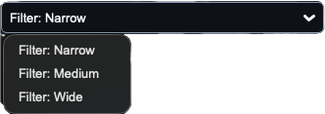
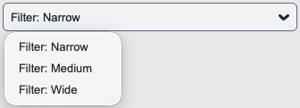


### API Property Reference

| Property / Feature | Standard CustomTkinter | Your `sCustomTkinter` Setup |
| :--- | :--- | :--- |
| **Instantiation** | `ctk.CTkOptionMenu(master)` | `sCTkOptionMenuSecondary(master)` *(Secondary Helper Dropdown)* |
| **File Mapping** | Component settings span single un-managed file layouts. | Separated safely across `sCTkOptionMenuSecondary.py` and `ThemeableWidget.py`. |
| **State Lock** | `self.configure(state="disabled")` | `widget.state("disabled")`<br>**OR**<br>`widget.configure(state="disabled")`<br><br>**Dual-Routing State Pipeline:** Natively intercepts state updates. Locks both the base frame container layer and the interior dropdown menu elements securely to mask interactive hover events out of `disabled_map` guidelines. |
| `get_state()` | `self.cget("state")` | `Method -> str` explicit verification query matching system test assertions. |

---

### Constructor

Initialize a custom secondary drop-down helper option menu instance. Keywords that cause collision errors with native container borders are filtered dynamically beforehand.

```python
# Instantiate an auxiliary DSP filter bandwidth selection drop-down menu
filter_dropdown = sCTkOptionMenuSecondary(
    master=control_panel,
    values=["Filter: Narrow", "Filter: Medium", "Filter: Wide"],
    command=on_filter_width_changed
)

# Render the widget inside your parent layout frame panel
filter_dropdown.pack(fill="x", padx=40, pady=10)
```
### Convenience Functions
```python
# Programmatically manipulate selection items or fetch choice parameters
filter_dropdown.set("Filter: Narrow")      # Forces the visible dropdown face to display a specific option text
active_filter = filter_dropdown.get()       # Returns the active string variable currently selected
filter_dropdown.update_list(["A", "B"])     # Replaces choice index items safely while protecting bounds

# Evaluate current state configurations or apply absolute user interaction locks via dual-routing syntax
current_mode = filter_dropdown.get_state()  # Returns 'normal' or 'disabled'
filter_dropdown.state("disabled")           # Freezes selection paths and applies muted flat gray skins
```

### Centralized Stylesheet Setup (`themes.json`)
```json
{
    "sCTkOptionMenuSecondary": {
        "fg_color": ["#FAFAFA", "#11141A"],
        "border_color": ["#CBD5E1", "#222933"],
        "border_width": 1,
        "corner_radius": 6,
        "text_color": ["#475569", "#94A3B8"],
        "font": ["Arial", 11],
        "disabled_map": {
            "fg_color": ["#F1F5F9", "#0A0D14"],
            "border_color": ["#E2E8F0", "#171C24"],
            "text_color": ["#94A3B8", "#4B5563"]
        }
    }
}
```

---

### Other Notes
* **Inversion Blacklist Filter Shield:** Because this widget is a compound object utilizing an underlying `CTkFrame` container, passing core text parameters (like `font` or `text_color`) straight into the initialization tree causes a fatal `ValueError` crash. The constructor parses and pulls these tokens beforehand, feeding them explicitly down to the nested dropdown item instead.
* **Deep-Copy Dictionary Isolation Shield:** Because CustomTkinter's native option menu initialization code mutates, strips, and deletes keys directly out of raw dictionary data footprints during its boot phase, the constructor clones your configurations into `self._local_defaults = dict(self.final_kw)` beforehand. This prevents normal state restorations from crashing on missing keys.
* **Real-Time Repaint Loop:** The internal core engine is fortified to run color tuple lookups dynamically across both normal and locked state selections. This forces the secondary option menu dropdown faces, text fonts, and outer chassis frame layouts to adapt fluidly to theme skin toggle commands without white-out freezes.
* **Automated Lifecycle Handshake:** At the absolute bottom of the initialization routine, the constructor fires `self._finalize_themeable_lifecycle()` to safely notify top-level Pygubu container managers that the widget is compiled.

---

### Implementation Example & Test Harness

Below is a complete, self-contained test execution script demonstrating how to properly embed an `sCTkOptionMenuSecondary` dropdown helper while actively reporting choice changes onto a secondary telemetry label and supporting light/dark switches.

```python
#!/usr/bin/python3
# =====================================================================
# 🛠️ TESTING HARNESS IMPORTS & SETUP for OptionMenu Secondary
# =====================================================================

import customtkinter as ctk
from scustomtkinter import sCTkFrame, sCTkButtonPrimary,sCTkLabelSecondary, sCTk, sCTkOptionMenuSecondary

if __name__ == "__main__":

    root = sCTk()
    root.geometry("450x320")
    root.title("sCTkOptionMenuSecondary Real-Time Validation Bench")

    base = sCTkFrame(root)
    base.pack(expand=True, fill="both", padx=20, pady=20)

    lbl_monitor = sCTkLabelSecondary(base, text="Active Selection: Filter: Narrow")
    lbl_monitor.pack(pady=10)

    menu_field = sCTkOptionMenuSecondary(
        base,
        values=["Filter: Narrow", "Filter: Medium", "Filter: Wide"],
        command=lambda choice: lbl_monitor.configure(text=f"Active Selection: {choice}")
    )
    menu_field.pack(expand=False, fill="x", padx=40, pady=10)
    menu_field.set("Filter: Narrow")

    def toggle_operational_state():
        current_mode = menu_field.get_state()
        target = "disabled" if current_mode == "normal" else "normal"
        menu_field.configure(state=target)
        btn_toggle.configure(text="Lock Dropdown (Set 'disabled')" if target == "normal" else "Unlock Dropdown (Set 'normal')")

    def toggle_skin_mode():
        current_skin = ctk.get_appearance_mode()
        ctk.set_appearance_mode("Light" if current_skin == "Dark" else "Dark")

    btn_toggle = sCTkButtonPrimary(base, text="Lock Dropdown (Set 'disabled')", command=toggle_operational_state)
    btn_toggle.pack(side="bottom", pady=5)

    btn_theme = sCTkButtonPrimary(base, text="Simulate Global Theme Shift", command=toggle_skin_mode)
    btn_theme.pack(side="bottom", pady=5)

    root.mainloop()
```

[Return to Table of Contents](#contents)


# Additional Widgets Provided by sCustomTkinter
These are all the extra widgets that were added to the stock set provided with `CustomTkinter`.


## sCTKDialBase

Abstract foundational base class for theme-adaptive mechanical rotary encoder components. It coordinates vector canvas layouts, mouse interaction loops, and cross-platform OS theme repainting rules.

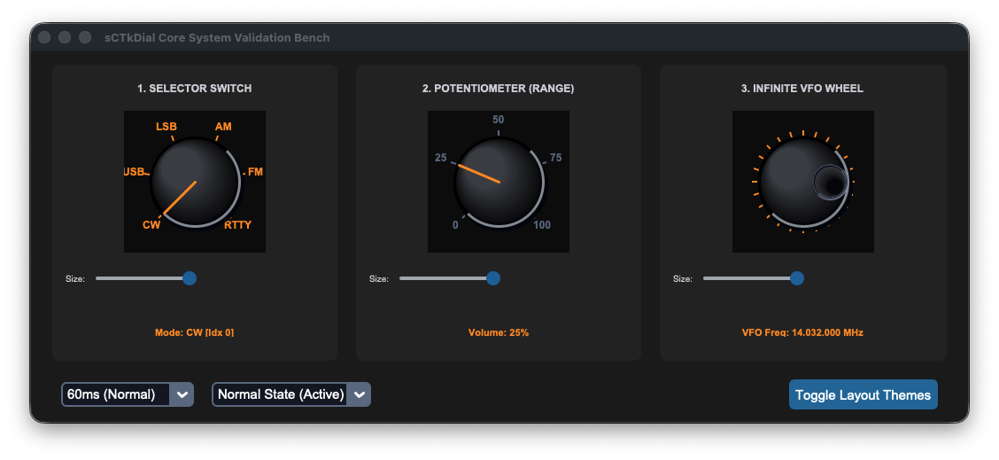

### Universal Dial Architecture

Every custom rotary knob in the ecosystem inherits its vector mechanics directly out of this core layout module. It establishes several universal features:

* **Centralized Theme Mapping:** Resolves raw colors and styles out of `themes.json` using the specific runtime class name, automatically generating fallback properties if individual blocks are unconfigured.
* **Cascading Interaction Blocks:** Toggling a component into a disabled state dynamically unbinds mouse clicks, trackpad sweeps, and scrolling event loops simultaneously to protect the live interface deck from input leaks.
* **Translucency Shield Protection Engine:** Natively catches instances where a parent widget background resolves to `"transparent"`. It programmatically climbs up the window hierarchy tree to resolve the canvas background to a valid parent hex value string, completely eliminating Light Mode Tcl color crashes.
* **Sequential Re-Binding Engine:** Forces real-time theme repaint sweeps to complete and settle background color layers *before* executing low-level pointer attachments, keeping Apple trackpad touch momentum and standard wheel clicks perfectly responsive upon coming back from a disabled state lockout.

### API Property Reference (Shared Properties)

| Property / Feature | Value Format | Description |
| :--- | :--- | :--- |
| `state(mode)` | `Method (str)` | Main state manager handling map transformations (`'normal'`, `'disabled'`). |
| `get_state()` | `Method -> str` | Direct verification query returning the current operational lock status. |
| `diameter` | `int` | Square bounding container metric enforcing canvas height and width equality. |
| `divisions` | `int` | Total tick scale markings drawn symmetrically around the outer chassis ring track. |

---

### Centralized Stylesheet Setup Reference (`themes.json`)

All concrete sub-classes read from this structural arrangement format inside your centralized style registries:

```json
{
    "sCTkDialContinuous": {
        "fg_color": ["#E2E8F0", "#262626"],
        "shadow_color": ["#CBD5E1", "#02040A"],
        "text_color": ["#1A4375", "#FF9100"],
        "dial_color": ["#1E293B", "#181E2B"],
        "pointer_glow_color": ["#CBD5E1", "#3A455C"],
        "disabled_map": {
            "fg_color": ["#E2E8F0", "#1A1D24"],
            "text_color": ["#94A3B8", "#4B5563"]
        }
    }
}
```

### Other notes
* **Keyword Isolation Guard:** The framework handles deep property filtering inside the master mixin initialization phase, stripping custom draw elements out before they can collide with native CustomTkinter frame assertions.
* **Cross-Platform Auto Sensing:** Automatically pairs mousewheel and touchpad scroll tracks across macOS, Windows, and Linux operating systems cleanly out of the box.


## sCTkDialContinuous

### Table of Contents
* [API Property Reference](#api-property-reference)
* [Constructor](#constructor)
* [Callback Signature & Usage](#callback-signature--usage)
* [Centralized Stylesheet Setup](#centralized-stylesheet-setup-sctkthemesjson)
* [Other Notes](#other-notes)
* [Implementation Example & Test Harness](#implementation-example--test-harness)

---

An infinite flywheel tuning encoder module tracking signed velocity delta step increments across an endless 360-degree rotation path (ideal for high-fidelity radio VFO controls, audio mixers, and multi-channel squelch encoders).


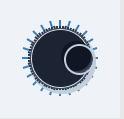


### API Property Reference

| Property / Feature | Type / Signature | Description |
| :--- | :--- | :--- |
| **Instantiation** | *Constructor* | `sCTkDialContinuous(master)` *(Infinite Tuning Wheel Encoder)* |
| **File Mapping** | *Inheritance Tree* | Inherits vector math mechanics and 3D knob rendering directly out of `sCTkDial.py`. |
| `_scroll_cooldown_seconds`| `float` | Throttle limiting touchpad refresh rates to stabilize fast tuning rolls. |
| `set_position_index(delta)`| `Method (int)` | Manually advances the 3D dimple coordinates via an integer step. |
| `left_click_callback` | `Callable / None` | **Custom Accelerated Click Hook:** Overrides standard single-step decrements to execute accelerated jumping intervals when clicking the left canvas edge. |
| `right_click_callback` | `Callable / None` | **Custom Accelerated Click Hook:** Overrides standard single-step increments to execute accelerated jumping intervals when clicking the right canvas edge. |
| **State**                 | `dial.state("disabled")`<br>**OR**<br>`dial.configure(state="disabled")` | **Dual-Routing State Pipeline:** Handles both syntaxes natively. Freezes canvas mouse-wheel scrolling, disables click jump hooks, and shifts visual themes out of `disabled_map` guidelines via a strict sequential re-binding engine. |

---

### Constructor

Initialize an infinite flywheel encoder instance. Keyword properties layer safely over centralized configuration defaults and are automatically sanitized by the `ThemeableWidget` mixin layer before the native constructor fires.

```python
# Instantiate the themed infinite VFO wheel element
tuning_dial = sCTkDialContinuous(
    master=frame_continuous,
    divisions=24,
    diameter=130,
    command=on_vfo_dial_rotated,
    left_click_callback=my_custom_left_click,
    right_click_callback=my_custom_right_click
)
```

---

### Callback Signature & Usage

Dispatches a raw signed directional integer step change directly to runtime listeners upon rotation changes.

#### Command 

```python
# Fires automatically on valid mouse scrolling, touchpad rolling, or click-drag actions
def on_vfo_dial_rotated(clicks_delta: int):
    # Clockwise rotation yields positive steps (+1); Counter-clockwise yields negative steps (-1)
    global current_frequency_hz
    current_frequency_hz += clicks_delta * 100
```

### Centralized Stylesheet Setup (`sCTkThemes.json`)
```json
{
    "sCTkDialContinuous": {
        "fg_color": "transparent",
        "dial_color": ["#1E293B", "#181E2B"],
        "shadow_color": ["#CBD5E1", "#02040A"],
        "pointer_glow_color": ["#CBD5E1", "#3A455C"],
        "border_width": 0,
        "corner_radius": 0
    }
}
```

### Other notes
* **Latching Override Independence:** Infinite flywheel dimples loop continuously around the chassis ring, ignoring arc boundary restrictions.
* **Custom Accelerated Steps:** Attaching optional click callbacks allows click events to jump values by wider intervals (e.g., jumping 2 full indices per tap via `set_position_index(2)`) rather than dropping onto the baseline single-step tracking paths.
* **Automated Lifecycle Handshake:** Triggers `self._finalize_themeable_lifecycle()` at the absolute end of the constructor initialization track to cleanly pass instance registration hooks straight back up to Pygubu parent controllers.

---

### Implementation Example & Test Harness

Below is a complete, self-contained test execution script demonstrating how to properly embed an `sCTkDialContinuous` alongside custom click jump hooks and an interactive VFO digital frequency display counter readout.

```python
#!/usr/bin/python3
# =====================================================================
# 🛠️ TESTING HARNESS IMPORTS & SETUP for Dial Continuous
# =====================================================================

import customtkinter as ctk
from scustomtkinter import sCTkFrame, sCTkButtonPrimary, sCTk, sCTkLabelSecondary, sCTkDialContinuous


# Global state trackers for the interactive bench loop
current_frequency_hz = 14032000


def refresh_frequency_display():
    """Formats integers into a clean MHz telemetry layout readout string."""
    freq_str = f"{current_frequency_hz:08d}"
    formatted_freq = f"{freq_str[-8:-6]}.{freq_str[-6:-3]}.{freq_str[-3:]}"
    if formatted_freq.startswith("."):
        formatted_freq = formatted_freq[1:]

    if lbl_vfo_display.winfo_exists():
        lbl_vfo_display.configure(text=f"VFO Freq: {formatted_freq} MHz")


def on_vfo_dial_rotated(clicks_delta):
    """Event-driven callback tracking signed velocity delta step changes."""
    global current_frequency_hz
    current_frequency_hz += clicks_delta * 100
    current_frequency_hz = max(0, current_frequency_hz)
    refresh_frequency_display()


def my_custom_left_click():
    """Accelerated Jump: Moves 2 complete indexing steps left per click tap."""
    if tuning_dial.cget("state") == "disabled":
        return
    tuning_dial.set_position_index(-2)  # Jump 2 steps left natively


def my_custom_right_click():
    """Accelerated Jump: Moves 2 complete indexing steps right per click tap."""
    if tuning_dial.cget("state") == "disabled":
        return
    tuning_dial.set_position_index(2)  # Jump 2 steps right natively


def toggle_operational_state():
    """Toggles interaction channels and visual states back and forth."""
    current_mode = tuning_dial.cget("state")
    target = "disabled" if current_mode == "normal" else "normal"

    tuning_dial.configure(state=target)
    lbl_vfo_display.configure(state=target)
    btn_toggle.configure(text="Lock Dial (Set 'disabled')" if target == "normal" else "Unlock Dial (Set 'normal')")
    print(f"Logged Verification Hook -> tuning_dial.get_state() = {tuning_dial.get_state()}")


if __name__ == "__main__":
    root = sCTk()
    root.title("sCTkDialContinuous Test Deck")
    root.geometry("380x360")

    base = sCTkFrame(root, corner_radius=8)
    base.pack(expand=True, fill="both", padx=20, pady=20)

    lbl_title = sCTkLabelSecondary(base, text="3. Continuous VFO WHEEL", font=("Arial", 12, "bold"))
    lbl_title.pack(pady=(12, 2))

    tuning_dial = sCTkDialContinuous(
        base,
        divisions=24,
        diameter=130,
        command=on_vfo_dial_rotated,
        left_click_callback=my_custom_left_click,
        right_click_callback=my_custom_right_click
    )
    tuning_dial.pack(pady=10)

    lbl_vfo_display = sCTkLabelSecondary(base, text="VFO Freq: 14.032.000 MHz", font=("Arial", 11, "bold"))
    lbl_vfo_display.pack(pady=10)

    btn_toggle = sCTkButtonPrimary(base, text="Lock Dial (Set 'disabled')", command=toggle_operational_state)
    btn_toggle.pack(side="bottom", pady=15)

    print("--- BOOT INITIALIZATION PASSTHROUGH ---")
    print(f"Initial Dial State = {tuning_dial.get_state().upper()}")
    print("========================================\n")

    root.mainloop()
```

[Return to Table of Contents](#contents)


## sCTkDialRange

### Table of Contents
* [API Property Reference](#api-property-reference)
* [Constructor](#constructor)
* [Callback Signature & Usage](#callback-signature--usage)
* [Centralized Stylesheet Setup](#centralized-stylesheet-setup-sctkthemesjson)
* [Other Notes](#other-notes)
* [Implementation Example & Test Harness](#implementation-example--test-harness)

---

A concrete rotary encoder range variant designed for hard-bounded linear controls (e.g., AF/RF volume gain level sliders, squelch limits, or power thresholds). It enforces absolute mechanical dead stops at outer thresholds, preventing directional wraparound loops.


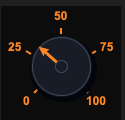
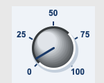


### API Property Reference

| Property / Feature | Type / Signature | Description |
| :--- | :--- | :--- |
| **Instantiation** | *Constructor* | `sCTkDialRange(master)` *(Bounded Linear Range Dial)* |
| **File Mapping** | *Inheritance Tree* | Streamlined and compiled programmatically inside `sCTkDial.py` and `ThemeableWidget.py`. |
| `from_` / `min_value` | `int` | Lower boundary threshold (default 0) enforcing absolute counter-clockwise dead stops. |
| `to` / `max_value` | `int` | Upper boundary threshold (default 100) enforcing absolute clockwise dead stops. |
| `divisions` | `int` | Quantized subdivision tick line count painted geometrically across the arc limit sweep. |
| `_scroll_cooldown_seconds`| `float` | Throttle limiting touchpad refresh rates to stabilize fast range adjustments. |
| `get()` / `set(val)` | `Methods -> int` | Unified index query mechanisms to get or force selected integer values. |
| `left_click_callback` | `Callable / None` | **Custom Accelerated Click Hook:** Overrides standard single-step decrements to execute accelerated jumping intervals when clicking the left canvas edge. |
| `right_click_callback` | `Callable / None` | **Custom Accelerated Click Hook:** Overrides standard single-step increments to execute accelerated jumping intervals when clicking the right canvas edge. |
| **State**                 | `dial.state("disabled")`<br>**OR**<br>`dial.configure(state="disabled")` | **Dual-Routing State Pipeline:** Handles both syntaxes natively. Freezes canvas mouse-wheel scrolling, disables click jump hooks, and shifts visual themes out of `disabled_map` guidelines via a strict sequential re-binding engine. |

---

### Constructor

Initialize a custom bounded linear range potentiometer instance. Custom parameters passed from Pygubu builder allocations (like string `translator` tracks or `data_pool` environments) are automatically intercepted, processed, and purged early by the `ThemeableWidget` mixin layer before the native constructor fires. Bounding geometry sizes and limits scale out of central stylesheet registries.

```python
# Instantiate an AF Volume gain potentiometer control dial
volume_potentiometer = sCTkDialRange(
    master=control_panel,
    from_=0,
    to=30,
    divisions=6,
    arc_angle=270,
    command=on_volume_level_changed,
    left_click_callback=my_custom_left_click,
    right_click_callback=my_custom_right_click
)
```

---

### Callback Signature & Usage

Dispatches the current absolute active integer value directly to runtime tracking listeners upon position changes.

#### Command 

```python
# Fires automatically on valid mouse scrolling, touchpad rolling, or click-drag actions
def on_volume_level_changed(active_value: int):
    # active_value is hard constrained between your from_ and to boundary integers
    print(f"Active Selected Option Value position tracker = {active_value}")
```

### Centralized Stylesheet Setup (`sCTkThemes.json`)
```json
{
    "sCTkDialRange": {
        "fg_color": "transparent",
        "dial_color": ["#1E293B", "#181E2B"],
        "border_color": ["#CBD5E1", "#334155"],
        "text_color": ["#3B8ED0", "#FF9100"],
        "pointer_color": ["#3B8ED0", "#FF9100"],
        "shadow_color": ["#CBD5E1", "#02040A"],
        "border_width": 0,
        "corner_radius": 0
    }
}
```

### Other notes
* **Bypassing the BaseUI Middleman:** This component inherits cleanly and directly from native CustomTkinter classes and `ThemeableWidget`, completely bypassing the intermediate template layout files entirely to avoid argument deadlocks.
* **Automated Lifecycle Handshake:** At the absolute bottom of the initialization track, the constructor triggers `self._finalize_themeable_lifecycle()` to safely notify top-level Pygubu container managers that the widget is compiled.
* **Absolute Threshold Dead Stops:** Unlike continuous or selector models, scrolling past upper or lower boundaries clips inputs securely using `max(self._from, min(self._to, value))`, blocking accidental overflow.

---

### Implementation Example & Test Harness

Below is a complete, self-contained test execution script demonstrating how to properly embed an `sCTkDialRange` alongside custom click jump hooks and an active volume gain control panel display tracker.

```python
#!/usr/bin/python3
# =====================================================================
# 🛠️ TESTING HARNESS IMPORTS & SETUP for Dial Range
# =====================================================================

import customtkinter as ctk
from scustomtkinter import sCTkFrame, sCTkButtonPrimary, sCTk, sCTkLabelSecondary, sCTkDialRange


if __name__ == "__main__":

    root = sCTk()
    root.geometry("450x350")
    root.title("Ranged Potentiometer Telemetry Bench")

    base = sCTkFrame(root, corner_radius=8)
    base.pack(expand=True, fill="both", padx=20, pady=20)

    # 1. Live feedback display lane tracking
    lbl_volume = sCTkLabelSecondary(base, text="AF Volume: 15 %", font=("Arial", 11, "bold"))
    lbl_volume.pack(pady=15)


    def my_custom_left_click():
        """Accelerated Jump: Drops 3 units per click tap."""
        if volume_pot.get_state() == "disabled": return
        volume_pot.set(volume_pot.get() - 3)


    def my_custom_right_click():
        """Accelerated Jump: Jumps 3 units per click tap."""
        if volume_pot.get_state() == "disabled": return
        volume_pot.set(volume_pot.get() + 3)


    # 2. Instantiate with explicit limits and tracking labels
    volume_pot = sCTkDialRange(
        base,
        from_=0,
        to=100,
        divisions=5,
        arc_angle=270,
        command=lambda val: lbl_volume.configure(text=f"AF Volume: {int((val / 100) * 100)} %"),
        left_click_callback=my_custom_left_click,
        right_click_callback=my_custom_right_click
    )
    volume_pot.pack(expand=True, fill="none", padx=10, pady=10)
    volume_pot.set(5)  # Initialize baseline startup volume index


    # 3. Dynamic panel interactive state toggle test layout
    def toggle_pot_lock():
        current_mode = volume_pot.get_state()
        target = "disabled" if current_mode == "normal" else "normal"

        volume_pot.configure(state=target)
        btn_toggle.configure(text="UNLOCK VOLUME DECK" if target == "disabled" else "LOCK POTENTIOMETER")
        print(f"Logged Verification Hook -> volume_pot.get_state() = {volume_pot.get_state()}")


    btn_toggle = sCTkButtonPrimary(base, text="LOCK POTENTIOMETER", command=toggle_pot_lock)
    btn_toggle.pack(side="bottom", pady=15)

    # Standard test assertions routine verification sequences
    print("--- BOOT INITIALIZATION PASSTHROUGH ---")
    volume_pot.state("disabled")
    print("state (Disabled Pass) =", volume_pot.get_state())  # Output: disabled

    volume_pot.state("normal")
    print("state (Normal Pass)   =", volume_pot.get_state())  # Output: normal
    print("========================================\n")

    root.mainloop()
```

[Return to Table of Contents](#contents)


## sCTkDialSelector

### Table of Contents
* [API Property Reference](#api-property-reference)
* [Constructor](#constructor)
* [Callback Signature & Usage](#callback-signature--usage)
* [Centralized Stylesheet Setup](#centralized-stylesheet-setup-sctkthemesjson)
* [Other Notes](#other-notes)
* [Implementation Example & Test Harness](#implementation-example--test-harness)

---

A concrete rotary encoder switch variant designed for stepped selector controls (e.g., band configurations, operating modes, or filter sub-selections). It uses an explicit bounding arc configuration and outputs a clean integer mapping parameter tracking list item indices natively.


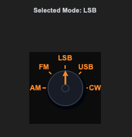
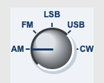


### API Property Reference

| Property / Feature        | Type / Signature | Description |
|:--------------------------| :--- | :--- |
| **Instantiation**         | *Constructor* | `sCTkDialSelector(master)` *(Stepped Arc Selector Dial)* |
| **File Mapping**          | *Inheritance Tree* | Streamlined and compiled programmatically inside `sCTkDial.py` and `ThemeableWidget.py`. |
| `labels`                  | `list [str]` | Ordered array list mapping string tags directly above calculated step lines. Supports raw comma-separated strings inside layout inspectors. |
| `arc_angle`               | `float` | Angular geometric limit (default 270) restricting the pointer range sweep layout. |
| `_scroll_cooldown_seconds`| `float` | Throttle limiting touchpad refresh rates to stabilize fast selector rolls. |
| `get()` / `set(idx)`      | `Methods -> int` | Unified index query mechanisms to get or force selected positions. |
| `left_click_callback`     | `Callable / None` | **Custom Accelerated Click Hook:** Overrides standard single-step decrements to execute accelerated jumping intervals when clicking the left canvas edge. |
| `right_click_callback`    | `Callable / None` | **Custom Accelerated Click Hook:** Overrides standard single-step increments to execute accelerated jumping intervals when clicking the right canvas edge. |
| **State**                 | `dial.state("disabled")`<br>**OR**<br>`dial.configure(state="disabled")` | **Dual-Routing State Pipeline:** Handles both syntaxes natively. Freezes canvas mouse-wheel scrolling, disables click jump hooks, and shifts visual themes out of `disabled_map` guidelines via a strict sequential re-binding engine. |

---

### Constructor

Initialize a custom stepped rotary selector switch instance. Properties like `labels` support raw string array text list configurations natively for absolute Pygubu inspector panel compatibility. Custom attributes from Pygubu builder allocations (like string `translator` tracks) are automatically intercepted and sanitized by the `ThemeableWidget` mixin layer before the native constructor fires.

```python
# Instantiate a 5-position operating mode rotary switch selector
mode_switch = sCTkDialSelector(
    master=control_panel,
    labels=["AM", "FM", "LSB", "USB", "CW-N"],
    arc_angle=180,
    command=on_operating_mode_changed,
    left_click_callback=my_custom_left_click,
    right_click_callback=my_custom_right_click
)
```

---

### Callback Signature & Usage

Dispatches the current absolute active list item integer index directly to runtime configuration listeners.

#### Command 

```python
# Fires automatically on valid mouse scrolling, touchpad rolling, or click-drag actions
def on_operating_mode_changed(active_index: int):
    # active_index maps directly to items in your labels block list (0, 1, 2, etc.)
    print(f"Active Selected Option Index position tracker = {active_index}")
```

### Centralized Stylesheet Setup (`sCTkThemes.json`)
```json
{
    "sCTkDialSelector": {
        "fg_color": "transparent",
        "dial_color": ["#1E293B", "#181E2B"],
        "border_color": ["#CBD5E1", "#334155"],
        "text_color": ["#0284C7", "#38BDF8"],
        "pointer_color": ["#0284C7", "#38BDF8"],
        "shadow_color": ["#CBD5E1", "#02040A"],
        "border_width": 0,
        "corner_radius": 0
    }
}
```

### Other notes
* **Bypassing the BaseUI Skeletons:** This component avoids all autogenerated Pygubu intermediate templates, connecting the component straight to CustomTkinter's appearance modes via programmatic multiple inheritance tracks.
* **Automated Lifecycle Handshake:** Fires `self._finalize_themeable_lifecycle()` at the absolute end of the constructor initialization track to cleanly pass instance registration hooks straight back up to Pygubu parent controllers.
* **Rolling Selector Loops:** When spinning scroll wheels beyond boundary edges, the index modulo calculates the length of the string array, snapping the cursor back around to index 0 smoothly.

---

### Implementation Example & Test Harness

Below is a complete, self-contained test execution script demonstrating how to properly embed an `sCTkDialSelector` alongside custom click jump hooks and an active mode switch control panel display tracker.

```python
#!/usr/bin/python3

# =====================================================================
# 🛠️ TESTING HARNESS IMPORTS & SETUP for Dial Rotary Switch (sCTkDialSelector)
# =====================================================================

import customtkinter as ctk
from scustomtkinter import sCTkFrame, sCTkButtonPrimary, sCTk, sCTkLabelSecondary, sCTkDialSelector


if __name__ == "__main__":

    root = sCTk()
    root.geometry("450x350")
    root.title("Rotary Switch Selector Bench")

    base = sCTkFrame(root)
    base.pack(expand=True, fill="both", padx=20, pady=20)

    # 1. Attach a live telemetry readout label
    lbl_mode_tag = sCTkLabelSecondary(base, text="Selected Mode: AM", font=("Arial", 11, "bold"))
    lbl_mode_tag.pack(pady=15)


    def my_custom_left_click():
        """Accelerated Jump: Moves 2 complete indexing steps left per click tap."""
        if mode_selector.get_state() == "disabled":
            return
        mode_selector.set(mode_selector.get() - 2)


    def my_custom_right_click():
        """Accelerated Jump: Moves 2 complete indexing steps right per click tap."""
        if mode_selector.get_state() == "disabled":
            return
        mode_selector.set(mode_selector.get() + 2)


    # 2. Instantiate with unique radio deck selector labels and selection trackers
    mode_selector = sCTkDialSelector(
        base,
        labels=["AM", "FM", "LSB", "USB", "CW"],
        arc_angle=180,  # Half-circle step selector arc
        command=lambda idx: lbl_mode_tag.configure(text=f"Selected Mode: {mode_selector._labels[idx]}"),
        left_click_callback=my_custom_left_click,
        right_click_callback=my_custom_right_click
    )
    mode_selector.pack(expand=True, fill="none", padx=10, pady=10)


    # 3. Standard application dashboard interaction lock toggle simulation
    def toggle_widget_lock():
        current_mode = mode_selector.get_state()
        target = "disabled" if current_mode == "normal" else "normal"

        mode_selector.configure(state=target)
        btn_lock.configure(
            text="UNLOCK CHANNELS" if target == "disabled" else "LOCK SWITCH (Set 'disabled')"
        )
        print(f"Logged Verification Hook -> mode_selector.get_state() = {mode_selector.get_state()}")


    btn_lock = ctk.CTkButton(base, text="LOCK SWITCH (Set 'disabled')", command=toggle_widget_lock)
    btn_lock.pack(side="bottom", pady=10)

    # Standard test assertions routine verification sequences
    print("--- BOOT INITIALIZATION PASSTHROUGH ---")
    mode_selector.state("disabled")
    print("state (Disabled Pass) =", mode_selector.get_state())  # Output: disabled

    mode_selector.state("normal")
    print("state (Normal Pass)   =", mode_selector.get_state())  # Output: normal
    print("========================================\n")

    root.mainloop()
```

[Return to Table of Contents](#contents)


## sCTkFileExplorer

### Table of Contents
* [API Property Reference](#api-property-reference)
* [Constructor](#constructor)
* [Convenience Functions](#convenience-functions)
* [Execution Event Callbacks](#execution-event-callbacks-command--double_click_command)
* [Centralized Stylesheet Setup](#centralized-stylesheet-setup-sctkthemesjson)
* [Other Notes](#other-notes)
* [Implementation Example & Test Harness](#implementation-example--test-harness)

---

A theme-compliant, highly configurable custom file and folder navigation panel embedded directly within user layout cards. Designed to list paths and filter extensions dynamically without forcing external platform dialog boxes, it unbinds hover highlights and locks canvas scroll mechanisms seamlessly when interaction states toggle.

---


### API Property Reference

| Property / Feature | Standard CustomTkinter | Your `sCustomTkinter` Setup |
| :--- | :--- | :--- |
| **Instantiation** | *Not Available Natively* | `sCTkFileExplorer(master)` *(Embedded Local File Navigator)* |
| **File Mapping** | No native component layout handles inline folder index matrices. | Streamlined and compiled programmatically across `sCTkFileExplorer.py` and `ThemeableWidget.py`. |
| **State Lock** | *Not Supported Natively* | `explorer.state("disabled")`<br>**OR**<br>`explorer.configure(state="disabled")`<br><br>**Dual-Routing State Pipeline:** Natively handles both syntaxes. Freezes canvas item scrolling, strips active button double-clicks, and dims rows using centralized `disabled_map` presets. |
| `get_state()` | *Not Supported Natively* | `Method -> str` explicit verification query matching system test assertions. |

---

### Constructor

Initialize a custom embedded directory explorer window panel. Specific configuration metrics like `filetypes` can be parsed straight out of layout inspectors without generating order-of-operation runtime exceptions. High-level custom configuration parameters from Pygubu (like `translator`, `on_first_object_cb`, `image_loader`, and `data_pool`) are automatically intercepted, processed, and purged early by the `ThemeableWidget` mixin layer before the native constructor fires.

```python
sCTkFileExplorer(master, type="directory", filetypes=None, initialdir=None, initialfile=None, command=None, double_click_command=None, width=400, height=300, corner_radius=None, border_width=None, bg_color="transparent", fg_color=None, border_color=None, background_corner_colors=None, overwrite_preferred_drawing_method=None, **kwargs)
```

| Parameter Name | Data Type | Default Value | Description |
| :--- | :--- | :--- | :--- |
| `master` | `any` | *Required* | Reference pointer tracking your root window, parent layout layer, or container frame capsule. |
| `type` | `str` | `"directory"` | Structural layout operation mode. Options: `"directory"` (renders folders only) or `"file"` (renders folders and compatible files). |
| `filetypes` | `list` / `str` | `None` | Filter array masking permitted file extensions. Formatted as an explicit python list or bracketed string array (e.g., `['.py', '.txt']`). Defers to unfiltered mode when `None`. |
| `initialdir` | `str` | `None` | Starting navigation folder pathway string. Supports tilde user expansion (`~`) and forces normalization to absolute paths at instantiation. Defaults to `os.getcwd()` if omitted. |
| `initialfile` | `str` | `None` | Default starting highlight target file path string. Highlights and selects the specified file asset row automatically on boot. |
| `command` | `callable` | `None` | Single-click method event callback triggered instantly whenever a valid, active list row is highlighted. Requires a strict **two-argument footprint**. |
| `double_click_command` | `callable` | `None` | Double-click selection method callback executed when an active row file is confirmed or executed. Requires a strict **two-argument footprint**. |
| `width` | `int` | `400` | Manual horizontal width constraint boundary dimension allocated to the explorer component measured in pixels. |
| `height` | `int` | `300` | Manual vertical height constraint boundary dimension allocated to the explorer component measured in pixels. |
### Convenience Functions
```python
# Programmatically manipulate selection items, change views, or filter parameters dynamically
explorer.set_mode("directory")               # Options: "file" or "directory"
explorer.set_initial_dir("/path/to/folder") # Forces the navigation frame to jump to a specific directory
explorer.set_initial_file("/path/file.py")   # Forces the text buffer lane to highlight a specific default file path
explorer.set_filetypes([".py", ".json"])     # Updates the active file type visibility extension arrays

# Evaluate current state configurations or apply absolute user interaction locks via dual-routing syntax
current_mode = explorer.get_state()          # Returns 'normal' or 'disabled'
explorer.state("disabled")                   # Freezes directory lines and dims row font components
```

---

### ⚡ Execution Event Callbacks (`command` & `double_click_command`)

Both callback functions execute dynamically when rows are manipulated by the user. To prevent application layer traceback drops, **any method mapped to these commands must accept exactly two mandatory arguments**:

```python
def my_explorer_callback(widget_instance, selected_path):
    """
    Mandatory Callback Signature Requirement
    
    1. widget_instance: The sCTkFileExplorer object triggering the method loop.
    2. selected_path:   The absolute string file path matching the row just clicked.
    """
    print(f"Action detected from {widget_instance}: Processing path -> {selected_path}")
```

* **`command`**: Triggers when a folder or file row is highlighted on a single click. Passes the explorer instance pointer and the updated absolute string path of the row item.
* **`double_click_command`**: Triggers when an active item row is double-clicked. If the targeted row is a subdirectory, the explorer automatically expands and steps *into* that directory. If the item is a valid file asset, it hands structural control back to the callback method, passing the explorer instance pointer and the absolute file location path.

---

### 🎨 Centralized Stylesheet Setup (`sCTkThemes.json`)

The file explorer queries your repository styling map profile matrix using standard `self._resolve_color()` lookup routines. This decoupling ensures that layout shapes, font styles, and path row aesthetics repaint smoothly during real-time theme profile adjustments.

To satisfy the framework configuration guidelines, ensure your theme matrix includes this structured asset block:

```json
{
    "sCTkFileExplorer": {
        "fg_color": "transparent",
        "btn_fg": ["#1A4375", "#1F6AA5"],
        "btn_border_color": ["#94A3B8", "#4B5563"],
        "btn_text_color": ["#FFFFFF", "#FFFFFF"],
        "btn_hover": ["#112A4B", "#194A7A"],
        "entry_fg": ["#FFFFFF", "#1E1E1E"],
        "entry_border_color": ["#CBD5E1", "#334155"],
        "entry_text_color": ["#1F2937", "#FFFFFF"],
        "row_active_text": ["#111827", "#F9FAFB"],
        "row_dimmed_text": ["#94A3B8", "gray50"],
        "button_color": ["#64748B", "#475569"],
        "disabled_map": {
            "btn_fg": ["#F3F4F6", "#111111"],
            "btn_border_color": ["#E5E7EB", "#222222"],
            "btn_text_color": ["#94A3B8", "#4B5563"],
            "entry_fg": ["#F9FAFB", "#1A1A1A"],
            "entry_border_color": ["#E5E7EB", "#222222"],
            "entry_text_color": ["#94A3B8", "#4B5563"],
            "button_color": ["#CBD5E1", "#334155"]
        }
    }
}
```

---

### Other Notes
* **Standalone Embed Mechanics:** Instead of blocking main loops via operational platform modal windows (`filedialog`), this component behaves as a standard frame block that can pack or grid comfortably anywhere inside your primary interface layouts.
* **Automated Lifecycle Handshake:** Fires `self._finalize_themeable_lifecycle()` at the absolute end of the constructor initialization track to cleanly pass instance registration hooks straight back up to Pygubu parent controllers.
* **Deep-Copy Dictionary Isolation Shield:** Because CustomTkinter's native container initialization loops mutate and delete attributes directly out of raw dictionary data footprints during its boot pass, the constructor clones your configurations into `self._local_defaults = dict(self.final_kw)` beforehand. This preserves your color mappings safely.

---

### Implementation Example & Test Harness

Below is a complete, self-contained test execution script demonstrating how to properly embed an `sCTkFileExplorer` workspace card alongside pure, composite companion input tools and entry lanes to drive runtime changes dynamically.

```python
#!/usr/bin/python3

# =====================================================================
# 🛠️ TESTING HARNESS IMPORTS & SETUP for FIle Explorer
# =====================================================================

import os
import customtkinter as ctk
from scustomtkinter import sCTkFrame, sCTkEntryPrimary, sCTkButtonPrimary
from scustomtkinter import sCTkOptionMenuPrimary, sCTk, sCTkLabelSecondary, sCTkFileExplorer

if __name__ == "__main__":
    root = sCTk()
    root.title("Standalone Embedded sCTkFileExplorer Panel View")
    root.geometry("600x720")

    base = sCTkFrame(root)
    base.pack(expand=True, fill="both", padx=20, pady=20)

    lbl_monitor = sCTkLabelSecondary(base, text="Active Highlight Track: [None Selection]")
    lbl_monitor.pack(pady=10)

    def track_selection(explorer_instance):
        path = explorer_instance.selected_path.get()
        lbl_monitor.configure(text=f"Active Highlight Track: {os.path.basename(path)}")
        print(f"SINGLE-CLICK HIGHLIGHT: {path}")

    def execute_file(explorer_instance, path):
        print(f"DOUBLE-CLICK CONFIRMED! Launching: {path}")

    user_home_dir = os.path.expanduser("~")
    explorer = sCTkFileExplorer(base, type="file", initialdir=user_home_dir, filetypes=[".py", ".md", ".json"], command=track_selection, double_click_command=execute_file, width=540, height=350)
    explorer.pack(fill="both", expand=True, padx=15, pady=10)

    control_deck = sCTkFrame(base, border_width=1, corner_radius=6)
    control_deck.pack(fill="x", padx=15, pady=10)

    row1 = sCTkFrame(control_deck)
    row1.pack(fill="x", padx=10, pady=5)
    sCTkLabelSecondary(row1, text="Explorer Mode:", width=100, anchor="w").pack(side="left", padx=5)

    def on_mode_menu_changed(choice):
        mode_type = "file" if "File" in choice else "directory"
        explorer.set_mode(mode_type)
        entry_filter.configure(state="disabled" if mode_type == "directory" else "normal")

    opt_mode = sCTkOptionMenuPrimary(row1, values=["File Mode (Show Items)", "Directory Mode (Folders Only)"], command=on_mode_menu_changed, width=250)
    opt_mode.pack(side="left", padx=5)
    opt_mode.set("File Mode (Show Items)")

    row2 = sCTkFrame(control_deck)
    row2.pack(fill="x", padx=10, pady=5)
    sCTkLabelSecondary(row2, text="File Filter List:", width=100, anchor="w").pack(side="left", padx=5)

    entry_filter = sCTkEntryPrimary(row2, placeholder_text="['.py', '.md', '.json', '.txt']")
    entry_filter.pack(side="left", fill="x", expand=True, padx=5)
    entry_filter.bind("<Return>", lambda e: explorer.set_filetypes(entry_filter.get().strip()))

    row3 = sCTkFrame(control_deck)
    row3.pack(fill="x", padx=10, pady=5)
    sCTkLabelSecondary(row3, text="Jump to Path:", width=100, anchor="w").pack(side="left", padx=5)

    entry_path = sCTkEntryPrimary(row3, placeholder_text="Enter absolute directory path...")
    entry_path.insert(0, user_home_dir)
    entry_path.pack(side="left", fill="x", expand=True, padx=5)
    entry_path.bind("<Return>", lambda e: explorer.set_initial_dir(entry_path.get().strip()))

    def toggle_explorer_lock():
        target = "disabled" if explorer.get_state() == "normal" else "normal"
        explorer.configure(state=target)
        opt_mode.configure(state=target)
        entry_filter.configure(state=target)
        entry_path.configure(state=target)
        btn_lock.configure(text="Lock Explorer Deck" if target == "normal" else "Unlock Explorer Deck")

    btn_lock = sCTkButtonPrimary(base, text="Lock Explorer Deck", command=toggle_explorer_lock)
    btn_lock.pack(side="bottom", pady=10)
    root.mainloop()

```

[Return to Table of Contents](#contents)


## sCTkFrameLabeledPrimary

### Table of Contents
* [API Property Reference](#api-property-reference)
* [Constructor](#constructor)
* [Advanced Layout Inspection API](#advanced-layout-inspection-api)
* [Centralized Stylesheet Setup](#centralized-stylesheet-setup-sctkthemesjson)
* [Other Notes](#other-notes)
* [Implementation Example & Test Harness](#implementation-example--test-harness)

---

A clean, theme-compliant custom header-labeled scrollable container card frame built directly on top of CustomTkinter's native text/scroll classes. It is engineered to act as an organized panel matrix tree that seamlessly suppresses visible scrollbar components out of view by hard-matching scrollbar background canvas elements directly to frame asset color backgrounds.

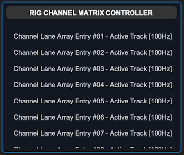
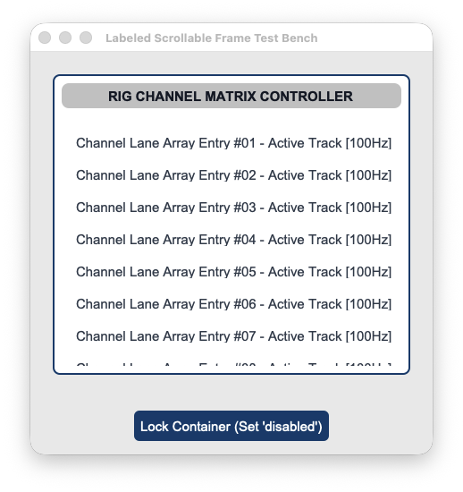


### API Property Reference

| Property / Feature | Standard CustomTkinter | Your `sCustomTkinter` Setup |
| :--- | :--- | :--- |
| **Instantiation** | `ctk.CTkFrame(master)` *(No label natively)* | `sCTkFrameLabeledPrimary(master)` *(Labeled Frame Enclosure)* |
| **File Mapping** | Config metrics look up loose un-managed palette snapshot lists. | Streamlined and compiled programmatically across `sCTkFrameLabeledPrimary.py` and `ThemeableWidget.py`. |
| `winfo_children()` | Returns raw internal widgets, including heading text blocks. | Overridden signature supporting filtered inner form component lookups. |
| `get_children()` | *Not Supported Natively* | Convenience method returning clean application-level custom components. |
| `get_all_children()` | *Not Supported Natively* | Convenience method returning direct, unfiltered access to the entire core frame tree. |

---

### Constructor

Initialize a custom scrollable labeled container frame option deck card. Scrollbar tracks are hidden automatically upon completing instantiation passes. High-level custom configuration parameters from Pygubu (like `translator`, `on_first_object_cb`, `image_loader`, and `data_pool`) are automatically intercepted, processed, and purged early by the `ThemeableWidget` mixin layer before the native constructor fires.

```python
# Instantiate a primary header-labeled scrollable matrix panel deck frame
channel_grid = sCTkFrameLabeledPrimary(
    master=root_window,
    label_text="RIG CHANNEL MATRIX CONTROLLER"
)

# Render the widget container view using standard geometry packer layout trackers
channel_grid.pack(expand=True, fill="both", padx=25, pady=25)
```

---

### Advanced Layout Inspection API

Because labeled frame capsules bundle an integrated text header directly onto their border chassis, native widget sweeps can accidentally overwrite heading text constraints. The class overrides window queries to isolate your layout data cleanly.

#### `winfo_children(include_private: bool = False) -> list`

* **`include_private=False` (Default):** Isolates and hides the internal `CTkLabel` heading widget and frame layout backplane blocks. Loops crawling your dashboard lanes will discover only the actual primary input rows packed inside the box, preventing title typography parameters from getting corrupted during runtime style shifts.
* **`include_private=True`:** Immediately deactivates the filter mesh to return the raw, unmanipulated Tkinter structural window lineage hierarchy.
### Centralized Stylesheet Setup (`sCTkThemes.json`)
```json
{
    "sCTkFrameLabeledPrimary": {
        "fg_color": ["#FFFFFF", "#1E293B"],
        "border_color": ["#E2E8F0", "#334155"],
        "label_text_color": ["#1A4375", "#38BDF8"],
        "border_width": 1,
        "corner_radius": 8,
        "disabled_map": {
            "fg_color": ["#F1F5F9", "#111111"],
            "border_color": ["#E2E8F0", "#222222"],
            "label_text_color": ["#94A3B8", "#4B5563"]
        }
    }
}
```

---

### Other Notes
* **Chassis Child Interceptor Shield:** Calling standard native `.winfo_children()` on a scrollable canvas widget leaks CustomTkinter's private system geometry framework bars (`_parent_frame`, `_view_frame`, etc.). This override cuts directly to the true internal workspace data window array, returning clean lists of only your functional custom widgets.
* **Scrollbar Suppression Engine Protection:** Instead of executing complex system canvas unbinding loops that destroy track physics, `_hide_internal_scrollbars()` sets scroll widths down to zero and safely maps track colors to your frame background through an absolute tuple resolution call beforehand. This permanently avoids alpha translucent `transparent` name crashes in Light Mode.
* **Automated Lifecycle Handshake:** Fires `self._finalize_themeable_lifecycle()` at the absolute end of the constructor initialization track to cleanly pass instance registration hooks straight back up to Pygubu parent controllers.

---

### Implementation Example & Test Harness

Below is a complete, self-contained test execution script demonstrating how to properly embed an `sCTkFrameLabeledPrimary` alongside an application-layer cascading state loop tracker.

```python
#!/usr/bin/python3

# =====================================================================
# 🛠️ TESTING HARNESS IMPORTS & SETUP for Frame Labeled Primary
# =====================================================================

from scustomtkinter import sCTkButtonPrimary, sCTkLabelSecondary, CTk, sCTkFrameLabeledPrimary


if __name__ == "__main__":

    root = sCTk()
    root.geometry("450x450")
    root.title("Labeled Scrollable Frame Test Bench")

    scroll_panel = sCTkFrameLabeledPrimary(root, label_text="RIG CHANNEL MATRIX CONTROLLER")
    scroll_panel.pack(expand=True, fill="both", padx=25, pady=25)

    for i in range(1, 21):
        lbl_item = sCTkLabelSecondary(scroll_panel, text=f"Channel Lane Array Entry #{i:02d} - Active Track [100Hz]")
        lbl_item.pack(pady=4, fill="x", padx=10)


    def toggle_frame_states():
        current_mode = scroll_panel.get_state()
        target = "disabled" if current_mode == "normal" else "normal"

        scroll_panel.configure(state=target)

        true_children = scroll_panel.winfo_children()
        print(f"DEBUG ASSERTER: Successfully captured {len(true_children)} label elements...")

        for child in true_children:
            if hasattr(child, "configure"):
                child.configure(state=target)

        btn_toggle.configure(
            text="Lock Container (Set 'disabled')" if target == "normal" else "Unlock Container (Set 'normal')")
        print(f"Logged Verification Hook -> scroll_panel.get_state() = {scroll_panel.get_state()}\n")


    btn_toggle = sCTkButtonPrimary(root, text="Lock Container (Set 'disabled')", command=toggle_frame_states)
    btn_toggle.pack(pady=15)

    print("--- BOOT INITIALIZATION PASSTHROUGH ---")
    scroll_panel.state("disabled")
    print(f"state (Disabled Pass) = {scroll_panel.get_state().upper()}")

    scroll_panel.state("normal")
    print(f"state (Normal Pass)   = {scroll_panel.get_state().upper()}")
    print("========================================\n")

    root.mainloop()


```

[Return to Table of Contents](#contents)


## sCTkLabelSecondary

### Table of Contents
* [API Property Reference](#api-property-reference)
* [Constructor](#constructor)
* [Centralized Stylesheet Setup](#centralized-stylesheet-setup-sctkthemesjson)
* [Other Notes](#other-notes)
* [Implementation Example & Test Harness](#implementation-example--test-harness)

---

The custom secondary interface typography display label widget component wrapping `customtkinter.CTkLabel`. It features an independent deep-copy keyword caching shield and an advanced multi-state color-dimming interceptor to automatically shift text contrasts when subsystem components enter disabled sequences.


### API Property Reference

| Property / Feature | Standard CustomTkinter | Your `sCustomTkinter` Setup |
| :--- | :--- | :--- |
| **Instantiation** | `ctk.CTkLabel(master)` | `sCTkLabelSecondary(master)` *(Secondary Interface Text Label)* |
| **File Mapping** | Direct module definitions run without structured configuration. | Streamlined and compiled programmatically across `sCTkLabelSecondary.py` and `ThemeableWidget.py`. |
| **State Lock** | *Not Supported Natively* | `secondary_label.state("disabled")`<br>**OR**<br>`secondary_label.configure(state="disabled")`<br><br>**Framework-Wide State Support:** Natively supported across all label components (`Primary`, `Secondary`, `Tertiary`). It intercepts state configuration calls and dynamically dims typography layouts based on centralized `disabled_map` metrics. |
| `get_state()` | *Not Supported Natively* | `Method -> str` explicit verification query matching system test assertions. |

---

### Constructor

Initialize a custom secondary text label instance. Configuration metrics map cleanly out of central stylesheet parameters and are automatically sanitized by the `ThemeableWidget` mixin layer before the native constructor fires.

```python
# Instantiate a secondary user interface text display label element
lane_label = sCTkLabelSecondary(
    master=control_panel,
    text="Active Teleceiver Signal Frequency Lane [94.1 MHz]"
)

# Render the widget inside your layout panel using geometry managers
lane_label.pack(expand=True, padx=20, pady=20)
```
### Centralized Stylesheet Setup (`sCTkThemes.json`)
```json
{
    "sCTkLabelSecondary": {
        "fg_color": "transparent",
        "text_color": ["#475569", "#94A3B8"],
        "font": ["Arial", 11, "bold"],
        "disabled_map": {
            "text_color": ["#CBD5E1", "#4B5563"]
        }
    }
}
```

---

### Other Notes
* **Bypassing the BaseUI Middleman:** This component inherits cleanly and directly from native CustomTkinter classes and `ThemeableWidget`, completely bypassing the intermediate template layout files entirely to avoid argument deadlocks and preserve image scaling properties.
* **Deep-Copy Dictionary Isolation Shield:** Because CustomTkinter's native geometry constructor routines mutate and drop keys directly out of parsed configuration structures during early boot phases, the constructor clones your data configurations into `self._local_defaults = dict(self.final_kw)` beforehand. This prevents layout repaints from failing.
* **Dynamic Dark Mode Pass-Through:** When returning to an active state, the visual interceptor reads directly from your protected `_local_defaults` cache. If no hardcoded text color is explicitly discovered, it hands control back to CustomTkinter's master `ThemeManager` to natively paint high-contrast system fonts.
* **Automated Lifecycle Handshake:** Triggers `self._finalize_themeable_lifecycle()` at the absolute bottom of the initialization track to cleanly pass instance registration hooks straight back up to Pygubu parent controllers.

---

### Implementation Example & Test Harness

Below is a complete, self-contained test execution script demonstrating how to properly embed an `sCTkLabelSecondary` component element along with an interactive status switch toggle.

```python
#!/usr/bin/python3

# =====================================================================
# 🛠️ TESTING HARNESS IMPORTS & SETUP for Frame Labeled Secondary
# =====================================================================

from scustomtkinter import sCTkButtonPrimary, sCTkLabelTertiary, sCTk, sCTkFrameLabeledSecondary

if __name__ == "__main__":

    root = sCTk()
    root.geometry("450x450")
    root.title("Labeled Scrollable Secondary Frame Test Bench")

    # Instantiate your custom scrollable secondary frame container [INDEX]
    scroll_panel = sCTkFrameLabeledSecondary(root, label_text="AUXILIARY METADATA TRACK MATRIX")
    scroll_panel.pack(expand=True, fill="both", padx=25, pady=25)

    # Populate scroll panel container slots with helper sCTkLabelTertiary notice items [INDEX]
    for i in range(1, 21):
        lbl_item = sCTkLabelTertiary(scroll_panel,
                                     text=f"Helper Node Index [ID: {i:02d}] - Calibration Offset [0.00Hz]")
        lbl_item.pack(pady=4, fill="x", padx=10)


    def toggle_frame_states():
        """Toggles the container panel and cascades the state down to all child widgets [INDEX]."""
        current_mode = scroll_panel.get_state()
        target = "disabled" if current_mode == "normal" else "normal"

        # 1. Update the parent scrollable frame's visual layout variables via dual-routing syntax [INDEX]
        scroll_panel.configure(state=target)

        # 2. Native standard cascade loop leveraging your winfo_children() override [INDEX]
        true_children = scroll_panel.winfo_children()
        print(f"DEBUG ASSERTER: Successfully captured {len(true_children)} label elements...")

        for child in true_children:
            if hasattr(child, "configure"):
                child.configure(state=target)

        btn_toggle.configure(
            text="Lock Container (Set 'disabled')" if target == "normal" else "Unlock Container (Set 'normal')")
        print(f"Logged Verification Hook -> scroll_panel.get_state() = {scroll_panel.get_state()}\n")


    btn_toggle = sCTkButtonPrimary(root, text="Lock Container (Set 'disabled')", command=toggle_frame_states)
    btn_toggle.pack(pady=15)

    # Run the interactive boot tracking logs [INDEX]
    print("--- BOOT INITIALIZATION PASSTHROUGH ---")
    scroll_panel.state("disabled")
    print(f"state (Disabled Pass) = {scroll_panel.get_state().upper()}")

    scroll_panel.state("normal")
    print(f"state (Normal Pass)   = {scroll_panel.get_state().upper()}")
    print("========================================\n")

    root.mainloop()


```

[Return to Table of Contents](#contents)


## sCTkFrameOutlined

A clean, theme-compliant container frame variant explicitly styled to act as an outlined structural card or passive layout grouping box. It integrates a clean operational state interceptor layer to gracefully absorb cascading configuration switches without throwing unrecognized keyword violations.

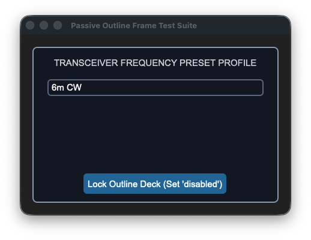
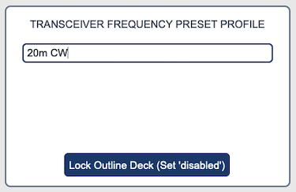


### API Property Reference

| Property / Feature | Standard CustomTkinter | Your `sCustomTkinter` Setup |
| :--- | :--- | :--- |
| **Instantiation** | `ctk.CTkFrame(master)` | `sCTkFrameOutlined(master)` *(Functions as Outlined Panel Box)* |
| **Maintenance** | Manual alignment of background and boundary color borders. | Clean style updates modified globally right inside the master JSON file. |
| **File Mapping** | Everything runs under one core native pipeline track. | Streamlined and compiled programmatically across `sCTkFrameOutlined.py` and `ThemeableWidget.py`. |
| `state(mode)` | *Not Available Natively* | `Method (str)` managing layout tracking map transformations (`'normal'`, `'disabled'`). |
| `get_state()` | *Not Available Natively* | `Method -> str` explicit verification query matching system test assertions. |

---

### Constructor

Initialize a custom outlined container chassis layout instance. Border widths, corners, and framework properties layer cleanly over configuration choices and are automatically sanitized by the `ThemeableWidget` mixin layer before the native constructor fires.

```python
# Instantiate a theme-compliant outlined group card panel box
vfo_preset_card = sCTkFrameOutlined(
    master=main_dashboard,
    border_width=2,
    corner_radius=6
)

# Render the widget inside your parent container coordinate tracker layout
vfo_preset_card.pack(fill="both", expand=True, padx=20, pady=20)
```

---

### Convenience Functions
```python
# Evaluate active visual modes or apply absolute user interaction locks via dual-routing syntax
current_mode = vfo_preset_card.get_state() # Returns 'normal' or 'disabled'
vfo_preset_card.state("disabled")          # Softens border highlights and fades panel backgrounds safely

# Smoothly query standard Tkinter children references inside the grouping chassis
for child in vfo_preset_card.winfo_children():
    # Structural Check: Ensure control buttons are skipped during cascading locks
    if child == master_unlock_button:
        continue
    if hasattr(child, "configure"):
        child.configure(state="disabled")
```
### Centralized Stylesheet Setup (`themes.json`)
```json
{
    "sCTkFrameOutlined": {
        "fg_color": ["#FFFFFF", "#1E1E1E"],
        "border_color": ["#1A4375", "#FF9100"],
        "corner_radius": 8,
        "border_width": 2,
        "disabled_map": {
            "fg_color": ["#F1F5F9", "#121212"],
            "border_color": ["#CBD5E1", "#4B5563"]
        }
    }
}
```

---

### Other Notes
* **Universal State Interceptor:** Intercepts incoming `state` configuration commands, stripping them out completely to protect native CustomTkinter validation threads from fatal unhandled type exceptions, while successfully updating frame visual accents via an internal tuple resolution pass.
* **Automated Lifecycle Handshake:** Fires `self._finalize_themeable_lifecycle()` at the absolute end of the constructor initialization track to cleanly pass instance registration hooks straight back up to Pygubu parent controllers.
* **Containment Architecture Guard:** When implementing an automatic state sweep across standard `.winfo_children()` layers, always isolate your action trigger button. If it is packed inside the same outline frame layout without a bypass filter, it will freeze its own execution threads and lock the workspace.

---

### Implementation Example & Test Harness

Below is a complete, self-contained test execution script demonstrating how to properly embed an `sCTkFrameOutlined` card along with an application-layer cascading state toggle switch.

```python
#!/usr/bin/python3

# =====================================================================
# 🛠️ TESTING HARNESS IMPORTS & SETUP for Frame Outlined
# =====================================================================

from scustomtkinter import (sCTkButtonPrimary, sCTkEntryPrimary, sCTkLabelSecondary,
                            sCTk, sCTkFrameOutlined)

if __name__ == "__main__":

    root = sCTk()
    root.title("Passive Outline Frame Test Suite")
    root.geometry("450x300")

    frame_group = sCTkFrameOutlined(root, border_width=2)
    frame_group.pack(fill="both", expand=True, padx=20, pady=20)

    lbl_title = sCTkLabelSecondary(frame_group, text="TRANSCEIVER FREQUENCY PRESET PROFILE")
    lbl_title.pack(pady=(12, 4), padx=10, fill="x")

    mock_entry = sCTkEntryPrimary(frame_group, placeholder_text="Standard data field...")
    mock_entry.pack(pady=10, padx=25, fill="x")


    def toggle_frame_states():
        """Toggles the outlined card panel and cascades the state change down to child widgets, skipping the trigger."""
        current_mode = frame_group.get_state()
        target = "disabled" if current_mode == "normal" else "normal"

        frame_group.configure(state=target)

        for child in frame_group.winfo_children():
            if child == btn_toggle:
                continue
            if hasattr(child, "configure"):
                child.configure(state=target)

        btn_toggle.configure(
            text="Lock Outline Deck (Set 'disabled')" if target == "normal" else "Unlock Outline Deck (Set 'normal')")
        print(f"Logged Verification Hook -> frame_group.get_state() = {frame_group.get_state()}")


    btn_toggle = sCTkButtonPrimary(frame_group, text="Lock Outline Deck (Set 'disabled')", command=toggle_frame_states)
    btn_toggle.pack(side="bottom", pady=15)

    print("--- BOOT INITIALIZATION PASSTHROUGH ---")
    print(f"Initial Outline Frame State = {frame_group.get_state().upper()}")
    print("========================================\n")

    root.mainloop()


```


## sCTkMessagebox

### Table of Contents
* [API Constructor Reference](#api-constructor-reference)
* [Global Shortcut Function Handlers](#global-shortcut-function-handlers)
* [Simple Syntax Quick-Reference Guide](#simple-syntax-quick-reference-guide)
* [Centralized Stylesheet Setup](#centralized-stylesheet-setup-sctkthemesjson)
* [Layout & Text Wrapping Integration Rules](#layout--text-wrapping-integration-rules)
* [Implementation Example & Test Harness](#implementation-example--test-harness)

---

The `sCTkMessagebox` is an advanced, themeable dialog window system designed to provide critical messages to the user. It replaces standard OS message alerts with modular, center-positioned dialogue boxes featuring dynamic text-wrapping, automated parent window tracking calculations, custom asset handling, and support for dual high-contrast action selection layouts that return boolean runtime parameters.

---


### API Constructor Reference

```python
sCTkMessagebox(title, message, typ, master=None, buttons="ok", ok_text="Ok", yes_text="Yes", no_text="No", width=400)
```

| Parameter Name | Data Type | Default Value | Description |
| :--- | :--- | :--- | :--- |
| `title` | `str` | *Required* | Text displayed inside the top operating window header bar title deck. |
| `message` | `str` | *Required* | Body text string message container paragraph to display inside the prompt panel. |
| `typ` | `str` | *Required* | Alert asset track type classification identifier. Accepts `"info"`, `"warning"`, or `"error"`. |
| `master` | `any` | `None` | Reference pointer tracking your root window or parent `sCTkFrame` to calculate centering bounds. |
| `buttons` | `str` | `"ok"` | Layout selection control mapping. Accepts `"ok"` (single center prompt) or `"yes_no"` (twin balanced selections). |
| `ok_text` | `str` | `"Ok"` | Custom display string label mapped to the single button layout option track. |
| `yes_text` | `str` | `"Yes"` | Display string assigned to the primary confirmation button choice track. |
| `no_text` | `str` | `"No"` | Display string assigned to the secondary dismissal button choice track. |
| `width` | `int` | `400` | Manual window width boundary tracking restriction limit measured in pixels. |

---

### Global Shortcut Function Handlers

To launch modal dialog blocks quickly inside callback triggers without handling complete class instantiations manually, utilize these pre-wired shortcuts via the **`messagebox`** namespace proxy:

#### Standard Alert Prompts (Returns `True` upon closure)
```python
sCTkMessagebox.showinfo(title, message, ok_text="Ok", width=400, master=root)
sCTkMessagebox.showwarning(title, message, ok_text="Ok", width=400, master=root)
sCTkMessagebox.showerror(title, message, ok_text="Ok", width=400, master=root)
```

#### Confirmation Prompt Shortcuts (Returns primitive Python `True` or `False` boolean states)
```python
sCTkMessagebox.askyesno(title, message, yes_text="Yes", no_text="No", width=400, master=root)
sCTkMessagebox.askwarningyesno(title, message, yes_text="Yes", no_text="No", width=400, master=root)
sCTkMessagebox.askerroryesno(title, message, yes_text="Yes", no_text="No", width=400, master=root)
```

---

### Simple Syntax Quick-Reference Guide

Below are clean, minimal use-cases showcasing how to call each convenience shortcut using the standardized `messagebox` proxy engine.

#### 1. `sCTkMessagebox.showinfo`
Used for general application notifications, status confirmations, and completions.
```python
from scustomtkinter import sCTkMessagebox

# Displays a standard informative dialog popup
sCTkMessagebox.showinfo("System Init", "Satellite link successfully established.", master=root)
```

#### 2. `sCTkMessagebox.showwarning`
Used to display alert parameters, non-fatal operational boundary breaches, or layout cautions.
```python
from scustomtkinter import sCTkMessagebox

# Displays a warning alert box with a custom approval button text
sCTkMessagebox.showwarning("Battery Low", "Backup power source dropped below 15%.", ok_text="Acknowledge", master=root)
```

#### 3. `sCTkMessagebox.showerror`
Used to halt operations when a severe terminal failure or unhandled exception block is triggered.
```python
from scustomtkinter import sCTkMessagebox

# Displays a fatal critical error box
sCTkMessagebox.showerror("TX Failure", "Transmitter hardware thermal overload detected.", master=root)
```

#### 4. `sCTkMessagebox.askyesno`
Launches a standard query dialogue window, returning a boolean flag based on the user's action.
```python
from scustomtkinter import sCTkMessagebox

# Captures true/false verification states
if sCTkMessagebox.askyesno("Log Session", "Do you wish to save the active telemetry log files?", master=root):
    print("User clicked YES: Executing write loop...")
else:
    print("User clicked NO: Dropping record data...")
```

#### 5. `sCTkMessagebox.askwarningyesno`
Launches a critical query box carrying high-visibility alert graphics for destructive actions.
```python
from scustomtkinter import sCTkMessagebox

# Captures permission states for hazardous overrides
override_allowed = messagebox.askwarningyesno(
    "Frequency Sync", 
    "VFO phase lock is currently unstable. Force manual override?", 
    yes_text="Force Override", 
    no_text="Abort Scan", 
    master=root
)
```

#### 6. `sCTkMessagebox.askerroryesno`
Launches an error-status confirmation panel, typical for prompt actions following a hard code drop.
```python
from scustomtkinter import sCTkMessagebox

# Captures choice states to run system self-healing scripts
if sCTkMessagebox.askerroryesno("Cascade Failure", "Buffer buffer overflow hit. Attempt a cold reset?", master=root):
    # Execute recovery sequence...
    pass
```

---

### Centralized Stylesheet Setup (`sCTkThemes.json`)

The component relies heavily on your centralized style dictionary system. To prevent the mixin parser tracking structures from raising runtime validation faults, verify your shared stylesheet contains this asset entry:

```json
{
    "sCTkMessagebox": {
        "font": ["Arial", 14],
        "text_color": ["#1A1A1A", "#E5E5E5"]
    }
}
```

---

### Layout & Text Wrapping Integration Rules

To completely bypass CustomTkinter's internal multi-line font calculation limitations, this widget uses Python's native `textwrap` module to inject hard newline coordinates before passing layout parameters to your primary text components.

Observe these implementation traits:
* **Horizontal Capsule Brackets**: When `buttons="yes_no"` is active, Column 0 and Column 1 utilize an interlocking `uniform="dialog_buttons"` constraint map. This completely locks both buttons to an identical layout grid pixel width, regardless of text length mismatches.
* **Vertical Safety Gutter**: Text layout nodes use `padx=(10, 35)` paired alongside a calculated character width subtraction map. This forces word bounds to drop downwards well before interacting with the physical window frame margin boundary.
* **Autonomous Resizing**: The `_center_window` geometry calculations lock your custom manual `width` pixel profile constraint, but query the active required widget layout height parameters dynamically via `winfo_reqheight()`. This allows window frames to expand or shrink vertically based on your text content volume requirements automatically.

---

### Implementation Example & Test Harness

Below is a complete, self-contained test execution script demonstrating how to properly map shortcut handlers, custom text boundaries, and dynamic boolean feedback out of an interactive transceiver dashboard setup.

```python
#!/usr/bin/python3
# =====================================================================
# 🛠️ TESTING HARNESS IMPORTS & SETUP for Messagebox
# =====================================================================

import customtkinter as ctk
from scustomtkinter import sCTkFrame, sCTkButtonPrimary,sCTk, sCTkMessagebox

if __name__ == "__main__":
    root = sCTk()
    root.geometry("300x520")
    root.title("Message Example")

    long_msg = "Warning: The VFO phase lock loop has lost lock synchronization with the master synthesizer. Override?"

    # 🚀 Clean functional callbacks using the messagebox namespace!
    def trigger_info_ask():
        print(f"Feedback: {sCTkMessagebox.askyesno('Info Query', 'Log parameter data?', yes_text='Log', no_text='Skip', master=root)}")

    def trigger_warning_ask():
        print(f"Feedback: {sCTkMessagebox.askwarningyesno('Band Switch', long_msg, yes_text='Override', no_text='Drop', width=450, master=root)}")

    def trigger_error_ask():
        print(f"Feedback: {sCTkMessagebox.askerroryesno('Fatal Error', 'Attempt buffer cold reset?', yes_text='Reset', no_text='Quit', master=root)}")

    # 🚀 Native drop-in style execution pass!
    sCTkButtonPrimary(root, text="Test Info (OK)", width=200, command=lambda: sCTkMessagebox.showinfo("Message Example", "Short statement alert.", ok_text="Acknowledge", master=root)).pack(pady=8)
    sCTkButtonPrimary(root, text="Test Info (Yes/No)", width=200, command=trigger_info_ask).pack(pady=(8, 25))
    sCTkButtonPrimary(root, text="Test Warning (OK)", width=200, command=lambda: sCTkMessagebox.showwarning("Warning", "Listen carefully", ok_text="Proceed", master=root)).pack(pady=8)
    sCTkButtonPrimary(root, text="Test Warning (Yes/No)", width=200, command=trigger_warning_ask).pack(pady=(8, 25))
    sCTkButtonPrimary(root, text="Test Error (OK)", width=200, command=lambda: sCTkMessagebox.showerror("Error", "Dead meat", ok_text="Close", master=root)).pack(pady=8)
    sCTkButtonPrimary(root, text="Test Error (Yes/No)", width=200, command=trigger_error_ask).pack(pady=8)

    root.mainloop()
```


## sCTkPathChooser

### Table of Contents
* [API Property Reference](#api-property-reference)
* [Constructor](#constructor)
* [Convenience Functions](#convenience-functions)
* [Centralized Stylesheet Setup](#centralized-stylesheet-setup-sctkthemesjson)
* [Other Notes](#other-notes)
* [Implementation Example & Test Harness](#implementation-example--test-harness)

---

An advanced composite field-and-trigger widget pairing a fluid single-line text lane entry block directly alongside an integrated modal browser toggle button. It translates local paths, expands system tilde keys (`~`), and dynamically opens an embedded, theme-synchronized `sCTkFileExplorer` portal centered accurately over your parent layout dimensions without locking primary background execution threads.


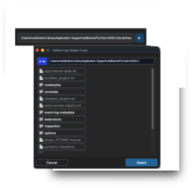
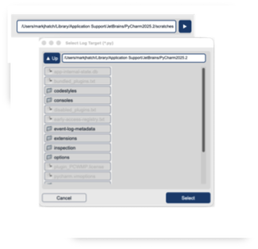


### API Property Reference

| Property / Feature | Standard CustomTkinter | Your `sCustomTkinter` Setup |
| :--- | :--- | :--- |
| **Instantiation** | *Not Available Natively* | `sCTkPathChooser(master)` *(Compound Path Selector)* |
| **File Mapping** | No unified compound object natively synchronizes text cells with buttons. | Separated safely across `sCTkPathChooser.py` and `ThemeableWidget.py`. |
| **State Lock** | `self.configure(state="disabled")` | `chooser.state("disabled")`<br>**OR**<br>`chooser.configure(state="disabled")`<br><br>**Polymorphic State Control:** Simultaneously locks the entry string text buffer lane and freezes the browser launcher button out of centralized `disabled_map` guidelines. |
| `get_state()` | *Not Available Natively* | `Method -> str` explicit verification query matching system test assertions. |

---

### Constructor

Initialize a custom compound directory path or file selector instance. Offset parameters like `btn_width` or `entry_height` can be passed cleanly during instantiation to stretch internal sub-elements independently.

```python
sCTkPathChooser(master, type="directory", title="Select Path", filetypes=None, initialdir=None, initialfile=None, command=None, width=350, height=32, justify="left", entry_height=32, btn_width=110, btn_height=32, btn_text=None, browser_width=500, browser_height=450, **kwargs)
```

| Parameter Name | Data Type | Default Value | Description |
| :--- | :--- | :--- | :--- |
| `master` | `any` | *Required* | Reference pointer tracking your root window, parent layout layer, or container frame capsule. |
| `type` | `str` | `"directory"` | Structural layout operation mode. Options: `"directory"` (renders folder browser options) or `"file"` (enforces file extension checks). |
| `title` | `str` | `"Select Path"` | Text heading string displayed inside the top title deck of the popup modal browser window. |
| `filetypes` | `list` / `str` | `None` | Filter array masking permitted file extensions. Formatted as an explicit python list or bracketed string array (e.g., `['.py', '.json']`). |
| `justify` | `str` | `"left"` | Text alignment profile string inside the input field lane. Accepts `"left"`, `"right"`, or `"center"`. |
| `entry_height` | `int` | *Matches height* | Manual vertical height footprint tracking restriction assigned to the text box lane measured in pixels. |
| `btn_width` | `int` | `110` | Manual horizontal width allocated to the macro click trigger browse button measured in pixels. |
| `btn_text` | `str` | `None` | Display string override assigned to the browse button. Automatically falls back to mode labels if left as `None`. |
| `command` | `callable` | `None` | Single-click method event callback executed whenever a file selection path is successfully submitted or confirmed. |
### Convenience Functions
```python
# Programmatically manipulate selector entries, fetch strings, or trigger modal windows on the fly
chooser.set("/Users/name/Documents") # Clears the current buffer and inserts an expanded absolute pathway
active_path = chooser.get()          # Returns the active character path string array currently displayed

# Evaluate current state configurations or apply absolute user interaction locks via dual-routing syntax
current_mode = chooser.get_state()   # Returns 'normal' or 'disabled'
chooser.state("disabled")            # Freezes button triggers and applies muted flat gray skins
```

### Centralized Stylesheet Setup (`sCTkThemes.json`)
```json
{
    "sCTkPathChooser": {
        "entry_fg": ["#FFFFFF", "#1E1E1E"],
        "entry_border_color": ["#CBD5E1", "#334155"],
        "entry_text_color": ["#1F2937", "#FFFFFF"],
        "entry_font": ["Arial", 12],
        "btn_fg": ["#1A4375", "#1F6AA5"],
        "btn_border_color": ["#94A3B8", "#4B5563"],
        "btn_text_color": ["#FFFFFF", "#FFFFFF"],
        "btn_hover": ["#112A4B", "#194A7A"],
        "btn_font": ["Arial", 11, "bold"],
        "disabled_map": {
            "entry_fg": ["#F9FAFB", "#1A1A1A"],
            "entry_border_color": ["#E5E7EB", "#222222"],
            "entry_text_color": ["#94A3B8", "#4B5563"],
            "btn_fg": ["#F3F4F6", "#111111"],
            "btn_border_color": ["#E5E7EB", "#222222"],
            "btn_text_color": ["#94A3B8", "#4B5563"]
        }
    }
}
```

---

### Other Notes
* **Inversion Blacklist & Mutation Shield:** To bypass CustomTkinter's private constructor sweeping arrays that destructively mutate configuration dictionary values, the constructor copies your data parameters into `self._local_defaults = dict(self.final_kw)` beforehand. This preserves your geometric variables safely.
* **Polymorphic Cascade Safety:** State changes automatically flow downward. Passing a `.state("disabled")` loop locks down both the interior text lane and the macro browse button, preventing unwanted modal triggers and hover events uniformly.
* **Automated Lifecycle Handshake:** Triggers `self._finalize_themeable_lifecycle()` at the absolute bottom of the initialization track to cleanly pass instance registration hooks straight back up to Pygubu layout trees out of the box.

---

### Implementation Example & Test Harness

Below is a complete, self-contained test execution script demonstrating how to embed an `sCTkPathChooser` within an isolated `sCTkFrame` chassis backplane while implementing runtime lock states and interactive selection feedback loops.

```python
#!/usr/bin/python3
# =====================================================================
# 🛠️ TESTING HARNESS IMPORTS & SETUP for Path Chooser
# =====================================================================

import os
import customtkinter as ctk
from scustomtkinter import sCTkFrame, sCTkButtonPrimary, sCTkLabelSecondary, sCTk, sCTkPathChooser

if __name__ == "__main__":

    root = sCTk()
    root.title("Compound Path Chooser Test Suite")
    root.geometry("700x260")

    base = sCTkFrame(root)
    base.pack(expand=True, fill="both", padx=20, pady=20)

    lbl_monitor = sCTkLabelSecondary(base, text="Active Telemetry Target: [None Selection]")
    lbl_monitor.pack(pady=10)

    def print_result(path):
        lbl_monitor.configure(text=f"Active Telemetry Target: {os.path.basename(path)}")
        print(f"MAIN CONSOLE PATH SELECTION -> {path}")

    chooser = sCTkPathChooser(
        base, type="file", title="Select Log Target", filetypes=[".py"], command=print_result,
        justify="right", width=550, height=50, state="normal", entry_height=40, btn_width=40,
        btn_height=40, btn_text="▶", browser_width=550, browser_height=500
    )
    chooser.pack(padx=20, pady=15)

    def toggle_chooser_lock():
        target = "disabled" if chooser.get_state() == "normal" else "normal"
        chooser.configure(state=target)
        btn_lock.configure(text="Lock Chooser Deck" if target == "normal" else "Unlock Chooser Deck")
        print(f"Logged Verification Hook -> chooser.get_state() = {chooser.get_state()}")

    btn_lock = sCTkButtonPrimary(base, text="Lock Chooser Deck", command=toggle_chooser_lock)
    btn_lock.pack(side="bottom", pady=5)

    print("--- BOOT INITIALIZATION PASSTHROUGH ---")
    chooser.state("disabled")
    print("state (Disabled Pass) =", chooser.get_state())
    chooser.state("normal")
    print("state (Normal Pass)   =", chooser.get_state())
    print("========================================\n")

    root.mainloop()
```

[Return to Table of Contents](#contents)


## sCTkScrollArea

The `sCTkScrollArea` is an unblocked viewport container layout chassis designed for the `sCustomTkinter` radio desktop interface. It acts as a direct canvas frame alternative to `ctk.CTkScrollableFrame`, allowing isolated external scrolling elements to connect natively to an internal view surface. It isolates internal frame elements to capture mouse wheels and high-precision touchpad momentum sweeps smoothly across all target rows.


### 📌 Localized Table of Contents
* [API Constructor Reference](#-api-constructor-reference)
* [Native Viewport Alignment Handshake](#%EF%B8%8F-native-viewport-alignment-handshake)
* [Centralized Stylesheet Integration](#-centralized-stylesheet-integration-sctkthemesjson)
* [Implementation Reference Template](#-implementation-reference-template)

---

### 📋 API Constructor Reference

#### `sCTkScrollArea` Constructor
```python
scroll_area = sCTkScrollArea(master=None, **kwargs)
```

#### `sCTkScrollbar` Constructor
```python
scrollbar = sCTkScrollbar(master=None, orientation="vertical", **kwargs)
```

### API Property Reference

| Property / Feature | Standard CustomTkinter | Your `sCustomTkinter` Setup |
| :--- | :--- | :--- |
| **Instantiation** | `ctk.CTkScrollableFrame(master)` | `sCTkScrollArea(master)` *(Unblocked Direct Canvas Frame)* |
| **Viewport Target** | Fixed internal scrolling handle | `scroll_view.scroll_content` *(Exposed content container frame parent)* |
| **High-Precision Logic**| Hardcoded scroll layout chains | **Inertial Micro-Delta Aggregator:** Smoothly captures, normalizes, and dampens Apple Magic Mouse and Trackpad sweeps natively. |
| **Event Routing** | Restricts wheel events outside bounds | **Event Propagator Pattern:** Broadcaster hooks platform-synchronized event listeners across viewport rows automatically. |

---

### 🎛️ Native Viewport Alignment Handshake
Connecting the unblocked container frame to an isolated themeable scrollbar involves a single architectural lifecycle call.

When you pack the label items or tracking data lines inside the container frame, you invoke the convenience event propagator. This ensures that traditional mouse wheels and high-precision Apple touchpad momentum sweeps execute with perfect visual continuity even when hovering over nested child items.

```python
# 1. Native alignment layout handshake
scroll_view.hook_scrollbar(scrollbar)

# 2. Populate data items directly into the scrolling content frame panel
for i in range(25):
    lbl_item = sCTkLabelSecondary(scroll_view.scroll_content, text="Telemetry Row")
    lbl_item.pack()
    
    # 3. Propagate scroll wheel sweeps from children back up to the canvas base
    scroll_view.propagate_scroll_events(lbl_item)
```

[Go to Piece 2 of 2](#%F0%9F%8E%A8-centralized-stylesheet-integration-sctkthemesjson) | [Return to Table of Contents](#%F0%9F%93%8C-localized-table-of-contents)

### 🎨 Centralized Stylesheet Integration (`sCTkThemes.json`)

`sCTkScrollArea` drives its configuration rules out of your central theme file. Redundant layout wrappers and broken configuration keys are completely omitted, maintaining a clean, production-grade JSON dictionary footprint.

```json
{
    "sCTkScrollArea": {
        "corner_radius": 0,
        "fg_color": "transparent",
        "border_width": 0,
        "border_color": "transparent"
    }
}
```

---

### 💻 Implementation Reference Template

```python
#!/usr/bin/python3
# =====================================================================
# 🛠️ TESTING HARNESS IMPORTS & SETUP for ScrollArea
# =====================================================================

import customtkinter as ctk
from scustomtkinter import sCTkFrame, sCTkButtonPrimary, sCTkLabelSecondary, sCTk, sCTkScrollbar, sCTkScrollArea

if __name__ == "__main__":
    root = sCTk()
    root.geometry("480x480")
    root.title("sCTkScrollArea Unified Validation Deck")
    root.configure(fg_color=("#F1F5F9", "#1C1C1C"))

    # 2. Arrange our isolated lower button layout panel tray
    lower_tray = ctk.CTkFrame(root, fg_color="transparent")
    lower_tray.pack(side="bottom", fill="x", padx=15, pady=(0, 15))

    # 3. Mount master backplane panel frame capsule container
    main_layout = sCTkFrame(root, border_width=2)
    main_layout.pack(expand=True, fill="both", padx=15, pady=15)

    status_monitor = sCTkLabelSecondary(main_layout, text="SYSTEM STATUS: [VIEWPORT CHASSIS ONLINE]")
    status_monitor.pack(fill="x", padx=10, pady=(5, 10))

    def toggle_appearance_skin():
        ctk.set_appearance_mode("Light" if ctk.get_appearance_mode() == "Dark" else "Dark")

    # Pack our skin preference toggler safely inside the isolated lower tray panel
    btn_theme = sCTkButtonPrimary(lower_tray, text="Toggle UI Light/Dark Appearance", command=toggle_appearance_skin)
    btn_theme.pack(fill="x", expand=True, padx=5)

    # 4. Mount themeable custom scrollbar primitive
    scrollbar = sCTkScrollbar(main_layout, orientation="vertical")
    scrollbar.pack(side="right", fill="y", padx=(5, 10), pady=10)

    # 5. Build nested viewport container layout tracks
    content_chassis = sCTkFrame(main_layout, border_width=0, fg_color="transparent")
    content_chassis.pack(side="left", fill="both", expand=True, padx=(10, 0), pady=10)

    scroll_view = sCTkScrollArea(content_chassis)
    scroll_view.pack(fill="both", expand=True)

    # 6. Populate viewport with telemetry data and invoke the opt-in convenience propagator
    for i in range(25):
        lbl_item = sCTkLabelSecondary(scroll_view.scroll_content, text=f"▶ Transceiver Core Channel Lane Code: {100 + i} [STATUS: OK]")
        lbl_item.pack(anchor="w", padx=10, pady=4)
        scroll_view.propagate_scroll_events(lbl_item)

    # 7. Wire hardware event pipelines natively together
    scroll_view.hook_scrollbar(scrollbar)

    root.mainloop()
```

[Return to Table of Contents](#%F0%9F%93%8C-localized-table-of-contents)


## sCTkSelector

### Table of Contents
* [API Property Reference](#api-property-reference)
* [Constructor](#constructor)
* [Convenience Functions](#convenience-functions)
* [Centralized Stylesheet Setup](#centralized-stylesheet-setup-sctkthemesjson)
* [Other Notes](#other-notes)
* [Implementation Example & Test Harness](#implementation-example--test-harness)

---

An advanced theme-compliant option list selector widget. It pairs an optional high-contrast string prefix search lane with a dynamic checklist scrollback chassis to safely manage multi-state checkbox row configurations natively.


### API Property Reference

| Property / Feature | Standard CustomTkinter | Your `sCustomTkinter` Setup |
| :--- | :--- | :--- |
| **Instantiation** | *Not Available Natively* | `sCTkSelector(master)` *(Scrollable Options Selector)* |
| **File Mapping** | Array elements bundle manually without centralized theme hooks. | Separated safely across `sCTkSelector.py` and `ThemeableWidget.py`. |
| **State Lock** | *Not Supported Natively* | `theSelector.state("disabled")`<br>**OR**<br>`theSelector.configure(state="disabled")`<br><br>**Polymorphic State Controller:** Simultaneously locks the top search bar entry field and paralyzes all child selection checkbox tracks natively using a low-level event intercept matrix. |
| `searchBox` | *Not Supported Natively* | `Property -> bool`. Controls visibility of the dynamic search bar lane. |

---

### Constructor

Initialize a custom themed selector option array tree layout.

```python
items = ["vw", "porsche", "roadster", "tesla", "ferrari", "mclaren"]

# Instantiate with multi-selection active but search functionality turned off
theSelector = sCTkSelector(
    master=root, 
    items=items, 
    multiple_choices=True, 
    searchBox=False
)

# Render the widget inside your container panel
theSelector.pack(expand=True, fill="both", padx=15, pady=15)
```

---

### Convenience Functions
```python
# Unpack current active choices dynamically
active_items = theSelector.get_selections()  # Returns list of strings e.g. ['porsche', 'tesla']

# Return all mapped string names managed by the element index
all_options = theSelector.get_all_items()     # Returns list of all items

# Wipe selection arrays clean uniformly
theSelector.clear_selections()

# Adjust layout properties or component visibilities on the fly
theSelector.configure(searchBox=True)        # Dynamically mounts and renders search bar lane
```
### Centralized Stylesheet Setup (`sCTkThemes.json`)
```json
{
    "sCTkSelector": {
        "fg_color": ["#FAFAFA", "#11141A"],
        "border_color": ["#CBD5E1", "#222933"],
        "text_color": ["#1F2937", "#FFFFFF"],
        "disabled_map": {
            "fg_color": ["#F1F5F9", "#0A0D14"],
            "border_color": ["#E2E8F0", "#171C24"]
        }
    }
}
```

---

### Other Notes
* **Crash-Shield Transparency Interceptor:** Native checkboxes throw a fatal `ValueError` if their indicator fills map to `transparent`. If the selector's master frame layout returns a transparent background, the visual router automatically overrides the checkbox container tracks with solid high-contrast corporate hex codes on boot.
* **Light Mode Contrast Guard:** To bypass CustomTkinter's native washed-out white checkmark bug on locked elements, the repaint engine manually forces a dark gray checkmark selection overlay inside Light Mode, keeping checked rows perfectly legible.
* **Automated Lifecycle Handshake:** At the absolute bottom of the initialization sequence, the constructor fires `self._finalize_themeable_lifecycle()` to safely pass instance registration hooks straight back up to Pygubu layout trees.

---

### Implementation Example & Test Harness

Below is a complete, self-contained testing suite containing interactive buttons to safely evaluate option configurations, state locks, and real-time global look preference shifts.

```python
#!/usr/bin/python3
# =====================================================================
# 🛠️ TESTING HARNESS IMPORTS & SETUP for Selector
# =====================================================================

import customtkinter as ctk
from scustomtkinter import sCTkButtonPrimary, sCTk, sCTkSelector


if __name__ == "__main__":
    def on_confirm(): print(f"Active Selection Telemetry Array: {theSelector.get_selections()}")

    root = sCTk()
    root.geometry("250x420")
    root.title("sCTkSelector Validation Bench")

    items = ["vw", "porsche", "roadster", "tesla", "ferrari", "mclaren"]
    theSelector = sCTkSelector(root, items=items, multiple_choices=True)
    theSelector.pack(expand=True, fill="both", padx=15, pady=15)

    def toggle_selector_lock():
        target = "disabled" if theSelector.get_state() == "normal" else "normal"
        theSelector.configure(state=target)
        btn_lock.configure(text="Lock Selector Deck" if target == "normal" else "Unlock Selector Deck")

    def toggle_skin_mode():
        current_skin = ctk.get_appearance_mode()
        ctk.set_appearance_mode("Light" if current_skin == "Dark" else "Dark")

    confirm_btn = sCTkButtonPrimary(root, text="Confirm Selections", command=on_confirm)
    confirm_btn.pack(pady=5)
    btn_lock = sCTkButtonPrimary(root, text="Lock Selector Deck", command=toggle_selector_lock)
    btn_lock.pack(pady=5)
    btn_theme = sCTkButtonPrimary(root, text="Simulate Global Theme Shift", command=toggle_skin_mode)
    btn_theme.pack(pady=(5, 15))

    root.mainloop()

```

[Return to Table of Contents](#contents)


## sCTkSeparator

(Derived from Selector class by Fastattack, 2024. This widget was made available to the community via the MIT License. Source Repository: [MoreCustomTkinterWidgets](https://github.com) )

### Table of Contents
* [System Architecture Overview](#system-architecture-overview)
* [API Property Reference](#api-property-reference)
* [Centralized Stylesheet Setup](#centralized-stylesheet-setup-sctkthemesjson)
* [Layout Manager Integration](#layout-manager-integration)
* [Pygubu Designer Properties Guide](#pygubu-designer-properties-guide)
* [Implementation Example & Test Harness](#implementation-example--test-harness)

---

The *sCTkSeparator* is an advanced, themeable divider widget for CustomTkinter. It provides dynamic scaling via layout managers, vector-drawn customizable corner radiuses, dashed/dotted line styles, and automated line-splitting centered section text headers with bounding capsule brackets.

--- 

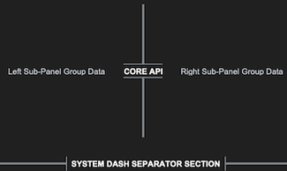
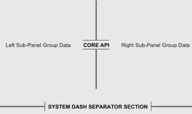


### System Architecture Overview

The component functions as a structural vector drawing lane subclassed from `ctk.CTkBaseClass`. Rather than forcing a static line width or texture file, it wraps a native Tkinter canvas object to paint partitions programmatically.

The visual update matrix implements two important enhancements:
1. **Dynamic Layout Dimension Adapters**: To prevent text characters from clipping, the instantiation block monitors initialization properties. If text section banners are provided, the widget automatically stretches its bounding frame vertical or horizontal thickness out to `28px` to give text canvas regions clear physical space while leaving the split line itself perfectly thin.
2. **Skin Preference Broadcaster Interceptor**: Features an explicit `_set_appearance_mode` connection loop. This forces text header strings, dashed patterns, and line fills to recalculate active palettes instantly during global theme swaps without any pixel lag.

---

### API Property Reference

| Property Name | Data Type | Default Value | Description |
| :--- | :--- | :--- | :--- |
| `master` | `any` | *Required* | Parent container instance (e.g., `sCTkFrame` or `ctk.CTk`). |
| `length` | `int` | `100` | The total span length of the line track in pixels (corresponds to widget height if vertical, width if horizontal). |
| `width` | `float` | `4` | The visual thickness profile of the divider line in pixels. |
| `corner_radius` | `int` or `None` | `6` (from theme) | Defines roundness sharpness of divider line endpoints (defaults to stylesheet configuration). |
| `orientation` | `str` | `"vertical"` | Sets spatial directional positioning alignment. Accepts `"vertical"` or `"horizontal"`. |
| `text` | `str` | `""` | Appends a centered section header label text directly inside a computed line split zone. |
| `font` | `tuple` or `CTkFont` | `("Arial", 11, "bold")` | Text font profile style parameters for the embedded header tag. |
| `text_color` | `str` or `Tuple[str, str]` | Central theme default | Font hex palette token string mapping. Supports appearance mode tuples. |
| `dash` | `tuple` or `None` | `None` | Integer stroke sequence array tuple mapping out dashed/dotted rendering rules (e.g., `(5, 5)`). |

---

### Centralized Stylesheet Setup (`sCTkThemes.json`)

The component queries your centralized theme sheet profile matrix using standard `self._resolve_color()` lookup calls, ensuring that indicator dots and canvas borders translate colors smoothly across appearance updates.

To satisfy the framework configuration guidelines, ensure your theme matrix includes this structured asset block:

```json
{
    "sCTkSeparator": {
        "fg_color": ["#808080", "#8A9296"],
        "bg_color": "transparent",
        "corner_radius": 6,
        "font": ["Arial", 11, "bold"],
        "text_color": ["#1A1A1A", "#FFFFFF"],
        "disabled_map": {
            "fg_color": ["#CBD5E1", "#475569"],
            "text_color": ["#94A3B8", "gray50"]
        }
    }
}
```
### Layout Manager Integration

Mixing layout manager tracking loops within the same immediate frame layer is completely blocked. When handling automated expansion parameters across scaling monitor resolutions, enforce the following geometry behaviors:

#### Grid Configurations (`.grid()`)
* **Horizontal Mode Line**: Must use **`sticky="ew"`** to allow the vector path to grow horizontally.
* **Vertical Mode Line**: Must use **`sticky="nswe"`** to stretch across columns and rows evenly without crushing string lines.
* **Parent Frame Setup**: The container frame track columns/rows **must** have their weights configured to let the engine allocate expanding window real estate:
  ```python
  # Column 0 and Column 2 hold widgets and expand; Column 1 isolates the separator line track
  grid_Frame.grid_columnconfigure(0, weight=1)
  grid_Frame.grid_columnconfigure(1, weight=1)
  grid_Frame.grid_columnconfigure(2, weight=1)
  ```

#### Pack Configurations (`.pack()`)
* **Horizontal Mode Line**: Must use **`fill="x"`** alongside `expand=False` so it hugs adjacent frames tightly instead of expanding into empty background rows.
* **Vertical Mode Line**: Must use **`fill="y"`** inside layout columns.

---

### Pygubu Designer Properties Guide

When configuring layouts visually within the Pygubu Designer editing workspace panel strip, observe these property formatting rules:

1. **`orientation`**: Select `vertical` or `horizontal` from the choice dropdown list pane. The preview canvas will immediately adjust orientations without flattening.
2. **`text`**: Type any section title banner sequence string directly into the entry field (e.g., `AUDIO CONTROLS`). The line will cleanly break around the text boundaries.
3. **`dash`**: Enter raw comma-separated lists of numerical values directly into the input strip **without using quote symbols or brackets**.
   * Type `5,5` for standard clean dash blocks.
   * Type `2,6` for clean dotted layout maps.
   * Leave blank or type `None` to restore solid rounded vector shapes.

---

### Implementation Example & Test Harness

Below is a complete, self-contained test execution script demonstrating how to layout horizontal, vertical, and dashed separators inside an interactive telemetry deck panel while exercising lock states and skin sweeps.

```python
#!/usr/bin/python3
# =====================================================================
# 🛠️ TESTING HARNESS IMPORTS & SETUP for Separator
# =====================================================================

import customtkinter as ctk
from scustomtkinter import sCTkFrame, sCTkButtonPrimary, sCTkLabelSecondary, sCTk, sCTkSeparator

if __name__ == "__main__":
    root = sCTk()
    root.title("sCTkSeparator Production Test Environment")
    root.geometry("600x450")

    grid_Frame = sCTkFrame(root)
    grid_Frame.pack(side="top", fill="both", expand=True, padx=20, pady=15)
    grid_Frame.grid_columnconfigure(0, weight=1); grid_Frame.grid_columnconfigure(1, weight=1); grid_Frame.grid_columnconfigure(2, weight=1); grid_Frame.grid_rowconfigure(0, weight=1)

    lbl_left = sCTkLabelSecondary(grid_Frame, text="Left Sub-Panel Group Data")
    lbl_left.grid(row=0, column=0, sticky="nswe")

    sep_vertical_text = sCTkSeparator(grid_Frame, orientation="vertical", text="CORE API", width=4)
    sep_vertical_text.grid(row=0, column=1, sticky="nswe", padx=10, pady=10)

    lbl_right = sCTkLabelSecondary(grid_Frame, text="Right Sub-Panel Group Data")
    lbl_right.grid(row=0, column=2, sticky="nswe")

    sep_horizontal_text = sCTkSeparator(root, orientation="horizontal", text="SYSTEM DASH SEPARATOR SECTION", width=4)
    sep_horizontal_text.pack(side="top", fill="x", padx=20, pady=10)

    def toggle_separator_lock():
        target = "disabled" if sep_vertical_text.get_state() == "normal" else "normal"
        sep_vertical_text.configure(state=target)
        sep_horizontal_text.configure(state=target)
        btn_lock.configure(text="Lock Separators" if target == "normal" else "Unlock Separators")

    def toggle_skin_mode():
        current_skin = ctk.get_appearance_mode()
        ctk.set_appearance_mode("Light" if current_skin == "Dark" else "Dark")

    btn_lock = sCTkButtonPrimary(root, text="Lock Separators", command=toggle_separator_lock)
    btn_lock.pack(pady=5)
    btn_theme = sCTkButtonPrimary(root, text="Simulate Global Theme Shift", command=toggle_skin_mode)
    btn_theme.pack(pady=(5, 20))

    root.mainloop()
```

[Return to Table of Contents](#contents)


## sCTkSMeter

The `sCTkSMeter` is a standalone, theme-adaptive analog S-Meter/Power Output gauge instrument designed specifically for ham radio transceiver desktop interfaces. Natively inheriting container footprints from `customtkinter.CTkFrame`, it delivers smooth telemetry tracking sweeps without the overhead of extraneous nesting modules.


---

### 🛠️ Core Gauge Geometry & Scale Mechanics

The instrument face is split mathematically to mirror classic analog transceiver gauge divisions perfectly:
*   **The S-Unit Scale (Ticks 0–9):** Maps incoming telemetry values from `0.0` to `9.0` linearly across the first 60% of the visual arc container, rendered in your high-contrast brand or amber theme palettes.
*   **The Decibel Over S9 Scale (Ticks 9–15):** Maps advanced signal parameters from `9.0` up to `69.0` across the remaining 40% of the dial arc track (where `+20dB` sits at coordinate 29, `+40dB` at 49, and `+60dB` at 69). This region is permanently framed by your crimson/redline alert warning colors.
*   **Unified Pivot Axis Integration:** The inner rendering engines calculate lines, arcs, labels, and needle sweeps using a singular synchronized mathematical pivot point (`center_x = width * 0.48`). This entirely eliminates off-axis tracking drift or floating pointer artifacts when live data streams update.

---

### 📋 API Constructor Reference

```python
sCTkSMeter(master=None, width=340, height=130, **kw)
```

| Parameter Name | Data Type | Default Value | Description |
| :--- | :--- | :--- | :--- |
| `master` | `any` | `None` | Reference pointer tracking your root window or parent `sCTkFrame` container layout layer. |
| `width` | `int` | `340` | Manual hardware panel horizontal width boundary tracking profile measured in pixels. Supports on-the-fly Pygubu geometry defaults resetting queries safely. |
| `height` | `int` | `130` | Manual hardware panel vertical height boundary tracking profile measured in pixels. Supports on-the-fly Pygubu geometry defaults resetting queries safely. |

---

### ⚡ Global Object Instance Methods

To drive the needle tracking sweep fluidly inside background receiver threads, automatic VFO frequency scanning loops, or telemetry data parsing hooks, utilize this direct public setter:

#### Update Instrument Needle Position
```python
# Updates pointer positioning dynamically. Expects a float value clamped between 0.0 and 69.0.
smeter.set(value)
```

---

### 🎨 Centralized Stylesheet Integration (`sCTkThemes.py`)

The component is deeply integrated with your centralized theme dictionary layout. To ensure that canvas backgrounds, typography text arcs, and indicator colors translate cleanly during startup initialization sweeps or global appearance mode switches, verify your shared configuration contains this asset block:

```python
THEME_DEFAULTS = {
    "sCTkSMeter": {
        # Light Mode: Clean White Face | Dark Mode: Deep Obsidian Cockpit Black
        "fg_color": ("#F8FAFC", "#0A0A0A"),       
        
        # High-Contrast Brand Blue for bright rooms / Illuminated Glowing Neon Amber for dark setups
        "text_color": ("#1A4375", "#FF9100"),     
        
        # Solid High-Contrast Crimson / Intense Mechanical Redline alert arc warning zone
        "alarm_color": ("#990000", "#FF2200"),    
        
        # Deep Cobalt-Navy Slate indicator pointer / Blazing Orange needle tracking sweep
        "needle_color": ("#112A4B", "#FF9100"),
        
        # Dial layout calibration typography fonts
        "font": ("Arial", 10, "bold")
    },
    # ... your other widget entries
}
```

---

### Implementation Example & Test Harness

Below is a complete, self-contained interactive test execution script demonstrating how to use `sCTkSMeter`.


```python
#!/usr/bin/python3
# =====================================================================
# 🛠️ TESTING HARNESS IMPORTS & SETUP for S Meter
# =====================================================================

import customtkinter as ctk
from scustomtkinter import sCTkFrame, sCTkButtonPrimary, sCTk, sCTkSMeter
import random


if __name__ == "__main__":

    root = sCTk()
    root.title("sCTk Standalone Analog Gauge")
    root.geometry("450x260")
    root.configure(fg_color=("#F1F5F9", "#1C1C1C"))

    dashboard_frame = sCTkFrame(root, fg_color="transparent", border_width=0)
    dashboard_frame.pack(padx=20, pady=20)

    smeter = sCTkSMeter(dashboard_frame, width=340, height=130)
    smeter.pack(padx=10, pady=10)


    class SignalSimulator:
        def __init__(self, root_win, meter):
            self.root, self.meter = root_win, meter
            self.target, self.needle = 6.0, 0.0

        def shift_vfo(self):
            self.target = random.uniform(1.5, 65.0)
            self.root.after(random.randint(2500, 5000), self.shift_vfo)

        def physics_loop(self):
            jitter = random.uniform(-1.5, 1.5)
            sig = max(0.0, min(69.0, self.target + jitter))
            self.needle += (sig - self.needle) * 0.25
            self.meter.set(self.needle)
            self.root.after(25, self.physics_loop)


    sim = SignalSimulator(root, smeter)
    sim.physics_loop()
    sim.shift_vfo()


    def toggle_theme():
        ctk.set_appearance_mode("Light" if ctk.get_appearance_mode() == "Dark" else "Dark")


    sCTkButtonPrimary(root, text="Toggle Theme mode", command=toggle_theme).pack(pady=5)
    root.mainloop()

```


## sCTkSMeterBar

The `sCTkSMeterBar` is a standalone, low-profile horizontal discrete 30-segment LED bar instrumentation widget displaying independent telemetry tracks for incoming receiver S-Units, transmitter SWR ratio levels, and forward RF Power output percentage. Like all sCTk widgets, it is fully theme-adaptive.


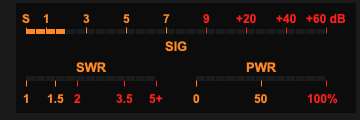


---

### 🛠️ Subsystem Layout & Multi-Track Physics

The discrete LED matrix map shifts automatically based on the device operational path constraints:
*   **The S-Meter Track (Top Row):** Maps incoming telemetry values across 30 linear segments. Signals from `0.0` to `9.0` utilize the first 60% of the bar, while advanced signal ranges up to `+60dB` expand into the remaining 40% redline warning zone.
*   **The Transmitter Track (Split Bottom Row):** Splices the lower segment path down the center into two separate monitoring zones. The left half maps a logarithmic SWR reflection track up to your custom `swr_max_value`, while the right half tracks forward RF power from `0%` to `100%`.
*   **Post-Boot Geometry Flattening:** Overrides native internal grid layout constraints programmatically to force all 30 LED rectangles to sit perfectly flush. This completely removes horizontal spacing holes, keeping your panel elements locked into a solid hardware console bar.

---

### 📋 API Constructor Reference

```python
sCTkSMeterBar(master=None, swr_max_value=5.0, swr_visible=True, pwr_visible=True, hide_lower_row=False, width=340, height=110, **kw)
```

| Parameter Name | Data Type | Default Value | Description |
| :--- | :--- | :--- | :--- |
| `master` | `any` | `None` | Reference pointer tracking your root window or parent `sCTkFrame` container layout layer. |
| `swr_max_value` | `float` | `5.0` | The explicit maximum scale boundary representing the far right edge limit tracking your transmitter's SWR track. |
| `swr_visible` | `bool` | `True` | Visibility flag for the SWR cluster. Flipping to `False` shifts the text, ticks, and active LEDs into a faded, disabled palette look. |
| `pwr_visible` | `bool` | `True` | Visibility flag for the PWR cluster. Flipping to `False` shifts the text, ticks, and active LEDs into a faded, disabled palette look. |
| `hide_lower_row` | `bool` | `False` | Layout override command. When `True`, the entire lower instrumentation cluster collapses and vanishes, pushing the `SIG` bar to the true vertical center of the card footprint. |
| `width` | `int` | `340` | Manual hardware panel horizontal width boundary tracking profile measured in pixels. Supports on-the-fly Pygubu geometry defaults resetting queries safely. |
| `height` | `int` | `110` | Manual hardware panel vertical height boundary tracking profile measured in pixels. Supports on-the-fly Pygubu geometry defaults resetting queries safely. |

---

### ⚡ Global Object Instance Methods

#### Update Instrument Telemetry Channels
```python
# Pass parameters to update any of the 3 telemetry rows independently on the fly.
# Expects floats matching your radio data streams.
led_bar_gauge.set(s_value=9.2, swr_value=1.4, pwr_value=45.0)
```

#### Live Layout Configuration Modifier
```python
# Updates layout presentation properties on the fly without reconstruction overhead.
led_bar_gauge.configure_visibility(swr_visible=False, pwr_visible=True, hide_lower_row=False)
```

---

### 🎨 Centralized Stylesheet Integration (`sCTkThemes.py`)

The component relies heavily on your centralized style dictionary system. To prevent the mixin parser tracking structures from raising runtime validation faults during initialization cycles, verify your shared stylesheet contains this asset configuration block:

```python
THEME_DEFAULTS = {
    "sCTkSMeterBar": {
        # Light Mode: Clean Slate-White Face | Dark Mode: Deep Obsidian Cockpit Black
        "fg_color": ("#F8FAFC", "#0A0A0A"),       
        
        # High-Contrast Brand Blue for bright rooms / Illuminated Glowing Neon Amber for dark setups
        "text_color": ("#1A4375", "#FF9100"),     
        
        # Solid High-Contrast Crimson / Intense Mechanical Redline alert segment zones
        "alarm_color": ("#DC2626", "#FF2200"),    
        
        # Active illuminated LED block color tracks mapped out below threshold limits
        "led_on_color": ("#2471A3", "#10B981"),   
        
        # Unlit background matrix segment pockets visible behind dark/inactive areas
        "led_off_color": ("#E2E8F0", "#1F2937")   
    },
    # ... your other widget entries
}
```

---

### Implementation Example & Test Harness

Below is a complete, self-contained interactive test execution script demonstrating how to use `sCTkSMeterBar`.


```python
#!/usr/bin/python3
# =====================================================================
# 🛠️ TESTING HARNESS IMPORTS & SETUP for S Meter Bar
# =====================================================================

import customtkinter as ctk
from scustomtkinter import sCTkFrame, sCTkButtonPrimary, sCTk, sCTkSMeterBar
import random


if __name__ == "__main__":

    app = sCTk()
    app.title("sCTk Bar Instrument Test Harness")
    app.geometry("440x240")
    app.configure(fg_color=("#F1F5F9", "#1C1C1C"))

    panel_container = sCTkFrame(app, fg_color="transparent", border_width=0)
    panel_container.pack(padx=20, pady=15, fill="both", expand=True)

    led_bar_gauge = sCTkSMeterBar(panel_container, width=340, height=110)
    led_bar_gauge.pack()

    class HarnessSimulator:
        def __init__(self, root_win, bar):
            self.root, self.bar = root_win, bar
            self.s_target, self.s_curr = 4.0, 0.0
            self.swr_target, self.pwr_target = 1.0, 0.0
            self.swr_curr, self.pwr_curr = 1.0, 0.0
            self.tx_active = False

        def tuning_cycle(self):
            self.s_target = random.uniform(0.5, 13.5)
            if not self.tx_active and random.random() > 0.4:
                self.tx_active = True
                self.swr_target = random.uniform(1.1, 4.5)
                self.pwr_target = random.uniform(35.0, 95.0)
                self.root.after(random.randint(1500, 3000), self._release)
            self.root.after(random.randint(4000, 8000), self.tuning_cycle)

        def _release(self):
            self.tx_active = False
            self.swr_target, self.pwr_target = 1.0, 0.0

        def physics_tick(self):
            self.s_curr += ((max(0.0, min(15.0, self.s_target + random.uniform(-1.2, 1.2)))) - self.s_curr) * 0.35
            self.swr_curr += (((max(1.0, min(5.0, self.swr_target + random.uniform(-0.15, 0.15))) if self.tx_active else 1.0)) - self.swr_curr) * 0.20
            self.pwr_curr += (((max(0.0, min(100.0, self.pwr_target + random.uniform(-2.5, 2.5))) if self.tx_active else 0.0)) - self.pwr_curr) * 0.20
            self.bar.set(s_value=self.s_curr, swr_value=self.swr_curr, pwr_value=self.pwr_curr)
            self.root.after(20, self.physics_tick)

    sim = HarnessSimulator(app, led_bar_gauge)
    sim.physics_tick()
    sim.tuning_cycle()

    def toggle_theme():
        ctk.set_appearance_mode("Light" if ctk.get_appearance_mode() == "Dark" else "Dark")

    sCTkButtonPrimary(app, text="Toggle Theme", command=toggle_theme).pack(pady=5)
    app.mainloop()

```


## sCTkSpinbox

The `sCTkSpinbox` is a highly configurable, theme-compliant custom spinbox wrapper widget. It extends `ctk.CTkFrame` and aggregates an internal `sCTkEntryPrimary` alongside two flanking or stacked directional button controls. The component dynamically supports two operational tracking modes: standard numerical incrementation step ranges, and discrete string text array index navigation. Like all sCTk widgets, it is fully theme-adaptive.


<a name="contents"></a>
### 📍 Table of Contents
* [API Constructor Reference](#constructor)
* [Custom Keyword Extensions (**kw)](#extensions)
* [Global Object Instance Methods](#methods)
* [Centralized Stylesheet Integration](#stylesheet)
* [Implementation Reference Template](#template)

---

<a name="constructor"></a>
### 📋 API Constructor Reference

```python
sCTkSpinbox(master=None, from_=0.0, to=100.0, step_size=1.0, command=None, state="normal", wrap=False, justify="left", show=None, placeholder_text=None, exportselection=True, width=140, height=32, **kw)
```

| Parameter Name | Data Type | Default Value | Description |
| :--- | :--- | :--- | :--- |
| `master` | `any` | `None` | Reference pointer tracking your root window or parent layout layer capsule container. |
| `from_` | `float` | `0.0` | The lower numerical limit boundary representing the floor of your adjustment range. |
| `to` | `float` | `100.0` | The upper numerical limit boundary representing the ceiling of your adjustment range. |
| `step_size` | `float` | `1.0` | The exact mathematical offset added or subtracted from your tracking float on every button click. |
| `command` | `callable` | `None` | Optional event logging callback function executed instantly on text shifts, passing the active value. |
| `state` | `str` | `"normal"` | Execution state controller. Toggling to `"disabled"` dampens and locks out all inputs and arrows. |
| `wrap` | `bool` | `False` | Mechanical boundary iteration loop flag. When `True`, stepping past limits wraps around to alternative poles. |
| `justify` | `str` | `"left"` | Content text arrangement alignment tracking mask within the entry area. Options: `"left"`, `"center"`, `"right"`. |
| `show` | `str` | `None` | Character masking input indicator string sequence (e.g. `show="*"` for password entries). |
| `placeholder_text` | `str` | `None` | Faded background prompt text block displayed natively whenever the input cell field is completely empty. |
| `exportselection` | `bool` | `True` | Standard Tkinter selection clipboard persistence state identifier switch. |
| `width` | `int` | `140` | Manual hardware panel horizontal width layout footprint dimension measured in pixels. |
| `height` | `int` | `32` | Manual hardware panel vertical height layout footprint dimension measured in pixels. |

---

<a name="extensions"></a>
### 🛠️ Custom Keyword Extensions (`**kw`)
These exclusive configuration parameters override default geometry behaviors, resolve theme definitions, and style proportions dynamically:

| Extension Parameter | Data Type | Default Value | Description |
| :--- | :--- | :--- | :--- |
| `button_width` | `int` | `22` | The horizontal width tracking measurement assigned to increment/decrement button frames in pixels. |
| `button_height` | `int` | `None` | The vertical button height. If `None`, scales automatically based on active grid parameters. |
| `button_side` | `str` | `"right"` | Hardware control grid positioning side anchor layout. Options: `"right"`, `"left"`, `"split"`. |
| `orientation` | `str` | `"vertical"` | Structural grid layout arrangement axis profile track. Options: `"vertical"`, `"horizontal"`. |
| `arrow_font_size` | `int` | `11` | Typography scaling rule explicitly defining point sizes for the raw directional glyph markings inside Pygubu. |
| `format` | `str` | `""` | Numerical formatting mask specifier string rule (supports C percent styles `%.3f` or bracket masks `{:.3f}`). |
| `values` | `str` / `list` | `None` | Literal input values array string loader. Setting choices converts your widget into Discrete Text List Mode. |

---

<a name="methods"></a>
### ⚡ Global Object Instance Methods

#### Programmatically Set Value Elements
```python
# Insert a distinct float, integer, or matching list mode text option string natively
spinbox.set(12.5)
```

#### Fetch Active Value Strings
```python
# Reaches into the data entry track, pulling back the active string layout contents
current_selection = spinbox.get()
```

#### Discrete Values Array Loader Shortcut
```python
# Programmatically inject custom space-separated lines or list records on the fly
spinbox.set_values('Slow Normal Fast "Turbo Speed" Max')
```

#### Layout Parameter Configuration Modifier
```python
# Updates interactive structural layouts or boundaries cleanly without layout recreation overhead
spinbox.configure(orientation="horizontal", button_side="split", arrow_font_size=14, wrap=True)
```

#### Advanced Sub-Component Style Targeting
If an explicit overrides requirement arises at runtime that bypasses the compiled stylesheet definitions, you can directly interact with the isolated increment/decrement components safely without initialization crashes:
```python
# Manually altering internal button typography fonts or text strings at runtime safely
spinbox.up_button.configure(font=("Arial", 10, "normal"))   # Increment button control instance
spinbox.down_button.configure(font=("Arial", 10, "normal")) # Decrement button control instance
```

---

<a name="stylesheet"></a>
### 🎨 Centralized Stylesheet Integration (`sCTkThemes.json`)

The widget relies heavily on direct index key lookups within your central styling map profile matrix. The component automatically feeds state updates down to your nested `sCTkEntryPrimary` instance, cascading text dimming transitions natively.

```json
{
    "sCTkSpinbox": {
        "font": ["Arial", 15, "normal"],
        "arrow_font_size": 11,
        "arrow_up_char": "▲",
        "arrow_down_char": "▼",
        "arrow_right_char": "▶",
        "arrow_left_char": "◀",
        "format": "%.2f",
        "border_width": 1.5,
        "corner_radius": 6,
        
        "entry_color": ["#FFFFFF", "#111827"],
        "border_color": ["#1A4375", "#64748B"],
        "text_color": ["#1F2937", "#F9FAFB"],
        "placeholder_text_color": ["#5A6E7F", "#526071"],
        "button_color": ["#9E9E9E", "#2A2F3D"],
        "button_hover_color": ["#7D7D7D", "#374151"],

        "disabled_map": {
            "entry_color": ["#F3F4F6", "#1F2937"],
            "border_color": ["#CBD5E1", "#475569"],
            "text_color": ["#94A3B8", "#64748B"],
            "button_color": ["#CBD5E1", "#334155"]
        }
    }
}
```

---

<a name="template"></a>
### 💻 Implementation Reference Template

```python
#!/usr/bin/python3
# =====================================================================
# 🛠️ TESTING HARNESS IMPORTS & SETUP for Spinbox
# =====================================================================

import customtkinter as ctk
from scustomtkinter import sCTkFrame, sCTkComboBox, sCTkLabelSecondary, sCTkEntryPrimary, sCTk, sCTkSpinbox


if __name__ == "__main__":

    app = sCTk()
    app.title("sCTk Advanced Spinbox Tester Deck")
    app.geometry("490x740")
    app.configure(fg_color=("#F1F5F9", "#1C1C1C"))

    def on_spinbox_value_changed(val):
        if isinstance(val, float): vfo_readout.configure(text=f"Telemetry Output: {val:.3f}")
        else: vfo_readout.configure(text=f"Telemetry Output: '{str(val)}'")

    dashboard_panel = sCTkFrame(app, fg_color="transparent", border_width=0)
    dashboard_panel.pack(padx=25, pady=15, fill="both", expand=True)

    vfo_readout = sCTkLabelSecondary(dashboard_panel, text="Telemetry Output: Initializing...", font=("Arial", 22, "bold"), text_color=("#1A4375", "#FF9100"))
    vfo_readout.pack(pady=10)

    spinbox = sCTkSpinbox(dashboard_panel, from_=1.0, to=50.0, step_size=0.5, wrap=True, justify="center", placeholder_text="Click Me", command=on_spinbox_value_changed, width=180, height=34)
    spinbox.pack(pady=10)

    control_frame = sCTkFrame(dashboard_panel, fg_color=("#E2E8F0", "#262626"), corner_radius=6)
    control_frame.pack(fill="both", expand=True, padx=5, pady=10)
    control_frame.grid_columnconfigure(0, weight=1); control_frame.grid_columnconfigure(1, weight=1)

    lbl_state = sCTkLabelSecondary(control_frame, text="Component State:", font=("Arial", 11, "bold"))
    lbl_state.grid(row=0, column=0, padx=15, pady=5, sticky="w")
    state_dropdown = sCTkComboBox(control_frame, values=["Normal State (Active)", "Disabled State (Locked)"], command=lambda choice: spinbox.configure(state="disabled" if "Disabled" in choice else "normal"), width=170)
    state_dropdown.grid(row=0, column=1, padx=15, pady=5, sticky="e"); state_dropdown.set("Normal State (Active)")

    lbl_justify = sCTkLabelSecondary(control_frame, text="Text Alignment (Justify):", font=("Arial", 11, "bold"))
    lbl_justify.grid(row=1, column=0, padx=15, pady=5, sticky="w")
    justify_dropdown = sCTkComboBox(control_frame, values=["Center", "Left", "Right"], command=lambda choice: spinbox.configure(justify=choice.lower()), width=170)
    justify_dropdown.grid(row=1, column=1, padx=15, pady=5, sticky="e"); justify_dropdown.set("Center")

    lbl_format = sCTkLabelSecondary(control_frame, text="Masking Format Pattern:", font=("Arial", 11, "bold"))
    lbl_format.grid(row=2, column=0, padx=15, pady=5, sticky="w")
    format_dropdown = sCTkComboBox(control_frame, values=["None (Default)", "%.1f kHz", "{:.2f}", "{:.3f}"], command=lambda choice: spinbox.configure(format={"%.1f kHz": "%.1f kHz", "{:.2f}": "{:.2f}", "{:.3f}": "{:.3f}", "None (Default)": ""}.get(choice, "")), width=170)
    format_dropdown.grid(row=2, column=1, padx=15, pady=5, sticky="e"); format_dropdown.set("None (Default)")

    lbl_wrap = sCTkLabelSecondary(control_frame, text="Boundary Iteration Wrap:", font=("Arial", 11, "bold"))
    lbl_wrap.grid(row=3, column=0, padx=15, pady=5, sticky="w")
    wrap_dropdown = ctk.CTkComboBox(control_frame, values=["True (Loop Enabled)", "False (Hard Limits)"], command=lambda choice: spinbox.configure(wrap=True if "True" in choice else False), width=170)
    wrap_dropdown.grid(row=3, column=1, padx=15, pady=5, sticky="e"); wrap_dropdown.set("True (Loop Enabled)")

    lbl_mode = sCTkLabelSecondary(control_frame, text="Data Array Input Mode:", font=("Arial", 11, "bold"))
    lbl_mode.grid(row=4, column=0, padx=15, pady=5, sticky="w")
    def on_mode_changed(choice):
        if "Discrete List" in choice: spinbox.set_values(txt_custom_values.get())
        else: spinbox.set_values([]); spinbox.set(5.0)
    mode_dropdown = sCTkComboBox(control_frame, values=["Numerical Mode (1.0 - 50.0)", "Discrete List Mode (Strings)"], command=on_mode_changed, width=170)
    mode_dropdown.grid(row=4, column=1, padx=15, pady=5, sticky="e"); mode_dropdown.set("Numerical Mode (1.0 - 50.0)")

    lbl_custom_vals = sCTkLabelSecondary(control_frame, text="List Strings Configuration:", font=("Arial", 11, "bold"))
    lbl_custom_vals.grid(row=5, column=0, padx=15, pady=5, sticky="w")
    txt_custom_values = sCTkEntryPrimary(control_frame, width=170, height=28, placeholder_text="Item1 'Item Two' Item3...")
    txt_custom_values.grid(row=5, column=1, padx=15, pady=5, sticky="e"); txt_custom_values.insert(0, 'Slow Normal Fast "Turbo Speed" Max')
    txt_custom_values.bind("<Return>", lambda e: spinbox.set_values(txt_custom_values.get()) if "Discrete List" in mode_dropdown.get() else None)

    lbl_side = sCTkLabelSecondary(control_frame, text="Hardware Button Side:", font=("Arial", 11, "bold"))
    lbl_side.grid(row=6, column=0, padx=15, pady=5, sticky="w")
    side_dropdown = sCTkComboBox(control_frame, values=["Right", "Left", "Split"], command=lambda choice: spinbox.configure(button_side=choice.lower()), width=170)
    side_dropdown.grid(row=6, column=1, padx=15, pady=5, sticky="e"); side_dropdown.set("Right")

    lbl_orient = sCTkLabelSecondary(control_frame, text="Control Grid Orientation:", font=("Arial", 11, "bold"))
    lbl_orient.grid(row=7, column=0, padx=15, pady=5, sticky="w")
    orient_dropdown = sCTkComboBox(control_frame, values=["Vertical", "Horizontal"], command=lambda choice: spinbox.configure(orientation=choice.lower()), width=170)
    orient_dropdown.grid(row=7, column=1, padx=15, pady=5, sticky="e"); orient_dropdown.set("Vertical")

    lbl_arrow_size = sCTkLabelSecondary(control_frame, text="Arrow Glyphs Font Size:", font=("Arial", 11, "bold"))
    lbl_arrow_size.grid(row=8, column=0, padx=15, pady=5, sticky="w")
    arrow_size_dropdown = sCTkComboBox(control_frame, values=["8 pt (Default)", "11 pt (Medium)", "14 pt (Large)", "18 pt"], command=lambda choice: spinbox.configure(arrow_font_size=int(choice.split()[0])), width=170)
    arrow_size_dropdown.grid(row=8, column=1, padx=15, pady=5, sticky="e"); arrow_size_dropdown.set("8 pt (Default)")

    app.mainloop()

```

[Return to Table of Contents](#contents)


## sCTkSwitchAlt

The `sCTkSwitchAlt` is an advanced custom composite toggle switch component built on a high-performance vector graphics `ctk.CTkCanvas` layout engine. Unlike the native inheritance model found in the `sCTkSwitch` (Standard Switch), the alternative variant is engineered specifically to shatter CustomTkinter's low-level polygon color caching locks. This enables **100% complete color rendering control** driven straight out of your central `themes.json` sheets across both the track background and moving selector handle elements, completely eliminating square bounding box ghosts and artifact dropouts.


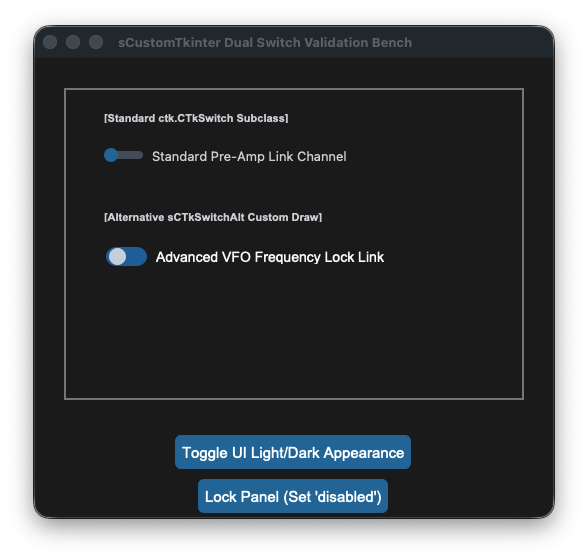
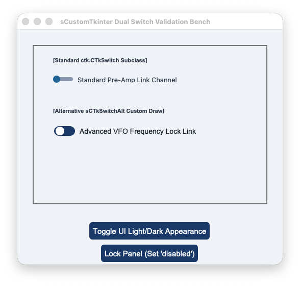


<a name="contents"></a>
### 📍 Table of Contents
* [API Constructor Reference](#constructor)
* [Vector Canvas Drawing Architecture](#canvas-engine)
* [Architectural Comparison (Standard Switch vs. Alt)](#comparison)
* [Global Object Instance Methods](#methods)
* [Centralized Stylesheet Integration](#stylesheet)
* [Implementation Reference Template](#template)

---

<a name="constructor"></a>
### 📋 API Constructor Reference

```python
sCTkSwitchAlt(master=None, text="", command=None, variable=None, textvariable=None, onvalue=1, offvalue=0, state="normal", font=None, **kw)
```

| Parameter Name | Data Type | Default Value | Description |
| :--- | :--- | :--- | :--- |
| `master` | `any` | `None` | Reference pointer tracking your root window or parent layout layer capsule container. |
| `text` | `str` | `""` | The descriptive typography text string label displayed natively alongside the custom toggle switch canvas track. |
| `command` | `callable` | `None` | Optional event logging callback function executed instantly on state shifts, passing the active value. |
| `variable` | `Variable` | `None` | Persistent Tkinter variable tracking hook (e.g. `tk.IntVar` or `tk.StringVar`) mapped to the toggle state value. |
| `textvariable` | `Variable` | `None` | Dynamic data trace observer variable instance to update text description labels automatically. |
| `onvalue` | `any` | `1` | The value coordinate written to variables and passed to callbacks when the slider knob is checked. |
| `offvalue` | `any` | `0` | The value coordinate written to variables and passed to callbacks when the slider knob is unchecked. |
| `state` | `str` | `"normal"` | Execution state controller. Toggling to `"disabled"` dampens colors and activates total interaction locks. |
| `font` | `tuple` / `str` | `None` | Typography configuration specifically assigned to resolve descriptive text labels. |

---

<a name="canvas-engine"></a>
### 🛡️ Vector Canvas Drawing Architecture
Standard CustomTkinter switches lock color palettes inside native canvas properties upon birth initialization, making post-boot track recoloring impossible. Furthermore, nesting traditional rounded shapes frequently results in white or black hard-edged "square" background bounding boxes bleeding through the layout under alternative global preference skins.

The `sCTkSwitchAlt` overcomes this limitation by implementing a **Pure Primitives Reconstruct Engine**. Built using `ctk.CTkCanvas`, the widget deletes and redraws the precise geometry lines of the capsule track (`create_oval` + `create_rectangle`) and a proportional 16px circle knob disc handle dynamically on every state transition. This guarantees high-visibility rendering, zero layout drift, and smooth color changes with absolute fidelity to your central stylesheets.

---

<a name="comparison"></a>
### 🔀 Architectural Comparison (Standard Switch vs. Alt)
The framework provides two unified, parallel switch variants engineered for distinct interface layout profiles:

1. **`sCTkSwitch` (Standard Switch Base Variant):**
   * *Underlying Engine:* Direct subclass of `ctk.CTkSwitch` maintaining native performance properties.
   * *Color Management:* Retains native color caching constraints. When disabled, the track background remains frozen on its base palette; only the description typography text dims down to gray.
   * *Animations:* Retains the native multi-frame linear handle slide translation animation curves.

2. **`sCTkSwitchAlt` (Alternative Composite Variant):**
   * *Underlying Engine:* Powered by an open vector canvas primitive layout container.
   * *Color Management:* Fully unlocked look layers. When enabled, the track remains a static blue (matching primary panel elements) instead of shifting hues. When disabled, the track capsule and circular disc knob instantly paint themselves in high-visibility steel and slate disabled tokens.
   * *Animations:* Bypasses sliding transitions; the indicator knob disc snaps to true coordinates instantly.

---

<a name="methods"></a>
### ⚡ Global Object Instance Methods

#### Fetch Active State Coordinates
```python
# Returns the active onvalue or offvalue parameter matching the position ledger register
active_choice = switch_alt.get()
```

#### Programmatically Toggle Placements
```python
# Forcefully sets the toggle position value, rendering the knob handle on or off instantly
switch_alt.set("on")
```

#### Query Active Operation Modes
```python
# Returns the active interaction mode string ('normal' or 'disabled')
current_state = switch_alt.get_state()
```

#### Apply Absolute Operational Interaction Locks
```python
# Disables click events on the canvas primitives while dimming all shapes down to custom gray levels
switch_alt.state("disabled")
```

---

<a name="stylesheet"></a>
### 🎨 Centralized Stylesheet Integration (`sCTkThemes.json`)

To minimize repository file footprint configurations, both the standard and alternative widgets share a single unified `"sCTkSwitch"` style map profile block. The alternative variant leverages the shared parameters to drive its track and circular knob fills dynamically:

```json
{
    "sCTkSwitch": {
        "fg_color": ["#1A4375", "#1F6AA5"],
        "progress_color": ["#1A4375", "#1F6AA5"],
        "button_color": ["#FFFFFF", "#CBD5E1"],
        "button_hover_color": ["#E5E7EB", "#94A3B8"],
        "text_color": ["#1F2937", "#F9FAFB"],
        "font": ["Arial", 14, "normal"],
        "disabled_map": {
            "text_color": ["#94A3B8", "#64748B"],
            "fg_color": ["#E5E7EB", "#526071"],
            "progress_color": ["#CBD5E1", "#526071"],
            "button_color": ["#8A94A6", "#94A3B8"],
            "button_hover_color": ["#8A94A6", "#94A3B8"]
        }
    }
}
```

---

<a name="template"></a>
### 💻 Implementation Reference Template

This standalone verification program demonstrates how to correctly embed both the `sCTkSwitch` (Standard Switch) and the advanced `sCTkSwitchAlt` within a shared panel interface, tracking live variables and skin preferred overrides simultaneously.

```python
#!/usr/bin/python3
# =====================================================================
# 🛠️ TESTING HARNESS IMPORTS & SETUP for Switch - alt
# =====================================================================

import customtkinter as ctk
from scustomtkinter import sCTkFrame, sCTkLabelSecondary, sCTkButtonPrimary, sCTk, sCTkSwitch, sCTkSwitchAlt


if __name__ == "__main__":

    root = sCTk()
    root.geometry("520x460")
    root.title("sCustomTkinter Dual Switch Validation Bench")
    root.configure(fg_color=("#F1F5F9", "#1C1C1C"))

    base = sCTkFrame(root, border_width=2)
    base.pack(expand=True, fill="both", padx=30, pady=30)

    # Configure the internal panel weights cache grid system to force left alignment
    base.grid_columnconfigure(0, weight=1)

    # =====================================================================
    # 🎛️ MODULE 1: Standard Switch (Native Inheritance Variant)
    # =====================================================================
    # 🔑 LEFT REALIGNMENT PASS: Configured with sticky="w" to lock alignment flush left!
    lbl_std = sCTkLabelSecondary(base, text="[Standard ctk.CTkSwitch Subclass]", font=("Arial", 11, "bold"))
    lbl_std.grid(row=0, column=0, padx=40, pady=(15, 2), sticky="w")

    switch_std = sCTkSwitch(
        base,
        text="Standard Pre-Amp Link Channel",
        command=lambda val: print(f"Standard Pass -> State Value: {val}")
    )
    switch_std.grid(row=1, column=0, padx=40, pady=10, sticky="w")

    # =====================================================================
    # 🎛️ MODULE 2: Alternative Switch (Custom Composite Drawing Variant)
    # =====================================================================
    lbl_alt = sCTkLabelSecondary(base, text="[Alternative sCTkSwitchAlt Custom Draw]", font=("Arial", 11, "bold"))
    lbl_alt.grid(row=2, column=0, padx=40, pady=(25, 2), sticky="w")

    switch_alt = sCTkSwitchAlt(
        base,
        text="Advanced VFO Frequency Lock Link",
        command=lambda val: print(f"Alternative Pass -> State Value: {val}")
    )
    switch_alt.grid(row=3, column=0, padx=40, pady=10, sticky="w")


    # =====================================================================
    # 🛠️ INTERACTIVE BENCH LOOK CONTROLLERS
    # =====================================================================
    def toggle_framework_locks():
        """Toggles operational locked states across both components smoothly."""
        current_std = switch_std.get_state()
        target = "disabled" if current_std == "normal" else "normal"

        switch_std.configure(state=target)
        switch_alt.configure(state=target)

        btn_lock.configure(
            text="Unlock Panel (Set 'normal')" if target == "disabled" else "Lock Panel (Set 'disabled')")


    def toggle_skin_preference():
        """Toggles between Light and Dark application window appearances dynamically."""
        ctk.set_appearance_mode("Light" if ctk.get_appearance_mode() == "Dark" else "Dark")


    # Arrange execution buttons layout grids at the lower edge of the screen capsule
    btn_lock = sCTkButtonPrimary(root, text="Lock Panel (Set 'disabled')", command=toggle_framework_locks)
    btn_lock.pack(side="bottom", pady=5)

    btn_skin = sCTkButtonPrimary(root, text="Toggle UI Light/Dark Appearance", command=toggle_skin_preference)
    btn_skin.pack(side="bottom", pady=5)

    root.mainloop()
```


## sCTkTableview

The `sCTkTableview` is a high-performance, theme-adaptive, and interactive data grid widget engineered specifically for the `sCustomTkinter` desktop amateur radio workspace architecture. It wraps a specialized scrollable container viewport to render structured, matrix-aligned logging rows, transceiver channels, or telemetry tracking data.


<a name="contents"></a>
### 📌 Localized Table of Contents
* [API Constructor Reference](#constructor)
* [Method Resolution Order (MRO) Taxonomy](#mro-taxonomy)
* [Pygubu Workspace Property Envelopes](#pygubu-envelopes)
* [Global Object Instance Methods](#methods)
* [Centralized Stylesheet Integration](#stylesheet)
* [Implementation Reference Template](#template)

---

<a name="constructor"></a>
### 📋 API Constructor Reference

```python
table = sCTkTableview(master, columns=None, width=500, height=300, grid_mode="zebra", header_line_width=2, outline_width=1.0, outline_radius=4, state="normal", num_columns=3, num_rows=1, show_headers=True, cell_bg_color=None, cell_alt_bg_color=None, *args, **kwargs)
```

| Parameter Name | Data Type | Default Value | Description |
| :--- | :--- | :--- | :--- |
| `master` | `any` | *Required* | Reference pointer tracking your root window or parent layout container. |
| `columns` | `list` / `str` | `None` | Structured list of header strings or a raw comma-separated tracking string token payload. |
| `grid_mode` | `str` | `"zebra"` | Visual row background arrangement tracker: can accept `"grid"`, `"zebra"`, or `"none"`. |
| `header_line_width`| `int` | `2` | Dimensional vertical scale of the separating accent bar gridded underneath the header elements. |
| `outline_width` | `float` | `1.0` | Outer bounding box line size bounding the master border layout frame container. |
| `outline_radius` | `int` | `4` | Corner corner-radius roundness assigned specifically onto the bounding frame layouts. |
| `state` | `str` | `"normal"` | Initial execution state ring variable: can accept `"normal"` or `"disabled"`. |

[Go to Piece 1B of 2](#mro-taxonomy) | [Return to Table of Contents](#contents)
<a name="methods"></a>
### ⚡ Global Object Instance Methods

#### Unified State Gateway Handler
```python
# GETTER: Returns the active operational state string ('normal' or 'disabled')
current_mode = table.state()

# SETTER: Freezes grid cell edits and dynamically applies themes.json desaturation tokens
table.state("disabled")
```

#### Programmatically Apply Live Configuration Changes
```python
# Dynamically adjusts grid modes or row limits and triggers full table redraw sweeps
table.configure(grid_mode="grid", num_rows=12)
```

#### Fetch Active Operational Tracking Dimensions
```python
row_count = table.get_num_rows()       # Returns absolute gridded row limits
column_count = table.get_num_columns() # Returns true managed structural column counts
```

#### Manage Column Properties & Justification Anchors
```python
# Configures structural widths and justifies cell strings ('w', 'center', 'e') safely
table.set_column_properties(column_index=0, width=140, anchor="w")
```

#### Register Callback Intercept Listeners
```python
# Selection Listener Pass
table.bind_selection_callback(lambda r_idx, row_data: print(f"Row {r_idx} clicked: {row_data}"))

# Inline Edit Pre-Save Validator (Must return True to accept changes, or False to reject)
table.bind_validation_callback(lambda col_idx, raw_string: len(raw_input_string.strip()) > 0)

# Post-Save Commit Event Callback
table.bind_edit_callback(lambda r, c, committed_val: log.info(f"Committed cell update: {committed_val}"))
```

---

<a name="stylesheet"></a>
### 🎨 Centralized Stylesheet Integration (`sCTkThemes.json`)

To minimize repository file footprints, the component drives its cascading color passes from a single profile key block. The standard text desaturation variables, grid dividers, and zebra backgrounds align natively within a single block configuration.

```json
{
    "sCTkTableview": {
        "header_bg_color": ["#1A4375", "#1F6AA5"],
        "header_text_color": ["#FFFFFF", "#FFFFFF"],
        "header_font": ["Arial", 13, "bold"],
        "cell_bg_color": ["#FFFFFF", "#1E293B"],
        "cell_alt_bg_color": ["#F8FAFC", "#334155"],
        "cell_text_color": ["#1A1A1A", "#FFFFFF"],
        "cell_font": ["Arial", 12, "normal"],
        "grid_line_color": ["#CBD5E1", "#475569"],
        "disabled_map": {
            "header_bg_color": ["#CBD5E1", "#334155"],
            "header_text_color": ["#94A3B8", "#64748B"],
            "cell_bg_color": ["#F1F5F9", "#1F2937"],
            "cell_alt_bg_color": ["#E2E8F0", "#111827"],
            "cell_text_color": ["#94A3B8", "#64748B"],
            "grid_line_color": ["#CBD5E1", "#475569"]
        }
    }
}
```

[Go to Piece 2B of 3](#template) | [Return to Table of Contents](#contents)
<a name="template"></a>
### 💻 Implementation Reference Template

This standalone verification program demonstrates how to correctly embed the `sCTkTableview` within a parent container panel, tracking cell data inputs and state locks cleanly.

```python
#!/usr/bin/python3
# =====================================================================
# 🛠️ TESTING HARNESS IMPORTS & SETUP for Tableview
# =====================================================================

import customtkinter as ctk
from scustomtkinter import sCTkFrame, sCTkButtonPrimary, sCTkLabelPrimary, sCTk, sCTkTableview

if __name__ == "__main__":
    root = sCTk()
    root.title("sCTkTableview Full Validation & State Showcase")
    root.geometry("640x540")
    root.configure(fg_color=("#F1F5F9", "#1C1C1C"))

    # 2. Mount custom master container using framework primitives
    border_capsule = sCTkFrame(root, border_width=2)
    border_capsule.pack(padx=20, pady=20, fill="both", expand=True)

    cols = ["Channel Label", "Frequency (MHz)", "Mode", "Station Name"]

    # 3. Initialize data grid component wrapper cleanly
    table = sCTkTableview(
        border_capsule,
        columns=cols,
        grid_mode="zebra",
        header_line_width=3,
        outline_width=1.5,
        outline_radius=6,
        state="normal"
    )
    table.pack(padx=12, pady=12, fill="both", expand=True)

    # Establish proportional column dimension parameters and text anchors
    table.set_column_properties(0, width=110, anchor="w")
    table.set_column_properties(1, width=120, anchor="center")
    table.set_column_properties(2, width=70, anchor="center")
    table.set_column_properties(3, width=250, anchor="w")

    ham_stations = [
        ["160M-VOX", "1.8400", "LSB", "160m - Voice / Calling"],
        ["40M-LSB", "7.2000", "LSB", "40m - LSB Voice Calling"],
        ["40M-FT8", "7.0740", "USB", "40m - FT8 Digital Mode"],
        ["20M-FT8", "14.0740", "USB", "20m - FT8 Digital Mode"],
        ["17M-USB", "18.1300", "USB", "17m - USB Voice Calling"],
        ["15M-USB", "21.3000", "USB", "15m - USB Voice Calling"],
        ["12M-USB", "24.9500", "USB", "12m - USB Voice Calling"],
        ["10M-USB", "28.4000", "USB", "10m - Tech / General Voice"]
    ]
    table.load_dataset(ham_stations)

    # 4. Define robust cell entry constraints to filter updates safely
    def validate_table_cell_changes(column_index: int, raw_input_string: str) -> bool:
        cleaned_input = str(raw_input_string).strip()
        if column_index == 1:
            try:
                float(cleaned_input)
                return True
            except ValueError:
                return False
        if column_index == 2:
            return cleaned_input.upper() in ["LSB", "USB", "AM", "FM", "CW"]
        return len(cleaned_input) > 0

    # 5. Bind callback listeners cleanly to public forwarding hooks
    table.bind_validation_callback(validate_table_cell_changes)
    table.bind_selection_callback(lambda r, vals: print(f"📡 Clicked Row: {r} -> {vals}"))
    table.bind_edit_callback(lambda r, c, val: print(f"📝 Persistent Data Saved ({r}, {c}) -> '{val}'"))

    # =====================================================================
    # 🛠️ PANEL LAYOUT ACTION INTERCEPT CONTROLLERS
    # =====================================================================
    def toggle_grid_lock():
        """Toggles active data row selections and blocks text entry editing."""
        current_mode = table.get_state()
        target = "disabled" if current_mode == "normal" else "normal"
        table.configure(state=target)
        btn_lock.configure(text="Unlock Tableview Grid" if target == "disabled" else "Lock Tableview Grid (Set 'disabled')")
        print(f"Logged Verification Hook -> table.get_state() = {table.get_state()}")

    def toggle_skin_preference():
        """Toggles between Light and Dark interface appearance preferences."""
        ctk.set_appearance_mode("Light" if ctk.get_appearance_mode() == "Dark" else "Dark")

    # Arrange test interaction buttons horizontally across the lower tray area
    control_tray = sCTkFrame(root, fg_color="transparent")
    control_tray.pack(side="bottom", fill="x", padx=20, pady=(0, 15))

    btn_lock = sCTkButtonPrimary(control_tray, text="Lock Tableview Grid (Set 'disabled')", command=toggle_grid_lock)
    btn_lock.pack(side="left", expand=True, padx=5)

    btn_skin = sCTkButtonPrimary(control_tray, text="Toggle UI Light/Dark Appearance", command=toggle_skin_preference)
    btn_skin.pack(side="right", expand=True, padx=5)

    # table.bind_validation_callback(validate_table_cell_changes)
    # table.bind_selection_callback(lambda r, vals: print(f"📡 Clicked Row: {r} -> {vals}"))
    # table.bind_edit_callback(lambda r, c, val: print(f"📝 Persistent Data Saved ({r}, {c}) -> '{val}'"))
    # table.configure(state="disabled")

    root.mainloop()

```

[Return to Table of Contents](#contents)


