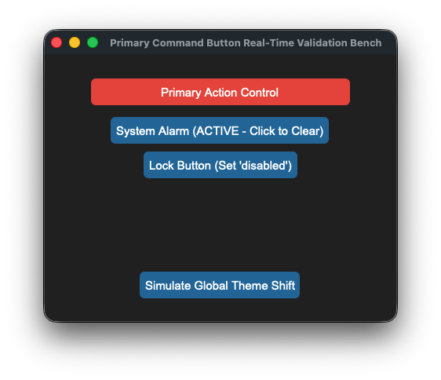

## sCTkButtonPrimary

The dominant primary command execution button widget component wrapping `customtkinter.CTkButton`. It incorporates high-priority telemetry layout overrides (**Alarm Warning Blocks** and **Latching Pressed Anchors**) layered over an independent deep-copy keyword caching shield to isolate colors from native dictionary mutation failures while leveraging `ThemeableWidget` mixins to natively handle Pygubu data streams.


### API Property Reference

| Property / Feature | Standard CustomTkinter | Your `sCustomTkinter` Setup |
| :--- | :--- | :--- |
| **Instantiation** | `ctk.CTkButton(master)` | `sCTkButtonPrimary(master)` *(Dominant Action Button)* |
| **File Mapping** | Everything runs under one core native layout pipeline. | Streamlined and compiled programmatically across `sCTkButtonPrimary.py` and `ThemeableWidget.py`. |
| `state(mode)` | `self.configure(state=...)` | `Method (str)` handling layout tracking maps and toggling active canvas event binds natively. |
| `get_state()` | `self.cget("state")` | `Method -> str` explicit verification query matching system test assertions. |
| `set_pressed(bool)` | *Not Available Natively* | **Latching Hook:** Locks background contrast styles to match `pressed_map` guidelines. |
| `set_alarm_state(bool)` | *Not Available Natively* | **Priority Warning Hook:** Overrides interaction states to show a red warning panel. |

---

### Constructor

Initialize a custom primary button instance. High-level configuration variables passed from Pygubu (like `translator` and `on_first_object_cb`) are automatically intercepted, processed, and purged early by the `ThemeableWidget` mixin layer before the native constructor fires.

```python
# Instantiate a primary command action execution button
tx_trigger = sCTkButtonPrimary(
    master=control_panel,
    text="TRANSMIT EXECUTE",
    command=on_transmit_triggered
)

# Render the widget inside your parent container geometry packer panel
tx_trigger.pack(fill="x", padx=40, pady=10)
```

---

### Convenience Functions
```python
# Force an immediate priority warning red flash profile highlight
tx_trigger.set_alarm_state(True)  # Forces alarm_map layout configurations forward

# Toggle latching states or apply absolute interaction locks smoothly
tx_trigger.set_pressed(True)      # Locks background contrast styles to pressed_map rules
tx_trigger.state("disabled")      # Unbinds mouse canvas routines and applies muted gray fills
```

### Centralized Stylesheet Setup (`sCTkThemes.json`)
```json
{
    "sCTkButtonPrimary": {
        "fg_color": ["#1A4375", "#1F6AA5"],
        "hover_color": ["#112A4B", "#194A7A"],
        "text_color": ["#FFFFFF", "#FFFFFF"],
        "border_width": 0,
        "corner_radius": 6,
        "disabled_map": {
            "fg_color": ["#F3F4F6", "#1F2937"],
            "border_color": ["#E5E7EB", "#374151"],
            "text_color": ["#94A3B8", "#64748B"]
        },
        "pressed_map": {
            "fg_color": ["#0F2542", "#134267"],
            "border_color": ["#0F2542", "#134267"],
            "text_color": ["#94A3B8", "#CBD5E1"]
        },
        "alarm_map": {
            "fg_color": ["#DC2626", "#EF4444"],
            "hover_color": ["#991B1B", "#7F1D1D"],
            "text_color": ["#FFFFFF", "#FFFFFF"]
        }
    }
}
```

### Other Notes
* **Bypassing the BaseUI Skeletons:** Completely avoids transitional helper UI files, connecting straight to `ctk.CTkButton` and `ThemeableWidget` multiple inheritance pathways to avoid signature collisions.
* **Automated Lifecycle Handshake:** Triggers `self._finalize_themeable_lifecycle()` at the absolute bottom of the initialization sequence to pass object creation lifecycle hooks straight back up to Pygubu application factories.

---

### Implementation Example & Test Harness

Below is a complete, self-contained test execution script demonstrating how to properly embed an `sCTkButtonPrimary` alongside an interactive theme state track and system warning switch.

```python
# =====================================================================
# 🛠️ TESTING HARNESS IMPORTS & SETUP for Primary Button
# =====================================================================

import customtkinter as ctk
from scustomtkinter import sCTkFrame, sCTkButtonPrimary,sCTk


if __name__ == "__main__":

    root = sCTk()
    root.geometry("450x340")
    root.title("Primary Command Button Real-Time Validation Bench")

    base = sCTkFrame(root)
    base.pack(expand=True, fill="both", padx=20, pady=20)

    command_btn = sCTkButtonPrimary(base, text="Primary Action Control")
    command_btn.pack(expand=False, fill="x", padx=40, pady=10)

    def toggle_system_alarm():
        new_alarm_mode = not command_btn.is_alarm
        command_btn.set_alarm_state(new_alarm_mode)
        btn_alarm_switch.configure(text="System Alarm (ACTIVE - Click to Clear)" if new_alarm_mode else "System Alarm")

    def toggle_disabled_lock():
        target = "disabled" if command_btn.get_state() == "normal" else "normal"
        command_btn.configure(state=target)
        btn_lock.configure(text="Lock Button (Set 'disabled')" if target == "normal" else "Unlock Button (Set 'normal')")

    def toggle_skin_mode():
        current_skin = ctk.get_appearance_mode()
        ctk.set_appearance_mode("Light" if current_skin == "Dark" else "Dark")

    btn_alarm_switch = sCTkButtonPrimary(base, text="System Alarm", command=toggle_system_alarm)
    btn_alarm_switch.pack(pady=5)

    btn_lock = sCTkButtonPrimary(base, text="Lock Button (Set 'disabled')", command=toggle_disabled_lock)
    btn_lock.pack(pady=5)

    btn_theme = sCTkButtonPrimary(base, text="Simulate Global Theme Shift", command=toggle_skin_mode)
    btn_theme.pack(side="bottom", pady=10)

    root.mainloop()

```

[Return to Table of Contents](#contents)
