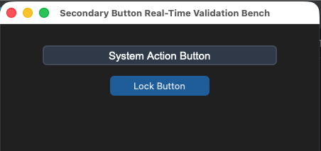
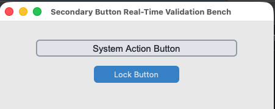

## sCTkButtonSecondary

A specialized, theme-compliant secondary button component widget variant wrapping `customtkinter.CTkButton` designed to act as a latching status toggle selector. It implements a deep-copy keyword caching shield to preserve custom visual style parameters from native mutation traps and prevent `NoneType` canvas validation exceptions.






### API Property Reference

| Property / Feature | Standard CustomTkinter | Your `sCustomTkinter` Setup |
| :--- | :--- | :--- |
| **Instantiation** | `ctk.CTkButton(master)` | `sCTkButtonSecondary(master)` *(Latching Toggle Selector)* |
| **File Mapping** | Component definitions bundle under single active tracks. | Streamlined and compiled programmatically across `sCTkButtonSecondary.py` and `ThemeableWidget.py`. |
| `state(mode)` | `self.configure(state=...)` | `Method (str)` managing layout tracking maps and toggling active canvas event binds natively. |
| `get_state()` | `self.cget("state")` | `Method -> str` explicit verification query matching system test assertions. |
| `set_pressed(bool)` | *Not Available Natively* | **Latching Hook:** Dynamically updates visual button states to look locked down. |

---

### Constructor

Initialize a custom secondary latching toggle button instance. Custom parameters passed from Pygubu builder allocations (like string `translator` tracks or `data_pool` environments) are automatically intercepted, processed, and purged early by the `ThemeableWidget` mixin layer before the native constructor fires.

```python
# Instantiate a secondary latching toggle button element
vfo_lock_toggle = sCTkButtonSecondary(
    master=control_panel,
    text="LOCK ACTIVE VFO MODE",
    command=on_vfo_lock_toggled
)

# Render the widget inside your parent container geometry tracker layout
vfo_lock_toggle.pack(fill="x", padx=40, pady=10)
```

---

### Convenience Functions
```python
# Force an active button press visual accent highlight on the fly
vfo_lock_toggle.set_pressed(True)   # Shifts colors to match your pressed_map rules

# Evaluate active visual modes or apply absolute user interaction locks
current_mode = vfo_lock_toggle.get_state() # Returns 'normal' or 'disabled'
vfo_lock_toggle.state("disabled")          # Unbinds mouse canvas routines and applies muted gray fills
```

### Centralized Stylesheet Setup (`sCTkThemes.json`)
```json
{
    "sCTkButtonSecondary": {
        "fg_color": "transparent",
        "border_color": ["#CBD5E1", "#44403C"],
        "text_color": ["#334155", "#E7E5E4"],
        "border_width": 1,
        "corner_radius": 6,
        "disabled_map": {
            "fg_color": ["#F1F5F9", "#171412"],
            "border_color": ["#E2E8F0", "#292524"],
            "text_color": ["#94A3B8", "#57534E"]
        },
        "pressed_map": {
            "fg_color": ["#E2E8F0", "#44403C"],
            "border_color": ["#94A3B8", "#6B7280"],
            "text_color": ["#000000", "#FFFFFF"]
        }
    }
}
```

### Other notes
* **Bypassing the BaseUI Skeletons:** This component inherits cleanly and directly from native CustomTkinter classes and `ThemeableWidget`, completely bypassing the intermediate template layout files entirely to preserve high-DPI image scaling.
* **Canvas Interaction Toggles:** When shifted into a `disabled` state configuration, the widget explicitly unbinds mouse events (`<Enter>`, `<Leave>`, `<Button-1>`) at the canvas level to lock interactions and prevent memory leaks. Shifting back to `normal` restores the listeners seamlessly.
* **Automated Lifecycle Handshake:** At the absolute bottom of the initialization track, the constructor triggers `self._finalize_themeable_lifecycle()` to safely notify top-level Pygubu container managers that the widget is compiled.

### Implementation Example & Test Harness

Below is a complete, self-contained test execution script demonstrating how to properly embed an `sCTkButtonSecondary` alongside an interactive latch controller.

```python
#!/usr/bin/python3

# =====================================================================
# 🛠️ TESTING HARNESS IMPORTS & SETUP for Secondary Button
# =====================================================================

import customtkinter as ctk
from scustomtkinter import sCTkFrame, sCTk, sCTkButtonSecondary

if __name__ == "__main__":
    root = sCTk()
    root.geometry("450x320")
    root.title("Secondary Button Real-Time Validation Bench")

    base = sCTkFrame(root)
    base.pack(expand=True, fill="both", padx=20, pady=20)

    widget = sCTkButtonSecondary(base, text="System Action Button")
    widget.pack(padx=40, pady=10, fill="x")

    def toggle_disabled_lock():
        target = "disabled" if widget.get_state() == "normal" else "normal"
        widget.configure(state=target)
        btn_lock.configure(text="Lock Button" if target == "normal" else "Unlock Button")

    def toggle_skin_mode():
        current_skin = ctk.get_appearance_mode()
        ctk.set_appearance_mode("Light" if current_skin == "Dark" else "Dark")

    btn_lock = ctk.CTkButton(base, text="Lock Button", command=toggle_disabled_lock)
    btn_lock.pack(pady=5)

    btn_theme = ctk.CTkButton(base, text="Simulate Global Theme Shift", command=toggle_skin_mode)
    btn_theme.pack(side="bottom", pady=10)

    root.mainloop()

```

[Return to Table of Contents](#contents)
