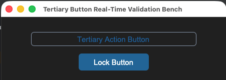

## sCTkButtonTertiary

An outline-driven custom toggle variant button widget component styled specifically for sub-presets, tuning markers, and option lock keys wrapping `customtkinter.CTkButton`. It utilizes an independent deep-copy keyword caching shield and a dynamic runtime accent fallback detector to align button typography with CustomTkinter system configurations automatically.





### API Property Reference

| Property / Feature | Standard CustomTkinter | Your `sCustomTkinter` Setup |
| :--- | :--- | :--- |
| **Instantiation** | `ctk.CTkButton(master)` | `sCTkButtonTertiary(master)` *(Outline Latching Button)* |
| **File Mapping** | Everything runs under one core native framework layout layer. | Streamlined and compiled programmatically across `sCTkButtonTertiary.py` and `ThemeableWidget.py`. |
| `state(mode)` | `self.configure(state=...)` | `Method (str)` handling layout tracking map transformations (`'normal'`, `'disabled'`) and canvas unbindings. |
| `get_state()` | `self.cget("state")` | `Method -> str` explicit verification query matching system test assertions. |
| `set_pressed(bool)` | *Not Available Natively* | **Latching Hook:** Locks background contrast styles to match `pressed_map` guidelines. |

---

### Constructor

Initialize a custom tertiary button instance. Custom parameters passed from Pygubu (like `translator`, `on_first_object_cb`, `image_loader`, and `data_pool`) are automatically intercepted, processed, and purged early by the `ThemeableWidget` mixin layer before the native constructor fires. If no explicit `text_color` parameters are discovered inside `sCTkThemes.json`, the constructor queries CustomTkinter's baseline colors (`["#3B8ED0", "#1F6AA5"]`) automatically to preserve unified system highlights.

```python
# Instantiate a tertiary outline latching button
preset_select = sCTkButtonTertiary(
    master=control_panel,
    text="PRESET CHANNEL A",
    command=on_preset_selected
)

# Render the widget inside your parent container geometry packer panel
preset_select.pack(fill="x", padx=40, pady=10)
```

---

### Centralized Stylesheet Setup (`sCTkThemes.json`)
```json
{
    "sCTkButtonTertiary": {
        "fg_color": "transparent",
        "border_color": ["#3B8ED0", "#1F6AA5"],
        "text_color": null,
        "border_width": 1,
        "corner_radius": 4,
        "disabled_map": {
            "fg_color": "transparent",
            "border_color": ["#CBD5E1", "#374151"],
            "text_color": ["#94A3B8", "#64748B"]
        },
        "pressed_map": {
            "fg_color": ["#3B8ED0", "#1F6AA5"],
            "border_color": ["#3B8ED0", "#1F6AA5"],
            "text_color": ["#FFFFFF", "#FFFFFF"]
        }
    }
}
```

### Other Notes
* **Bypassing the BaseUI Middleman:** This component inherits cleanly and directly from native CustomTkinter classes and `ThemeableWidget`, bypassing the intermediate template layout files entirely to avoid signature collisions.
* **Automated Lifecycle Handshake:** At the absolute bottom of the initialization track, the constructor triggers `self._finalize_themeable_lifecycle()` to safely notify top-level Pygubu container managers that the widget is compiled.

---

### Implementation Example & Test Harness

Below is a complete, self-contained test execution script demonstrating how to properly embed an `sCTkButtonTertiary` alongside latching switches.

```python
#!/usr/bin/python3

# =====================================================================
# 🛠️ TESTING HARNESS IMPORTS & SETUP for Tertiary Button
# =====================================================================

import customtkinter as ctk
from scustomtkinter import sCTkFrame, sCTk, sCTkButtonPrimary, sCTkButtonTertiary

if __name__ == "__main__":
    root = sCTk()
    root.geometry("450x320")
    root.title("Tertiary Button Real-Time Validation Bench")

    base = sCTkFrame(root)
    base.pack(expand=True, fill="both", padx=20, pady=20)

    widget = sCTkButtonTertiary(base, text="Tertiary Action Button")
    widget.pack(padx=40, pady=10, fill="x")

    def toggle_disabled_lock():
        target = "disabled" if widget.get_state() == "normal" else "normal"
        widget.configure(state=target)
        btn_lock.configure(text="Lock Button" if target == "normal" else "Unlock Button")

    def toggle_skin_mode():
        current_skin = ctk.get_appearance_mode()
        ctk.set_appearance_mode("Light" if current_skin == "Dark" else "Dark")

    btn_lock = sCTkButtonPrimary(base, text="Lock Button", command=toggle_disabled_lock)
    btn_lock.pack(pady=5)

    btn_theme = sCTkButtonPrimary(base, text="Simulate Global Theme Shift", command=toggle_skin_mode)
    btn_theme.pack(side="bottom", pady=10)

    root.mainloop()


```

[Return to Table of Contents](#contents)
