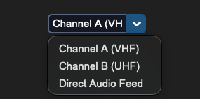

## sCTkComboBox

### Table of Contents
* [API Property Reference](#api-property-reference)
* [Constructor](#constructor)
* [Convenience Functions](#convenience-functions)
* [Centralized Stylesheet Setup](#centralized-stylesheet-setup-themesjson)
* [Other Notes](#other-notes)
* [Implementation Example & Test Harness](#implementation-example--test-harness)

---

A theme-compliant, prominent data-entry combo box widget variant designed for multi-frequency array indexes, input lanes, and tracking channels. It features an independent deep-copy keyword caching shield and early parameter-popping filters to safeguard dropdown sub-component properties from native mutation deletion loops.




### API Property Reference

| Property / Feature | Standard CustomTkinter | Your `sCustomTkinter` Setup |
| :--- | :--- | :--- |
| **Instantiation** | `ctk.CTkComboBox(master)` | `sCTkComboBox(master)` *(Composite Dropdown Input)* |
| **File Mapping** | Component definitions bundle under single active tracks. | Streamlined and compiled programmatically across `sCTkComboBox.py` and `ThemeableWidget.py`. |
| `state(mode)` | `self.configure(state=...)` | `Method (str)` handling layout tracking map transformations (`'normal'`, `'disabled'`) via strict sequential update loops. |
| `get_state()` | `self.cget("state")` | `Method -> str` explicit verification query matching system test assertions. |
| `get()` | `self.get()` | Returns the active selected string item currently displayed inside the text frame field. |
| `set(value)` | `self.set(str)` | Programmatically injects a custom string or forces selection updates onto the view face. |

---

### Constructor

Initialize a custom combo box dropdown element instance. Custom attributes passed from Pygubu builder allocations (like string `translator` tracks or `data_pool` environments) are automatically intercepted, processed, and purged early by the `ThemeableWidget` mixin layer before the native constructor fires.

```python
# Instantiate a custom combo box dropdown element
frequency_dropdown = sCTkComboBox(
    master=control_panel,
    values=["Channel A (VHF)", "Channel B (UHF)", "Direct Audio Feed"],
    command=on_frequency_channel_changed
)

# Render the widget inside your parent container geometry packer layout panel
frequency_dropdown.pack(fill="x", padx=40, pady=10)
```

---

### Convenience Functions
```python
# Programmatically query entries or force alternative text items on the fly
active_selection = frequency_dropdown.get() # Returns current text lane string
frequency_dropdown.set("Channel B (UHF)")   # Snaps the visible box choice straight to the specified item
frequency_dropdown.state("disabled")        # Freezes entry input lanes and applies muted gray fills
```

### Centralized Stylesheet Setup (`sCTkThemes.json`)
```json
{
    "sCTkComboBox": {
        "fg_color": ["#FFFFFF", "#1E1E1E"],
        "border_color": ["#94A3B8", "#4B5563"],
        "text_color": ["#111827", "#F9FAFB"],
        "button_color": ["#1A4375", "#1F6AA5"],
        "button_hover_color": ["#112A4B", "#194A7A"],
        "dropdown_fg_color": ["#FFFFFF", "#1F2937"],
        "dropdown_text_color": ["#374151", "#F3F4F6"],
        "dropdown_hover_color": ["#F3F4F6", "#374151"],
        "border_width": 2,
        "corner_radius": 6,
        "disabled_map": {
            "fg_color": ["#F3F4F6", "#111111"],
            "border_color": ["#CBD5E1", "#333333"],
            "text_color": ["#94A3B8", "#4B5563"],
            "button_color": ["#E5E7EB", "#222222"]
        }
    }
}
```

### Other notes
* **Bypassing the BaseUI Middleman:** This component inherits cleanly and directly from native CustomTkinter classes and `ThemeableWidget`, completely bypassing the intermediate template layout files entirely to avoid argument deadlocks.
* **Automated Lifecycle Handshake:** At the absolute bottom of the initialization track, the constructor triggers `self._finalize_themeable_lifecycle()` to safely notify top-level Pygubu container managers that the widget is compiled.

---

### Implementation Example & Test Harness

Below is a complete, self-contained test execution script demonstrating how to properly embed an `sCTkComboBox` alongside an interactive theme state track.

```python

# =====================================================================
# 🛠️ TESTING HARNESS IMPORTS & SETUP for ComboBox
# =====================================================================

import customtkinter as ctk
from scustomtkinter import sCTkFrame, sCTk, sCTkButtonPrimary, sCTkComboBox

if __name__ == "__main__":

    root = sCTk()
    root.geometry("450x300")
    root.title("ComboBox Interaction Telemetry Bench")

    base = sCTkFrame(root)
    base.pack(expand=True, fill="both", padx=20, pady=20)

    widget = sCTkComboBox(
        base,
        values=["Channel A (VHF)", "Channel B (UHF)", "Direct Audio Feed"],
        command=lambda choice: print(f"ComboBox Option Latched: {choice}")
    )
    widget.pack(expand=True, fill="none", padx=10, pady=10)

    def toggle_widget_state():
        current_mode = widget.get_state()
        target = "disabled" if current_mode == "normal" else "normal"
        widget.configure(state=target)
        btn_toggle.configure(text="Unlock Dropdown" if target == "disabled" else "Lock Dropdown (Set 'disabled')")
        print(f"Logged Verification Hook -> widget.get_state() = {widget.get_state()}")

    btn_toggle = sCTkButtonPrimary(base, text="Lock Dropdown (Set 'disabled')", command=toggle_widget_state)
    btn_toggle.pack(side="bottom", pady=15)

    print("--- BOOT INITIALIZATION PASSTHROUGH ---")
    widget.state("disabled")
    print("state (Disabled Pass) =", widget.get_state())

    widget.state("normal")
    print("state (Normal Pass)   =", widget.get_state())
    print("========================================\n")

    root.mainloop()

```

[Return to Table of Contents](#contents)
