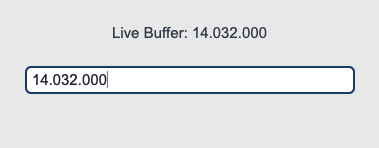

## sCTkEntryPrimary

### Table of Contents
* [API Property Reference](#api-property-reference)
* [Constructor](#constructor)
* [Convenience Functions](#convenience-functions)
* [Centralized Stylesheet Setup](#centralized-stylesheet-setup-themesjson)
* [Other Notes](#other-notes)
* [Implementation Example & Test Harness](#implementation-example--test-harness)

---

Dominant form input lane widget variant designed for primary user data entry (e.g., core configuration inputs, direct numeric entries, or text queries). It implements a direct native class configuration architecture combined with the `ThemeableWidget` sanitizer pass to guarantee complete safety against keyword collisions.

*For alternative helper input fields or metadata input channels, see the companion component documentation page:* [sCTkEntrySecondary](sCTkEntrySecondary.md).





### API Property Reference

| Property / Feature | Standard CustomTkinter | Your `sCustomTkinter` Setup |
| :--- | :--- | :--- |
| **Instantiation** | `ctk.CTkEntry(master)` | `sCTkEntryPrimary(master)` *(Primary form data field)* |
| **Maintenance** | Local style overrides duplicated across files manually. | Clean updates across all layouts modified directly in the JSON file. |
| **File Mapping** | Everything runs under one core native text pipeline. | Streamlined and compiled cleanly across `sCTkEntryPrimary.py` and `ThemeableWidget.py`. |
| **State Lock** | `self.configure(state="disabled")` | `input_field.state("disabled")`<br>**OR**<br>`input_field.configure(state="disabled")`<br><br>**Dual-Routing State Pipeline:** Natively handles both syntax paths. Freezes text interaction lanes, blocks keyboard event streams, and dynamically shifts colors out of `disabled_map` guidelines via strict sequential update passes. |
| `get_state()` | `self.cget("state")` | `Method -> str` explicit verification query matching system test assertions. |

---

### Constructor

Initialize a custom primary form data field instance. High-level custom configuration parameters from Pygubu (like `translator`, `on_first_object_cb`, `image_loader`, and `data_pool`) are automatically intercepted, processed, and purged early by the `ThemeableWidget` mixin layer before the native constructor fires.

```python
# Instantiate a primary frequency entry lane input field
freq_input_field = sCTkEntryPrimary(
    master=control_panel,
    placeholder_text="Enter Transceiver Frequency...",
    textvariable=vfo_string_var
)

# Render the widget inside your parent container coordinate tracker panel
freq_input_field.pack(fill="x", padx=40, pady=10)
```

---

### Convenience Functions
```python
# Selectively manipulate the internal textual elements on the fly
frequency_input.insert(0, "14.032.000") # Populates text buffer indices with data strings
frequency_input.delete(0, \"end\")         # Wipes the entry line lane completely back to empty
active_buffer = frequency_input.get()    # Queries the live active text character arrays

# Evaluate current state configurations or apply absolute user interaction locks via dual-routing syntax
current_mode = frequency_input.get_state() # Returns 'normal' or 'disabled'
frequency_input.state("disabled")          # Locks data entry tracks and applies muted gray fills
```

### Centralized Stylesheet Setup (`themes.json`)
```json
{
    "sCTkEntryPrimary": {
        "fg_color": ["#FFFFFF", "#111827"],
        "border_color": ["#1A4375", "#4B5563"],
        "text_color": ["#1F2937", "#FFFFFF"],
        "placeholder_text_color": ["#94A3B8", "#64748B"],
        "disabled_map": {
            "fg_color": ["#F3F4F6", "#1F2937"],
            "border_color": ["#E5E7EB", "#374151"],
            "text_color": ["#94A3B8", "#64748B"],
            "placeholder_text_color": ["#CBD5E1", "#475569"]
        }
    }
}
```

### Other notes
* **Bypassing the BaseUI Middleman:** This widget inherits directly from `ctk.CTkEntry` and `ThemeableWidget`, entirely removing any autogenerated Pygubu intermediate templates. This simplifies the class footprint while fully retaining dynamic string translation and lifecycle callback capabilities natively.
* **Automated Lifecycle Handshake:** At the absolute bottom of the initialization routine, the constructor fires `self._finalize_themeable_lifecycle()` to safely dispatch first-object registration notifications back up to Pygubu's master parent script systems.

---

### Implementation Example & Test Harness

Below is a complete, self-contained test execution script demonstrating how to properly embed an `sCTkEntryPrimary` input lane field along with an interactive status switch toggle.

```python
#!/usr/bin/python3
# =====================================================================
# 🛠️ TESTING HARNESS IMPORTS & SETUP for Entry Secondary
# =====================================================================

import customtkinter as ctk
from scustomtkinter import sCTkFrameLabeledSecondary, sCTkButtonPrimary, sCTk, sCTkLabelTertiary, sCTkEntrySecondary

# =====================================================================
# 🛠️ TESTING HARNESS IMPORTS & SETUP
# =====================================================================
import sCTkThemes
from sCTkFrame import sCTkFrame

if __name__ == "__main__":
    sCTkThemes.apply_sCTkThemes()

    root = ctk.CTk()
    root.geometry("500x450")
    root.title("sCTkEntryPrimary Real-Time Validation Bench")

    base = sCTkFrame(root)
    base.pack(expand=True, fill="both", padx=20, pady=20)

    widget = sCTkEntryPrimary(base, placeholder_text="Enter Transceiver Callsign...")
    widget.pack(fill="x", padx=20, pady=20)

    def toggle_logger_states():
        """Cycles operational states between active feed and locked desaturated tracks."""
        current_state = widget.get_state()
        target = "disabled" if current_state == "normal" else "normal"

        widget.configure(state=target)
        btn_toggle.configure(text="Activate Entry Field" if target == "disabled" else "Lock Entry Field")
        print(f"Logged Verification Hook -> widget.get_state() = {widget.get_state().upper()}")

    def toggle_appearance_skin():
        current_mode = ctk.get_appearance_mode()
        ctk.set_appearance_mode("Light" if current_mode == "Dark" else "Dark")

    btn_toggle = ctk.CTkButton(base, text="Lock Entry Field", command=toggle_logger_states)
    btn_toggle.pack(fill="x", padx=10, pady=5)

    btn_theme = ctk.CTkButton(base, text="Toggle Theme Skin", command=toggle_appearance_skin)
    btn_theme.pack(fill="x", padx=10, pady=5)

    root.mainloop()

```

[Return to Table of Contents](#contents)
