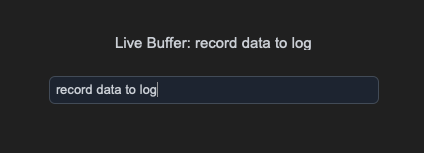
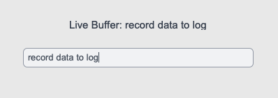

## sCTkEntrySecondary

### Table of Contents
* [API Property Reference](#api-property-reference)
* [Constructor](#constructor)
* [Convenience Functions](#convenience-functions)
* [Centralized Stylesheet Setup](#centralized-stylesheet-setup-themesjson)
* [Other Notes](#other-notes)
* [Implementation Example & Test Harness](#implementation-example--test-harness)

---

Auxiliary / secondary metadata input lane widget variant designed for secondary data capture (e.g., logging channels, station call signs, panel notes, or sub-metadata queries).

*For dominant form input fields or direct operational data entry channels, see the primary component documentation page:* [sCTkEntryPrimary](sCTkEntryPrimary.md).






### API Property Reference

| Property / Feature | Standard CustomTkinter | Your `sCustomTkinter` Setup |
| :--- | :--- | :--- |
| **Instantiation** | `ctk.CTkEntry(master)` | `sCTkEntrySecondary(master)` *(Secondary metadata field)* |
| **Maintenance** | Local style overrides duplicated across files manually. | Clean updates across all layouts modified directly in the JSON file. |
| **File Mapping** | Everything runs under one core native text pipeline. | Streamlined and compiled cleanly across `sCTkEntrySecondary.py` and `ThemeableWidget.py`. |
| **State Lock** | `self.configure(state="disabled")` | `input_field.state("disabled")`<br>**OR**<br>`input_field.configure(state="disabled")`<br><br>**Dual-Routing State Pipeline:** Natively handles both syntax paths. Freezes text interaction lanes, blocks keyboard event streams, and dynamically shifts colors out of `disabled_map` guidelines via sequential repaint loops. |
| `get_state()` | `self.cget("state")` | `Method -> str` explicit verification query matching system test assertions. |

---

### Constructor

Initialize a custom secondary data field instance. High-level custom configuration parameters from Pygubu (like `translator`, `on_first_object_cb`, `image_loader`, and `data_pool`) are automatically intercepted, processed, and purged early by the `ThemeableWidget` mixin layer before the native constructor fires.

```python
# Instantiate a secondary metadata user entry field
callsign_input = sCTkEntrySecondary(
    master=control_panel,
    placeholder_text="Enter Station Call Sign...",
    textvariable=callsign_string_var
)

# Render the widget inside your parent container coordinate tracker panel
callsign_input.pack(fill="x", padx=40, pady=10)
```

---

### Convenience Functions
```python
# Selectively manipulate the internal textual elements on the fly
callsign_input.insert(0, "W1AW")         # Populates text buffer indices with data strings
callsign_input.delete(0, "end")          # Wipes the entry line lane completely back to empty
active_buffer = callsign_input.get()     # Queries the live active text character arrays

# Evaluate current state configurations or apply absolute user interaction locks via dual-routing syntax
current_mode = callsign_input.get_state() # Returns 'normal' or 'disabled'
callsign_input.state("disabled")           # Locks data entry tracks and applies muted gray fills
```

### Centralized Stylesheet Setup (`themes.json`)
```json
{
    "sCTkEntrySecondary": {
        "fg_color": ["#F8FAFC", "#111827"],
        "border_color": ["#94A3B8", "#374151"],
        "text_color": ["#475569", "#94A3B8"],
        "placeholder_text_color": ["#94A3B8", "#475569"],
        "disabled_map": {
            "fg_color": ["#F1F5F9", "#171412"],
            "border_color": ["#E2E8F0", "#292524"],
            "text_color": ["#94A3B8", "#57534E"],
            "placeholder_text_color": ["#E5E7EB", "#1C1917"]
        }
    }
}
```

### Other notes
* **Bypassing the BaseUI Middleman:** This component inherits cleanly and directly from `ctk.CTkEntry` and `ThemeableWidget`, bypassing the intermediate template layout files entirely. It connects the component straight to CustomTkinter's appearance modes while using the multiple inheritance protocol layer to sanitize keyword arrays.
* **Coordinated Lifehook Repaint Pass:** Implements an overridden `_set_appearance_mode()` hook that catches global theme skin shifts (via dashboard buttons or native macOS preferences), briefly toggles the widget's internal state open to redraw vector lines, and locks it back down with zero color-caching freezes.

---

### Implementation Example & Test Harness

Below is a complete, self-contained test execution script demonstrating how to properly embed an `sCTkEntrySecondary` input lane field along with an interactive status switch toggle.

```python
#!/usr/bin/python3

# =====================================================================
# 🛠️ TESTING HARNESS IMPORTS & SETUP for EntrySecondary
# =====================================================================

import customtkinter as ctk
from scustomtkinter import sCTkFrame, sCTkButtonPrimary, sCTk, sCTkLabelSecondary, sCTkEntrySecondary


if __name__ == "__main__":

    root = sCTk()
    root.geometry("450x260")
    root.title("sCTkEntrySecondary Testing Deck")

    base = sCTkFrame(root)
    base.pack(expand=True, fill="both", padx=20, pady=20)

    # Label notice layer to monitor buffer array activity
    lbl_monitor = sCTkLabelSecondary(base, text="Console monitor active...")
    lbl_monitor.pack(pady=10)

    # Instantiate your custom secondary helper field
    input_field = sCTkEntrySecondary(base, placeholder_text="Enter configuration metadata...")
    input_field.pack(expand=False, fill="x", padx=40, pady=10)

    # Monitor keystrokes live
    input_field.bind("<KeyRelease>", lambda e: lbl_monitor.configure(text=f"Live Buffer: {input_field.get()}"))

    def toggle_operational_state():
        """Toggles the helper input field between normal active and dimmed disabled profiles."""
        current_mode = input_field.get_state()
        target = "disabled" if current_mode == "normal" else "normal"

        # Explicitly testing the dual-routing capability via configure()
        input_field.configure(state=target)
        btn_toggle.configure(
            text="Lock Helper Input (Set 'disabled')" if target == "normal" else "Unlock Helper Input (Set 'normal')")
        print(f"Logged Verification Hook -> input_field.get_state() = {input_field.get_state()}")

    btn_toggle = sCTkButtonPrimary(base, text="Lock Helper Input (Set 'disabled')", command=toggle_operational_state)
    btn_toggle.pack(side="bottom", pady=15)

    # Run the interactive boot tracking logs
    print("--- BOOT INITIALIZATION PASSTHROUGH ---")
    input_field.state("disabled")
    print("state (Disabled Pass) =", input_field.get_state())  # Output: disabled

    input_field.state("normal")
    print("state (Normal Pass)   =", input_field.get_state())  # Output: normal
    print("========================================\n")

    root.mainloop()
```

[Return to Table of Contents](#contents)
