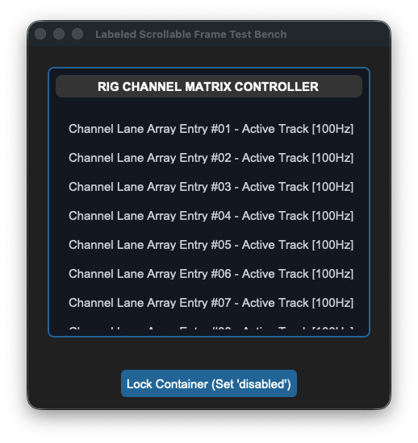

## sCTkFrameLabeledPrimary

### Table of Contents
* [API Property Reference](#api-property-reference)
* [Constructor](#constructor)
* [Advanced Layout Inspection API](#advanced-layout-inspection-api)
* [Centralized Stylesheet Setup](#centralized-stylesheet-setup-sctkthemesjson)
* [Other Notes](#other-notes)
* [Implementation Example & Test Harness](#implementation-example--test-harness)

---

A clean, theme-compliant custom header-labeled scrollable container card frame built directly on top of CustomTkinter's native text/scroll classes. It is engineered to act as an organized panel matrix tree that seamlessly suppresses visible scrollbar components out of view by hard-matching scrollbar background canvas elements directly to frame asset color backgrounds.




### API Property Reference

| Property / Feature | Standard CustomTkinter | Your `sCustomTkinter` Setup |
| :--- | :--- | :--- |
| **Instantiation** | `ctk.CTkFrame(master)` *(No label natively)* | `sCTkFrameLabeledPrimary(master)` *(Labeled Frame Enclosure)* |
| **File Mapping** | Config metrics look up loose un-managed palette snapshot lists. | Streamlined and compiled programmatically across `sCTkFrameLabeledPrimary.py` and `ThemeableWidget.py`. |
| `winfo_children()` | Returns raw internal widgets, including heading text blocks. | Overridden signature supporting filtered inner form component lookups. |
| `get_children()` | *Not Supported Natively* | Convenience method returning clean application-level custom components. |
| `get_all_children()` | *Not Supported Natively* | Convenience method returning direct, unfiltered access to the entire core frame tree. |

---

### Constructor

Initialize a custom scrollable labeled container frame option deck card. Scrollbar tracks are hidden automatically upon completing instantiation passes. High-level custom configuration parameters from Pygubu (like `translator`, `on_first_object_cb`, `image_loader`, and `data_pool`) are automatically intercepted, processed, and purged early by the `ThemeableWidget` mixin layer before the native constructor fires.

```python
# Instantiate a primary header-labeled scrollable matrix panel deck frame
channel_grid = sCTkFrameLabeledPrimary(
    master=root_window,
    label_text="RIG CHANNEL MATRIX CONTROLLER"
)

# Render the widget container view using standard geometry packer layout trackers
channel_grid.pack(expand=True, fill="both", padx=25, pady=25)
```

---

### Advanced Layout Inspection API

Because labeled frame capsules bundle an integrated text header directly onto their border chassis, native widget sweeps can accidentally overwrite heading text constraints. The class overrides window queries to isolate your layout data cleanly.

#### `winfo_children(include_private: bool = False) -> list`

* **`include_private=False` (Default):** Isolates and hides the internal `CTkLabel` heading widget and frame layout backplane blocks. Loops crawling your dashboard lanes will discover only the actual primary input rows packed inside the box, preventing title typography parameters from getting corrupted during runtime style shifts.
* **`include_private=True`:** Immediately deactivates the filter mesh to return the raw, unmanipulated Tkinter structural window lineage hierarchy.
### Centralized Stylesheet Setup (`sCTkThemes.json`)
```json
{
    "sCTkFrameLabeledPrimary": {
        "fg_color": ["#FFFFFF", "#1E293B"],
        "border_color": ["#E2E8F0", "#334155"],
        "label_text_color": ["#1A4375", "#38BDF8"],
        "border_width": 1,
        "corner_radius": 8,
        "disabled_map": {
            "fg_color": ["#F1F5F9", "#111111"],
            "border_color": ["#E2E8F0", "#222222"],
            "label_text_color": ["#94A3B8", "#4B5563"]
        }
    }
}
```

---

### Other Notes
* **Chassis Child Interceptor Shield:** Calling standard native `.winfo_children()` on a scrollable canvas widget leaks CustomTkinter's private system geometry framework bars (`_parent_frame`, `_view_frame`, etc.). This override cuts directly to the true internal workspace data window array, returning clean lists of only your functional custom widgets.
* **Scrollbar Suppression Engine Protection:** Instead of executing complex system canvas unbinding loops that destroy track physics, `_hide_internal_scrollbars()` sets scroll widths down to zero and safely maps track colors to your frame background through an absolute tuple resolution call beforehand. This permanently avoids alpha translucent `transparent` name crashes in Light Mode.
* **Automated Lifecycle Handshake:** Fires `self._finalize_themeable_lifecycle()` at the absolute end of the constructor initialization track to cleanly pass instance registration hooks straight back up to Pygubu parent controllers.

---

### Implementation Example & Test Harness

Below is a complete, self-contained test execution script demonstrating how to properly embed an `sCTkFrameLabeledPrimary` alongside an application-layer cascading state loop tracker.

```python
#!/usr/bin/python3

# =====================================================================
# 🛠️ TESTING HARNESS IMPORTS & SETUP for Frame Labeled Primary
# =====================================================================

from scustomtkinter import sCTkButtonPrimary, sCTkLabelSecondary, CTk, sCTkFrameLabeledPrimary


if __name__ == "__main__":

    root = sCTk()
    root.geometry("450x450")
    root.title("Labeled Scrollable Frame Test Bench")

    scroll_panel = sCTkFrameLabeledPrimary(root, label_text="RIG CHANNEL MATRIX CONTROLLER")
    scroll_panel.pack(expand=True, fill="both", padx=25, pady=25)

    for i in range(1, 21):
        lbl_item = sCTkLabelSecondary(scroll_panel, text=f"Channel Lane Array Entry #{i:02d} - Active Track [100Hz]")
        lbl_item.pack(pady=4, fill="x", padx=10)


    def toggle_frame_states():
        current_mode = scroll_panel.get_state()
        target = "disabled" if current_mode == "normal" else "normal"

        scroll_panel.configure(state=target)

        true_children = scroll_panel.winfo_children()
        print(f"DEBUG ASSERTER: Successfully captured {len(true_children)} label elements...")

        for child in true_children:
            if hasattr(child, "configure"):
                child.configure(state=target)

        btn_toggle.configure(
            text="Lock Container (Set 'disabled')" if target == "normal" else "Unlock Container (Set 'normal')")
        print(f"Logged Verification Hook -> scroll_panel.get_state() = {scroll_panel.get_state()}\n")


    btn_toggle = sCTkButtonPrimary(root, text="Lock Container (Set 'disabled')", command=toggle_frame_states)
    btn_toggle.pack(pady=15)

    print("--- BOOT INITIALIZATION PASSTHROUGH ---")
    scroll_panel.state("disabled")
    print(f"state (Disabled Pass) = {scroll_panel.get_state().upper()}")

    scroll_panel.state("normal")
    print(f"state (Normal Pass)   = {scroll_panel.get_state().upper()}")
    print("========================================\n")

    root.mainloop()


```

[Return to Table of Contents](#contents)
