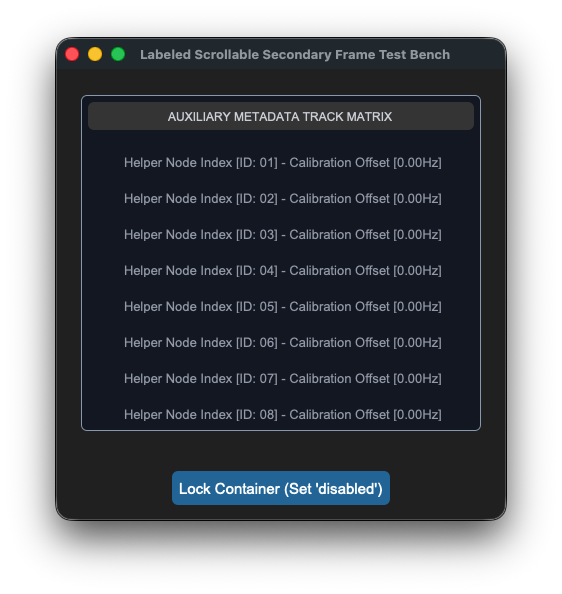
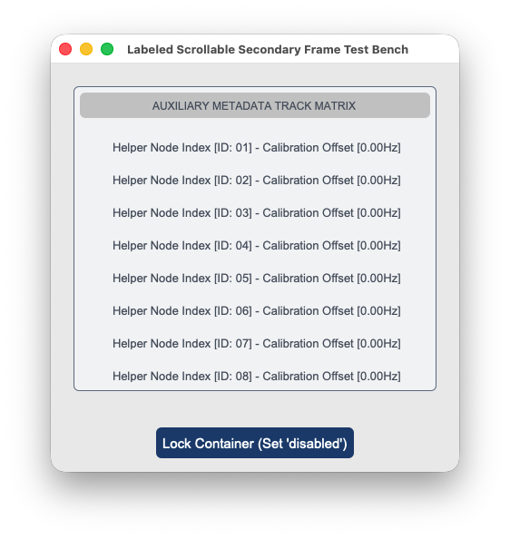

## sCTkLabelSecondary

### Table of Contents
* [API Property Reference](#api-property-reference)
* [Constructor](#constructor)
* [Centralized Stylesheet Setup](#centralized-stylesheet-setup-sctkthemesjson)
* [Other Notes](#other-notes)
* [Implementation Example & Test Harness](#implementation-example--test-harness)

---

The custom secondary interface typography display label widget component wrapping `customtkinter.CTkLabel`. It features an independent deep-copy keyword caching shield and an advanced multi-state color-dimming interceptor to automatically shift text contrasts when subsystem components enter disabled sequences.






### API Property Reference

| Property / Feature | Standard CustomTkinter | Your `sCustomTkinter` Setup |
| :--- | :--- | :--- |
| **Instantiation** | `ctk.CTkLabel(master)` | `sCTkLabelSecondary(master)` *(Secondary Interface Text Label)* |
| **File Mapping** | Direct module definitions run without structured configuration. | Streamlined and compiled programmatically across `sCTkLabelSecondary.py` and `ThemeableWidget.py`. |
| **State Lock** | *Not Supported Natively* | `secondary_label.state("disabled")`<br>**OR**<br>`secondary_label.configure(state="disabled")`<br><br>**Framework-Wide State Support:** Natively supported across all label components (`Primary`, `Secondary`, `Tertiary`). It intercepts state configuration calls and dynamically dims typography layouts based on centralized `disabled_map` metrics. |
| `get_state()` | *Not Supported Natively* | `Method -> str` explicit verification query matching system test assertions. |

---

### Constructor

Initialize a custom secondary text label instance. Configuration metrics map cleanly out of central stylesheet parameters and are automatically sanitized by the `ThemeableWidget` mixin layer before the native constructor fires.

```python
# Instantiate a secondary user interface text display label element
lane_label = sCTkLabelSecondary(
    master=control_panel,
    text="Active Teleceiver Signal Frequency Lane [94.1 MHz]"
)

# Render the widget inside your layout panel using geometry managers
lane_label.pack(expand=True, padx=20, pady=20)
```
### Centralized Stylesheet Setup (`sCTkThemes.json`)
```json
{
    "sCTkLabelSecondary": {
        "fg_color": "transparent",
        "text_color": ["#475569", "#94A3B8"],
        "font": ["Arial", 11, "bold"],
        "disabled_map": {
            "text_color": ["#CBD5E1", "#4B5563"]
        }
    }
}
```

---

### Other Notes
* **Bypassing the BaseUI Middleman:** This component inherits cleanly and directly from native CustomTkinter classes and `ThemeableWidget`, completely bypassing the intermediate template layout files entirely to avoid argument deadlocks and preserve image scaling properties.
* **Deep-Copy Dictionary Isolation Shield:** Because CustomTkinter's native geometry constructor routines mutate and drop keys directly out of parsed configuration structures during early boot phases, the constructor clones your data configurations into `self._local_defaults = dict(self.final_kw)` beforehand. This prevents layout repaints from failing.
* **Dynamic Dark Mode Pass-Through:** When returning to an active state, the visual interceptor reads directly from your protected `_local_defaults` cache. If no hardcoded text color is explicitly discovered, it hands control back to CustomTkinter's master `ThemeManager` to natively paint high-contrast system fonts.
* **Automated Lifecycle Handshake:** Triggers `self._finalize_themeable_lifecycle()` at the absolute bottom of the initialization track to cleanly pass instance registration hooks straight back up to Pygubu parent controllers.

---

### Implementation Example & Test Harness

Below is a complete, self-contained test execution script demonstrating how to properly embed an `sCTkLabelSecondary` component element along with an interactive status switch toggle.

```python
#!/usr/bin/python3

# =====================================================================
# 🛠️ TESTING HARNESS IMPORTS & SETUP for Frame Labeled Secondary
# =====================================================================

from scustomtkinter import sCTkButtonPrimary, sCTkLabelTertiary, sCTk, sCTkFrameLabeledSecondary

if __name__ == "__main__":

    root = sCTk()
    root.geometry("450x450")
    root.title("Labeled Scrollable Secondary Frame Test Bench")

    # Instantiate your custom scrollable secondary frame container [INDEX]
    scroll_panel = sCTkFrameLabeledSecondary(root, label_text="AUXILIARY METADATA TRACK MATRIX")
    scroll_panel.pack(expand=True, fill="both", padx=25, pady=25)

    # Populate scroll panel container slots with helper sCTkLabelTertiary notice items [INDEX]
    for i in range(1, 21):
        lbl_item = sCTkLabelTertiary(scroll_panel,
                                     text=f"Helper Node Index [ID: {i:02d}] - Calibration Offset [0.00Hz]")
        lbl_item.pack(pady=4, fill="x", padx=10)


    def toggle_frame_states():
        """Toggles the container panel and cascades the state down to all child widgets [INDEX]."""
        current_mode = scroll_panel.get_state()
        target = "disabled" if current_mode == "normal" else "normal"

        # 1. Update the parent scrollable frame's visual layout variables via dual-routing syntax [INDEX]
        scroll_panel.configure(state=target)

        # 2. Native standard cascade loop leveraging your winfo_children() override [INDEX]
        true_children = scroll_panel.winfo_children()
        print(f"DEBUG ASSERTER: Successfully captured {len(true_children)} label elements...")

        for child in true_children:
            if hasattr(child, "configure"):
                child.configure(state=target)

        btn_toggle.configure(
            text="Lock Container (Set 'disabled')" if target == "normal" else "Unlock Container (Set 'normal')")
        print(f"Logged Verification Hook -> scroll_panel.get_state() = {scroll_panel.get_state()}\n")


    btn_toggle = sCTkButtonPrimary(root, text="Lock Container (Set 'disabled')", command=toggle_frame_states)
    btn_toggle.pack(pady=15)

    # Run the interactive boot tracking logs [INDEX]
    print("--- BOOT INITIALIZATION PASSTHROUGH ---")
    scroll_panel.state("disabled")
    print(f"state (Disabled Pass) = {scroll_panel.get_state().upper()}")

    scroll_panel.state("normal")
    print(f"state (Normal Pass)   = {scroll_panel.get_state().upper()}")
    print("========================================\n")

    root.mainloop()


```

[Return to Table of Contents](#contents)
