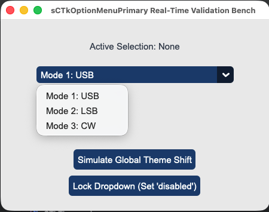

## sCTkOptionMenuPrimary

### Table of Contents
* [API Property Reference](#api-property-reference)
* [Constructor](#constructor)
* [Convenience Functions](#convenience-functions)
* [Centralized Stylesheet Setup](#centralized-stylesheet-setup-themesjson)
* [Other Notes](#other-notes)
* [Implementation Example & Test Harness](#implementation-example--test-harness)

---

The dominant primary option menu selector drop-down widget component wrapping `customtkinter.CTkOptionMenu`. It incorporates early parameter popping filters and an independent value-cloned deep copy caching layer to guarantee composite drop-down states remain permanently insulated against native CustomTkinter initialization dictionary data loss.





### API Property Reference

| Property / Feature | Standard CustomTkinter | Your `sCustomTkinter` Setup |
| :--- | :--- | :--- |
| **Instantiation** | `ctk.CTkOptionMenu(master)` | `sCTkOptionMenuPrimary(master)` *(Primary Drop-Down Menu)* |
| **File Mapping** | Direct layouts bundle under unconfig-managed files. | Streamlined and compiled programmatically across `sCTkOptionMenuPrimary.py` and `ThemeableWidget.py`. |
| **State Lock** | `self.configure(state="disabled")` | `menu_field.state("disabled")`<br>**OR**<br>`menu_field.configure(state="disabled")`<br><br>**Dual-Routing State Pipeline:** Natively intercepts state calls, unbinding drop-down trigger events while shifting background contrast rules safely out of `disabled_map` metrics via a strict sequential update pass. |
| `get_state()` | `self.cget("state")` | `Method -> str` explicit verification query matching system test assertions. |

---

### Constructor

Initialize a custom primary drop-down menu instance. High-level configuration parameters like `values`, `command`, and `variable` are explicitly popped early inside `__init__` to protect the layout engine from keyword collisions. Custom layout parameters passed from Pygubu are handled seamlessly by the `ThemeableWidget` mixin layer before the native constructor fires.

```python
# Instantiate a primary operational mode selection option menu
mode_dropdown = sCTkOptionMenuPrimary(
    master=control_panel,
    values=["Mode 1: Upper Sideband", "Mode 2: Lower Sideband", "Mode 3: Continuous Wave"],
    command=on_mode_selection_changed
)

# Render the widget inside your parent layout frame panel
mode_dropdown.pack(fill="x", padx=40, pady=10)
```
### Convenience Functions
```python
# Programmatically update menu item lists or query data frames
mode_dropdown.set("Mode 3: Continuous Wave")  # Forces the dropdown choice to display a specific value string
current_choice = mode_dropdown.get()           # Returns the active string item currently displayed
mode_dropdown.update_list(["Option A", "Option B"]) # Safely replaces the visible array and handles indexing boundaries

# Evaluate current state configurations or apply absolute user interaction locks via dual-routing syntax
current_mode = mode_dropdown.get_state()       # Returns 'normal' or 'disabled'
mode_dropdown.state("disabled")                # Locks dropdown triggers and applies muted gray fills
```

### Centralized Stylesheet Setup (`themes.json`)
```json
{
    "sCTkOptionMenuPrimary": {
        "fg_color": ["#1A4375", "#1F6AA5"],
        "button_color": ["#112A4B", "#194A7A"],
        "button_hover_color": ["#0F2542", "#134267"],
        "text_color": ["#FFFFFF", "#FFFFFF"],
        "dropdown_fg_color": ["#FFFFFF", "#1F2937"],
        "dropdown_text_color": ["#1F2937", "#FFFFFF"],
        "disabled_map": {
            "fg_color": ["#F3F4F6", "#1F2937"],
            "button_color": ["#E5E7EB", "#374151"],
            "button_hover_color": ["#E5E7EB", "#374151"],
            "text_color": ["#94A3B8", "#64748B"]
        }
    }
}
```

### Other Notes
* **Deep-Copy Dictionary Isolation Shield:** Because CustomTkinter's native option menu initialization code mutates, strips, and deletes keys directly out of raw dictionary data footprints during its boot phase, the constructor clones your configurations into `self._local_defaults = dict(self.final_kw)` beforehand. This prevents normal state restorations from crashing on missing keys.
* **Real-Time Repaint Loop:** The internal core engine is fortified to run color tuple lookups dynamically across both normal and locked state selections. This forces the option menu button faces, text fonts, and inner canvas drop tracks to adapt fluidly to theme skin toggle commands without white-out freezes.
* **Automated Lifecycle Handshake:** At the absolute bottom of the initialization routine, the constructor fires `self._finalize_themeable_lifecycle()` to safely notify top-level Pygubu container managers that the widget is compiled.

---

### Implementation Example & Test Harness

Below is a complete, self-contained test execution script demonstrating how to properly embed an `sCTkOptionMenuPrimary` option dropdown field along with an interactive status switch toggle and skin mode updater.

```python
#!/usr/bin/python3
# =====================================================================
# 🛠️ TESTING HARNESS IMPORTS & SETUP for OptionMenu Primary
# =====================================================================

import customtkinter as ctk
from scustomtkinter import sCTkFrame, sCTkButtonPrimary,sCTkLabelSecondary, sCTk, sCTkOptionMenuPrimary

if __name__ == "__main__":

    root = sCTk()
    root.geometry("450x320")
    root.title("sCTkOptionMenuPrimary Real-Time Validation Bench")

    base = sCTkFrame(root)
    base.pack(expand=True, fill="both", padx=20, pady=20)

    lbl_monitor = sCTkLabelSecondary(base, text="Active Selection: None")
    lbl_monitor.pack(pady=10)

    menu_field = sCTkOptionMenuPrimary(
        base,
        values=["Mode 1: USB", "Mode 2: LSB", "Mode 3: CW"],
        command=lambda choice: lbl_monitor.configure(text=f"Active Selection: {choice}")
    )
    menu_field.pack(expand=False, fill="x", padx=40, pady=10)
    menu_field.set("Mode 1: USB")

    def toggle_operational_state():
        current_mode = menu_field.get_state()
        target = "disabled" if current_mode == "normal" else "normal"
        menu_field.configure(state=target)
        btn_toggle.configure(text="Lock Dropdown (Set 'disabled')" if target == "normal" else "Unlock Dropdown (Set 'normal')")

    def toggle_skin_mode():
        current_skin = ctk.get_appearance_mode()
        ctk.set_appearance_mode("Light" if current_skin == "Dark" else "Dark")

    btn_toggle = sCTkButtonPrimary(base, text="Lock Dropdown (Set 'disabled')", command=toggle_operational_state)
    btn_toggle.pack(side="bottom", pady=5)

    btn_theme = sCTkButtonPrimary(base, text="Simulate Global Theme Shift", command=toggle_skin_mode)
    btn_theme.pack(side="bottom", pady=5)

    print("--- BOOT INITIALIZATION PASSTHROUGH ---")
    menu_field.state("disabled")
    print("state (Disabled Pass) =", menu_field.get_state())

    menu_field.state("normal")
    print("state (Normal Pass)   =", menu_field.get_state())
    print("========================================\n")

    root.mainloop()
```

[Return to Table of Contents](#contents)
