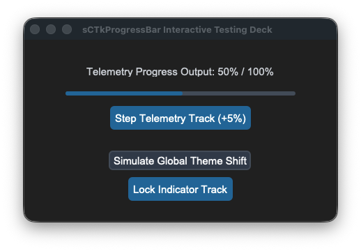

## sCTkProgressBar

### Table of Contents
* [API Property Reference](#api-property-reference)
* [Constructor](#constructor)
* [Convenience Functions](#convenience-functions)
* [Progress Scaling & Movement Physics](#progress-scaling--movement-physics)
* [Centralized Stylesheet Setup](#centralized-stylesheet-setup-sctkthemesjson)
* [Implementation Example & Test Harness](#implementation-example--test-harness)

---

An advanced theme-compliant linear progression indicator widget. It implements custom state hooks to dynamically morph track backgrounds and progress fill lanes into desaturated gray tokens on a programmatic lock, protecting visual dashboard metrics from freezing out of theme synchronization.





### API Property Reference

| Property / Feature | Standard CustomTkinter | Your `sCustomTkinter` Setup |
| :--- | :--- | :--- |
| **Instantiation** | `ctk.CTkProgressBar(master)` | `sCTkProgressBar(master)` *(Themed Progress Bar)* |
| **File Mapping** | Config metrics look up loose un-managed palette snapshot lists. | Separated safely across `sCTkProgressBar.py` and `ThemeableWidget.py`. |
| **State Lock** | *Not Supported Natively* | `widget.state("disabled")`<br>**OR**<br>`widget.configure(state="disabled")`<br><br>**Polymorphic State Controller:** Repaints the underlying vector fill segments to reflect a read-only lock state natively. |

---

### Constructor

Initialize a custom themed progression indicator chassis.

```python
# Instantiate a telemetry loading indicator bar
load_bar = sCTkProgressBar(master=dashboard_panel)

# FIX: Keep expand=False to prevent track heights from over-stretching vertically!
load_bar.pack(expand=False, fill="x", padx=40, pady=10)

# Feed status tracking values down the matrix (0.0 to 1.0)
load_bar.set(0.45)
```

---

### Convenience Functions
```python
# Unpack active progress metrics programmatically
current_value = load_bar.get()                # Returns float between 0.0 and 1.0


# Force-apply a new progress position value across the track index
load_bar.set(0.75)                            # Sets progress bar layout directly to 75%


# Apply an immediate visual state lock across the tracker segment
load_bar.state("disabled")                    # Repaints filled lanes to desaturated gray
```

---

### Progress Scaling & Movement Physics

The progression indicator updates its visual fill index strictly via **floating-point values ranging from `0.0` (0%) to `1.0` (100%)**. To safely translate integer step adjustments (like hardware clicks, telemetry deltas, or button taps) into smooth fractional bar movement, utilize the following resolution guidelines:

#### 1. Incrementing with Decimal Steps
To move the bar forward by a specific percentage step, extract the active position float via `.get()` and add a corresponding fractional delta (`0.01` for a 1% step, `0.05` for a 5% step, `0.10` for a 10% step):

```python
# Advance progress bar position forward by exactly +5%
current_position = load_bar.get()
next_position = current_position + 0.05

# Clamp the value at the 1.0 (100%) ceiling to prevent math layout overflow exceptions
if next_position > 1.0:
    next_position = 1.0

load_bar.set(next_position)
```

#### 2. Reversing to Percentages for Labels
To report the floating-point index back to the operator dashboard as a readable integer percentage string, multiply the float by `100` and cast it to a flat `int()` value:

```python
# Converts a position of 0.65 into a clean string layout: "65%"
percentage_string = f"{int(load_bar.get() * 100)}%"
my_dashboard_label.configure(text=percentage_string)
```

---

### Centralized Stylesheet Setup (`sCTkThemes.json`)
```json
{
    "sCTkProgressBar": {
        "fg_color": ["#E2E8F0", "#2D2D2D"],
        "progress_color": ["#3B82F6", "#1F6AA5"],
        "border_color": ["#CBD5E1", "#334155"],
        "disabled_map": {
            "fg_color": ["#E2E8F0", "#1E293B"],
            "progress_color": ["#94A3B8", "#475569"]
        }
    }
}
```

---

### Implementation Example & Test Harness

Below is a complete, self-contained interactive test execution script demonstrating how to map percentage labels and step controllers natively alongside an `sCTkProgressBar`.

```python
#!/usr/bin/python3
# =====================================================================
# 🛠️ TESTING HARNESS IMPORTS & SETUP for ProgressBar
# =====================================================================

import customtkinter as ctk
from scustomtkinter import sCTkFrame, sCTkButtonPrimary, sCTkButtonSecondary, sCTkLabelSecondary, sCTk, sCTkProgressBar

if __name__ == "__main__":

    root = sCTk()
    root.geometry("450x260")
    root.title("sCTkProgressBar Interactive Testing Deck")

    base = sCTkFrame(root)
    base.pack(expand=True, fill="both", padx=20, pady=20)

    initial_val = 0.45
    lbl_status = sCTkLabelSecondary(
        base,
        text=f"Telemetry Progress Output: {int(initial_val * 100)}% / 100%"
    )
    lbl_status.pack(pady=(10, 5))

    widget = sCTkProgressBar(base)
    widget.pack(expand=False, fill="x", padx=40, pady=10)
    widget.set(initial_val)

    def step_progress():
        if widget.get_state() == "disabled":
            print("⚠️ Cannot modify progress channel: Widget is currently locked!")
            return

        current_val = widget.get()
        next_val = current_val + 0.05
        if next_val > 1.0:
            next_val = 0.0

        widget.set(next_val)
        lbl_status.configure(text=f"Telemetry Progress Output: {int(next_val * 100)}% / 100%")

    btn_step = sCTkButtonPrimary(base, text="Step Telemetry Track (+5%)", command=step_progress)
    btn_step.pack(pady=(5, 5))

    def toggle_operational_lock():
        current_mode = widget.get_state()
        target = "disabled" if current_mode == "normal" else "normal"
        widget.configure(state=target)
        btn_lock.configure(text="Lock Indicator Track" if target == "normal" else "Unlock Indicator Track")
        btn_step.configure(state=target)

    btn_lock = sCTkButtonPrimary(base, text="Lock Indicator Track", command=toggle_operational_lock)
    btn_lock.pack(side="bottom", pady=(5, 10))

    def toggle_skin_mode():
        current_skin = ctk.get_appearance_mode()
        ctk.set_appearance_mode("Light" if current_skin == "Dark" else "Dark")

    btn_theme = sCTkButtonSecondary(base, text="Simulate Global Theme Shift", command=toggle_skin_mode)
    btn_theme.pack(side="bottom", pady=5)

    root.mainloop()
```

[Return to Table of Contents](#contents)
