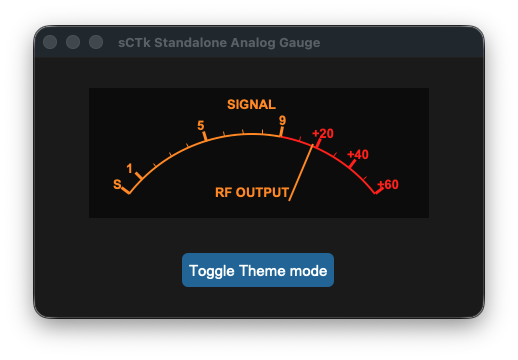
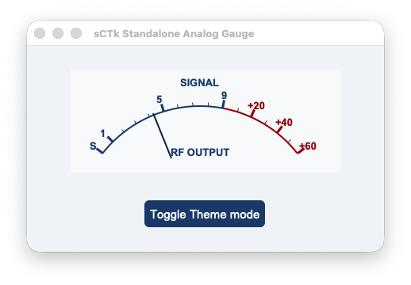

## sCTkSMeter

The `sCTkSMeter` is a standalone, theme-adaptive analog S-Meter/Power Output gauge instrument designed specifically for ham radio transceiver desktop interfaces. Natively inheriting container footprints from `customtkinter.CTkFrame`, it delivers smooth telemetry tracking sweeps without the overhead of extraneous nesting modules.






---

### 🛠️ Core Gauge Geometry & Scale Mechanics

The instrument face is split mathematically to mirror classic analog transceiver gauge divisions perfectly:
*   **The S-Unit Scale (Ticks 0–9):** Maps incoming telemetry values from `0.0` to `9.0` linearly across the first 60% of the visual arc container, rendered in your high-contrast brand or amber theme palettes.
*   **The Decibel Over S9 Scale (Ticks 9–15):** Maps advanced signal parameters from `9.0` up to `69.0` across the remaining 40% of the dial arc track (where `+20dB` sits at coordinate 29, `+40dB` at 49, and `+60dB` at 69). This region is permanently framed by your crimson/redline alert warning colors.
*   **Unified Pivot Axis Integration:** The inner rendering engines calculate lines, arcs, labels, and needle sweeps using a singular synchronized mathematical pivot point (`center_x = width * 0.48`). This entirely eliminates off-axis tracking drift or floating pointer artifacts when live data streams update.

---

### 📋 API Constructor Reference

```python
sCTkSMeter(master=None, width=340, height=130, **kw)
```

| Parameter Name | Data Type | Default Value | Description |
| :--- | :--- | :--- | :--- |
| `master` | `any` | `None` | Reference pointer tracking your root window or parent `sCTkFrame` container layout layer. |
| `width` | `int` | `340` | Manual hardware panel horizontal width boundary tracking profile measured in pixels. Supports on-the-fly Pygubu geometry defaults resetting queries safely. |
| `height` | `int` | `130` | Manual hardware panel vertical height boundary tracking profile measured in pixels. Supports on-the-fly Pygubu geometry defaults resetting queries safely. |

---

### ⚡ Global Object Instance Methods

To drive the needle tracking sweep fluidly inside background receiver threads, automatic VFO frequency scanning loops, or telemetry data parsing hooks, utilize this direct public setter:

#### Update Instrument Needle Position
```python
# Updates pointer positioning dynamically. Expects a float value clamped between 0.0 and 69.0.
smeter.set(value)
```

---

### 🎨 Centralized Stylesheet Integration (`sCTkThemes.py`)

The component is deeply integrated with your centralized theme dictionary layout. To ensure that canvas backgrounds, typography text arcs, and indicator colors translate cleanly during startup initialization sweeps or global appearance mode switches, verify your shared configuration contains this asset block:

```python
THEME_DEFAULTS = {
    "sCTkSMeter": {
        # Light Mode: Clean White Face | Dark Mode: Deep Obsidian Cockpit Black
        "fg_color": ("#F8FAFC", "#0A0A0A"),       
        
        # High-Contrast Brand Blue for bright rooms / Illuminated Glowing Neon Amber for dark setups
        "text_color": ("#1A4375", "#FF9100"),     
        
        # Solid High-Contrast Crimson / Intense Mechanical Redline alert arc warning zone
        "alarm_color": ("#990000", "#FF2200"),    
        
        # Deep Cobalt-Navy Slate indicator pointer / Blazing Orange needle tracking sweep
        "needle_color": ("#112A4B", "#FF9100"),
        
        # Dial layout calibration typography fonts
        "font": ("Arial", 10, "bold")
    },
    # ... your other widget entries
}
```

---

## Implementation Example & Test Harness

Below is a complete, self-contained interactive test execution script demonstrating how to use `sCTkSMeter`.


```python
#!/usr/bin/python3
# =====================================================================
# 🛠️ TESTING HARNESS IMPORTS & SETUP for S Meter
# =====================================================================

import customtkinter as ctk
from scustomtkinter import sCTkFrame, sCTkButtonPrimary, sCTk, sCTkSMeter
import random


if __name__ == "__main__":

    root = sCTk()
    root.title("sCTk Standalone Analog Gauge")
    root.geometry("450x260")
    root.configure(fg_color=("#F1F5F9", "#1C1C1C"))

    dashboard_frame = sCTkFrame(root, fg_color="transparent", border_width=0)
    dashboard_frame.pack(padx=20, pady=20)

    smeter = sCTkSMeter(dashboard_frame, width=340, height=130)
    smeter.pack(padx=10, pady=10)


    class SignalSimulator:
        def __init__(self, root_win, meter):
            self.root, self.meter = root_win, meter
            self.target, self.needle = 6.0, 0.0

        def shift_vfo(self):
            self.target = random.uniform(1.5, 65.0)
            self.root.after(random.randint(2500, 5000), self.shift_vfo)

        def physics_loop(self):
            jitter = random.uniform(-1.5, 1.5)
            sig = max(0.0, min(69.0, self.target + jitter))
            self.needle += (sig - self.needle) * 0.25
            self.meter.set(self.needle)
            self.root.after(25, self.physics_loop)


    sim = SignalSimulator(root, smeter)
    sim.physics_loop()
    sim.shift_vfo()


    def toggle_theme():
        ctk.set_appearance_mode("Light" if ctk.get_appearance_mode() == "Dark" else "Dark")


    sCTkButtonPrimary(root, text="Toggle Theme mode", command=toggle_theme).pack(pady=5)
    root.mainloop()

```
