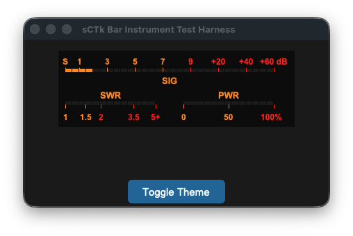
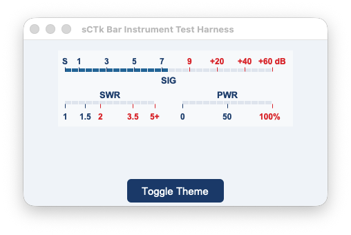

## sCTkSMeterBar

The `sCTkSMeterBar` is a standalone, low-profile horizontal discrete 30-segment LED bar instrumentation widget displaying independent telemetry tracks for incoming receiver S-Units, transmitter SWR ratio levels, and forward RF Power output percentage. Like all sCTk widgets, it is fully theme-adaptive.






---

### 🛠️ Subsystem Layout & Multi-Track Physics

The discrete LED matrix map shifts automatically based on the device operational path constraints:
*   **The S-Meter Track (Top Row):** Maps incoming telemetry values across 30 linear segments. Signals from `0.0` to `9.0` utilize the first 60% of the bar, while advanced signal ranges up to `+60dB` expand into the remaining 40% redline warning zone.
*   **The Transmitter Track (Split Bottom Row):** Splices the lower segment path down the center into two separate monitoring zones. The left half maps a logarithmic SWR reflection track up to your custom `swr_max_value`, while the right half tracks forward RF power from `0%` to `100%`.
*   **Post-Boot Geometry Flattening:** Overrides native internal grid layout constraints programmatically to force all 30 LED rectangles to sit perfectly flush. This completely removes horizontal spacing holes, keeping your panel elements locked into a solid hardware console bar.

---

### 📋 API Constructor Reference

```python
sCTkSMeterBar(master=None, swr_max_value=5.0, swr_visible=True, pwr_visible=True, hide_lower_row=False, width=340, height=110, **kw)
```

| Parameter Name | Data Type | Default Value | Description |
| :--- | :--- | :--- | :--- |
| `master` | `any` | `None` | Reference pointer tracking your root window or parent `sCTkFrame` container layout layer. |
| `swr_max_value` | `float` | `5.0` | The explicit maximum scale boundary representing the far right edge limit tracking your transmitter's SWR track. |
| `swr_visible` | `bool` | `True` | Visibility flag for the SWR cluster. Flipping to `False` shifts the text, ticks, and active LEDs into a faded, disabled palette look. |
| `pwr_visible` | `bool` | `True` | Visibility flag for the PWR cluster. Flipping to `False` shifts the text, ticks, and active LEDs into a faded, disabled palette look. |
| `hide_lower_row` | `bool` | `False` | Layout override command. When `True`, the entire lower instrumentation cluster collapses and vanishes, pushing the `SIG` bar to the true vertical center of the card footprint. |
| `width` | `int` | `340` | Manual hardware panel horizontal width boundary tracking profile measured in pixels. Supports on-the-fly Pygubu geometry defaults resetting queries safely. |
| `height` | `int` | `110` | Manual hardware panel vertical height boundary tracking profile measured in pixels. Supports on-the-fly Pygubu geometry defaults resetting queries safely. |

---

### ⚡ Global Object Instance Methods

#### Update Instrument Telemetry Channels
```python
# Pass parameters to update any of the 3 telemetry rows independently on the fly.
# Expects floats matching your radio data streams.
led_bar_gauge.set(s_value=9.2, swr_value=1.4, pwr_value=45.0)
```

#### Live Layout Configuration Modifier
```python
# Updates layout presentation properties on the fly without reconstruction overhead.
led_bar_gauge.configure_visibility(swr_visible=False, pwr_visible=True, hide_lower_row=False)
```

---

### 🎨 Centralized Stylesheet Integration (`sCTkThemes.py`)

The component relies heavily on your centralized style dictionary system. To prevent the mixin parser tracking structures from raising runtime validation faults during initialization cycles, verify your shared stylesheet contains this asset configuration block:

```python
THEME_DEFAULTS = {
    "sCTkSMeterBar": {
        # Light Mode: Clean Slate-White Face | Dark Mode: Deep Obsidian Cockpit Black
        "fg_color": ("#F8FAFC", "#0A0A0A"),       
        
        # High-Contrast Brand Blue for bright rooms / Illuminated Glowing Neon Amber for dark setups
        "text_color": ("#1A4375", "#FF9100"),     
        
        # Solid High-Contrast Crimson / Intense Mechanical Redline alert segment zones
        "alarm_color": ("#DC2626", "#FF2200"),    
        
        # Active illuminated LED block color tracks mapped out below threshold limits
        "led_on_color": ("#2471A3", "#10B981"),   
        
        # Unlit background matrix segment pockets visible behind dark/inactive areas
        "led_off_color": ("#E2E8F0", "#1F2937")   
    },
    # ... your other widget entries
}
```

---

## Implementation Example & Test Harness

Below is a complete, self-contained interactive test execution script demonstrating how to use `sCTkSMeterBar`.


```python
#!/usr/bin/python3
# =====================================================================
# 🛠️ TESTING HARNESS IMPORTS & SETUP for S Meter Bar
# =====================================================================

import customtkinter as ctk
from scustomtkinter import sCTkFrame, sCTkButtonPrimary, sCTk, sCTkSMeterBar
import random


if __name__ == "__main__":

    app = sCTk()
    app.title("sCTk Bar Instrument Test Harness")
    app.geometry("440x240")
    app.configure(fg_color=("#F1F5F9", "#1C1C1C"))

    panel_container = sCTkFrame(app, fg_color="transparent", border_width=0)
    panel_container.pack(padx=20, pady=15, fill="both", expand=True)

    led_bar_gauge = sCTkSMeterBar(panel_container, width=340, height=110)
    led_bar_gauge.pack()

    class HarnessSimulator:
        def __init__(self, root_win, bar):
            self.root, self.bar = root_win, bar
            self.s_target, self.s_curr = 4.0, 0.0
            self.swr_target, self.pwr_target = 1.0, 0.0
            self.swr_curr, self.pwr_curr = 1.0, 0.0
            self.tx_active = False

        def tuning_cycle(self):
            self.s_target = random.uniform(0.5, 13.5)
            if not self.tx_active and random.random() > 0.4:
                self.tx_active = True
                self.swr_target = random.uniform(1.1, 4.5)
                self.pwr_target = random.uniform(35.0, 95.0)
                self.root.after(random.randint(1500, 3000), self._release)
            self.root.after(random.randint(4000, 8000), self.tuning_cycle)

        def _release(self):
            self.tx_active = False
            self.swr_target, self.pwr_target = 1.0, 0.0

        def physics_tick(self):
            self.s_curr += ((max(0.0, min(15.0, self.s_target + random.uniform(-1.2, 1.2)))) - self.s_curr) * 0.35
            self.swr_curr += (((max(1.0, min(5.0, self.swr_target + random.uniform(-0.15, 0.15))) if self.tx_active else 1.0)) - self.swr_curr) * 0.20
            self.pwr_curr += (((max(0.0, min(100.0, self.pwr_target + random.uniform(-2.5, 2.5))) if self.tx_active else 0.0)) - self.pwr_curr) * 0.20
            self.bar.set(s_value=self.s_curr, swr_value=self.swr_curr, pwr_value=self.pwr_curr)
            self.root.after(20, self.physics_tick)

    sim = HarnessSimulator(app, led_bar_gauge)
    sim.physics_tick()
    sim.tuning_cycle()

    def toggle_theme():
        ctk.set_appearance_mode("Light" if ctk.get_appearance_mode() == "Dark" else "Dark")

    sCTkButtonPrimary(app, text="Toggle Theme", command=toggle_theme).pack(pady=5)
    app.mainloop()

```
