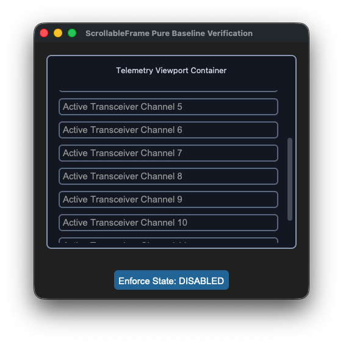
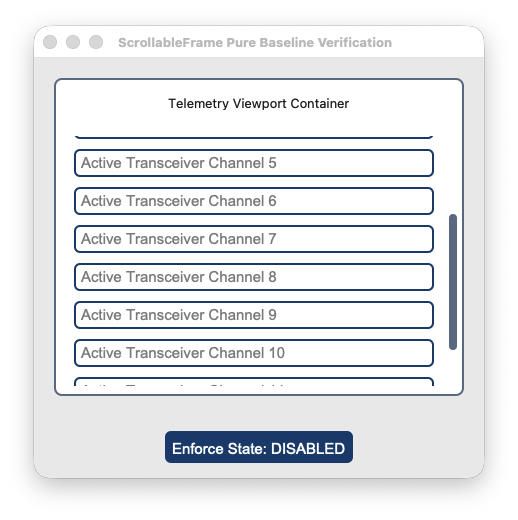

## sCTkScrollableFrame

### Table of Contents
* [API Property Reference](#api-property-reference)
* [Constructor](#constructor)
* [Convenience Functions](#convenience-functions)
* [Advanced Layout Inspection API](#advanced-layout-inspection-api)
* [Centralized Stylesheet Setup](#centralized-stylesheet-setup-sctkthemesjson)
* [Other Notes](#other-notes)
* [Implementation Example & Test Harness](#implementation-example--test-harness)

---

An advanced scrollable window viewport capsule inheriting natively and directly from CustomTkinter's `ctk.CTkScrollableFrame` layouts. It streamlines geometry tracking parameters and isolates background mouse-wheel layers cleanly while leaving the application developer completely in control of child layout configuration sweeps across theme switches.






### API Property Reference

| Property / Feature | Standard CustomTkinter | Your `sCustomTkinter` Setup |
| :--- | :--- | :--- |
| **Instantiation** | `ctk.CTkScrollableFrame(master)` | `sCTkScrollableFrame(master)` *(Themed Viewport Container)* |
| **File Mapping** | Config metrics look up loose un-managed palette snapshot lists. | Streamlined and compiled programmatically across `sCTkScrollableFrame.py` and `ThemeableWidget.py`. |
| **State Lock** | *Not Supported Natively* | Passive Container Operation Parity.<br><br>**Baseline Design Workflow:** Containers remain perpetually active (`"normal"`) to allow child inputs sitting on top of their canvas face to handle their own active drawing states and color switches independently. |
| `winfo_children()` | Returns raw internal Tkinter tree widgets, including private scrollbars. | Overridden signature supporting filtered application widget lookups. |
| `get_children()` | *Not Supported Natively* | Convenience method returning clean application-level custom components. |
| `get_all_children()` | *Not Supported Natively* | Convenience method returning direct, unfiltered access to the entire core tree. |

---

### Constructor

Initialize a custom themed scrollable frame viewport layout chassis. High-level custom configuration parameters passed by Pygubu (like `translator`, `on_first_object_cb`, `image_loader`, and `data_pool`) are automatically intercepted, processed, and purged early by the `ThemeableWidget` mixin layer before the native constructor fires.

```python
# Instantiate a telemetry logging scrollable list frame card
log_viewport = sCTkScrollableFrame(
    master=dashboard,
    width=380,
    height=250,
    label_text="Telemetry Viewport Container"
)

# Render the widget inside your container panel
log_viewport.pack(padx=20, pady=20, fill="both", expand=True)
```

---

### Convenience Functions
```python
# Evaluate current container configuration attributes smoothly out of local registries
current_mode = log_viewport.get_state()      # Always returns 'normal'
```

### Advanced Layout Inspection API

To insulate your structural look configurations from breaking when cascading loops pass through composite layouts, the system overrides native Tkinter window query behaviors.

#### `winfo_children(include_private: bool = False) -> list`

* **`include_private=False` (Default):** Drops private internal wrapper artifacts from appearing in clean application loops. The method dynamically strips out underlying `CTkScrollbar`, `CTkCanvas`, and raw `Canvas` components so layout managers and state controllers only target your functional custom entries and forms.
* **`include_private=True`:** Drops the filter shield instantly, returning the raw, unmanipulated C-level native Tkinter core window lineage tree for deep forensic tracking or platform diagnostics.

```python
# Pure application-layer cascade: Targets only form entries, skipping scrollbars natively
for widget in test_frame.winfo_children():
    widget.configure(state="disabled")

# Forensic debugging pass: Uncovers the hidden internal CustomTkinter layers
print(test_frame.winfo_children(include_private=True))
```

### Centralized Stylesheet Setup (`sCTkThemes.json`)
```json
{
    "sCTkScrollableFrame": {
        "fg_color": ["#FAFAFA", "#11141A"],
        "border_color": ["#CBD5E1", "#222933"],
        "label_fg_color": ["#E2E8F0", "#1A222D"],
        "scrollbar_button_color": ["#94A3B8", "#475569"],
        "scrollbar_button_hover_color": ["#64748B", "#334155"]
    }
}
```

### Other Notes
* **Bypassing the BaseUI Skeletons:** This component avoids all autogenerated Pygubu `baseui` template classes, mapping directly to native CustomTkinter classes to keep the recursive theme broadplane completely unblocked.
* **Automated Lifecycle Handshake:** Fires `self._finalize_themeable_lifecycle()` at the absolute end of the constructor initialization track to cleanly pass instance registration hooks up to Pygubu's master parent script controllers.

### ⚠️ Critical Apple Touch & Multi-Platform Scrolling Constraint

When packing layout controls interior to an `sCTkScrollableFrame` view pane, **you must strictly avoid mixing native CustomTkinter widgets (e.g., `ctk.CTkEntry`, `ctk.CTkButton`) alongside your themed `sCustomTkinter` equivalents.**

* **The Event Swallowing Trap:** Native `ctk` elements do not participate in our repository's unified recursive event-braid mesh. Because they aggressively capture touch focus inputs on macOS, any native element will act like a layout "black hole"—completely freezing trackpads and Apple Magic Mouse swipes the moment a user hovers their mouse cursor directly over that row.
* **The Resolution Rule:** Always pack your framework's custom theme-aligned classes (e.g., **`sCTkEntryPrimary`**, **`sCTkButtonPrimary`**, **`sCTkCheckBox`**). Because they inherit from our synchronized base mixins, they naturally allow high-precision touch parameters and traditional hardware scrollwheel click ticks to bubble straight up to the master viewport coordinate canvas flawlessly across macOS, Windows, and Linux.

---

### Implementation Example & Test Harness

Below is a complete, self-contained test execution script demonstrating how to properly embed an `sCTkScrollableFrame` container layout along with an external cascade state toggle switch button.

```python
#!/usr/bin/python3
# =====================================================================
# 🛠️ TESTING HARNESS IMPORTS & SETUP for ScrollableFrame
# =====================================================================

import customtkinter as ctk
from scustomtkinter import sCTkButtonPrimary, sCTkEntryPrimary, sCTk, sCTkScrollableFrame

if __name__ == "__main__":

    root = sCTk()
    root.title("ScrollableFrame Pure Baseline Verification")
    root.geometry("450x420")

    test_frame = sCTkScrollableFrame(root, width=380, height=250, label_text="Telemetry Viewport Container")
    test_frame.pack(padx=20, pady=20, fill="both", expand=True)

    for i in range(12):
        mock_entry = sCTkEntryPrimary(test_frame, placeholder_text=f"Active Transceiver Channel {i + 1}")
        mock_entry.pack(padx=10, pady=5, fill="x")

    _is_locked = False
    def toggle_cascade_lockout():
        global _is_locked
        _is_locked = not _is_locked
        target = "disabled" if _is_locked else "normal"

        toggle_btn.configure(text="Enforce State: NORMAL" if _is_locked else "Enforce State: DISABLED")

        # 🔑 CLEAN APPLICATION-LEVEL LOOKOUT LOOP CASCADE:
        # The external control logic explicitly dictates when and how to update nested elements!
        for entry_widget in test_frame.get_children():
            if hasattr(entry_widget, "configure"):
                try:
                    entry_widget.configure(state=target)
                except Exception:
                    pass

    toggle_btn = sCTkButtonPrimary(root, text="Enforce State: DISABLED", command=toggle_cascade_lockout)
    toggle_btn.pack(side="bottom", pady=15)

    btn_theme = sCTkButtonPrimary(root, text="Toggle Theme Skin", command=lambda: ctk.set_appearance_mode(
        "Dark" if ctk.get_appearance_mode() == "Light" else "Light"))
    btn_theme.pack(side="bottom", pady=5)

    test_frame._toggle_scroll_bindings(bind=True)
    root.mainloop()
```

[Return to Table of Contents](#contents)
