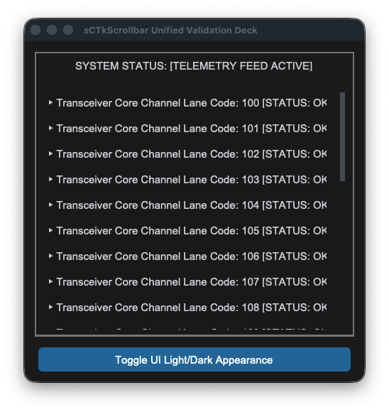
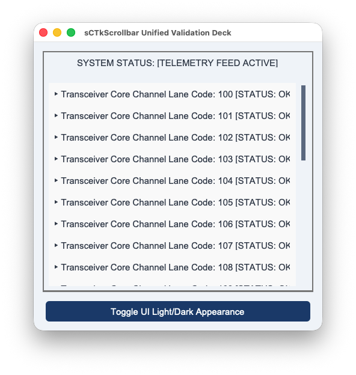

## sCTkScrollbar

The `sCTkScrollbar` is a high-performance, theme-adaptive custom scrollbar element designed for the `sCustomTkinter` radio desktop interface, working in tandem with the unblocked `sCTkScrollArea` viewport container frame. It inherits from `ctk.CTkScrollbar` to preserve native light/dark appearance switches while introducing specialized hardware aggregators to handle inertial gestures smoothly.






### 📌 Localized Table of Contents
* [API Constructor Reference](#-api-constructor-reference)
* [Native Viewport Alignment Handshake](#%EF%B8%8F-native-viewport-alignment-handshake)
* [Centralized Stylesheet Integration](#-centralized-stylesheet-integration-sctkthemesjson)
* [Implementation Reference Template](#-implementation-reference-template)

---

### 📋 API Constructor Reference

#### `sCTkScrollbar` Constructor
```python
scrollbar = sCTkScrollbar(master=None, orientation="vertical", **kwargs)
```

#### `sCTkScrollArea` Constructor
```python
scroll_area = sCTkScrollArea(master=None, **kwargs)
```

### API Property Reference

| Property / Feature | Standard CustomTkinter | Your `sCustomTkinter` Setup |
| :--- | :--- | :--- |
| **Instantiation** | `ctk.CTkScrollbar(master)` | `sCTkScrollbar(master)` *(Isolated External Scroll Handle)* |
| **Viewport Companion**| `ctk.CTkScrollableFrame` | `sCTkScrollArea(master)` *(Unblocked Direct Canvas Frame)* |
| **High-Precision Logic**| Coarse notched delta wheels only | **Inertial Micro-Delta Aggregator:** Smoothly captures, normalizes, and dampens Apple Magic Mouse and Trackpad sweeps natively. |
| **Event Routing** | Hardcoded internal grab hooks | **Direct Binding Pattern:** Attaches platform-synchronized event listeners across viewport and item rows automatically. |

---

### 🎛️ Native Viewport Alignment Handshake
Connecting the themeable scrollbar to the unblocked container frame involves a single architectural lifecycle call. 

When you pack the label items or tracking data lines inside the container frame, the underlying engine automatically routes vertical scroll gestures straight up into our fractional coordinate processor. This ensures that traditional mouse wheels and high-precision Apple touchpad momentum sweeps execute with perfect visual continuity.

```python
# 1. Native alignment layout handshake
scroll_view.hook_scrollbar(scrollbar)

# 2. Populate data items directly into the scrolling content frame panel
for i in range(25):
    lbl_item = sCTkLabelSecondary(scroll_view.scroll_content, text="Telemetry Row")
    lbl_item.pack()
```

[Go to Piece 2 of 2](#%F0%9F%8E%A8-centralized-stylesheet-integration-sctkthemesjson) | [Return to Table of Contents](#%F0%9F%93%8C-localized-table-of-contents)
### 🎨 Centralized Stylesheet Integration (`sCTkThemes.json`)

`sCTkScrollbar` drives its color changes straight out of your central theme file. Redundant state mappings and broken disabled maps are completely omitted, maintaining a clean, production-grade JSON dictionary footprint.

```json
{
    "sCTkScrollbar": {
        "corner_radius": 4,
        "fg_color": "transparent",
        "button_color": ["#64748B", "#4B5563"],
        "button_hover_color": ["#1A4375", "#2471A3"]
    }
}
```

---

### 💻 Implementation Reference Template

```python
#!/usr/bin/python3
# =====================================================================
# 🛠️ TESTING HARNESS IMPORTS & SETUP for Scrollbar
# =====================================================================

import customtkinter as ctk
from scustomtkinter import sCTkFrame, sCTkButtonPrimary, sCTkLabelSecondary, sCTk, sCTkScrollbar, sCTkScrollArea

if __name__ == "__main__":
    root = sCTk()
    root.geometry("480x480")
    root.title("sCTkScrollbar Unified Validation Deck")
    root.configure(fg_color=("#F1F5F9", "#1C1C1C"))

    # 2. Arrange our isolated lower button layout panel tray
    lower_tray = ctk.CTkFrame(root, fg_color="transparent")
    lower_tray.pack(side="bottom", fill="x", padx=15, pady=(0, 15))

    # 3. Mount master backplane panel frame capsule container
    main_layout = sCTkFrame(root, border_width=2)
    main_layout.pack(expand=True, fill="both", padx=15, pady=15)

    status_monitor = sCTkLabelSecondary(main_layout, text="SYSTEM STATUS: [TELEMETRY FEED ACTIVE]")
    status_monitor.pack(fill="x", padx=10, pady=(5, 10))

    def toggle_appearance_skin():
        ctk.set_appearance_mode("Light" if ctk.get_appearance_mode() == "Dark" else "Dark")

    # Pack our skin preference toggler safely inside the isolated lower tray panel
    btn_theme = sCTkButtonPrimary(lower_tray, text="Toggle UI Light/Dark Appearance", command=toggle_appearance_skin)
    btn_theme.pack(fill="x", expand=True, padx=5)

    # 4. Mount themeable custom scrollbar primitive
    scrollbar = sCTkScrollbar(main_layout, orientation="vertical")
    scrollbar.pack(side="right", fill="y", padx=(5, 10), pady=10)

    # 5. Build nested viewport container layout tracks
    content_chassis = sCTkFrame(main_layout, border_width=0, fg_color="transparent")
    content_chassis.pack(side="left", fill="both", expand=True, padx=(10, 0), pady=10)

    scroll_view = sCTkScrollArea(content_chassis)
    scroll_view.pack(fill="both", expand=True)

    # 6. Populate viewport with telemetry data and invoke the opt-in convenience propagator
    for i in range(25):
        lbl_item = sCTkLabelSecondary(scroll_view.scroll_content, text=f"▶ Transceiver Core Channel Lane Code: {100 + i} [STATUS: OK]")
        lbl_item.pack(anchor="w", padx=10, pady=4)
        scroll_view.propagate_scroll_events(lbl_item)

    # 7. Wire hardware event pipelines natively together
    scroll_view.hook_scrollbar(scrollbar)

    root.mainloop()
```

[Return to Table of Contents](#%F0%9F%93%8C-localized-table-of-contents)
