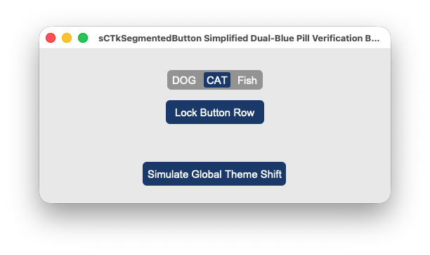

# sCTkSegmentedButton

A custom, theme-compliant segmented button strip tracker widget designed for hardware-inspired radio control panel layouts. Inherits directly from `customtkinter.CTkSegmentedButton` and implements the `ThemeableWidget` mixin framework, enabling total alignment with centralized stylesheet configurations.





## 🛠️ Architectural Design Features

*   **Zero-Gap Contiguous Bar:** Bypasses CustomTkinter's native button spacing layout by programmatically flattening horizontal paddings down to absolute zero. Every tab segment welds tightly flush next to each other inside a single continuous capsule pill track profile.
*   **Dynamic High-Contrast Legibility:** Forcefully overrides child element text layers dynamically on click events. This ensures the active choice badge maintains crisp pure white lettering over deep accent container fills, while adjacent unselected choices cleanly snap back to your rested dark gray or blue typography targets.
*   **Pygubu Constructor Handshake Protection:** Implements an internal initialization shield gate that catches post-boot `.configure(state='disabled')` assignments passed down from Pygubu form layout engines before sub-button structures have completed generation. This prevents `AttributeError` freezes on initial application startup loops.
*   **Virtual Lock Dimming Engine:** Integrates operational mode state switches straight down to your look dictionaries. Toggling the component to a disabled track automatically applies cohesive, muted, desaturated industrial gray tones over the capsule chasses natively.

---

## 🎨 Centralized Stylesheet Setup (`sCTkThemes.json`)

To drive the dual-blue layout metrics and clear-contrast typography text shifts accurately across both look preference sweeps, ensure your centralized theme profile file includes this exact element block:

```json
{
    "sCTkSegmentedButton": {
        "fg_color": ["#4F75A2", "#2B4C7E"],
        "selected_color": ["#1A4375", "#3A6FA2"],
        "selected_hover_color": ["#112A4B", "#2B5885"],
        "unselected_color": "transparent",
        "unselected_hover_color": ["#3A5C85", "#3A5F8C"],
        "text_color": ["#FFFFFF", "#FFFFFF"],
        "text_color_disabled": ["#94A3B8", "#64748B"],
        "disabled_map": {
            "fg_color": ["#B2B9BC", "#222527"],
            "selected_color": ["#70777B", "#45494D"],
            "selected_hover_color": ["#70777B", "#45494D"],
            "unselected_color": "transparent",
            "unselected_hover_color": "transparent"
        }
    }
}
```

---

## ⚙️ Public API Methods Reference

| Method Name | Arguments | Return Type | Description |
| :--- | :--- | :--- | :--- |
| `state(mode)` | `mode: str (Optional)` | `str` | Dedicated operational state controller. If empty, returns the current active state (`'normal'` or `'disabled'`). If passed, triggers a look cascade pass. |
| `get_state()` | `None` | `str` | Explicit state tracking query synchronized with framework validation benchmarks. |
| `set(value)` | `value: str` | `None` | Programmatic value tracking setter. Updates the active button highlight and instantly swaps text colors across the live segment matrix. |
| `cget(attribute)` | `attribute: str` | `Any` | Intercept shield layer that safely bridges requests for the `'state'` string parameter out of underlying tkinter dictionaries. |

---

## 💻 Implementation Code Template

```python
#!/usr/bin/python3
# =====================================================================
# 🛠️ TESTING HARNESS IMPORTS & SETUP for SegmentedButton
# =====================================================================

import os
import customtkinter as ctk
from scustomtkinter import sCTkFrame, sCTkButtonPrimary, sCTkLabelSecondary, sCTk, sCTkSegmentedButton

if __name__ == "__main__":

    root = sCTk()
    root.geometry("500x220")
    root.title("sCTkSegmentedButton Simplified Dual-Blue Pill Verification Bench")

    base = sCTkFrame(root)
    base.pack(expand=True, fill="both", padx=20, pady=20)

    widget = sCTkSegmentedButton(base, values=["DOG", "CAT", "Fish"])
    widget.pack(expand=False, fill="none", padx=10, pady=10)
    widget.set("DOG")


    def toggle_operational_lock():
        current_mode = widget.get_state()
        target = "disabled" if current_mode == "normal" else "normal"
        widget.configure(state=target)
        btn_lock.configure(text="Lock Button Row" if target == "normal" else "Unlock Button Row")


    def toggle_skin_mode():
        current_skin = ctk.get_appearance_mode()
        ctk.set_appearance_mode("Light" if current_skin == "Dark" else "Dark")


    btn_lock = sCTkButtonPrimary(base, text="Lock Button Row", command=toggle_operational_lock)
    btn_lock.pack(pady=5)

    btn_theme = sCTkButtonPrimary(base, text="Simulate Global Theme Shift", command=toggle_skin_mode)
    btn_theme.pack(side="bottom", pady=5)

    root.mainloop()
```
