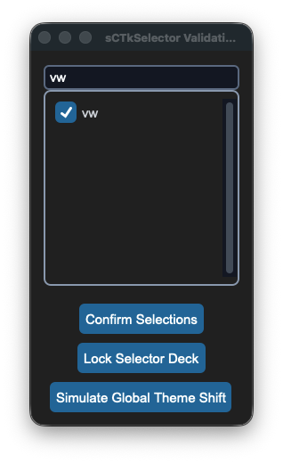
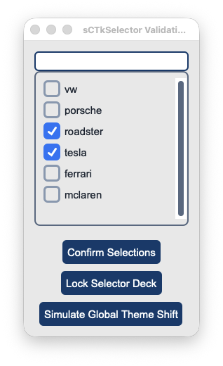

## sCTkSelector

### Table of Contents
* [API Property Reference](#api-property-reference)
* [Constructor](#constructor)
* [Convenience Functions](#convenience-functions)
* [Centralized Stylesheet Setup](#centralized-stylesheet-setup-sctkthemesjson)
* [Other Notes](#other-notes)
* [Implementation Example & Test Harness](#implementation-example--test-harness)

---

An advanced theme-compliant option list selector widget. It pairs an optional high-contrast string prefix search lane with a dynamic checklist scrollback chassis to safely manage multi-state checkbox row configurations natively.






### API Property Reference

| Property / Feature | Standard CustomTkinter | Your `sCustomTkinter` Setup |
| :--- | :--- | :--- |
| **Instantiation** | *Not Available Natively* | `sCTkSelector(master)` *(Scrollable Options Selector)* |
| **File Mapping** | Array elements bundle manually without centralized theme hooks. | Separated safely across `sCTkSelector.py` and `ThemeableWidget.py`. |
| **State Lock** | *Not Supported Natively* | `theSelector.state("disabled")`<br>**OR**<br>`theSelector.configure(state="disabled")`<br><br>**Polymorphic State Controller:** Simultaneously locks the top search bar entry field and paralyzes all child selection checkbox tracks natively using a low-level event intercept matrix. |
| `searchBox` | *Not Supported Natively* | `Property -> bool`. Controls visibility of the dynamic search bar lane. |

---

### Constructor

Initialize a custom themed selector option array tree layout.

```python
items = ["vw", "porsche", "roadster", "tesla", "ferrari", "mclaren"]

# Instantiate with multi-selection active but search functionality turned off
theSelector = sCTkSelector(
    master=root, 
    items=items, 
    multiple_choices=True, 
    searchBox=False
)

# Render the widget inside your container panel
theSelector.pack(expand=True, fill="both", padx=15, pady=15)
```

---

### Convenience Functions
```python
# Unpack current active choices dynamically
active_items = theSelector.get_selections()  # Returns list of strings e.g. ['porsche', 'tesla']

# Return all mapped string names managed by the element index
all_options = theSelector.get_all_items()     # Returns list of all items

# Wipe selection arrays clean uniformly
theSelector.clear_selections()

# Adjust layout properties or component visibilities on the fly
theSelector.configure(searchBox=True)        # Dynamically mounts and renders search bar lane
```
### Centralized Stylesheet Setup (`sCTkThemes.json`)
```json
{
    "sCTkSelector": {
        "fg_color": ["#FAFAFA", "#11141A"],
        "border_color": ["#CBD5E1", "#222933"],
        "text_color": ["#1F2937", "#FFFFFF"],
        "disabled_map": {
            "fg_color": ["#F1F5F9", "#0A0D14"],
            "border_color": ["#E2E8F0", "#171C24"]
        }
    }
}
```

---

### Other Notes
* **Crash-Shield Transparency Interceptor:** Native checkboxes throw a fatal `ValueError` if their indicator fills map to `transparent`. If the selector's master frame layout returns a transparent background, the visual router automatically overrides the checkbox container tracks with solid high-contrast corporate hex codes on boot.
* **Light Mode Contrast Guard:** To bypass CustomTkinter's native washed-out white checkmark bug on locked elements, the repaint engine manually forces a dark gray checkmark selection overlay inside Light Mode, keeping checked rows perfectly legible.
* **Automated Lifecycle Handshake:** At the absolute bottom of the initialization sequence, the constructor fires `self._finalize_themeable_lifecycle()` to safely pass instance registration hooks straight back up to Pygubu layout trees.

---

### Implementation Example & Test Harness

Below is a complete, self-contained testing suite containing interactive buttons to safely evaluate option configurations, state locks, and real-time global look preference shifts.

```python
#!/usr/bin/python3
# =====================================================================
# 🛠️ TESTING HARNESS IMPORTS & SETUP for Selector
# =====================================================================

import customtkinter as ctk
from scustomtkinter import sCTkButtonPrimary, sCTk, sCTkSelector


if __name__ == "__main__":
    def on_confirm(): print(f"Active Selection Telemetry Array: {theSelector.get_selections()}")

    root = sCTk()
    root.geometry("250x420")
    root.title("sCTkSelector Validation Bench")

    items = ["vw", "porsche", "roadster", "tesla", "ferrari", "mclaren"]
    theSelector = sCTkSelector(root, items=items, multiple_choices=True)
    theSelector.pack(expand=True, fill="both", padx=15, pady=15)

    def toggle_selector_lock():
        target = "disabled" if theSelector.get_state() == "normal" else "normal"
        theSelector.configure(state=target)
        btn_lock.configure(text="Lock Selector Deck" if target == "normal" else "Unlock Selector Deck")

    def toggle_skin_mode():
        current_skin = ctk.get_appearance_mode()
        ctk.set_appearance_mode("Light" if current_skin == "Dark" else "Dark")

    confirm_btn = sCTkButtonPrimary(root, text="Confirm Selections", command=on_confirm)
    confirm_btn.pack(pady=5)
    btn_lock = sCTkButtonPrimary(root, text="Lock Selector Deck", command=toggle_selector_lock)
    btn_lock.pack(pady=5)
    btn_theme = sCTkButtonPrimary(root, text="Simulate Global Theme Shift", command=toggle_skin_mode)
    btn_theme.pack(pady=(5, 15))

    root.mainloop()

```

[Return to Table of Contents](#contents)
