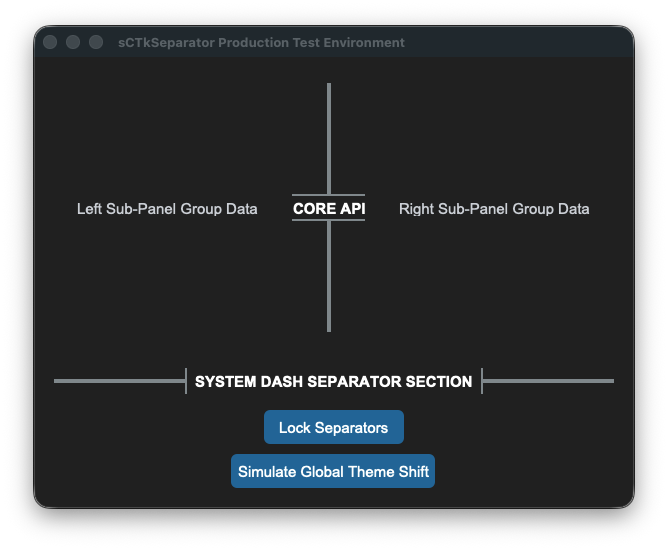
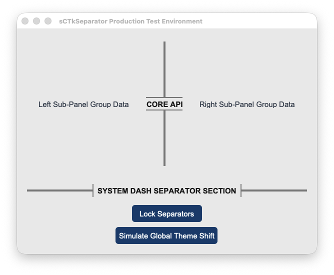

## sCTkSeparator

(Derived from Selector class by Fastattack, 2024. This widget was made available to the community via the MIT License. Source Repository: [MoreCustomTkinterWidgets](https://github.com) )

### Table of Contents
* [System Architecture Overview](#system-architecture-overview)
* [API Property Reference](#api-property-reference)
* [Centralized Stylesheet Setup](#centralized-stylesheet-setup-sctkthemesjson)
* [Layout Manager Integration](#layout-manager-integration)
* [Pygubu Designer Properties Guide](#pygubu-designer-properties-guide)
* [Implementation Example & Test Harness](#implementation-example--test-harness)

---

The *sCTkSeparator* is an advanced, themeable divider widget for CustomTkinter. It provides dynamic scaling via layout managers, vector-drawn customizable corner radiuses, dashed/dotted line styles, and automated line-splitting centered section text headers with bounding capsule brackets.

--- 





### System Architecture Overview

The component functions as a structural vector drawing lane subclassed from `ctk.CTkBaseClass`. Rather than forcing a static line width or texture file, it wraps a native Tkinter canvas object to paint partitions programmatically.

The visual update matrix implements two important enhancements:
1. **Dynamic Layout Dimension Adapters**: To prevent text characters from clipping, the instantiation block monitors initialization properties. If text section banners are provided, the widget automatically stretches its bounding frame vertical or horizontal thickness out to `28px` to give text canvas regions clear physical space while leaving the split line itself perfectly thin.
2. **Skin Preference Broadcaster Interceptor**: Features an explicit `_set_appearance_mode` connection loop. This forces text header strings, dashed patterns, and line fills to recalculate active palettes instantly during global theme swaps without any pixel lag.

---

### API Property Reference

| Property Name | Data Type | Default Value | Description |
| :--- | :--- | :--- | :--- |
| `master` | `any` | *Required* | Parent container instance (e.g., `sCTkFrame` or `ctk.CTk`). |
| `length` | `int` | `100` | The total span length of the line track in pixels (corresponds to widget height if vertical, width if horizontal). |
| `width` | `float` | `4` | The visual thickness profile of the divider line in pixels. |
| `corner_radius` | `int` or `None` | `6` (from theme) | Defines roundness sharpness of divider line endpoints (defaults to stylesheet configuration). |
| `orientation` | `str` | `"vertical"` | Sets spatial directional positioning alignment. Accepts `"vertical"` or `"horizontal"`. |
| `text` | `str` | `""` | Appends a centered section header label text directly inside a computed line split zone. |
| `font` | `tuple` or `CTkFont` | `("Arial", 11, "bold")` | Text font profile style parameters for the embedded header tag. |
| `text_color` | `str` or `Tuple[str, str]` | Central theme default | Font hex palette token string mapping. Supports appearance mode tuples. |
| `dash` | `tuple` or `None` | `None` | Integer stroke sequence array tuple mapping out dashed/dotted rendering rules (e.g., `(5, 5)`). |

---

### Centralized Stylesheet Setup (`sCTkThemes.json`)

The component queries your centralized theme sheet profile matrix using standard `self._resolve_color()` lookup calls, ensuring that indicator dots and canvas borders translate colors smoothly across appearance updates.

To satisfy the framework configuration guidelines, ensure your theme matrix includes this structured asset block:

```json
{
    "sCTkSeparator": {
        "fg_color": ["#808080", "#8A9296"],
        "bg_color": "transparent",
        "corner_radius": 6,
        "font": ["Arial", 11, "bold"],
        "text_color": ["#1A1A1A", "#FFFFFF"],
        "disabled_map": {
            "fg_color": ["#CBD5E1", "#475569"],
            "text_color": ["#94A3B8", "gray50"]
        }
    }
}
```
### Layout Manager Integration

Mixing layout manager tracking loops within the same immediate frame layer is completely blocked. When handling automated expansion parameters across scaling monitor resolutions, enforce the following geometry behaviors:

#### Grid Configurations (`.grid()`)
* **Horizontal Mode Line**: Must use **`sticky="ew"`** to allow the vector path to grow horizontally.
* **Vertical Mode Line**: Must use **`sticky="nswe"`** to stretch across columns and rows evenly without crushing string lines.
* **Parent Frame Setup**: The container frame track columns/rows **must** have their weights configured to let the engine allocate expanding window real estate:
  ```python
  # Column 0 and Column 2 hold widgets and expand; Column 1 isolates the separator line track
  grid_Frame.grid_columnconfigure(0, weight=1)
  grid_Frame.grid_columnconfigure(1, weight=1)
  grid_Frame.grid_columnconfigure(2, weight=1)
  ```

#### Pack Configurations (`.pack()`)
* **Horizontal Mode Line**: Must use **`fill="x"`** alongside `expand=False` so it hugs adjacent frames tightly instead of expanding into empty background rows.
* **Vertical Mode Line**: Must use **`fill="y"`** inside layout columns.

---

### Pygubu Designer Properties Guide

When configuring layouts visually within the Pygubu Designer editing workspace panel strip, observe these property formatting rules:

1. **`orientation`**: Select `vertical` or `horizontal` from the choice dropdown list pane. The preview canvas will immediately adjust orientations without flattening.
2. **`text`**: Type any section title banner sequence string directly into the entry field (e.g., `AUDIO CONTROLS`). The line will cleanly break around the text boundaries.
3. **`dash`**: Enter raw comma-separated lists of numerical values directly into the input strip **without using quote symbols or brackets**.
   * Type `5,5` for standard clean dash blocks.
   * Type `2,6` for clean dotted layout maps.
   * Leave blank or type `None` to restore solid rounded vector shapes.

---

### Implementation Example & Test Harness

Below is a complete, self-contained test execution script demonstrating how to layout horizontal, vertical, and dashed separators inside an interactive telemetry deck panel while exercising lock states and skin sweeps.

```python
#!/usr/bin/python3
# =====================================================================
# 🛠️ TESTING HARNESS IMPORTS & SETUP for Separator
# =====================================================================

import customtkinter as ctk
from scustomtkinter import sCTkFrame, sCTkButtonPrimary, sCTkLabelSecondary, sCTk, sCTkSeparator

if __name__ == "__main__":
    root = sCTk()
    root.title("sCTkSeparator Production Test Environment")
    root.geometry("600x450")

    grid_Frame = sCTkFrame(root)
    grid_Frame.pack(side="top", fill="both", expand=True, padx=20, pady=15)
    grid_Frame.grid_columnconfigure(0, weight=1); grid_Frame.grid_columnconfigure(1, weight=1); grid_Frame.grid_columnconfigure(2, weight=1); grid_Frame.grid_rowconfigure(0, weight=1)

    lbl_left = sCTkLabelSecondary(grid_Frame, text="Left Sub-Panel Group Data")
    lbl_left.grid(row=0, column=0, sticky="nswe")

    sep_vertical_text = sCTkSeparator(grid_Frame, orientation="vertical", text="CORE API", width=4)
    sep_vertical_text.grid(row=0, column=1, sticky="nswe", padx=10, pady=10)

    lbl_right = sCTkLabelSecondary(grid_Frame, text="Right Sub-Panel Group Data")
    lbl_right.grid(row=0, column=2, sticky="nswe")

    sep_horizontal_text = sCTkSeparator(root, orientation="horizontal", text="SYSTEM DASH SEPARATOR SECTION", width=4)
    sep_horizontal_text.pack(side="top", fill="x", padx=20, pady=10)

    def toggle_separator_lock():
        target = "disabled" if sep_vertical_text.get_state() == "normal" else "normal"
        sep_vertical_text.configure(state=target)
        sep_horizontal_text.configure(state=target)
        btn_lock.configure(text="Lock Separators" if target == "normal" else "Unlock Separators")

    def toggle_skin_mode():
        current_skin = ctk.get_appearance_mode()
        ctk.set_appearance_mode("Light" if current_skin == "Dark" else "Dark")

    btn_lock = sCTkButtonPrimary(root, text="Lock Separators", command=toggle_separator_lock)
    btn_lock.pack(pady=5)
    btn_theme = sCTkButtonPrimary(root, text="Simulate Global Theme Shift", command=toggle_skin_mode)
    btn_theme.pack(pady=(5, 20))

    root.mainloop()
```

[Return to Table of Contents](#contents)
