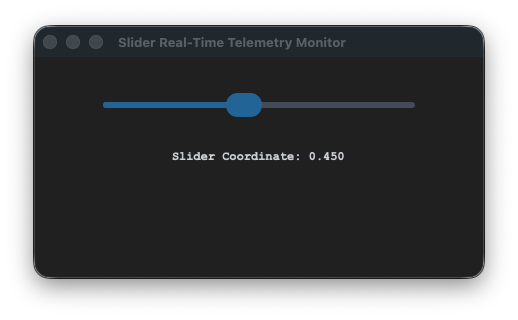

# sCTkSlider

Standardized live track calibration adjustment slider providing real-time data value interception, disabled layout mapping overrides, and multi-zone Pygubu designer compatibility.





---

## 🎨 Centralized Stylesheet Setup (`themes.json`)

To drive linear progress track filling and custom knob coordinate handle styles accurately across both look preference sweeps, ensure your centralized theme profile file includes this exact element block:

```json
{
    "sCTkSlider": {
        "fg_color": ["#E2E8F0", "#4B5563"],
        "progress_color": ["#2471A3", "#3B8ED0"],
        "button_color": ["#1A4375", "#1F6AA5"],
        "button_hover_color": ["#112A4B", "#194A7A"],
        "disabled_map": {
            "fg_color": ["#CBD5E1", "#374151"],
            "progress_color": ["#94A3B8", "#4B5563"],
            "button_color": ["#94A3B8", "#4B5563"]
        }
    }
}
```

---

## ⚙️ Public API Methods Reference

| Method Name | Arguments | Return Type | Description |
| :--- | :--- | :--- | :--- |
| `state(mode)` | `mode: str (Optional)` | `str` | Dedicated operational state manager. If empty, returns the current active state (`'normal'` or `'disabled'`). If passed, shifts tracking map parameters and cleanly freezes/unfreezes input handle loops. |
| `get_state()` | `None` | `str` | Explicit state tracking query synchronized with framework validation benchmarks. |
| `set(value)` | `value: float` | `None` | Manually positions the tracking slider handle directly onto a specific floating-point decimal location coordinate. |
| `cget(attribute)` | `attribute: str` | `Any` | Intercept shield layer that safely queries current active arguments from native CustomTkinter property arrays. |

---

## 💻 Implementation Code Template

```python
#!/usr/bin/python3
# =====================================================================
# 🛠️ TESTING HARNESS IMPORTS & SETUP for Slider
# =====================================================================

import customtkinter as ctk
from scustomtkinter import sCTkFrame, sCTkLabelSecondary, sCTk, sCTkSlider

if __name__ == "__main__":

    root = sCTk()
    root.geometry("450x220")
    root.title("Slider Real-Time Telemetry Monitor")

    base = sCTkFrame(root)
    base.pack(expand=True, fill="both", padx=20, pady=20)

    lbl_telemetry = sCTkLabelSecondary(base, text="Slider Coordinate: 0.450", font=("Courier New", 12, "bold"))

    widget = sCTkSlider(base)
    widget.configure(command=lambda val: lbl_telemetry.configure(text=f"Slider Coordinate: {val:.3f}"))
    widget.pack(expand=False, fill="x", padx=40, pady=15)
    widget.set(0.450)
    lbl_telemetry.pack(pady=10)

    # Verify look states transition flawlessly on the console
    widget.state("disabled")
    print("--- DISABLED PASS ---")
    print("state (Disabled Pass) =", widget.get_state())

    widget.state("normal")
    print("\n--- NORMAL PASS ---")
    print("state (Normal Pass)   =", widget.get_state())

    root.mainloop()
```
