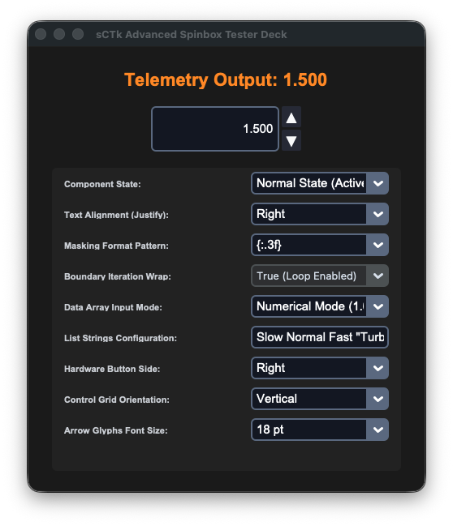
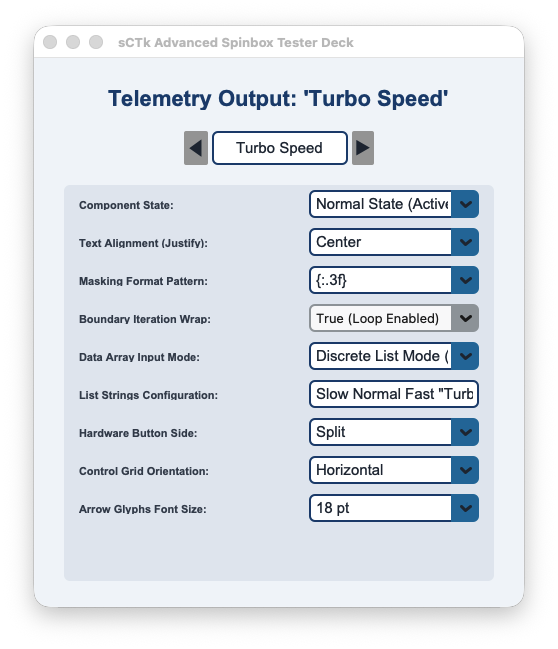

## sCTkSpinbox

The `sCTkSpinbox` is a highly configurable, theme-compliant custom spinbox wrapper widget. It extends `ctk.CTkFrame` and aggregates an internal `sCTkEntryPrimary` alongside two flanking or stacked directional button controls. The component dynamically supports two operational tracking modes: standard numerical incrementation step ranges, and discrete string text array index navigation. Like all sCTk widgets, it is fully theme-adaptive.






<a name="contents"></a>
### 📍 Table of Contents
* [API Constructor Reference](#constructor)
* [Custom Keyword Extensions (**kw)](#extensions)
* [Global Object Instance Methods](#methods)
* [Centralized Stylesheet Integration](#stylesheet)
* [Implementation Reference Template](#template)

---

<a name="constructor"></a>
### 📋 API Constructor Reference

```python
sCTkSpinbox(master=None, from_=0.0, to=100.0, step_size=1.0, command=None, state="normal", wrap=False, justify="left", show=None, placeholder_text=None, exportselection=True, width=140, height=32, **kw)
```

| Parameter Name | Data Type | Default Value | Description |
| :--- | :--- | :--- | :--- |
| `master` | `any` | `None` | Reference pointer tracking your root window or parent layout layer capsule container. |
| `from_` | `float` | `0.0` | The lower numerical limit boundary representing the floor of your adjustment range. |
| `to` | `float` | `100.0` | The upper numerical limit boundary representing the ceiling of your adjustment range. |
| `step_size` | `float` | `1.0` | The exact mathematical offset added or subtracted from your tracking float on every button click. |
| `command` | `callable` | `None` | Optional event logging callback function executed instantly on text shifts, passing the active value. |
| `state` | `str` | `"normal"` | Execution state controller. Toggling to `"disabled"` dampens and locks out all inputs and arrows. |
| `wrap` | `bool` | `False` | Mechanical boundary iteration loop flag. When `True`, stepping past limits wraps around to alternative poles. |
| `justify` | `str` | `"left"` | Content text arrangement alignment tracking mask within the entry area. Options: `"left"`, `"center"`, `"right"`. |
| `show` | `str` | `None` | Character masking input indicator string sequence (e.g. `show="*"` for password entries). |
| `placeholder_text` | `str` | `None` | Faded background prompt text block displayed natively whenever the input cell field is completely empty. |
| `exportselection` | `bool` | `True` | Standard Tkinter selection clipboard persistence state identifier switch. |
| `width` | `int` | `140` | Manual hardware panel horizontal width layout footprint dimension measured in pixels. |
| `height` | `int` | `32` | Manual hardware panel vertical height layout footprint dimension measured in pixels. |

---

<a name="extensions"></a>
### 🛠️ Custom Keyword Extensions (`**kw`)
These exclusive configuration parameters override default geometry behaviors, resolve theme definitions, and style proportions dynamically:

| Extension Parameter | Data Type | Default Value | Description |
| :--- | :--- | :--- | :--- |
| `button_width` | `int` | `22` | The horizontal width tracking measurement assigned to increment/decrement button frames in pixels. |
| `button_height` | `int` | `None` | The vertical button height. If `None`, scales automatically based on active grid parameters. |
| `button_side` | `str` | `"right"` | Hardware control grid positioning side anchor layout. Options: `"right"`, `"left"`, `"split"`. |
| `orientation` | `str` | `"vertical"` | Structural grid layout arrangement axis profile track. Options: `"vertical"`, `"horizontal"`. |
| `arrow_font_size` | `int` | `11` | Typography scaling rule explicitly defining point sizes for the raw directional glyph markings inside Pygubu. |
| `format` | `str` | `""` | Numerical formatting mask specifier string rule (supports C percent styles `%.3f` or bracket masks `{:.3f}`). |
| `values` | `str` / `list` | `None` | Literal input values array string loader. Setting choices converts your widget into Discrete Text List Mode. |

---

<a name="methods"></a>
### ⚡ Global Object Instance Methods

#### Programmatically Set Value Elements
```python
# Insert a distinct float, integer, or matching list mode text option string natively
spinbox.set(12.5)
```

#### Fetch Active Value Strings
```python
# Reaches into the data entry track, pulling back the active string layout contents
current_selection = spinbox.get()
```

#### Discrete Values Array Loader Shortcut
```python
# Programmatically inject custom space-separated lines or list records on the fly
spinbox.set_values('Slow Normal Fast "Turbo Speed" Max')
```

#### Layout Parameter Configuration Modifier
```python
# Updates interactive structural layouts or boundaries cleanly without layout recreation overhead
spinbox.configure(orientation="horizontal", button_side="split", arrow_font_size=14, wrap=True)
```

#### Advanced Sub-Component Style Targeting
If an explicit overrides requirement arises at runtime that bypasses the compiled stylesheet definitions, you can directly interact with the isolated increment/decrement components safely without initialization crashes:
```python
# Manually altering internal button typography fonts or text strings at runtime safely
spinbox.up_button.configure(font=("Arial", 10, "normal"))   # Increment button control instance
spinbox.down_button.configure(font=("Arial", 10, "normal")) # Decrement button control instance
```

---

<a name="stylesheet"></a>
### 🎨 Centralized Stylesheet Integration (`sCTkThemes.json`)

The widget relies heavily on direct index key lookups within your central styling map profile matrix. The component automatically feeds state updates down to your nested `sCTkEntryPrimary` instance, cascading text dimming transitions natively.

```json
{
    "sCTkSpinbox": {
        "font": ["Arial", 15, "normal"],
        "arrow_font_size": 11,
        "arrow_up_char": "▲",
        "arrow_down_char": "▼",
        "arrow_right_char": "▶",
        "arrow_left_char": "◀",
        "format": "%.2f",
        "border_width": 1.5,
        "corner_radius": 6,
        
        "entry_color": ["#FFFFFF", "#111827"],
        "border_color": ["#1A4375", "#64748B"],
        "text_color": ["#1F2937", "#F9FAFB"],
        "placeholder_text_color": ["#5A6E7F", "#526071"],
        "button_color": ["#9E9E9E", "#2A2F3D"],
        "button_hover_color": ["#7D7D7D", "#374151"],

        "disabled_map": {
            "entry_color": ["#F3F4F6", "#1F2937"],
            "border_color": ["#CBD5E1", "#475569"],
            "text_color": ["#94A3B8", "#64748B"],
            "button_color": ["#CBD5E1", "#334155"]
        }
    }
}
```

---

<a name="template"></a>
### 💻 Implementation Reference Template

```python
#!/usr/bin/python3
# =====================================================================
# 🛠️ TESTING HARNESS IMPORTS & SETUP for Spinbox
# =====================================================================

import customtkinter as ctk
from scustomtkinter import sCTkFrame, sCTkComboBox, sCTkLabelSecondary, sCTkEntryPrimary, sCTk, sCTkSpinbox


if __name__ == "__main__":

    app = sCTk()
    app.title("sCTk Advanced Spinbox Tester Deck")
    app.geometry("490x740")
    app.configure(fg_color=("#F1F5F9", "#1C1C1C"))

    def on_spinbox_value_changed(val):
        if isinstance(val, float): vfo_readout.configure(text=f"Telemetry Output: {val:.3f}")
        else: vfo_readout.configure(text=f"Telemetry Output: '{str(val)}'")

    dashboard_panel = sCTkFrame(app, fg_color="transparent", border_width=0)
    dashboard_panel.pack(padx=25, pady=15, fill="both", expand=True)

    vfo_readout = sCTkLabelSecondary(dashboard_panel, text="Telemetry Output: Initializing...", font=("Arial", 22, "bold"), text_color=("#1A4375", "#FF9100"))
    vfo_readout.pack(pady=10)

    spinbox = sCTkSpinbox(dashboard_panel, from_=1.0, to=50.0, step_size=0.5, wrap=True, justify="center", placeholder_text="Click Me", command=on_spinbox_value_changed, width=180, height=34)
    spinbox.pack(pady=10)

    control_frame = sCTkFrame(dashboard_panel, fg_color=("#E2E8F0", "#262626"), corner_radius=6)
    control_frame.pack(fill="both", expand=True, padx=5, pady=10)
    control_frame.grid_columnconfigure(0, weight=1); control_frame.grid_columnconfigure(1, weight=1)

    lbl_state = sCTkLabelSecondary(control_frame, text="Component State:", font=("Arial", 11, "bold"))
    lbl_state.grid(row=0, column=0, padx=15, pady=5, sticky="w")
    state_dropdown = sCTkComboBox(control_frame, values=["Normal State (Active)", "Disabled State (Locked)"], command=lambda choice: spinbox.configure(state="disabled" if "Disabled" in choice else "normal"), width=170)
    state_dropdown.grid(row=0, column=1, padx=15, pady=5, sticky="e"); state_dropdown.set("Normal State (Active)")

    lbl_justify = sCTkLabelSecondary(control_frame, text="Text Alignment (Justify):", font=("Arial", 11, "bold"))
    lbl_justify.grid(row=1, column=0, padx=15, pady=5, sticky="w")
    justify_dropdown = sCTkComboBox(control_frame, values=["Center", "Left", "Right"], command=lambda choice: spinbox.configure(justify=choice.lower()), width=170)
    justify_dropdown.grid(row=1, column=1, padx=15, pady=5, sticky="e"); justify_dropdown.set("Center")

    lbl_format = sCTkLabelSecondary(control_frame, text="Masking Format Pattern:", font=("Arial", 11, "bold"))
    lbl_format.grid(row=2, column=0, padx=15, pady=5, sticky="w")
    format_dropdown = sCTkComboBox(control_frame, values=["None (Default)", "%.1f kHz", "{:.2f}", "{:.3f}"], command=lambda choice: spinbox.configure(format={"%.1f kHz": "%.1f kHz", "{:.2f}": "{:.2f}", "{:.3f}": "{:.3f}", "None (Default)": ""}.get(choice, "")), width=170)
    format_dropdown.grid(row=2, column=1, padx=15, pady=5, sticky="e"); format_dropdown.set("None (Default)")

    lbl_wrap = sCTkLabelSecondary(control_frame, text="Boundary Iteration Wrap:", font=("Arial", 11, "bold"))
    lbl_wrap.grid(row=3, column=0, padx=15, pady=5, sticky="w")
    wrap_dropdown = ctk.CTkComboBox(control_frame, values=["True (Loop Enabled)", "False (Hard Limits)"], command=lambda choice: spinbox.configure(wrap=True if "True" in choice else False), width=170)
    wrap_dropdown.grid(row=3, column=1, padx=15, pady=5, sticky="e"); wrap_dropdown.set("True (Loop Enabled)")

    lbl_mode = sCTkLabelSecondary(control_frame, text="Data Array Input Mode:", font=("Arial", 11, "bold"))
    lbl_mode.grid(row=4, column=0, padx=15, pady=5, sticky="w")
    def on_mode_changed(choice):
        if "Discrete List" in choice: spinbox.set_values(txt_custom_values.get())
        else: spinbox.set_values([]); spinbox.set(5.0)
    mode_dropdown = sCTkComboBox(control_frame, values=["Numerical Mode (1.0 - 50.0)", "Discrete List Mode (Strings)"], command=on_mode_changed, width=170)
    mode_dropdown.grid(row=4, column=1, padx=15, pady=5, sticky="e"); mode_dropdown.set("Numerical Mode (1.0 - 50.0)")

    lbl_custom_vals = sCTkLabelSecondary(control_frame, text="List Strings Configuration:", font=("Arial", 11, "bold"))
    lbl_custom_vals.grid(row=5, column=0, padx=15, pady=5, sticky="w")
    txt_custom_values = sCTkEntryPrimary(control_frame, width=170, height=28, placeholder_text="Item1 'Item Two' Item3...")
    txt_custom_values.grid(row=5, column=1, padx=15, pady=5, sticky="e"); txt_custom_values.insert(0, 'Slow Normal Fast "Turbo Speed" Max')
    txt_custom_values.bind("<Return>", lambda e: spinbox.set_values(txt_custom_values.get()) if "Discrete List" in mode_dropdown.get() else None)

    lbl_side = sCTkLabelSecondary(control_frame, text="Hardware Button Side:", font=("Arial", 11, "bold"))
    lbl_side.grid(row=6, column=0, padx=15, pady=5, sticky="w")
    side_dropdown = sCTkComboBox(control_frame, values=["Right", "Left", "Split"], command=lambda choice: spinbox.configure(button_side=choice.lower()), width=170)
    side_dropdown.grid(row=6, column=1, padx=15, pady=5, sticky="e"); side_dropdown.set("Right")

    lbl_orient = sCTkLabelSecondary(control_frame, text="Control Grid Orientation:", font=("Arial", 11, "bold"))
    lbl_orient.grid(row=7, column=0, padx=15, pady=5, sticky="w")
    orient_dropdown = sCTkComboBox(control_frame, values=["Vertical", "Horizontal"], command=lambda choice: spinbox.configure(orientation=choice.lower()), width=170)
    orient_dropdown.grid(row=7, column=1, padx=15, pady=5, sticky="e"); orient_dropdown.set("Vertical")

    lbl_arrow_size = sCTkLabelSecondary(control_frame, text="Arrow Glyphs Font Size:", font=("Arial", 11, "bold"))
    lbl_arrow_size.grid(row=8, column=0, padx=15, pady=5, sticky="w")
    arrow_size_dropdown = sCTkComboBox(control_frame, values=["8 pt (Default)", "11 pt (Medium)", "14 pt (Large)", "18 pt"], command=lambda choice: spinbox.configure(arrow_font_size=int(choice.split()[0])), width=170)
    arrow_size_dropdown.grid(row=8, column=1, padx=15, pady=5, sticky="e"); arrow_size_dropdown.set("8 pt (Default)")

    app.mainloop()

```

[Return to Table of Contents](#contents)
