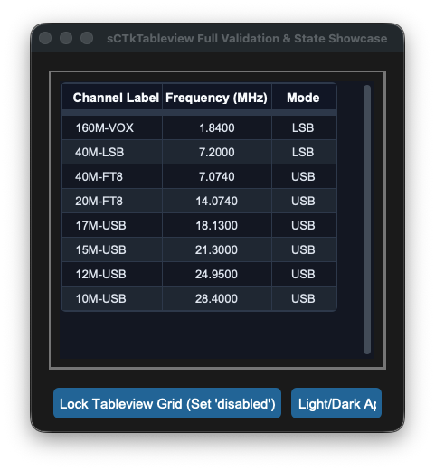
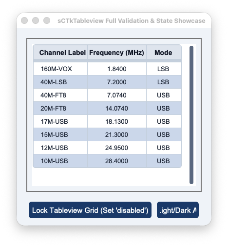

## sCTkTableview

The `sCTkTableview` is a high-performance, theme-adaptive, and interactive data grid widget engineered specifically for the `sCustomTkinter` desktop amateur radio workspace architecture. It wraps a specialized scrollable container viewport to render structured, matrix-aligned logging rows, transceiver channels, or telemetry tracking data.






<a name="contents"></a>
### 📌 Localized Table of Contents
* [API Constructor Reference](#constructor)
* [Method Resolution Order (MRO) Taxonomy](#mro-taxonomy)
* [Pygubu Workspace Property Envelopes](#pygubu-envelopes)
* [Global Object Instance Methods](#methods)
* [Centralized Stylesheet Integration](#stylesheet)
* [Implementation Reference Template](#template)

---

<a name="constructor"></a>
### 📋 API Constructor Reference

```python
table = sCTkTableview(master, columns=None, width=500, height=300, grid_mode="zebra", header_line_width=2, outline_width=1.0, outline_radius=4, state="normal", num_columns=3, num_rows=1, show_headers=True, cell_bg_color=None, cell_alt_bg_color=None, *args, **kwargs)
```

| Parameter Name | Data Type | Default Value | Description |
| :--- | :--- | :--- | :--- |
| `master` | `any` | *Required* | Reference pointer tracking your root window or parent layout container. |
| `columns` | `list` / `str` | `None` | Structured list of header strings or a raw comma-separated tracking string token payload. |
| `grid_mode` | `str` | `"zebra"` | Visual row background arrangement tracker: can accept `"grid"`, `"zebra"`, or `"none"`. |
| `header_line_width`| `int` | `2` | Dimensional vertical scale of the separating accent bar gridded underneath the header elements. |
| `outline_width` | `float` | `1.0` | Outer bounding box line size bounding the master border layout frame container. |
| `outline_radius` | `int` | `4` | Corner corner-radius roundness assigned specifically onto the bounding frame layouts. |
| `state` | `str` | `"normal"` | Initial execution state ring variable: can accept `"normal"` or `"disabled"`. |

[Go to Piece 1B of 2](#mro-taxonomy) | [Return to Table of Contents](#contents)
<a name="methods"></a>
### ⚡ Global Object Instance Methods

#### Unified State Gateway Handler
```python
# GETTER: Returns the active operational state string ('normal' or 'disabled')
current_mode = table.state()

# SETTER: Freezes grid cell edits and dynamically applies themes.json desaturation tokens
table.state("disabled")
```

#### Programmatically Apply Live Configuration Changes
```python
# Dynamically adjusts grid modes or row limits and triggers full table redraw sweeps
table.configure(grid_mode="grid", num_rows=12)
```

#### Fetch Active Operational Tracking Dimensions
```python
row_count = table.get_num_rows()       # Returns absolute gridded row limits
column_count = table.get_num_columns() # Returns true managed structural column counts
```

#### Manage Column Properties & Justification Anchors
```python
# Configures structural widths and justifies cell strings ('w', 'center', 'e') safely
table.set_column_properties(column_index=0, width=140, anchor="w")
```

#### Register Callback Intercept Listeners
```python
# Selection Listener Pass
table.bind_selection_callback(lambda r_idx, row_data: print(f"Row {r_idx} clicked: {row_data}"))

# Inline Edit Pre-Save Validator (Must return True to accept changes, or False to reject)
table.bind_validation_callback(lambda col_idx, raw_string: len(raw_input_string.strip()) > 0)

# Post-Save Commit Event Callback
table.bind_edit_callback(lambda r, c, committed_val: log.info(f"Committed cell update: {committed_val}"))
```

---

<a name="stylesheet"></a>
### 🎨 Centralized Stylesheet Integration (`sCTkThemes.json`)

To minimize repository file footprints, the component drives its cascading color passes from a single profile key block. The standard text desaturation variables, grid dividers, and zebra backgrounds align natively within a single block configuration.

```json
{
    "sCTkTableview": {
        "header_bg_color": ["#1A4375", "#1F6AA5"],
        "header_text_color": ["#FFFFFF", "#FFFFFF"],
        "header_font": ["Arial", 13, "bold"],
        "cell_bg_color": ["#FFFFFF", "#1E293B"],
        "cell_alt_bg_color": ["#F8FAFC", "#334155"],
        "cell_text_color": ["#1A1A1A", "#FFFFFF"],
        "cell_font": ["Arial", 12, "normal"],
        "grid_line_color": ["#CBD5E1", "#475569"],
        "disabled_map": {
            "header_bg_color": ["#CBD5E1", "#334155"],
            "header_text_color": ["#94A3B8", "#64748B"],
            "cell_bg_color": ["#F1F5F9", "#1F2937"],
            "cell_alt_bg_color": ["#E2E8F0", "#111827"],
            "cell_text_color": ["#94A3B8", "#64748B"],
            "grid_line_color": ["#CBD5E1", "#475569"]
        }
    }
}
```

[Go to Piece 2B of 3](#template) | [Return to Table of Contents](#contents)
<a name="template"></a>
### 💻 Implementation Reference Template

This standalone verification program demonstrates how to correctly embed the `sCTkTableview` within a parent container panel, tracking cell data inputs and state locks cleanly.

```python
#!/usr/bin/python3
# =====================================================================
# 🛠️ TESTING HARNESS IMPORTS & SETUP for Tableview
# =====================================================================

import customtkinter as ctk
from scustomtkinter import sCTkFrame, sCTkButtonPrimary, sCTkLabelPrimary, sCTk, sCTkTableview

if __name__ == "__main__":
    root = sCTk()
    root.title("sCTkTableview Full Validation & State Showcase")
    root.geometry("640x540")
    root.configure(fg_color=("#F1F5F9", "#1C1C1C"))

    # 2. Mount custom master container using framework primitives
    border_capsule = sCTkFrame(root, border_width=2)
    border_capsule.pack(padx=20, pady=20, fill="both", expand=True)

    cols = ["Channel Label", "Frequency (MHz)", "Mode", "Station Name"]

    # 3. Initialize data grid component wrapper cleanly
    table = sCTkTableview(
        border_capsule,
        columns=cols,
        grid_mode="zebra",
        header_line_width=3,
        outline_width=1.5,
        outline_radius=6,
        state="normal"
    )
    table.pack(padx=12, pady=12, fill="both", expand=True)

    # Establish proportional column dimension parameters and text anchors
    table.set_column_properties(0, width=110, anchor="w")
    table.set_column_properties(1, width=120, anchor="center")
    table.set_column_properties(2, width=70, anchor="center")
    table.set_column_properties(3, width=250, anchor="w")

    ham_stations = [
        ["160M-VOX", "1.8400", "LSB", "160m - Voice / Calling"],
        ["40M-LSB", "7.2000", "LSB", "40m - LSB Voice Calling"],
        ["40M-FT8", "7.0740", "USB", "40m - FT8 Digital Mode"],
        ["20M-FT8", "14.0740", "USB", "20m - FT8 Digital Mode"],
        ["17M-USB", "18.1300", "USB", "17m - USB Voice Calling"],
        ["15M-USB", "21.3000", "USB", "15m - USB Voice Calling"],
        ["12M-USB", "24.9500", "USB", "12m - USB Voice Calling"],
        ["10M-USB", "28.4000", "USB", "10m - Tech / General Voice"]
    ]
    table.load_dataset(ham_stations)

    # 4. Define robust cell entry constraints to filter updates safely
    def validate_table_cell_changes(column_index: int, raw_input_string: str) -> bool:
        cleaned_input = str(raw_input_string).strip()
        if column_index == 1:
            try:
                float(cleaned_input)
                return True
            except ValueError:
                return False
        if column_index == 2:
            return cleaned_input.upper() in ["LSB", "USB", "AM", "FM", "CW"]
        return len(cleaned_input) > 0

    # 5. Bind callback listeners cleanly to public forwarding hooks
    table.bind_validation_callback(validate_table_cell_changes)
    table.bind_selection_callback(lambda r, vals: print(f"📡 Clicked Row: {r} -> {vals}"))
    table.bind_edit_callback(lambda r, c, val: print(f"📝 Persistent Data Saved ({r}, {c}) -> '{val}'"))

    # =====================================================================
    # 🛠️ PANEL LAYOUT ACTION INTERCEPT CONTROLLERS
    # =====================================================================
    def toggle_grid_lock():
        """Toggles active data row selections and blocks text entry editing."""
        current_mode = table.get_state()
        target = "disabled" if current_mode == "normal" else "normal"
        table.configure(state=target)
        btn_lock.configure(text="Unlock Tableview Grid" if target == "disabled" else "Lock Tableview Grid (Set 'disabled')")
        print(f"Logged Verification Hook -> table.get_state() = {table.get_state()}")

    def toggle_skin_preference():
        """Toggles between Light and Dark interface appearance preferences."""
        ctk.set_appearance_mode("Light" if ctk.get_appearance_mode() == "Dark" else "Dark")

    # Arrange test interaction buttons horizontally across the lower tray area
    control_tray = sCTkFrame(root, fg_color="transparent")
    control_tray.pack(side="bottom", fill="x", padx=20, pady=(0, 15))

    btn_lock = sCTkButtonPrimary(control_tray, text="Lock Tableview Grid (Set 'disabled')", command=toggle_grid_lock)
    btn_lock.pack(side="left", expand=True, padx=5)

    btn_skin = sCTkButtonPrimary(control_tray, text="Toggle UI Light/Dark Appearance", command=toggle_skin_preference)
    btn_skin.pack(side="right", expand=True, padx=5)

    # table.bind_validation_callback(validate_table_cell_changes)
    # table.bind_selection_callback(lambda r, vals: print(f"📡 Clicked Row: {r} -> {vals}"))
    # table.bind_edit_callback(lambda r, c, val: print(f"📝 Persistent Data Saved ({r}, {c}) -> '{val}'"))
    # table.configure(state="disabled")

    root.mainloop()

```

[Return to Table of Contents](#contents)
