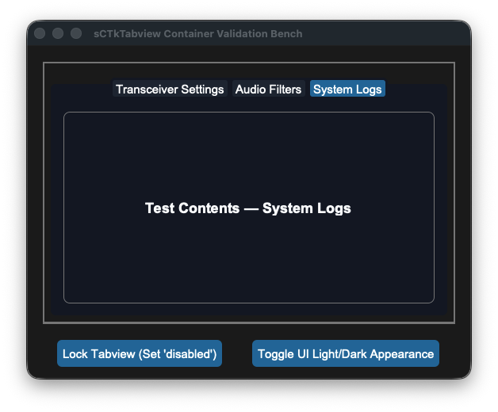
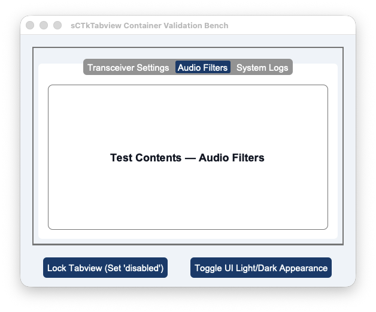

## sCTkTabview

The `sCTkTabview` is a theme-compliant custom multi-page dashboard deck container widget engineered specifically for the `sCustomTkinter` desktop amateur radio cockpit application. It inherits from `baseui.sCTkTabviewUI` and `ThemeableWidget` to manage dense workstation layouts cleanly. The component provides absolute palette rendering flexibility driven straight out of your central `themes.json` sheets, ensuring uniform text desaturation and track flattening when frozen or locked.





<a name="contents"></a>
### Localized Table of Contents
* [API Constructor Reference](#constructor)
* [Pygubu Designer Workspace Tab Insertion Rules](#pygubu-designer)
* [Programmatic Tab Creation & Content Hydration](#content-delivery)
* [Global Object Instance Methods](#methods)
* [Centralized Stylesheet Integration](#stylesheet)
* [Implementation Reference Template](#template)

---

<a name="constructor"></a>
### API Constructor Reference

```python
tabview = sCTkTabview(master=None, **kw)
```

| Parameter Name | Data Type | Default Value | Description |
| :--- | :--- | :--- | :--- |
| `master` | `any` | `None` | Reference pointer tracking your root window or parent layout container. |
| `kw` | `dict` | `None` | Optional keyword payload mapping standard configuration parameters natively down to the widget. |

---

<a name="pygubu-designer"></a>
### 🔌 Pygubu Designer Workspace Tab Insertion Rules
Because `sCTkTabview` derives its visual look from custom composite frames, nesting children within Pygubu-Designer layout pane requires strict structural adherence to CustomTkinter's native tab allocation slots to prevent immediate workspace crashes.

#### Adding Multi-Page Tabs in Pygubu-Designer
1. **Chassis Placement:** Locate the custom widget container on your workbench tree panel and place an instance of `sCTkTabview` right into your frame layout.
2. **Tab Component Selection:** In the Pygubu-Designer widget selector tree,  expand the CustomTkinter widger set and locate the native element named **`CTkTabview.Tab`** . 
3. **Parent Nesting Assignment:** Forcefully click and drop the **`CTkTabview.Tab`** element directly onto the parent `sCTkTabview` widget slot in your inspector tree layout.
4. **Repeat Allocation:** Repeat this step for each additional layout page slot you want to grid. The designer layout engine will handle the recursive preview sweeps smoothly. You can then name the tabs individually using the workspace property sidebars.

[Go to Piece 2 of 2](#content-delivery) | [Return to Table of Contents](#contents)
<a name="content-delivery"></a>
### Programmatic Tab Creation & Content Hydration
When crafting your radio console layouts natively via Python scripts, adding navigation tabs and stacking contents involves a simple three-step lifecycle lookup:

```python
# Step 1: Append a new structural landing tab track layer to the widget chassis
widget.add("Transceiver Settings")

# Step 2: Grab the native master frame viewport reference object assigned to that specific tab name
page_viewport = widget.tab("Transceiver Settings")

# Step 3: Instantiated any framework component (like an sCTkFrame capsule) by passing the viewport as its master parent!
inner_panel = sCTkFrame(page_viewport, border_width=1)
inner_panel.pack(expand=True, fill="both", padx=10, pady=10)
```

---

<a name="methods"></a>
### ⚡ Global Object Instance Methods

#### Unified State Gateway Handler
```python
# GETTER Pass: Returns the active operational state tracking string ('normal' or 'disabled')
current_mode = widget.state()

# SETTER Pass: Flattens menu headers, locks click selections, and dims text elements
widget.state("disabled")
```

---

<a name="stylesheet"></a>
### Centralized Stylesheet Integration (`sCTkThemes.json`)

```json
{
    "sCTkTabview": {
        "text_color": ["#1F2937", "#F9FAFB"],
        "font": ["Arial", 13, "bold"],
        "segmented_button_fg_color": ["#E2E8F0", "#1E293B"],
        "segmented_button_selected_color": ["#1A4375", "#1F6AA5"],
        "segmented_button_selected_hover_color": ["#15375B", "#1A5885"],
        "segmented_button_unselected_color": ["#F8FAFC", "#334155"],
        "segmented_button_unselected_hover_color": ["#E2E8F0", "#475569"],
        "disabled_map": {
            "text_color": ["#94A3B8", "#64748B"],
            "segmented_button_fg_color": ["#E5E7EB", "#334155"],
            "segmented_button_selected_color": ["#CBD5E1", "#475569"],
            "segmented_button_unselected_color": ["#F1F5F9", "#1F2937"]
        }
    }
}
```

---

<a name="template"></a>
### 💻 Implementation Reference Template

```python
#!/usr/bin/python3
# =====================================================================
# 🛠️ TESTING HARNESS IMPORTS & SETUP for Tabview
# =====================================================================

import customtkinter as ctk
from scustomtkinter import sCTkFrame, sCTkButtonPrimary, sCTkLabelPrimary, sCTk, sCTkTabview

if __name__ == "__main__":

    root = sCTk()
    root.geometry("560x420")
    root.title("sCTkTabview Container Validation Bench")
    root.configure(fg_color=("#F1F5F9", "#1C1C1C"))

    # 2. Mount custom master backplane frame capsule container
    base = sCTkFrame(root, border_width=2)
    base.pack(expand=True, fill="both", padx=20, pady=20)

    # 3. Instantiate our custom multi-page tab container widget cleanly
    widget = sCTkTabview(base)
    widget.pack(expand=True, fill="both", padx=10, pady=10)

    # Define our targeted operational dashboard page labels string array
    tab_pages = ["Transceiver Settings", "Audio Filters", "System Logs"]

    # 4. NESTED TAB FRAME GENERATION PASS:
    # Loops through the strings, adds the tabs, and nests an sCTkFrame containing
    # an sCTkLabelPrimary placeholder inside every viewport page cleanly!
    for page_name in tab_pages:
        # Add the structural landing track tab layer to the widget chassis
        widget.add(page_name)

        # Grab the native container reference object assigned to this specific tab page
        page_viewport = widget.tab(page_name)

        # Mount an inner sCTkFrame container capsule to pad out the sub-tab view workspace
        inner_frame = sCTkFrame(page_viewport, border_width=1, corner_radius=8)
        inner_frame.pack(expand=True, fill="both", padx=10, pady=10)

        # Drop a high-visibility sCTkLabelPrimary component right in the center slot of the sub-frame
        test_label = sCTkLabelPrimary(inner_frame, text=f"Test Contents — {page_name}")
        test_label.pack(expand=True, fill="none", padx=20, pady=20)


    # =====================================================================
    # 🛠️ INTERACTIVE BENCH OPERATION CONTROLLERS
    # =====================================================================
    def toggle_tab_lock():
        """Toggles active data page switches and flattens tab button fills."""
        current = widget.state()
        target = "disabled" if current == "normal" else "normal"
        widget.state(target)
        btn_lock.configure(
            text="Unlock Tabview Navigation" if target == "disabled" else "Lock Tabview (Set 'disabled')")
        print(f"Logged State Verification Hook -> widget.state() = {widget.state()}")


    def toggle_skin_preference():
        """Toggles between Light and Dark interface appearance preferences."""
        ctk.set_appearance_mode("Light" if ctk.get_appearance_mode() == "Dark" else "Dark")


    # Arrange test interaction buttons horizontally across the lower tray tray area
    control_tray = sCTkFrame(root, fg_color="transparent")
    control_tray.pack(side="bottom", fill="x", padx=20, pady=(0, 15))

    btn_lock = sCTkButtonPrimary(control_tray, text="Lock Tabview (Set 'disabled')", command=toggle_tab_lock)
    btn_lock.pack(side="left", expand=True, padx=5)

    btn_skin = sCTkButtonPrimary(control_tray, text="Toggle UI Light/Dark Appearance", command=toggle_skin_preference)
    btn_skin.pack(side="right", expand=True, padx=5)

    root.mainloop()


```

[Return to Table of Contents](#contents)
