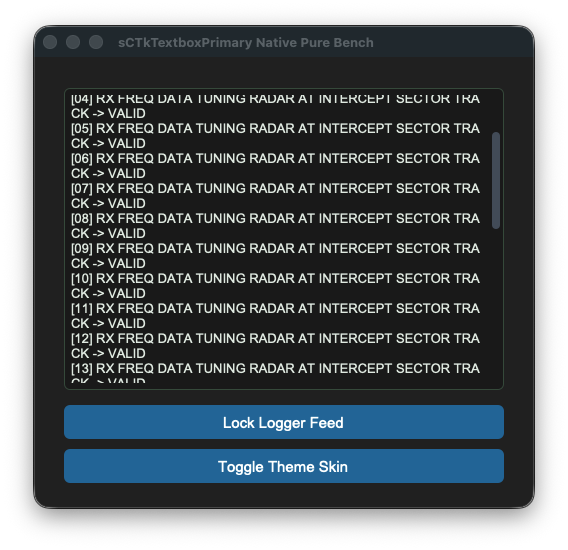

# sCTkTextboxPrimary

A dominant theme-compliant messaging and logging terminal console wrapper that inherits natively from `customtkinter.CTkTextbox`. It implements a specialized sequential order of operations pass to enforce native, zero-leak read-only locks while completely preventing CustomTkinter's native disabled appearance mode freezes.





## Core Features
*   **Native Read-Only Lockout**: Leverages CustomTkinter's native text buffer lockout states when disabled to provide a secure, native typing and text insertion freeze.
*   **Standard Viewport Accessibility**: Leaves mouse wheel scrolling tracks and high-precision macOS trackpad touch gestures fully functional when locked down, matching standard native CustomTkinter behavioral layout guidelines.
*   **Sequential Repaint Engine**: Forces structural scrollbar thumb vector updates *before* applying text engine state flags, ensuring internal canvas shapes never drop theme switches or freeze their color slots when locked.
*   **ThemeableWidget Protocol Mixin**: Integrates natively with the central mixin repository layer to strip, isolate, and safely process custom Pygubu keywords (`translator`, `on_first_object_cb`, `image_loader`, `data_pool`) on startup, preventing constructor crashes.
*   **Automated Asset Upgrades**: Automatically transforms raw incoming string icon file paths from Pygubu into modern vector-scaled `ctk.CTkImage` references behind the scenes.

## Public Methods

### `state(state_string: str = None) -> str`
Operational state management controller. Coordinates background desaturation colors and native input locks safely.
*   **Arguments**: 
    *   `state_string` (*str*, optional): The target state to enforce (`"normal"` or `"disabled"`). If omitted, returns the active virtual configuration tracker state.
*   **Returns**: The active operational state tracking string.

### `configure(*args, **kwargs)`
Handles both programmatic keyword modifications and Pygubu designer inspector positional dictionary queries safely. Automatically populates internal lifecycle handshake hooks (`_finalize_themeable_lifecycle`).

## Theme Configuration Matrix (`themes.json`)
```json
{
  "sCTkTextboxPrimary": {
    "fg_color": ["#FFFFFF", "#1E1E1E"],
    "border_color": ["#CBD5E1", "#3F3F46"],
    "text_color": ["#000000", "#FFFFFF"],
    "scrollbar_button_color": ["#94A3B8", "#475569"],
    "scrollbar_button_hover_color": ["#64748B", "#334155"],
    "disabled_map": {
      "fg_color": ["#F1F5F9", "#18181B"],
      "border_color": ["#E2E8F0", "#27272A"],
      "text_color": ["#64748B", "#71717A"],
      "scrollbar_button_color": ["#D1D5DB", "#374151"]
    }
  }
}
```

## Implementation Example & Test Harness

Below is a complete, self-contained interactive test execution script demonstrating how to use a `sCTkTextboxPrimary`.

```python
#!/usr/bin/python3
# =====================================================================
# 🛠️ TESTING HARNESS IMPORTS & SETUP for Textbox Primary
# =====================================================================

import customtkinter as ctk
from scustomtkinter import sCTkFrame, sCTkButtonPrimary, sCTk, sCTkTextboxPrimary


if __name__ == "__main__":

    root = sCTk()
    root.geometry("500x450")
    root.title("sCTkTextboxPrimary Native Pure Bench")

    base = sCTkFrame(root)
    base.pack(expand=True, fill="both", padx=20, pady=20)

    widget = sCTkTextboxPrimary(base)
    widget.pack(expand=True, fill="both", padx=10, pady=10)

    for i in range(30):
        widget.insert("end", f"[{i:02d}] RX FREQ DATA TUNING RADAR AT INTERCEPT SECTOR TRACK -> VALID\n")


    def toggle_logger_states():
        current_state = widget.get_state()
        target = "disabled" if current_state == "normal" else "normal"
        widget.configure(state=target)

        if target == "disabled":
            btn_toggle.configure(text="Activate Logger Feed")
            print("state (Disabled Sequence) =", widget.get_state().upper())
        else:
            btn_toggle.configure(text="Lock Logger Feed")
            print("state (Normal Sequence)   =", widget.get_state().upper())


    def toggle_appearance_skin():
        current_mode = ctk.get_appearance_mode()
        target = "Light" if current_mode == "Dark" else "Dark"
        ctk.set_appearance_mode(target)


    btn_toggle = sCTkButtonPrimary(base, text="Lock Logger Feed", command=toggle_logger_states)
    btn_toggle.pack(fill="x", padx=10, pady=5)

    btn_theme = sCTkButtonPrimary(base, text="Toggle Theme Skin", command=toggle_appearance_skin)
    btn_theme.pack(fill="x", padx=10, pady=5)

    root.mainloop()

```

[Return to Table of Contents](#contents)
