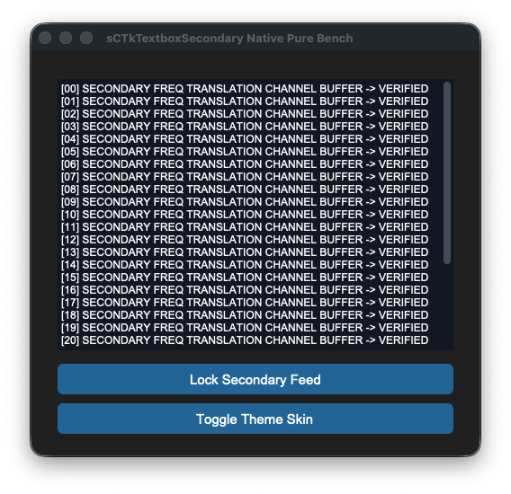
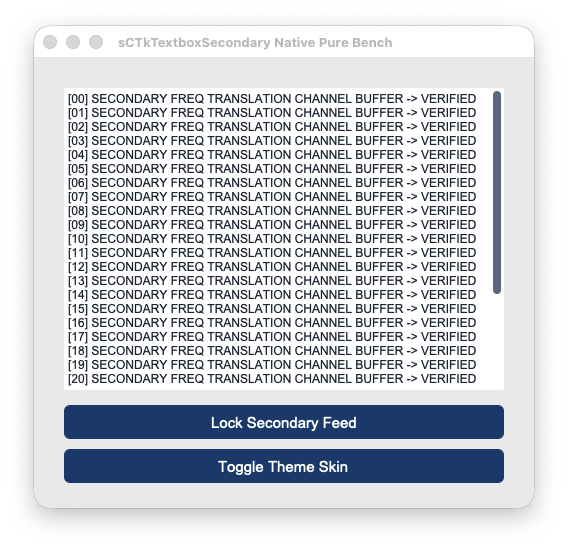

# sCTkTextboxSecondary

A custom, theme-compliant secondary logging and auxiliary console text display viewport built cleanly and natively on top of `customtkinter.CTkTextbox`. Designed to match the exact programmatic engine of the primary console, it uses sequential repaint loops to guarantee native read-only input locks without visual color freezes or text canvas truncation errors.






## Core Features
*   **Isolated Look Mappings**: Allows secondary terminal readouts and backup radio tracking data logs to manage distinct color desaturation maps separate from the primary dominant workspace console.
*   **Sequential Repaint Engine**: Synchronizes the base widget text engine and internal scroll handles natively, executing look updates first to bypass framework disabled white-out traps completely.
*   **Uninhibited Scroll Navigation**: Retains cross-platform mechanical mouse wheel and high-precision Apple Magic Mouse tracking loops across all states to ensure long-form system logs remain searchable.
*   **ThemeableWidget Protocol Mixin**: Implements multiple inheritance from the central mixin class to provide instant support for Pygubu string translations (`translator`) and object generation hooks (`on_first_object_cb`).

## Public Methods

### `state(state_string: str = None) -> str`
Operational state management controller. Coordinates background desaturation colors and typing masks safely.
*   **Arguments**: 
    *   `state_string` (*str*, optional): The target state to enforce (`"normal"` or `"disabled"`). If omitted, queries the active virtual state memory slot.
*   **Returns**: The active virtual state tracking string.

## Theme Configuration Matrix (`themes.json`)
```json
{
  "sCTkTextboxSecondary": {
    "fg_color": ["#F8FAFC", "#121214"],
    "border_color": ["#E2E8F0", "#2A2A2E"],
    "text_color": ["#0F172A", "#E2E8F0"],
    "scrollbar_button_color": ["#94A3B8", "#475569"],
    "scrollbar_button_hover_color": ["#64748B", "#334155"],
    "disabled_map": {
      "fg_color": ["#E2E8F0", "#1A1A1C"],
      "border_color": ["#CBD5E1", "#222224"],
      "text_color": ["#475569", "#8E9196"],
      "scrollbar_button_color": ["#D1D5DB", "#374151"]
    }
  }
}
```

## Implementation Example & Test Harness

Below is a complete, self-contained interactive test execution script demonstrating how to use a `sCTkTextboxSecondary`.

```python
#!/usr/bin/python3
# =====================================================================
# 🛠️ TESTING HARNESS IMPORTS & SETUP for Textbox Secondary
# =====================================================================

import customtkinter as ctk
from scustomtkinter import sCTkFrame, sCTkButtonPrimary, sCTk, sCTkTextboxSecondary

if __name__ == "__main__":

    root = sCTk()
    root.geometry("500x450")
    root.title("sCTkTextboxSecondary Native Pure Bench")

    base = sCTkFrame(root)
    base.pack(expand=True, fill="both", padx=20, pady=20)

    widget = sCTkTextboxSecondary(base)
    widget.pack(expand=True, fill="both", padx=10, pady=10)

    for i in range(30):
        widget.insert("end", f"[{i:02d}] SECONDARY FREQ TRANSLATION CHANNEL BUFFER -> VERIFIED\n")


    def toggle_logger_states():
        current_state = widget.get_state()
        target = "disabled" if current_state == "normal" else "normal"
        widget.configure(state=target)

        if target == "disabled":
            btn_toggle.configure(text="Activate Secondary Feed")
        else:
            btn_toggle.configure(text="Lock Secondary Feed")


    def toggle_appearance_skin():
        current_mode = ctk.get_appearance_mode()
        target = "Light" if current_mode == "Dark" else "Dark"
        ctk.set_appearance_mode(target)


    btn_toggle = sCTkButtonPrimary(base, text="Lock Secondary Feed", command=toggle_logger_states)
    btn_toggle.pack(fill="x", padx=10, pady=5)

    btn_theme = sCTkButtonPrimary(base, text="Toggle Theme Skin", command=toggle_appearance_skin)
    btn_theme.pack(fill="x", padx=10, pady=5)

    root.mainloop()

```

[Return to Table of Contents](#contents)
