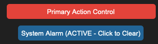
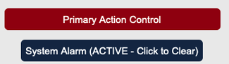

## sCTkButtonPrimary

### Table of Contents
* [Overview](#overview)
* [Constructor](#constructor)
* [Methods](#methods)
* [Theming (sCTkThemes.json)](#theming-sctkthemesjson)
* [Example](#example)
* [Known Limitations](#known-limitations)

---

### Overview

`sCTkButtonPrimary` is a themeable subclass of `customtkinter.CTkButton` — the most prominent of the library's three button tiers (see also `sCTkButtonSecondary`, `sCTkButtonTertiary`). It adds automatic light/dark theme resolution from `sCTkThemes.json`, a four-state visual model (not just enabled/disabled, but also pressed and alarm), and Pygubu Designer property introspection.

  &emsp; &emsp; &emsp; &emsp;
  

---

### Constructor

```python
sCTkButtonPrimary(master=None, **kwargs)
```

| Parameter | Type | Default | Description |
|---|---|---|---|
| `master` | widget | `None` | Parent container. |
| `**kwargs` | — | — | Any native `CTkButton` argument (e.g. `text`, `command`, `width`, `height`, `font`, `corner_radius`), or an override for one of the theme keys listed under [Theming](#theming-sctkthemesjson). Anything not supplied falls back to the `sCTkButtonPrimary` block of `sCTkThemes.json`. Unlike `sCTkComboBox`/`sCTkSegmentedButton`, there's no special extraction step here — `command` and every other native argument flow straight through to construction. |

```python
save_button = sCTkButtonPrimary(
    master=control_panel,
    text="Save Changes",
    command=on_save_clicked,
)
save_button.pack(fill="x", padx=40, pady=10)
```

---

### Methods

| Method | Returns | Description |
|---|---|---|
| `state(mode=None)` | `str` | Gets or sets the widget's enabled/disabled state. Only the literal string `"disabled"` (case-insensitive) disables it; `"normal"`, `"enabled"`, or `"active"` all enable it. Any other value matches neither branch and leaves the state unchanged (no error raised). Disabling correctly blocks both clicks and hover color changes — confirmed by direct, repeated testing. |
| `get_state()` | `str` | Equivalent to calling `state()` with no argument. |
| `set_pressed(pressed)` | `None` | Forces the visual "pressed" look on or off. No-op while disabled or while in alarm state. |
| `set_alarm_state(active)` | `None` | Forces a high-visibility warning/alarm look on or off. No-op while disabled. Turning alarm **on** clears any active "pressed" state, since alarm takes visual precedence — see [Theming](#theming-sctkthemesjson) for the full precedence order. |
| `configure(**kwargs)` / `config(**kwargs)` | varies | Standard widget configuration, plus: passing `state=...` routes to `state()` rather than the native option; calling `configure("propname")` with a single property name returns a Tkinter-style `(name, name, name, default, current)` tuple for `state`, `fg_color`, `border_color`, `text_color`, and `hover_color` — with `current` reflecting whichever state (disabled/alarm/pressed/normal) is presently active. Queries for any other single property name fall through to the native `CTkButton.configure`. |

---

### Theming (`sCTkThemes.json`)

Four visual states, not two, with a fixed precedence when more than one could apply: **disabled > alarm > pressed > normal**. Only the highest-precedence active state's colors are ever shown — e.g. a button that's both "pressed" and in "alarm" shows alarm colors, and setting alarm while pressed automatically clears the pressed flag.

- **Applied once, at construction** — every key in the widget's theme block, including `width`, `height`, `font`, and `corner_radius`, is merged with any matching keyword arguments and applied when the widget is built.
- **Re-applied on every state change** — `fg_color`, `hover_color`, `text_color`, and `border_color` are recomputed from whichever map matches the current precedence every time you call `state()`, `set_pressed()`, or `set_alarm_state()`. `border_width`, `corner_radius`, and `font` are **not** re-applied on state changes — they don't vary between states, so they're set once at construction and left alone.

```json
{
    "sCTkButtonPrimary": {
        "width": 140,
        "height": 34,
        "font": ["Arial", 15, "normal"],
        "fg_color": ["#1A4375", "#2471A3"],
        "hover_color": ["#112A4B", "#1F618D"],
        "text_color": ["#FFFFFF", "#FFFFFF"],
        "corner_radius": 6,
        "disabled_map": {
            "fg_color": ["#E5E7EB", "#374151"],
            "hover_color": ["#E5E7EB", "#374151"],
            "text_color": ["#94A3B8", "#64748B"]
        },
        "pressed_map": {
            "fg_color": ["#3B5984", "#2E4A75"],
            "hover_color": ["#3B5984", "#2E4A75"],
            "text_color": ["#FFFFFF", "#FFFFFF"]
        },
        "alarm_map": {
            "fg_color": ["#990000", "#E74C3C"],
            "hover_color": ["#990000", "#E74C3C"],
            "text_color": ["#FFFFFF", "#FFFFFF"]
        }
    }
}
```

Note there's no `border_color` anywhere in this block — this button style has no themed border by design (it's a solid-fill button). The widget checks for `border_color` in every state's color swap for consistency with the other themed widgets, but that lookup always resolves to nothing here and is simply skipped.

Colors are stored and passed through as raw `(light, dark)` tuples rather than resolved to a single value ahead of time, the same approach already confirmed working on `sCTkComboBox` and `sCTkSegmentedButton` — so they should correctly follow system/app appearance-mode changes automatically. That specific behavior hasn't been separately re-confirmed for this widget's light/dark toggle, only for its disable/enable cycle.

Disabling this button uses CustomTkinter's native `state="disabled"`, not a manual workaround — that distinction matters here specifically because an earlier version of this widget instead manually unbound mouse events while leaving the native state at `"normal"`, and that approach was directly tested and found to **not** actually block clicks. Native `state="disabled"` is what's required.

---

### Example

```python
import customtkinter as ctk
from scustomtkinter import sCTk, sCTkFrame, sCTkButtonPrimary

if __name__ == "__main__":
    root = sCTk()
    root.geometry("400x300")
    root.title("ButtonPrimary Example")

    base = sCTkFrame(root)
    base.pack(expand=True, fill="both", padx=20, pady=20)

    save_button = sCTkButtonPrimary(base, text="Save", command=lambda: print("Saved!"))
    save_button.pack(pady=10)

    def toggle_alarm():
        save_button.set_alarm_state(not save_button.is_alarm)

    alarm_toggle = sCTkButtonPrimary(base, text="Toggle Alarm Look", command=toggle_alarm)
    alarm_toggle.pack(pady=10)

    def toggle_disabled():
        target = "disabled" if save_button.get_state() == "normal" else "normal"
        save_button.state(target)
        disable_toggle.configure(text="Enable Save" if target == "disabled" else "Disable Save")

    disable_toggle = sCTkButtonPrimary(base, text="Disable Save", command=toggle_disabled)
    disable_toggle.pack(pady=10)

    root.mainloop()
```

---

### Known Limitations

- `state()` only recognizes `"disabled"` and `"normal"`/`"enabled"`/`"active"`; any other value (including typos) matches neither branch and silently leaves the state unchanged. No exception is raised.
- Calling `configure("fg_color")` (or `"border_color"`/`"text_color"`/`"hover_color"`) returns `str(value)` where `value` may itself be a `(light, dark)` tuple rather than a single resolved color — e.g. `"('#1A4375', '#2471A3')"` instead of a plain hex string. This is a known gap shared with the wider Pygubu single-argument query investigation set aside elsewhere in this project, not specific to this widget.
- Passing a positional dict to `configure()` is supported and merges into the update; a positional property-name string returns the Tkinter-style query tuple described above for five specific properties, and falls through to the native widget's `configure()` for anything else.

[Return to Table of Contents](#contents)