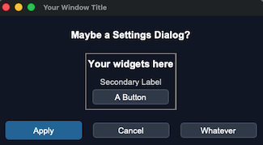
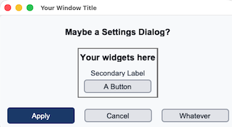

## sCTkDialog

`sCTkDialog` is a popup dialog with a consistent shape: a heading, a content area you fill, and a row of action buttons. It creates its own window, so a dialog is always a window — you don't build a `Toplevel` and put a dialog in it.




<a name="contents"></a>
### Table of Contents
* [Quick start](#quick-start)
* [Constructor](#constructor)
* [The content area](#content-area)
* [Buttons](#buttons)
* [Modality](#modality)
* [Sizing](#sizing)
* [Placement](#placement)
* [Methods](#methods)
* [Theming (sCTkThemes.json)](#theming)
* [Pygubu Designer](#pygubu)
* [Example](#example)
* [Known Limitations](#limitations)

---

<a name="quick-start"></a>
### Quick start

```python
dialog = sCTkDialog(self, title="Station Settings", heading="Transceiver")

sCTkEntryPrimary(dialog.contentFrame).pack(padx=20, pady=10)

dialog.set_apply_button(button_command=self.save_settings)
dialog.run_and_wait()
```

Content goes into `contentFrame`. The window, the heading and the button row are already there.

---

<a name="constructor"></a>
### Constructor

```python
sCTkDialog(master=None, *, title=None, width=None, height=None,
           locate_over=None, offset_x=40, offset_y=40, modal=False,
           transient=True, heading="Heading Title", heading_anchor="center",
           heading_font=None, heading_color=None, buttons=3,
           apply_text="Apply", cancel_text="Cancel", reset_text="Reset",
           apply_command=None, cancel_command=None, reset_command=None,
           toplevel=None, **kw)
```

| Parameter | Type | Default | Description |
| :--- | :--- | :--- | :--- |
| `master` | widget | `None` | Parent widget. Also the default for `locate_over`. |
| `title` | `str` | `None` | Window title bar text. |
| `width` / `height` | `int` | `None` | WINDOW size in pixels. Omit to size to content, subject to a 320x180 floor. These size the window, not the frame — the frame fills its window, so its own dimensions would have no effect. `configure()` and `cget()` treat them the same way. |
| `locate_over` | widget | `None` | The window to appear over. Defaults to `master`'s own toplevel — see [Placement](#placement). |
| `offset_x` / `offset_y` | `int` | `40` | Pixels right of and below `locate_over`'s top-left corner. |
| `modal` | `bool` | `False` | Block interaction with the rest of the application — see [Modality](#modality). |
| `transient` | `bool` | `True` | Tie the window to its parent for the window manager. |
| `heading` | `str` | `"Heading Title"` | Text above the content area. |
| `heading_anchor` | `str` | `"center"` | `"w"`, `"e"` or `"center"`. |
| `heading_font` | tuple | `None` | Overrides the theme's `heading_font` for this dialog. |
| `heading_color` | color | `None` | Overrides the theme's `text_color` for the heading. |
| `buttons` | `int` | `3` | How many action buttons — see [Buttons](#buttons). |
| `apply_text` / `cancel_text` / `reset_text` | `str` | `"Apply"` / `"Cancel"` / `"Reset"` | Button labels. |
| `apply_command` / `cancel_command` / `reset_command` | callable | `None` | Click callbacks. |
| `toplevel` | window | `None` | An existing window to use instead of creating one. Rarely needed. |

---

<a name="content-area"></a>
### The content area

`contentFrame` is where your widgets go. It sits between the heading and the button row and expands to fill whatever space is left.

```python
dialog = sCTkDialog(self, title="Filters")

grid = sCTkFrame(dialog.contentFrame)
grid.pack(expand=True, fill="both", padx=20, pady=10)
```

The dialog itself is an `sCTkFrame`, so packing widgets into the dialog rather than into `contentFrame` puts them beside the heading and buttons instead of between them. In Pygubu Designer this can't go wrong — widgets dropped onto a dialog land in `contentFrame` automatically.

---

<a name="buttons"></a>
### Buttons

`buttons` selects how many the dialog shows:

| Value | Buttons |
| :--- | :--- |
| `3` (default) | Apply, Cancel, Reset |
| `2` | Apply, Cancel |
| `1` | Apply |

**Apply is always present.** A dialog with no way to accept is a message box; use [`sCTkMessagebox`](sCTkMessagebox.md) for that.

Buttons that weren't requested are **never created**, and their attributes are `None` rather than undefined:

```python
dialog = sCTkDialog(self, buttons=2)
dialog.reset_Button          # None, not AttributeError
dialog.has_button("reset")   # False
```

Use `has_button()` rather than testing the attribute directly — it also handles a button removed later by `set_two_button()`.

Each button gets its callback from the constructor, or from the corresponding overridable method:

```python
class SettingsDialog(sCTkDialog):
    def apply_CB(self):
        save()
        self.dialog_close()

    def cancel_CB(self):
        self.dialog_close()
```

A callback passed to the constructor takes precedence over the method. Both work; the methods suit a subclass, the constructor arguments suit a dialog built inline.

**Changing the count destroys and rebuilds the row.** `set_buttons()` can't add a button that was never created, so it rebuilds. Labels and commands survive, because they're recorded on the dialog rather than only on the widgets.

---

<a name="modality"></a>
### Modality

Two different things, easily confused:

**`modal=True`** blocks *interaction*. The rest of the application stops responding to the mouse and keyboard while the dialog is open, but your code carries on running.

**`run_and_wait()`** blocks *execution* as well. The calling code stops at that line until the dialog closes.

```python
dialog = sCTkDialog(self, title="Confirm", buttons=2)
dialog.run_and_wait()        # returns when the dialog closes
```

Use `run_and_wait()` when you need the answer before continuing. Use `modal=True` alone when the dialog should be exclusive but your code has other work to do.

Neither returns a value. Store the result on the dialog, or on `self`, from your Apply callback.

---

<a name="sizing"></a>
### Sizing

**Omit `width` and `height` and the dialog sizes itself to its content.** That is usually what you want — a dialog should be as big as what it holds.

```python
sCTkDialog(self, title="Filters")              # sized to content
sCTkDialog(self, title="Filters", width=640)   # fixed width, content height
sCTkDialog(self, title="Filters", width=640, height=400)
```

An explicit size is honoured exactly, including below the floor: asking for 200x100 gets 200x100, because you had a reason to ask. The floor applies only to a dimension being derived from content — `MIN_WIDTH` 320, `MIN_HEIGHT` 180 on `sCTkDialogToplevel`, so a nearly-empty dialog still looks like a dialog rather than a sliver.

**`CONTENT_WIDTH` sets the natural width.** It's a class attribute, default 500, and it's what a content-sized dialog comes out as. Override it on a subclass for consistently wider or narrower dialogs rather than passing `width` at every call site:

```python
class WideDialog(sCTkDialog):
    CONTENT_WIDTH = 720
```

Height comes entirely from the content. The content area asks for no more room than its children need, so a dialog holding two entry fields is short and one holding a long form is tall.

**`width` and `height` mean the window, not the frame.** `sCTkDialog` inherits `sCTkFrame`, which also has those names — but the dialog fills its own window, so the frame's dimensions have no effect. Constructor, `configure()` and `cget()` all treat them as the window's size, so the three agree.

---

<a name="placement"></a>
### Placement

The window positions itself relative to another window rather than in screen coordinates, because that's what dialogs want: appear over whatever opened me, nudged down and right so the parent is still visible.

`locate_over` is deliberately separate from `master`. A dialog is often parented to a frame or a controller while needing to position over the main application window:

```python
sCTkDialog(self.control_panel, locate_over=self.main_window)
```

Omit it and the dialog uses `master`'s own toplevel, which is right most of the time.

Placement is clamped to the screen, so a large offset from a window near an edge won't push the dialog off it. `place_over()` can be called again later to reposition.

`transient=True` (the default) ties the window to its parent for the window manager: it stays above that window, minimises with it, and usually keeps out of the taskbar. `False` gives an independent window, which is what a long-lived tool panel wants. Placement is unaffected either way.

---

<a name="methods"></a>
### Methods

| Method | Returns | Description |
| :--- | :--- | :--- |
| `run_and_wait()` | `None` | Makes the dialog modal and blocks until it closes. |
| `dialog_close()` | `None` | Closes and destroys the window. |
| `on_delete_window()` | `None` | Bound to the window manager's close button. Override to intercept. |
| `set_title(title)` | `None` | Sets the window title bar text. |
| `set_heading(heading=None, anchor=None)` | `None` | Sets the heading text and alignment. `None` leaves either unchanged. |
| `set_heading_font(font)` | `None` | Overrides the heading font. |
| `set_heading_color(color)` | `None` | Overrides the heading colour. `None` restores the theme. |
| `set_buttons(count)` | `None` | Changes the button count, rebuilding the row. |
| `has_button(name)` | `bool` | Whether `"apply"`, `"cancel"` or `"reset"` exists. |
| `set_button_text(name, text)` | `bool` | Sets one button's label, remembering it across a rebuild. |
| `set_apply_button(button_name=None, button_command=None)` | `bool` | Sets the Apply button's label and callback. `False` if it doesn't exist. |
| `set_cancel_button(...)` | `bool` | As above, for Cancel. |
| `set_reset_button(...)` | `bool` | As above, for Reset. |
| `set_two_button()` | `None` | Removes Reset. Prefer `buttons=2` at construction. |
| `configure(**kwargs)` / `config(**kwargs)` | varies | Accepts every constructor property above, plus any native `sCTkFrame` option. |
| `cget(name)` | varies | Extended to `buttons`, the three labels, the three commands, `heading` and `heading_anchor`. |

The camelCase names from the earlier mixin-based API — `setTitle`, `setHeading`, `setApplyButton`, `runAndWait` and the rest — remain as aliases.

---

<a name="theming"></a>
### Theming (`sCTkThemes.json`)

```json
{
    "sCTkDialog": {
        "fg_color": ["#F8FAFC", "#0F172A"],
        "text_color": ["#111827", "#F9FAFB"],
        "heading_font": ["Arial", 18, "bold"]
    }
}
```

**All three keys are required.** Construction raises `KeyError` naming the missing one.

**`fg_color` is the background,** not the foreground. That's CustomTkinter's naming, not ours, and it catches people out. `text_color` is the foreground — used for the heading, and available to your own content through `cget("text_color")`.

The values above match what a dialog would otherwise inherit — `fg_color` from `sCTkToplevel`, `text_color` and `heading_font` from `sCTkLabelPrimary` — so a dialog starts out looking like the rest of the application and you change it from there.

The heading has its own keys rather than following `sCTkLabelPrimary` because a dialog heading is a distinct role. Without them, restyling dialog headings would move every primary label in the application.

Per-dialog overrides are `heading_font` and `heading_color`, or `set_heading_font()` and `set_heading_color()` at runtime.

---

<a name="pygubu"></a>
### Pygubu Designer

Drop an `sCTkDialog` onto your layout and fill it. Widgets dropped onto it land in `contentFrame` automatically.

Every constructor property above is in the inspector. Three behaviours worth knowing:

**Clearing a field restores the default.** Blanking `apply_text` shows "Apply" again rather than an empty button, matching what the generated code does — the property is omitted and the constructor default applies.

**Changing `buttons` redraws immediately,** so the canvas matches the preview and the generated code.

**Clicking any part of the dialog selects the dialog.** The heading, the buttons, the strips around them and the bare content area all select it in the widget tree. Clicking a widget you placed inside selects that widget instead — so a frame you drop into the content area to hold your own layout behaves normally.

**Labels for buttons you don't have are not generated.** With `buttons=2`, a `reset_text` value is kept in the design but left out of the generated file, where it would read as a label for a button that doesn't exist. Commands are *not* filtered this way — each one generates a callback stub in your file, and losing that stub because you briefly reduced the button count would be worse than the noise.

A dialog can be the main widget of a `.ui` file. Because it builds its own window, the generated `__main__` correctly creates no separate root.

---

<a name="example"></a>
### Example

```python
#!/usr/bin/python3
import customtkinter as ctk
from scustomtkinter import (sCTk, sCTkFrame, sCTkButtonPrimary,
                            sCTkLabelPrimary, sCTkEntryPrimary, sCTkDialog)


class SettingsDialog(sCTkDialog):
    """A dialog that reports what the user chose."""

    def __init__(self, master, **kw):
        super().__init__(master, title="Station Settings",
                         heading="Transceiver", buttons=3, **kw)
        self.result = None

        self.call_entry = sCTkEntryPrimary(
            self.contentFrame, placeholder_text="Callsign")
        self.call_entry.pack(padx=20, pady=(20, 10), fill="x")

        self.grid_entry = sCTkEntryPrimary(
            self.contentFrame, placeholder_text="Grid square")
        self.grid_entry.pack(padx=20, pady=(0, 20), fill="x")

    def apply_CB(self):
        self.result = (self.call_entry.get(), self.grid_entry.get())
        self.dialog_close()

    def cancel_CB(self):
        self.dialog_close()

    def reset_CB(self):
        self.call_entry.delete(0, "end")
        self.grid_entry.delete(0, "end")


if __name__ == "__main__":
    root = sCTk()
    root.geometry("420x220")
    root.title("sCTkDialog Example")

    base = sCTkFrame(root)
    base.pack(expand=True, fill="both", padx=20, pady=20)

    status = sCTkLabelPrimary(base, text="No settings yet")
    status.pack(pady=10)

    def open_settings():
        dialog = SettingsDialog(base, modal=True)
        dialog.run_and_wait()
        if dialog.result:
            status.configure(text=f"{dialog.result[0]} / {dialog.result[1]}")
        else:
            status.configure(text="Cancelled")

    sCTkButtonPrimary(base, text="Settings...", command=open_settings).pack(pady=10)

    root.mainloop()
```

---

<a name="limitations"></a>
### Known Limitations

- **A dialog is always a window.** There is no way to embed one in a frame. If you want the same heading/content/buttons arrangement inline, build it from `sCTkFrame` directly.
- **`run_and_wait()` returns nothing.** Store the result on the dialog from your Apply callback, as the example does. A return value would mean deciding what "cancelled" looks like for every caller.
- **`set_two_button()` is irreversible.** It destroys the Reset button. `set_buttons(3)` afterwards creates a fresh one, but any command set directly on the old widget rather than through `set_reset_button()` is lost.
- **The content area collapses when empty.** Its height comes from its children, so a dialog with nothing in it falls back to the window's `MIN_HEIGHT`. Intentional — an empty content area reserving 200px was what made every dialog taller than it needed to be.
- **The button row is fixed at three.** Apply, Cancel and Reset in that order, with those roles. A dialog needing different actions should rename them with the `*_text` properties rather than expecting more buttons.
- **Commands for absent buttons still appear in generated code.** With `buttons=2`, a `reset_command` is emitted and does nothing. Deliberate — see [Pygubu Designer](#pygubu).

[Return to Table of Contents](#contents)
