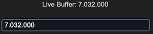
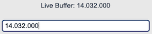

## sCTkEntryPrimary

### Table of Contents
* [Overview](#overview)
* [Constructor](#constructor)
* [Methods](#methods)
* [Theming (sCTkThemes.json)](#theming-sctkthemesjson)
* [Example](#example)
* [Known Limitations](#known-limitations)

---

### Overview

`sCTkEntryPrimary` is a themeable subclass of `customtkinter.CTkEntry` — the higher-emphasis of the library's two entry-field tiers (see also `sCTkEntrySecondary`). It adds automatic light/dark theme resolution from `sCTkThemes.json` and a genuine three-state visual model: normal, readonly, and disabled.

	 &emsp; &emsp; &emsp; &emsp;
	

All three states use CTk's native `state` option (`"normal"`, `"readonly"`, `"disabled"`). `normal`/`disabled` are confirmed correct by direct testing, consistent with every other widget in this library. `readonly` was added specifically to support `sCTkSpinbox`'s own readonly mode correctly (its entry can't be typed into directly, but the increment/decrement arrows stay clickable) — matching real `ttk.Spinbox` semantics, which distinguish readonly (arrows still work) from disabled (nothing works). Confirmed directly against CustomTkinter's own source: native `CTkEntry` already has full, deliberate support for a `"readonly"` state distinct from `"disabled"` — including a placeholder-text rule worth knowing about (see [Known Limitations](#known-limitations)).

---

### Constructor

```python
sCTkEntryPrimary(master=None, **kwargs)
```

| Parameter | Type | Default | Description |
|---|---|---|---|
| `master` | widget | `None` | Parent container. |
| `**kwargs` | — | — | Any native `CTkEntry` argument (e.g. `placeholder_text`, `width`), or an override for one of the theme keys listed under [Theming](#theming-sctkthemesjson). `state` is extracted and applied after construction rather than passed to the native constructor. |

```python
freq_entry = sCTkEntryPrimary(
    master=control_panel,
    placeholder_text="Enter frequency (MHz)",
)
freq_entry.pack(fill="x", padx=40, pady=10)
```

---

### Methods

| Method | Returns | Description |
|---|---|---|
| `state(state_string=None)` | `str` | Gets or sets the widget's visual state. `"normal"`/`"enabled"`/`"active"` all map to `"normal"`; `"readonly"` maps to `"readonly"`; `"disabled"` maps to `"disabled"`. All three use CTk's native `state` option. |
| `get_state()` | `str` | Equivalent to calling `state()` with no argument. |
| `configure(**kwargs)` / `config(**kwargs)` | varies | Standard widget configuration, plus: passing `state=...` routes to `state()` rather than the native option; calling `configure("propname")` with a single property name returns a Tkinter-style `(name, name, name, default, current)` tuple for `state`, `fg_color`, `text_color`, `border_color`, and `placeholder_text_color`. Queries for any other property name fall through to the native `CTkEntry.configure`. |

---

### Theming (`sCTkThemes.json`)

- **Applied once, at construction** — every key in the widget's theme block, including `font` and `corner_radius`, is merged with any matching keyword arguments and applied when the widget is built.
- **Re-applied on every `state()` change** — `fg_color`, `border_color`, `text_color`, and `placeholder_text_color` are recomputed from the theme's normal values, its `disabled_map`, or its `readonly_map` every time you call `state()`.

```json
{
    "sCTkEntryPrimary": {
        "font": ["Arial", 15, "normal"],
        "border_width": 1.5,
        "border_color": ["#1A4375", "#64748B"],
        "fg_color": ["#FFFFFF", "#111827"],
        "text_color": ["#1F2937", "#F9FAFB"],
        "placeholder_text_color": ["#94A3B8", "#64748B"],
        "corner_radius": 6,
        "disabled_map": {
            "fg_color": ["#F3F4F6", "#1F2937"],
            "border_color": ["#CBD5E1", "#475569"],
            "text_color": ["#94A3B8", "#64748B"]
        },
        "readonly_map": {
            "fg_color": ["#F8FAFC", "#1F2937"],
            "border_color": ["#64748B", "#94A3B8"],
            "text_color": ["#1F2937", "#F9FAFB"],
            "placeholder_text_color": ["#94A3B8", "#64748B"]
        }
    }
}
```

**`readonly_map` requires all four keys** (`fg_color`, `border_color`, `text_color`, `placeholder_text_color`) whenever `readonly` is actually requested — if any are missing, `state("readonly")` raises immediately rather than falling back to a guessed color. This check only runs when readonly is used, so existing code that never requests it is unaffected regardless of whether `readonly_map` is present.

The design intent behind the values above: `text_color` in `readonly_map` deliberately matches `normal`'s `text_color` exactly — readonly means "you can still read this clearly, you just can't edit it," a different message from disabled's "this is inactive." `border_color` is the primary visual cue distinguishing readonly from normal, using a muted "locked" tone distinct from both normal's vivid border and disabled's washed-out one.

`placeholder_text_color` is a genuinely distinct, themed value — not a fallback to `text_color`. This follows CustomTkinter's own convention: in the library's stock `dark-blue` theme, `text_color` is `["gray14", "gray84"]` while `placeholder_text_color` is a visibly more muted `["gray52", "gray62"]`. The value here reuses the muted gray already established throughout this theme file for disabled states — deliberate, but worth knowing if you'd rather placeholder text and disabled text look distinguishable from each other.

Note: CTkEntry has no separate font for placeholder text — it always shares the single `font` property with typed text. This is a real limitation of the underlying widget, not a gap in this theme file; there's no way to make placeholder text use a different font.

Colors are stored and passed through as raw `(light, dark)` tuples rather than resolved to a single value ahead of time, so they should correctly follow system/app appearance-mode changes automatically — the same approach validated on `sCTkComboBox`, `sCTkSegmentedButton`, and the button family, though not separately re-confirmed for this specific widget.

---

### Example

```python
#!/usr/bin/python3

import customtkinter as ctk
from scustomtkinter import sCTkFrame, sCTkButtonPrimary, sCTk, sCTkLabelPrimary, sCTkEntryPrimary


if __name__ == "__main__":

    root = sCTk()
    root.geometry("450x260")
    root.title("sCTkEntryPrimary Testing Deck")

    base = sCTkFrame(root)
    base.pack(expand=True, fill="both", padx=20, pady=20)

    # Label notice layer to monitor buffer array activity
    lbl_monitor = sCTkLabelPrimary(base, text="Console monitor active...")
    lbl_monitor.pack(pady=10)

    # Instantiate your custom Primary helper field
    input_field = sCTkEntryPrimary(base, placeholder_text="Enter configuration metadata...")
    input_field.pack(expand=False, fill="x", padx=40, pady=10)

    # Monitor keystrokes live
    input_field.bind("<KeyRelease>", lambda e: lbl_monitor.configure(text=f"Live Buffer: {input_field.get()}"))

    def toggle_operational_state():
        """Toggles the helper input field between normal active and dimmed disabled profiles."""
        current_mode = input_field.get_state()
        target = "disabled" if current_mode == "normal" else "normal"

        # Explicitly testing the dual-routing capability via configure()
        input_field.configure(state=target)
        btn_toggle.configure(
            text="Lock Helper Input (Set 'disabled')" if target == "normal" else "Unlock Helper Input (Set 'normal')")
        print(f"Logged Verification Hook -> input_field.get_state() = {input_field.get_state()}")

    btn_toggle = sCTkButtonPrimary(base, text="Lock Helper Input (Set 'disabled')", command=toggle_operational_state)
    btn_toggle.pack(side="bottom", pady=15)

    # Run the interactive boot tracking logs
    print("--- BOOT INITIALIZATION PASSTHROUGH ---")
    input_field.state("disabled")
    print("state (Disabled Pass) =", input_field.get_state())  # Output: disabled

    input_field.state("normal")
    print("state (Normal Pass)   =", input_field.get_state())  # Output: normal
    print("========================================\n")

    root.mainloop()
```

---

### Known Limitations

- `state()` only recognizes `"disabled"`, `"readonly"`, and `"normal"`/`"enabled"`/`"active"`; any other value (including typos) leaves the internal state flag unchanged, though colors are still harmlessly re-applied.
- **`readonly` never deactivates placeholder text, even on focus** — confirmed directly against CustomTkinter's own source: native `CTkEntry`'s internal placeholder logic explicitly skips clearing the placeholder whenever `state` is `"readonly"`. This makes sense (there's no reason to clear a placeholder for typing on a field that can't be typed into), but it means a readonly field showing placeholder text will keep showing it indefinitely, regardless of focus.
- The disable/enable-cycle cursor-position fix (`_reset_cursor_if_showing_placeholder`) is also applied on transitions into `readonly`, as a precaution — but this specific transition (unlike normal↔disabled, which is directly confirmed by testing) has not been independently verified. Given the point above, this is likely lower-risk than it might otherwise seem, since a readonly field showing placeholder text stays in that state continuously rather than toggling.
- Calling `configure("fg_color")` (or similar) returns `str(value)` where `value` may itself be a `(light, dark)` tuple rather than a single resolved color. Known gap shared with the wider Pygubu single-argument query investigation set aside elsewhere in this project.
- Passing a positional dict to `configure()` merges into the update; a positional property-name string returns the query tuple described above for five specific properties, and falls through to the native widget's `configure()` for anything else.

[Return to Table of Contents](#contents)
