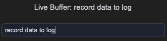
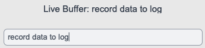

## sCTkEntrySecondary

### Table of Contents
* [Overview](#overview)
* [Constructor](#constructor)
* [Methods](#methods)
* [Theming (sCTkThemes.json)](#theming-sctkthemesjson)
* [Example](#example)
* [Known Limitations](#known-limitations)

---

### Overview

`sCTkEntrySecondary` is a themeable subclass of `customtkinter.CTkEntry` — the lower-emphasis of the library's two entry-field tiers (see also `sCTkEntryPrimary`). It adds automatic light/dark theme resolution from `sCTkThemes.json` and a distinct enabled/disabled visual state.

Dark Mode:	&emsp; &emsp; &emsp; &emsp;
Light Mode:	

> **Unresolved design question — identical to `sCTkEntryPrimary`.** This widget's "disabled" state maps to Tkinter's native `"readonly"`, not `"disabled"`, and this hasn't been independently confirmed correct through direct testing. See `sCTkEntryPrimary`'s documentation for the full explanation.

---

### Constructor

```python
sCTkEntrySecondary(master=None, **kwargs)
```

| Parameter | Type | Default | Description |
|---|---|---|---|
| `master` | widget | `None` | Parent container. |
| `**kwargs` | — | — | Any native `CTkEntry` argument, or an override for one of the theme keys listed under [Theming](#theming-sctkthemesjson). `state` is extracted and applied after construction rather than passed to the native constructor. |

```python
notes_entry = sCTkEntrySecondary(
    master=control_panel,
    placeholder_text="Optional notes",
)
notes_entry.pack(fill="x", padx=40, pady=10)
```

---

### Methods

| Method | Returns | Description |
|---|---|---|
| `state(state_string=None)` | `str` | Gets or sets the widget's enabled/disabled state. Only `"disabled"` (case-insensitive) disables it; `"normal"`, `"enabled"`, or `"active"` all enable it. See the unresolved design note above. |
| `get_state()` | `str` | Equivalent to calling `state()` with no argument. |
| `configure(**kwargs)` / `config(**kwargs)` | varies | Standard widget configuration, plus: passing `state=...` routes to `state()` rather than the native option; calling `configure("propname")` with a single property name returns a Tkinter-style `(name, name, name, default, current)` tuple for `state`, `fg_color`, `text_color`, `border_color`, and `placeholder_text_color`. Queries for any other property name fall through to the native `CTkEntry.configure`. |

---

### Theming (`sCTkThemes.json`)

- **Applied once, at construction** — every key in the widget's theme block, including `font` and `corner_radius`, is merged with any matching keyword arguments and applied when the widget is built.
- **Re-applied on every `state()` change** — `fg_color`, `border_color`, `text_color`, and `placeholder_text_color` are recomputed from the theme's normal values or its `disabled_map` every time you call `state()`.

```json
{
    "sCTkEntrySecondary": {
        "font": ["Arial", 13, "normal"],
        "border_width": 1,
        "border_color": ["#9CA3AF", "#4B5563"],
        "fg_color": ["#F3F4F6", "#1F2937"],
        "text_color": ["#4B5563", "#D1D5DB"],
        "corner_radius": 6,
        "disabled_map": {
            "fg_color": ["#F3F4F6", "#0B0F19"],
            "border_color": ["#CBD5E1", "#374151"],
            "text_color": ["#94A3B8", "#64748B"]
        }
    }
}
```

Same gap as `sCTkEntryPrimary`: there's no `placeholder_text_color` key here, even though the widget's code checks for one. Placeholder text uses CTkEntry's native default color rather than anything theme-driven.

Colors are stored and passed through as raw `(light, dark)` tuples rather than resolved to a single value ahead of time, so they should correctly follow system/app appearance-mode changes automatically — the same approach validated on `sCTkComboBox`, `sCTkSegmentedButton`, and the button family, though not separately re-confirmed for this specific widget.

---

### Example

```python
import customtkinter as ctk
from scustomtkinter import sCTk, sCTkFrame, sCTkEntrySecondary, sCTkButtonPrimary

if __name__ == "__main__":
    root = sCTk()
    root.geometry("400x250")
    root.title("EntrySecondary Example")

    base = sCTkFrame(root)
    base.pack(expand=True, fill="both", padx=20, pady=20)

    notes_entry = sCTkEntrySecondary(base, placeholder_text="Optional notes")
    notes_entry.pack(fill="x", pady=10)

    def toggle_disabled():
        target = "disabled" if notes_entry.get_state() == "normal" else "normal"
        notes_entry.state(target)
        disable_toggle.configure(text="Enable Field" if target == "disabled" else "Disable Field")

    disable_toggle = sCTkButtonPrimary(base, text="Disable Field", command=toggle_disabled)
    disable_toggle.pack(pady=10)

    root.mainloop()
```

---

### Known Limitations

- **"Disabled" is actually native "readonly", not "disabled"** — see the note at the top of this document.
- `placeholder_text_color` is checked by the widget's code but not defined anywhere in the theme file.
- `state()` only recognizes `"disabled"` and `"normal"`/`"enabled"`/`"active"`; any other value leaves the internal state flag unchanged, though colors are still harmlessly re-applied.
- Calling `configure("fg_color")` (or similar) returns `str(value)` where `value` may itself be a `(light, dark)` tuple rather than a single resolved color. Known gap shared with the wider Pygubu single-argument query investigation set aside elsewhere in this project.
- Passing a positional dict to `configure()` merges into the update; a positional property-name string returns the query tuple described above for five specific properties, and falls through to the native widget's `configure()` for anything else.

[Return to Table of Contents](#contents)
