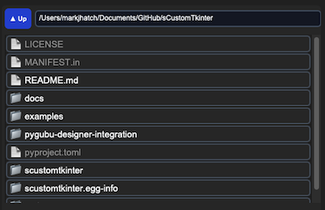
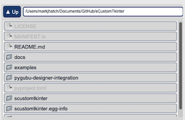

## sCTkFileExplorer
(Derived from FileExplorer class by Fastattack, 2024. This widget was made available to the community via the MIT License. Source Repository: [MoreCustomTkinterWidgets](https://github.com/fastattackv/MoreCustomTkinterWidgets) )

### Table of Contents
* [Overview](#overview)
* [Constructor](#constructor)
* [Methods](#methods)
* [Theming (sCTkThemes.json)](#theming-sctkthemesjson)
* [Example](#example)
* [Known Limitations](#known-limitations)

---

### Overview

`sCTkFileExplorer` is a theme-compliant, scrollable file/folder browser — a back button, an editable current-path entry, and a scrollable list of clickable file/folder rows. It inherits `ctk.CTkFrame`, `ScrollBindingMixin`, and `ThemeableWidget`, and builds its own scrolling machinery internally (a raw `tkinter.Canvas` plus a `CTkScrollbar`) rather than composing `sCTkScrollableFrame`.

  &emsp; &emsp; &emsp; &emsp;
 

**Scroll handling comes from [`ScrollBindingMixin`](ScrollBindingMixin.md),** the library's single shared implementation. This widget supplies two hooks: `_scroll_target()` returns its own internal canvas — no `winfo_parent()` lookup needed, unlike `sCTkScrollableFrame` — and `_scroll_layers()` assembles the widget, canvas, scrollbar and full row tree. It passes `explorer_frame` as the mixin's `content_widget`, since rows are added there rather than to the widget itself.

Bindings are automatic and self-maintaining: navigating to a new folder replaces every row widget, and the debounced `<Configure>` rebind picks them up with no explicit call. The mixin page covers the platform models, the activation mechanisms and the tuning constants.

Consolidating on the mixin fixed three problems specific to this widget. A global `bind_all("<MouseWheel>", ...)` once affected the entire application rather than just this widget. The scoped copy that replaced it walked only *one level* into the row frame, so a row's label or icon was never bound and the wheel did nothing over them. And it had no trackpad accumulator, scrolling on every raw event — trackpad scrolling here was markedly faster and coarser than everywhere else in the library, and now matches.

---

### Constructor

```python
sCTkFileExplorer(master=None, initialdir=None, type="file", filetypes=None, ...)
```

| Parameter | Type | Description |
|---|---|---|
| `master` | widget | Parent container. |
| `initialdir` | `str` | Starting directory. |
| `type` | `"file"` / `"directory"` | Whether individual files are selectable, or only directories. |
| `filetypes` | `list[str]` | File extension filter (only meaningful when `type="file"`). |
| `command` | `callable` | Called with the clicked path (a string) on a single click. |
| `double_click_command` | `callable` | Called with `(self, path)` on a double click. |
| `width` / `height` | `int` | Overall widget dimensions. |
| `**kwargs` | — | Any native `CTkFrame` argument, or a theme-key override (see [Theming](#theming-sctkthemesjson)). |

```python
explorer = sCTkFileExplorer(control_panel, initialdir="/Users/you/Documents", type="directory", width=350, height=380)
explorer.pack(fill="both", expand=True)
```

**`command` receives a path, not the widget.** An earlier version passed `self` (the widget instance) instead of the clicked path — confirmed and fixed, since the only real-world caller (`sCTkPathChooser`) expected a path string and would have received garbage.

---

### Methods

| Method | Returns | Description |
|---|---|---|
| `_finalize_split_bindings()` | `None` | Wires the back button, path entry, and canvas resize handling, then loads the initial directory. Auto-scheduled via `self.after(10, ...)` inside `__init__` — you don't need to call it yourself. It no longer governs scroll activation; `ScrollBindingMixin` handles that independently via `after_idle()`, which fires when Tk is actually idle rather than after a guessed delay. |
| `state(mode=None)` / `get_state()` | `str` | Gets or sets `"normal"`/`"disabled"`, dimming the back button, path entry, scrollbar, and all rows. Disabling also stops scrolling entirely — wheel, trackpad, and scrollbar dragging — matching `sCTkScrollableFrame`. |
| `configure(**kwargs)` | `None` | Standard configuration, accepting `state`, `type`, `initialdir`, `initialfile`, `filetypes`, and `double_click_command` alongside native options. |
| `configure(name)` | `tuple` | Pygubu-style single-argument query for any of the six properties above. **Previously broken:** the implementation read `pname = args` rather than `args[0]`, so every comparison tested a tuple against a string and all six queries fell through to the native widget. Pygubu could not read any of them. |

There's currently no public method for programmatic navigation from outside the widget — `path_to_show` (a `StringVar`) has no automatic refresh trace of its own (unlike `selected_path`), so navigating externally means setting it *and* explicitly calling the private `_fill_explorer()` afterward, matching the pattern used internally by the back button. This is a real API gap, not a documented feature.

---

### Theming (`sCTkThemes.json`)

```json
{
    "sCTkFileExplorer": {
        "btn_font": ["Arial", 11, "bold"],
        "entry_font": ["Arial", 12, "normal"],
        "btn_fg": ["#3B82F6", "#1D4ED8"],
        "btn_hover": ["#2563EB", "#1E40AF"],
        "btn_text_color": ["#FFFFFF", "#F9FAFB"],
        "btn_border_color": ["#1E3A8A", "#1E3A8A"],
        "entry_fg": ["#FFFFFF", "#111827"],
        "entry_text_color": ["#1F2937", "#F9FAFB"],
        "entry_border_color": ["#CBD5E1", "#475569"],
        "row_active_text": ["#1F2937", "#F9FAFB"],
        "row_dimmed_text": ["#94A3B8", "#64748B"],
        "button_color": ["#64748B", "#4B5563"],
        "disabled_map": {
            "btn_fg": ["#CBD5E1", "#334155"],
            "btn_border_color": ["#CBD5E1", "#334155"],
            "btn_text_color": ["#94A3B8", "#64748B"],
            "entry_fg": ["#F3F4F6", "#1F2937"],
            "entry_border_color": ["#CBD5E1", "#475569"],
            "entry_text_color": ["#94A3B8", "#64748B"],
            "row_dimmed_text": ["#5A6672", "#3A4552"],
            "button_color": ["#CBD5E1", "#334155"]
        }
    }
}
```

**`button_color` is required at the top level and in `disabled_map`.** This is a harder requirement than it looks: `_process_live_theme_repaint()` is bound to `<Visibility>`, so it fires essentially every time the widget is displayed, not only when explicitly disabled. A theme block missing `button_color` therefore raises `KeyError` on first display, not merely on disable. The values shown above (`["#64748B", "#4B5563"]` normal, `["#CBD5E1", "#334155"]` disabled) are the suggested pair.

`button_color` controls the internal scrollbar's color, distinct from `btn_fg` (the back button).

`row_active_text`/`row_dimmed_text` control file/folder row text color — `row_active_text` for a normal, selectable row; `row_dimmed_text` for either a row excluded by the current filter, or every row when the whole widget is disabled. Both required at the top level; `row_dimmed_text` is also hard-required in `disabled_map` for the whole-widget-disabled case.

**Only `button_color` and `row_dimmed_text` genuinely hard-fail if missing from `disabled_map`.** The other six disabled-state keys (`btn_fg`, `btn_border_color`, `btn_text_color`, `entry_fg`, `entry_border_color`, `entry_text_color`) gracefully fall back to their top-level/normal value if `disabled_map` doesn't override them — not a crash risk, just means that specific property simply won't visually change when disabled unless you give it a distinct value.

The internal raw `Canvas`'s background color isn't part of this theme block at all — it's derived from this widget's own `fg_color`, falling back to a fixed neutral pair (`#1C1C1C` dark / `#F3F4F6` light) if `fg_color` is `"transparent"`, since a raw Canvas can't render CTk's transparent pseudo-value. This is a different kind of fallback than the ones above — not a theme gap, but a genuine "needs an actual renderable color" situation, the same accepted pattern used in `sCTkFrameLabeledPrimary`'s scrollbar hiding.

---

### Example

```python
from scustomtkinter import sCTk, sCTkFrame, sCTkFileExplorer, sCTkLabelPrimary

if __name__ == "__main__":
    root = sCTk()
    root.geometry("420x480")
    root.title("FileExplorer Example")

    base = sCTkFrame(root)
    base.pack(expand=True, fill="both", padx=20, pady=20)

    status = sCTkLabelPrimary(base, text="Selected: (none yet)")
    status.pack(anchor="w", pady=(0, 8))

    explorer = sCTkFileExplorer(
        base, type="directory",
        command=lambda path: status.configure(text=f"Selected: {path}"),
    )
    explorer.pack(expand=True, fill="both")

    root.mainloop()
```

---

### Known Limitations

- No public method for programmatic navigation — see [Methods](#methods) above.
- Missing a required theme key raises `KeyError` at first use, naming exactly which key and whether it's needed at the top level or in `disabled_map`.
- **The debounced rebind also runs on genuine resizes.** `<Configure>` on the row frame doesn't distinguish "rows were added" from "the window was dragged", so resizing rebinds too. One coalesced pass rather than one per event, but on a very large directory it isn't free.
- **The internal `Canvas` is a raw `tkinter.Canvas`,** not a themed widget, so its background is derived rather than themed — see the note at the end of [Theming](#theming-sctkthemesjson).
- **The scrollbar stays visible when disabled, just inert.** It can't be dragged, but it isn't hidden — CustomTkinter's scrollbar has no native disabled state to lock. Same limitation as `sCTkScrollableFrame`.

**Fixed:** dragging the scrollbar when the files didn't fill the frame used to push the rows down to the bottom, leaving empty space above them. The scroll region was set straight from `bbox("all")`, which is *shorter* than the visible canvas when content is short, and Tk will still scroll within an undersized region. The region is now grown to at least the canvas height in that case, so `yview` has nowhere to go and scrolling correctly does nothing.

[Return to Table of Contents](#contents)
