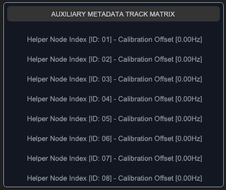

## sCTkFrameLabeledSecondary

### Table of Contents
* [Overview](#overview)
* [Constructor](#constructor)
* [Methods](#methods)
* [Theming (sCTkThemes.json)](#theming-sctkthemesjson)
* [Example](#example)
* [Known Limitations](#known-limitations)

---

### Overview

`sCTkFrameLabeledSecondary` is a themeable, lower-emphasis labeled container panel — see also `sCTkFrameLabeledPrimary`. It's built on `customtkinter.CTkScrollableFrame`, but deliberately used purely for its native title-label feature — the model here is `ttk.LabelFrame`, which never scrolls. Scrolling is intentionally suppressed; this is a labeled, bordered panel, not a scroll viewport.

Dark Mode:  &emsp; &emsp; &emsp; &emsp;
Light Mode: 

---

### Constructor

```python
sCTkFrameLabeledSecondary(master=None, **kwargs)
```

| Parameter | Type | Default | Description |
|---|---|---|---|
| `master` | widget | `None` | Parent container. |
| `**kwargs` | — | — | Any native `CTkScrollableFrame` argument (most usefully `label_text`, the panel's title), or an override for one of the theme keys listed under [Theming](#theming-sctkthemesjson). |

```python
notes_panel = sCTkFrameLabeledSecondary(
    master=control_root,
    label_text="Notes",
)
notes_panel.pack(expand=True, fill="both", padx=25, pady=25)
```

---

### Methods

| Method | Returns | Description |
|---|---|---|
| `state(mode=None)` | `str` | Gets or sets the widget's visual "disabled" state. Purely cosmetic — does not lock interactivity, and does not cascade to child widgets automatically. |
| `get_state()` | `str` | Equivalent to calling `state()` with no argument. |
| `configure(**kwargs)` / `config(**kwargs)` | varies | Standard widget configuration, plus: passing `state=...` routes to `state()`. Calling `configure("propname")` with a single property name returns a Tkinter-style query tuple for `state`, `fg_color`, `border_color`, and `label_text_color`. |
| `winfo_children(include_private=False)` | `list` | By default, filters out children whose exact class name is `"CTkLabel"`, `"Label"`, `"CTkFrame"`, or `"Frame"` — internal furniture `CTkScrollableFrame` creates for its own title row and canvas wrapper. Pass `include_private=True` for the raw, unfiltered list. Same class-name-based known limitation as `sCTkFrameLabeledPrimary` — see that widget's docs for the specific edge case. |
| `get_children()` | `list` | Equivalent to `winfo_children(include_private=False)`. |
| `get_all_children()` | `list` | Equivalent to `winfo_children(include_private=True)`. |
| `get_container()` | `self` | Returns the widget itself. Provided for API symmetry with composite widgets that wrap a separate inner container. |

---

### Theming (`sCTkThemes.json`)

- **Applied once, at construction** — every key in the widget's theme block is merged with any matching keyword arguments and applied when the widget is built.
- **Re-applied on every `state()` change** — `fg_color`, `border_color`, `label_text_color`, `border_width`, and `label_font` are recomputed from the theme's normal values or its `disabled_map`.

```json
{
    "sCTkFrameLabeledSecondary": {
        "border_width": 1,
        "border_color": ["#64748B", "#94A3B8"],
        "fg_color": ["#F3F4F6", "#111827"],
        "corner_radius": 6,
        "label_font": ["Arial", 12, "normal"],
        "label_text_color": ["#4B5563", "#D1D5DB"],
        "disabled_map": {
            "border_color": ["#CBD5E1", "#374151"],
            "label_text_color": ["#94A3B8", "#64748B"]
        }
    }
}
```

**On the internal scrollbar:** same situation as `sCTkFrameLabeledPrimary` — a scrollbar exists internally since this is built on `CTkScrollableFrame`, even though scrolling isn't the intent. It's suppressed by matching its colors to the frame's background and collapsing its width to `0`, since CustomTkinter's native scrollbar has no disabled state to lock in the first place.

Colors are stored and passed through as raw `(light, dark)` tuples rather than resolved to a single value ahead of time, so they should correctly follow system/app appearance-mode changes automatically — the same approach validated on `sCTkComboBox`, `sCTkSegmentedButton`, and the button family, though not separately re-confirmed for this specific widget.

**Safe to use as a base class for your own composite widgets.** Same protection as `sCTkFrameLabeledPrimary` — see that widget's docs for the full reasoning (the run-once guard in `ThemeableWidget.__init__`, plus this widget's own constructor filtering keys down to only what native `CTkScrollableFrame` actually accepts before its own constructor call).

---

### Example

```python
from scustomtkinter import sCTkButtonPrimary, sCTkLabelSecondary, sCTk, sCTkFrameLabeledSecondary

if __name__ == "__main__":
    root = sCTk()
    root.geometry("450x450")
    root.title("FrameLabeledSecondary Example")

    notes_panel = sCTkFrameLabeledSecondary(root, label_text="Notes")
    notes_panel.pack(expand=True, fill="both", padx=25, pady=25)

    for i in range(1, 6):
        item = sCTkLabelSecondary(notes_panel, text=f"Note {i}")
        item.pack(pady=4, fill="x", padx=10)

    def toggle_panel_state():
        target = "disabled" if notes_panel.get_state() == "normal" else "normal"
        notes_panel.configure(state=target)

        # Disabling the panel is purely cosmetic -- cascade to children explicitly.
        for child in notes_panel.get_children():
            if hasattr(child, "configure"):
                child.configure(state=target)

        toggle_btn.configure(text="Enable Panel" if target == "disabled" else "Disable Panel")

    toggle_btn = sCTkButtonPrimary(root, text="Disable Panel", command=toggle_panel_state)
    toggle_btn.pack(pady=15)

    root.mainloop()
```

---

### Known Limitations

- Disabling this widget is purely cosmetic — it does not lock interactivity, and does not cascade to child widgets automatically.
- The internal scrollbar cannot be truly disabled (a CustomTkinter limitation, confirmed by direct investigation) — only visually hidden via color-matching and zero width.
- `winfo_children()`'s default filtering is a class-name check, not an identity check — see `sCTkFrameLabeledPrimary`'s docs for the specific edge case this can miss.
- Calling `configure("fg_color")` (or similar) returns `str(value)` where `value` may itself be a `(light, dark)` tuple rather than a single resolved color. Known gap shared with the wider Pygubu single-argument query investigation set aside elsewhere in this project.

[Return to Table of Contents](#contents)
