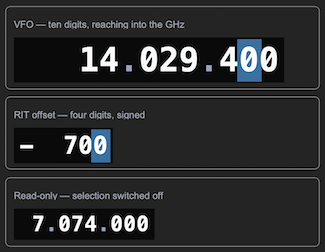
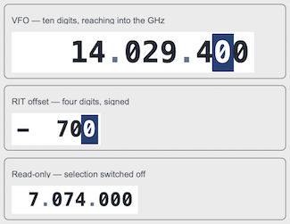

## sCTkFrequencyDisplay

### Table of Contents
* [Overview](#overview)
* [Constructor](#constructor)
* [Methods](#methods)
* [Selecting a Digit](#selecting-a-digit)
* [Appearance](#appearance)
* [Pygubu Designer](#pygubu-designer)
* [Theming (sCTkThemes.json)](#theming-sctkthemesjson)
* [Example](#example)
* [Known Limitations](#known-limitations)

---

### Overview

`sCTkFrequencyDisplay` is a grouped numeric readout you can click a digit of.

 &emsp; &emsp; &emsp; &emsp;
 

A frequency, shown as `x.xxx.xxx.xxx`, where clicking a digit selects it and **the selection is the tuning step**: pick the hundreds digit and a dial moves 100 Hz per detent. That replaces a separate step control, and with it the possibility of the two disagreeing about which digit is being tuned.

It also does signed offsets — RIT, XIT, anything with a direction — which is why it is a grouped numeric readout rather than strictly a frequency. Set `digits` and `signed` and the same drawing, selection and theming serve both.

**It draws, rather than packing labels.** The first version assembled ten `sCTkLabelPrimary` widgets and coloured the selected one's background. Three things were wrong with that, and all three are fixed by drawing:

* **The readout jittered.** Proportional digits are not the same width, so the row re-flowed as the numbers changed and the whole display shifted sideways while tuning. Here every character sits at a computed position and nothing moves.
* Ten `configure()` calls per update, against one redraw.
* The highlight was a label background, so it could only be a rectangle behind the glyph — and it had resorted to hardcoded hex rather than theme keys.

---

### Constructor

```python
sCTkFrequencyDisplay(master=None, digits=10, signed=False, value=0,
                     delimiter=".", font_size=34, selectable=True,
                     min_digit=1, state="normal", command=None, **kw)
```

| Parameter | Type | Default | Description |
|---|---|---|---|
| `master` | widget | `None` | Parent container. |
| `digits` | `int` | `10` | How many digit positions. Ten reaches into the GHz; four suits a signed offset. |
| `signed` | `bool` | `False` | Shows a leading `+` or `-`. |
| `value` | `int` | `0` | The value shown, in the caller's units — Hz for a frequency. |
| `delimiter` | `str` | `"."` | What separates the groups of three. Changeable at any time. |
| `font_size` | `int` | `34` | Point size of the digits. The *family* comes from the theme. |
| `selectable` | `bool` | `True` | Whether clicking a digit selects it. |
| `min_digit` | `int` | `1` | The smallest selectable digit, as a power of ten. |
| `state` | `str` | `"normal"` | `"normal"` or `"disabled"`. |
| `command` | `Callable` | `None` | Called with the new step when the selection changes. |
| `**kw` | — | — | Native `CTkFrame` arguments, or theme-key overrides. |

```python
vfo = sCTkFrequencyDisplay(panel, digits=10, value=14_029_400,
                           command=lambda step: print("step is now", step))
vfo.pack()
```

---

### Methods

| Method | Returns | Description |
|---|---|---|
| `set(value)` | — | Sets the value. Does **not** fire `command` — see [Selecting a Digit](#selecting-a-digit). |
| `get()` | `int` | The current value. |
| `select_digit(power)` | — | Selects a digit by its place value, and fires `command`. Clamped to `min_digit` and the display's width. |
| `step()` | `int` | The selected digit's place value in units. `100` means 100 Hz. |
| `selected_digit()` | `int` | The selected digit as a power of ten. |
| `state(mode=None)` | `str` | Gets or sets `"normal"`/`"disabled"`. |
| `get_state()` | `str` | Equivalent to `state()` with no argument. |
| `configure(**kwargs)` / `config(**kwargs)` | varies | Standard configuration, plus every constructor property. `configure("propname")` returns a Pygubu-style query tuple. |

---

<a name="selecting-a-digit"></a>
### Selecting a Digit

Clicking a digit selects it, and **the selection is the step**. A rig with a separate tuning-preset control has two things that can disagree about what a dial detent means; here there is one.

```python
def on_step(step):
    print(f"a detent now moves {step} Hz")

display = sCTkFrequencyDisplay(panel, command=on_step)
```

**`command` fires on selection, not on value changes.** `set()` is silent, matching `CTkSlider.set()` and the rest of this library: a programmatic set is the application saying what the value is, and the application already knows. Firing it would also make construction order load-bearing — setting an initial value would call back into an interface that does not exist yet.

**`min_digit` stops the smallest digits being selected.** The uBITX tunes in whole 10 Hz steps, so the default of `1` shows the units digit but does not let you tune it. Set it to `0` for a display where every digit is meaningful.

**Turning the digit is the caller's business.** The widget says *which* digit you are on and what it is worth; what a wheel or a dial does with that is for the application to decide. A readout that also tuned would have to know about the radio.

---

### Appearance

#### The font must be fixed-width

Even with characters at computed positions, a proportional font makes `1` and `8` different widths, so the ink shifts inside its own cell as the numbers change. The theme's family should be monospace, and the default is `Courier`.

**Tk guarantees only three family names across platforms** — `Courier`, `Helvetica` and `Times` — and maps each to something local. Anything else is a gamble: Menlo is macOS only, Consolas is Windows only, DejaVu Sans Mono is usually Linux. Worse, **Tk does not report a missing family**; it quietly substitutes its default, which is proportional.

So the widget checks. Name whatever suits your platform and it falls back through Menlo, Consolas, DejaVu Sans Mono, Liberation Mono, Courier New and Courier if that one is not installed.

#### Leading groups appear as they are needed

A ten-digit display showing an HF frequency does not sit behind two empty groups: everything before the first significant digit is suppressed. **The positions do not move when a group appears** — the layout is computed for the full width and the leading characters are simply not drawn.

The sign is the exception: it sits before the first significant digit and always draws, because an offset without its direction is worse than useless.

#### The delimiter is a live setting

Changeable at any time, because it is a display preference the whole interface shares. A readout that kept the delimiter it was born with would disagree with everything else the moment the setting changed.

---

<a name="pygubu-designer"></a>
### Pygubu Designer

Every constructor property is in the inspector, and `command` is a `commandentry` whose generated stub takes a `step` parameter — so a handler arrives already declaring what it receives.

`digits` and `signed` change the **layout**, so they are passed as constructor arguments rather than set afterwards: a readout that built at ten digits and shrank to four would flicker through the wrong size on every repaint.

**Clicking a digit on the design canvas selects the widget, not the digit.** The interaction is neutralised in preview, the same as the dials and the notebook — otherwise there would be no way to select the widget itself.

---

### Theming (`sCTkThemes.json`)

```json
{
    "sCTkFrequencyDisplay": {
        "fg_color": ["#FFFFFF", "#0A0A0A"],
        "font": ["Courier", 34, "bold"],
        "text_color": ["#1F2937", "#F9FAFB"],
        "delimiter_color": ["#64748B", "#94A3B8"],
        "selected_color": ["#1A4375", "#2471A3"],
        "selected_text_color": ["#FFFFFF", "#FFFFFF"],

        "disabled_map": {
            "text_color": ["#94A3B8", "#64748B"],
            "delimiter_color": ["#CBD5E1", "#3E4650"]
        }
    }
}
```

Every key above is required — construction raises `KeyError` naming any that are missing, and saying whether it belongs at the top level or in `disabled_map`.

**`delimiter_color` is deliberately a little quieter than `text_color`.** The separators are punctuation; someone reading a frequency should see the digits first. Raise it toward the text colour if that reads as washed out at your font size.

**The `font` size is only a default.** `font_size` is a per-instance property, because one interface may want a 38-pixel VFO and a 24-pixel read-only display from the same theme.

`fg_color` may be `"transparent"`, which is resolved by walking up for the parent's real colour — a raw canvas cannot render the word itself.

---

### Example

```python
#!/usr/bin/python3
import customtkinter as ctk
from scustomtkinter import sCTk, sCTkFrame, sCTkFrequencyDisplay

if __name__ == "__main__":
    root = sCTk()
    root.title("sCTkFrequencyDisplay")

    panel = sCTkFrame(root, fg_color="transparent", border_width=0)
    panel.pack(padx=20, pady=20)

    vfo = sCTkFrequencyDisplay(panel, digits=10, value=14_029_400,
                               font_size=38)
    vfo.pack(anchor="w")

    rit = sCTkFrequencyDisplay(panel, digits=4, signed=True, value=-700,
                               font_size=24, min_digit=0)
    rit.pack(anchor="w", pady=(8, 0))

    # The wheel turns whichever digit is selected. The widget reports the
    # step; moving the value is the application's business.
    def turn(event, display=vfo):
        direction = 1 if getattr(event, "delta", 0) > 0 else -1
        display.set(display.get() + direction * display.step())
        return "break"

    vfo.canvas.bind("<MouseWheel>", turn)

    root.mainloop()
```

---

### Known Limitations

- **The widget does not tune itself.** It reports which digit is selected and what it is worth; binding a wheel or a dial to it is the caller's job. That division is deliberate — see [Selecting a Digit](#selecting-a-digit).
- **One delimiter colour for all sizes.** A contrast that reads well at 38 pixels may look washed out at 24, and the theme offers a single value.
- **The value is an integer.** Fractional units would need a decimal position, which the grouping logic does not have.
- **`command` reports the step, not the digit's index.** `selected_digit()` gives the power of ten if you need the position itself.
- **Clicking selects; it does not edit.** There is no keyboard entry of a frequency into this widget.

[Return to Table of Contents](#contents)
