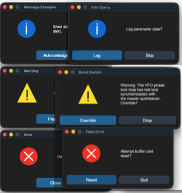
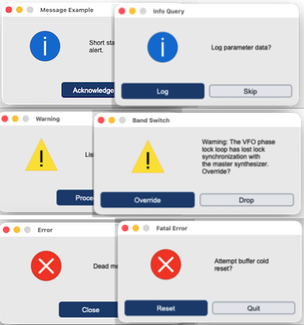

## sCTkMessagebox

### Table of Contents
* [API Constructor Reference](#api-constructor-reference)
* [Global Shortcut Function Handlers](#global-shortcut-function-handlers)
* [Simple Syntax Quick-Reference Guide](#simple-syntax-quick-reference-guide)
* [Centralized Stylesheet Setup](#centralized-stylesheet-setup-sctkthemesjson)
* [Layout & Text Wrapping Integration Rules](#layout--text-wrapping-integration-rules)
* [Configuration](#configuration)
* [Implementation Example & Test Harness](#implementation-example--test-harness)

---

The `sCTkMessagebox` is an advanced, themeable dialog window system designed to provide critical messages to the user. It replaces standard OS message alerts with modular, center-positioned dialogue boxes featuring dynamic text-wrapping, automated parent window tracking calculations, custom asset handling, and support for dual high-contrast action selection layouts that return boolean runtime parameters.

---






### API Constructor Reference

```python
sCTkMessagebox(title, message, typ, master=None, buttons="ok", ok_text="Ok", yes_text="Yes", no_text="No", width=400)
```

| Parameter Name | Data Type | Default Value | Description |
| :--- | :--- | :--- | :--- |
| `title` | `str` | *Required* | Text displayed inside the top operating window header bar title deck. |
| `message` | `str` | *Required* | Body text string message container paragraph to display inside the prompt panel. |
| `typ` | `str` | *Required* | Alert asset track type classification identifier. Accepts `"info"`, `"warning"`, or `"error"`. |
| `master` | `any` | `None` | Reference pointer tracking your root window or parent `sCTkFrame` to calculate centering bounds. |
| `buttons` | `str` | `"ok"` | Layout selection control mapping. Accepts `"ok"` (single center prompt) or `"yes_no"` (twin balanced selections). |
| `ok_text` | `str` | `"Ok"` | Custom display string label mapped to the single button layout option track. |
| `yes_text` | `str` | `"Yes"` | Display string assigned to the primary confirmation button choice track. |
| `no_text` | `str` | `"No"` | Display string assigned to the secondary dismissal button choice track. |
| `width` | `int` | `400` | Manual window width boundary tracking restriction limit measured in pixels. |

---

### Global Shortcut Function Handlers

To launch modal dialog blocks quickly inside callback triggers without handling complete class instantiations manually, utilize these pre-wired shortcuts via the **`messagebox`** namespace proxy:

#### Standard Alert Prompts (Returns `True` upon closure)
```python
sCTkMessagebox.showinfo(title, message, ok_text="Ok", width=400, master=root)
sCTkMessagebox.showwarning(title, message, ok_text="Ok", width=400, master=root)
sCTkMessagebox.showerror(title, message, ok_text="Ok", width=400, master=root)
```

#### Confirmation Prompt Shortcuts (Returns primitive Python `True` or `False` boolean states)
```python
sCTkMessagebox.askyesno(title, message, yes_text="Yes", no_text="No", width=400, master=root)
sCTkMessagebox.askwarningyesno(title, message, yes_text="Yes", no_text="No", width=400, master=root)
sCTkMessagebox.askerroryesno(title, message, yes_text="Yes", no_text="No", width=400, master=root)
```

---

### Simple Syntax Quick-Reference Guide

Below are clean, minimal use-cases showcasing how to call each convenience shortcut using the standardized `messagebox` proxy engine.

#### 1. `sCTkMessagebox.showinfo`
Used for general application notifications, status confirmations, and completions.
```python
from scustomtkinter import sCTkMessagebox

# Displays a standard informative dialog popup
sCTkMessagebox.showinfo("System Init", "Satellite link successfully established.", master=root)
```

#### 2. `sCTkMessagebox.showwarning`
Used to display alert parameters, non-fatal operational boundary breaches, or layout cautions.
```python
from scustomtkinter import sCTkMessagebox

# Displays a warning alert box with a custom approval button text
sCTkMessagebox.showwarning("Battery Low", "Backup power source dropped below 15%.", ok_text="Acknowledge", master=root)
```

#### 3. `sCTkMessagebox.showerror`
Used to halt operations when a severe terminal failure or unhandled exception block is triggered.
```python
from scustomtkinter import sCTkMessagebox

# Displays a fatal critical error box
sCTkMessagebox.showerror("TX Failure", "Transmitter hardware thermal overload detected.", master=root)
```

#### 4. `sCTkMessagebox.askyesno`
Launches a standard query dialogue window, returning a boolean flag based on the user's action.
```python
from scustomtkinter import sCTkMessagebox

# Captures true/false verification states
if sCTkMessagebox.askyesno("Log Session", "Do you wish to save the active telemetry log files?", master=root):
    print("User clicked YES: Executing write loop...")
else:
    print("User clicked NO: Dropping record data...")
```

#### 5. `sCTkMessagebox.askwarningyesno`
Launches a critical query box carrying high-visibility alert graphics for destructive actions.
```python
from scustomtkinter import sCTkMessagebox

# Captures permission states for hazardous overrides
override_allowed = messagebox.askwarningyesno(
    "Frequency Sync", 
    "VFO phase lock is currently unstable. Force manual override?", 
    yes_text="Force Override", 
    no_text="Abort Scan", 
    master=root
)
```

#### 6. `sCTkMessagebox.askerroryesno`
Launches an error-status confirmation panel, typical for prompt actions following a hard code drop.
```python
from scustomtkinter import sCTkMessagebox

# Captures choice states to run system self-healing scripts
if sCTkMessagebox.askerroryesno("Cascade Failure", "Buffer buffer overflow hit. Attempt a cold reset?", master=root):
    # Execute recovery sequence...
    pass
```

---

### Centralized Stylesheet Setup (`sCTkThemes.json`)

```json
{
    "sCTkMessagebox": {
        "fg_color": ["#F1F5F9", "#1C1C1C"],
        "font": ["Arial", 14],
        "text_color": ["#1A1A1A", "#E5E5E5"]
    }
}
```

**Every key above is required.** Construction raises `KeyError` naming the missing one, rather than substituting a plausible default that would make an incomplete block look merely slightly-off.

`font` and `text_color` style the message label. `fg_color` is the dialog window background, and is **new** — this widget previously forwarded its raw constructor keywords to native `CTkToplevel` rather than the resolved theme keywords, so the theme block never reached the window at all and the dialog rendered in CustomTkinter's own default background. `ThemeableWidget`'s resolution work was discarded for everything except the two label keys read back manually.

**Keyword filtering.** Theme keywords are now filtered against a whitelist before the native constructor sees them, because `CTkToplevel` names only `fg_color` explicitly and passes everything else through to `tkinter.Toplevel`, which raises `TclError` on any option it doesn't recognise. This closes a latent crash as well: a caller passing `font=` to this widget would previously have had it forwarded straight through.

**There is no `disabled_map` and no `state()`.** This is a modal dialog — it grabs input on construction and destroys itself on dismissal, so there is no interval in which a disabled appearance would mean anything.

---

### Layout & Text Wrapping Integration Rules

To completely bypass CustomTkinter's internal multi-line font calculation limitations, this widget uses Python's native `textwrap` module to inject hard newline coordinates before passing layout parameters to your primary text components.

Observe these implementation traits:
* **Horizontal Capsule Brackets**: When `buttons="yes_no"` is active, Column 0 and Column 1 utilize an interlocking `uniform="dialog_buttons"` constraint map. This completely locks both buttons to an identical layout grid pixel width, regardless of text length mismatches.
* **Vertical Safety Gutter**: Text layout nodes use `padx=(10, 35)` paired alongside a calculated character width subtraction map. This forces word bounds to drop downwards well before interacting with the physical window frame margin boundary.
* **Autonomous Resizing**: The `_center_window` geometry calculations lock your custom manual `width` pixel profile constraint, but query the active required widget layout height parameters dynamically via `winfo_reqheight()`. This allows window frames to expand or shrink vertically based on your text content volume requirements automatically.

---

<a name="configuration"></a>
### Configuration

`configure()` and `config()` behave as they do elsewhere in the library: keyword arguments are applied normally, a single positional dict is merged into them, and any other single positional value is forwarded to the native widget.

Three separate defects were fixed here, all silent:

- **`super().configure(args)` passed the whole tuple** as one positional argument instead of unwrapping it, so every single-argument call forwarded a malformed value.
- **`if args and isinstance(args, dict)`** — `args` is always a tuple, so that branch could never fire and the dict form of `configure()` was dead code.
- **No `config = configure` alias existed,** so `.config(...)` bypassed the override entirely and landed on the native widget. Tkinter binds `.config` as a separate class attribute; it does not track a subclass's override.

---

### Implementation Example & Test Harness

Below is a complete, self-contained test execution script demonstrating how to properly map shortcut handlers, custom text boundaries, and dynamic boolean feedback out of an interactive transceiver dashboard setup.

```python
#!/usr/bin/python3
# =====================================================================
# 🛠️ TESTING HARNESS IMPORTS & SETUP for Messagebox
# =====================================================================

import customtkinter as ctk
from scustomtkinter import sCTkFrame, sCTkButtonPrimary,sCTk, sCTkMessagebox

if __name__ == "__main__":
    root = sCTk()
    root.geometry("300x520")
    root.title("Message Example")

    long_msg = "Warning: The VFO phase lock loop has lost lock synchronization with the master synthesizer. Override?"

    # 🚀 Clean functional callbacks using the messagebox namespace!
    def trigger_info_ask():
        print(f"Feedback: {sCTkMessagebox.askyesno('Info Query', 'Log parameter data?', yes_text='Log', no_text='Skip', master=root)}")

    def trigger_warning_ask():
        print(f"Feedback: {sCTkMessagebox.askwarningyesno('Band Switch', long_msg, yes_text='Override', no_text='Drop', width=450, master=root)}")

    def trigger_error_ask():
        print(f"Feedback: {sCTkMessagebox.askerroryesno('Fatal Error', 'Attempt buffer cold reset?', yes_text='Reset', no_text='Quit', master=root)}")

    # 🚀 Native drop-in style execution pass!
    sCTkButtonPrimary(root, text="Test Info (OK)", width=200, command=lambda: sCTkMessagebox.showinfo("Message Example", "Short statement alert.", ok_text="Acknowledge", master=root)).pack(pady=8)
    sCTkButtonPrimary(root, text="Test Info (Yes/No)", width=200, command=trigger_info_ask).pack(pady=(8, 25))
    sCTkButtonPrimary(root, text="Test Warning (OK)", width=200, command=lambda: sCTkMessagebox.showwarning("Warning", "Listen carefully", ok_text="Proceed", master=root)).pack(pady=8)
    sCTkButtonPrimary(root, text="Test Warning (Yes/No)", width=200, command=trigger_warning_ask).pack(pady=(8, 25))
    sCTkButtonPrimary(root, text="Test Error (OK)", width=200, command=lambda: sCTkMessagebox.showerror("Error", "Dead meat", ok_text="Close", master=root)).pack(pady=8)
    sCTkButtonPrimary(root, text="Test Error (Yes/No)", width=200, command=trigger_error_ask).pack(pady=8)

    root.mainloop()
```