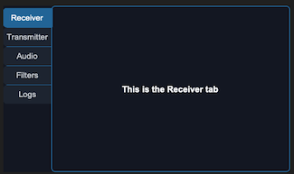
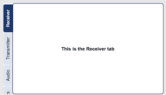

## sCTkNotebook

### Table of Contents
* [Overview](#overview)
* [Constructor](#constructor)
* [Methods](#methods)
* [Tab Pages](#tab-pages)
* [Appearance](#appearance)
* [Pygubu Designer](#pygubu-designer)
* [Theming (sCTkThemes.json)](#theming-sctkthemesjson)
* [Example](#example)
* [Known Limitations](#known-limitations)

---

### Overview

`sCTkNotebook` is a multi-page container with its tabs down the left or right edge, rather than across the top. The same idea as [`sCTkTabview`](sCTkTabview.md), turned ninety degrees.

 &emsp; &emsp; &emsp; &emsp;
 

Use it when a panel has more pages than a horizontal strip can show, or when the layout has vertical space to spare and horizontal space to protect.

**It is not a subclass of `sCTkTabview`.** Native `CTkTabview` builds its strip from a `CTkSegmentedButton`, which lays its buttons out in a single grid row and has no vertical mode. The geometry, the selection handling and the colours all come from that widget, so reusing it would mean overriding nearly all of it. This class owns its strip outright.

**Everything is drawn on one canvas.** Tab labels run along the strip rather than across it, so the text is rotated — and a Tk button cannot rotate its text. That alone would only need a canvas for the strip, but the page outline has to break where the selected tab meets it, and a border drawn by a frame cannot have a gap cut in it. Outline and tabs are therefore drawn together, with the content pages placed on top.

---

### Constructor

```python
sCTkNotebook(master=None, side="left", tab_width=34, tab_style="rounded",
             text_orientation="auto", show_page_border=True,
             show_tab_separators=False, state="normal", **kw)
```

| Parameter | Type | Default | Description |
|---|---|---|---|
| `master` | widget | `None` | Parent container. |
| `side` | `str` | `"left"` | Which edge the strip sits on, `"left"` or `"right"`. |
| `tab_width` | `int` | `34` | Width of the strip in pixels. See [Appearance](#appearance) for why this is explicit rather than measured. |
| `tab_style` | `str` | `"rounded"` | `"rounded"` or `"angled"`. |
| `text_orientation` | `str` | `"auto"` | `"auto"`, `"up"`, `"down"` or `"horizontal"`. |
| `show_page_border` | `bool` | `True` | Draws the outline around the page, broken where the selected tab meets it. |
| `show_tab_separators` | `bool` | `False` | A line between adjacent tabs. |
| `state` | `str` | `"normal"` | `"normal"` or `"disabled"`. |
| `**kw` | — | — | Native `CTkFrame` arguments, or theme-key overrides. |

```python
notebook = sCTkNotebook(panel, side="left", tab_width=34)
notebook.pack(expand=True, fill="both")

page = notebook.add("Receiver")
sCTkLabelPrimary(page, text="Receiver settings").pack(padx=20, pady=20)
```

---

### Methods

| Method | Returns | Description |
|---|---|---|
| `add(name)` | `sCTkFrame` | Creates a tab and returns its content page directly — no separate `tab()` call needed. Raises `ValueError` on a name already in use. |
| `tab(name)` | `sCTkFrame` | The page for an existing tab. Raises `KeyError` if there is none. |
| `delete(name)` | — | Removes a tab and destroys its page. If it was selected, the next remaining tab is selected instead. |
| `rename(old, new)` | — | Renames a tab, keeping its position and its page. Renaming by deleting and re-adding would move the tab to the end and destroy its children. |
| `set(name)` | — | Selects a tab and raises its page. |
| `get()` | `str` | The selected tab's name, or `None` when there are no tabs. |
| `tabs()` | `list[str]` | Tab names, in order. |
| `state(mode=None)` | `str` | Gets or sets `"normal"`/`"disabled"`. Disabling dims the strip and the outline and stops tab selection. |
| `get_state()` | `str` | Equivalent to `state()` with no argument. |
| `required_length()` | `int` | The height the widget wants so every tab is reachable without scrolling. See [Known Limitations](#known-limitations). |
| `configure(**kwargs)` / `config(**kwargs)` | varies | Standard configuration, plus every constructor property above. `configure("propname")` returns a Pygubu-style query tuple. |

---

<a name="tab-pages"></a>
### Tab Pages

`add()` returns an `sCTkFrame`, and that is the page. Children go into it directly:

```python
page = notebook.add("Audio")
sCTkFrame(page, border_width=1).pack(expand=True, fill="both", padx=10, pady=10)
```

Every page occupies the same grid cell, with the selected one raised. So a page keeps its children and its geometry between visits — switching tabs costs nothing and nothing is rebuilt.

**All pages report `winfo_ismapped()` as true**, including the ones you cannot see. `tkraise()` changes stacking, not mapping, so that call is not a way to find out which tab is showing. Use `get()`.

---

<a name="appearance"></a>
### Appearance

#### Which way the labels read

| `text_orientation` | Result |
|---|---|
| `"auto"` | Reads outside-in — up a left strip, down a right one, the way a book's spine is set — and flips when `side` changes. |
| `"up"` | 90° regardless of side. |
| `"down"` | 270° regardless of side. |
| `"horizontal"` | Flat text. |

`"up"` and `"down"` matter if a panel has notebooks on both edges and you want their labels to match rather than mirror.

**`"horizontal"` needs a wider strip.** With rotated text, a tab's length along the strip comes from its label's width and `tab_width` only has to fit the text's height. Flat text inverts that: the tab is barely taller than one line, and the label's width becomes `tab_width`'s problem. The widget cannot solve this for you without overriding the width you asked for, so it does not — set `tab_width` to something that fits your longest label, around 100 for ordinary words.

Orientation is a property of the notebook, not of a tab. Every tab in a strip reads the same way, which is deliberate: mixed orientations would need per-tab sizing along two axes and would look like a mistake.

#### Tab shape

`tab_style="rounded"` curves the two outer corners; `"angled"` cuts them off straight, the shape of a real notebook divider. The **inner** edge is square either way, so the selected tab reads as continuous with its page.

The chamfer is measured separately across the strip and along the tab, because the two edges are not equivalent — the strip's width is fixed, while a tab's length depends on its label and on whether the text is rotated:

```python
sCTkNotebook.TAB_CHAMFER_X = 6      # in from the corner, across the strip
sCTkNotebook.TAB_CHAMFER_Y = 6      # in from the corner, along the tab
```

Equal values give a 45-degree cut. A small x with a larger y gives a shallower lean.

#### Why `tab_width` is explicit

The strip takes its width from the page, so a strip that measured itself would resize the content area whenever a tab was renamed. A layout that shifts under you is worse than one you set.

---

<a name="pygubu-designer"></a>
### Pygubu Designer

Drop an `sCTkNotebook`, then drop `sCTkNotebook.Tab` onto it — the tab is offered only there, since it has nowhere else to live. Set each tab's `label` in the properties panel.

A tab is not a widget you construct: it is created *by* its notebook, through `add()`. The generated code reads:

```python
tab1 = notebook1.add("Receiver")
```

**Duplicate names are renamed, not rejected.** `add()` raises `ValueError` on a name already in use, which is right for application code — but inside the Designer that exception surfaces only on the console where nobody sees it, and the tab silently fails to appear while the tree and the preview disagree. A numeric suffix is appended instead, visibly, in both the strip and the property field.

**A tab cannot be selected by clicking it on the canvas.** Select it in the widget tree, which also switches the canvas to that tab. This is the same limitation as `sCTkTabview` and for the same reason: the strip is canvas-drawn, so a click there has no widget for the Designer to resolve. A widget dropped *inside* a tab is selectable by clicking as normal.

---

### Theming (`sCTkThemes.json`)

```json
{
    "sCTkNotebook": {
        "fg_color": ["#FFFFFF", "#111827"],
        "font": ["Arial", 13, "normal"],
        "corner_radius": 6,
        "text_color": ["#1F2937", "#D1D5DB"],
        "selected_text_color": ["#FFFFFF", "#FFFFFF"],
        "tab_fg_color": ["#E2E8F0", "#1F2937"],
        "tab_selected_color": ["#1A4375", "#2471A3"],
        "tab_hover_color": ["#CBD5E1", "#374151"],
        "border_color": ["#1A4375", "#2471A3"],

        "border_width": 2,
        "page_corner": 8,
        "page_inset": 8,
        "tab_corner": 6,
        "tab_chamfer_x": 6,
        "tab_chamfer_y": 6,
        "tab_gap": 2,
        "tab_pad": 18,
        "separator_inset": 5,
        "strip_margin": 6,

        "disabled_map": {
            "text_color": ["#94A3B8", "#64748B"],
            "tab_fg_color": ["#F1F5F9", "#1A1D24"],
            "tab_selected_color": ["#CBD5E1", "#374151"],
            "selected_text_color": ["#94A3B8", "#64748B"],
            "border_color": ["#CBD5E1", "#374151"]
        }
    }
}
```

**The colours are required**, at the top level and in `disabled_map` — `fg_color`, `font`, `text_color`, `selected_text_color`, `tab_fg_color`, `tab_selected_color`, `tab_hover_color` and `border_color`. Construction raises `KeyError` naming the missing key and where it belongs.

**The ten geometry values are optional.** Absent from a block, the class attribute of the same name in upper case applies, so a theme need only mention what it wants to change — a squarer palette might set `tab_corner` and nothing else. They remain settable per instance for one-off tuning:

```python
notebook.TAB_CHAMFER_Y = 10
```

`fg_color` is deliberately **not** in `disabled_map`: the page area does not dim, matching the dials and `sCTkScrollableFrame`. The content carries its own state, and a greyed page would hide it.

**A colour set at runtime survives a state change,** and clearing it returns to the theme's value rather than to whatever was set before. See [Theming](Theming.md#changing-values-at-runtime) for the general rule.

---

### Example

```python
#!/usr/bin/python3
import customtkinter as ctk
from scustomtkinter import sCTk, sCTkFrame, sCTkLabelPrimary, sCTkNotebook

TABS = ["Receiver", "Transmitter", "Audio", "Filters", "System Logs"]

if __name__ == "__main__":
    root = sCTk()
    root.title("sCTkNotebook")
    root.geometry("640x420")

    base = sCTkFrame(root, fg_color="transparent", border_width=0)
    base.pack(expand=True, fill="both", padx=16, pady=16)

    notebook = sCTkNotebook(base, side="left", tab_width=34)
    notebook.pack(expand=True, fill="both")

    for name in TABS:
        page = notebook.add(name)
        sCTkLabelPrimary(page, text=f"This is the {name} tab").pack(
            expand=True, padx=20, pady=20)

    notebook.set("Audio")
    print("tabs:", notebook.tabs(), " selected:", notebook.get())

    root.mainloop()
```

---

### Known Limitations

- **Tabs are selected from the widget tree, not the design canvas** — see [Pygubu Designer](#pygubu-designer).
- **The strip scrolls when the tabs do not fit,** under the wheel or a trackpad, and only when there is something to scroll — otherwise the wheel belongs to whatever is on the page. There is no scrollbar and no indication that more tabs exist below. `required_length()` reports the height that would show them all, but the widget cannot insist: a parent packing it with `fill="both"` decides its size regardless. Use the figure to set a minimum on the containing window, or let it scroll.
- **Disabling does not cascade to children.** It dims the strip and the outline and locks tab selection; widgets on a page are unaffected, which is the caller's responsibility. Same as `sCTkTabview`.
- **The page area is a raw canvas underneath.** `"transparent"` cannot be rendered on one, so a transparent `fg_color` falls back to whatever is actually behind the widget — the same accommodation `sCTkFileExplorer` makes for its canvas.
- **`text_orientation` and `tab_style` are properties of the notebook, not of a tab.** Every tab in one strip shares them.

[Return to Table of Contents](#contents)
