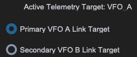
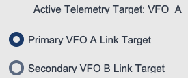

## sCTkRadioButton

### Table of Contents
* [Overview](#overview)
* [Constructor](#constructor)
* [Methods](#methods)
* [Theming (sCTkThemes.json)](#theming-sctkthemesjson)
* [Example](#example)
* [Known Limitations](#known-limitations)

---

### Overview

`sCTkRadioButton` is a themeable subclass of `customtkinter.CTkRadioButton`. It adds automatic light/dark theme resolution from `sCTkThemes.json` and a distinct enabled/disabled visual state, using CustomTkinter's native `state="disabled"` — confirmed by direct testing to correctly block clicks.

  &emsp; &emsp; &emsp; &emsp;
 

---

### Constructor

```python
sCTkRadioButton(master=None, variable=None, value=None, command=None, **kw)
```

| Parameter | Type | Default | Description |
|---|---|---|---|
| `master` | widget | `None` | Parent container. |
| `variable` | `tkinter.Variable` | `None` | Shared variable used for mutual exclusion within a group. |
| `value` | any | `None` | This button's value — the button shows as selected when `variable` equals this. |
| `command` | `callable` | `None` | Called when the button is selected. |
| `**kw` | — | — | Any native `CTkRadioButton` argument, or an override for one of the theme keys listed under [Theming](#theming-sctkthemesjson). |

```python
mode_var = tkinter.StringVar(value="AM")
am_radio = sCTkRadioButton(control_panel, text="AM", variable=mode_var, value="AM")
fm_radio = sCTkRadioButton(control_panel, text="FM", variable=mode_var, value="FM")
am_radio.pack(anchor="w")
fm_radio.pack(anchor="w")
```

---

### Methods

| Method | Returns | Description |
|---|---|---|
| `state(mode=None)` | `str` | Gets or sets the widget's enabled/disabled state. Only `"disabled"` (case-insensitive) disables it; `"normal"`, `"enabled"`, or `"active"` all enable it. |
| `get_state()` | `str` | Equivalent to calling `state()` with no argument. |
| `configure(**kwargs)` / `config(**kwargs)` | varies | Standard widget configuration, plus: `variable`/`value`/`command`/`state` are each routed individually. Rebinding `variable`/`value` to a new group after construction is confirmed correct by direct testing — it properly tears down the old variable's binding and establishes real mutual exclusion in the new group, with no leftover coupling to the original group. Calling `configure("propname")` with a single property name returns a Tkinter-style query tuple for `state`, `fg_color`, `border_color`, `text_color`, and `hover_color`. |

---

### Theming (`sCTkThemes.json`)

- **Applied once, at construction** — every key in the widget's theme block is merged with any matching keyword arguments and applied when the widget is built.
- **Re-applied on every `state()` change** — `fg_color`, `border_color`, `hover_color`, `text_color`, and `font` are recomputed from the theme's normal values or its `disabled_map` every time you call `state()`.

```json
{
    "sCTkRadioButton": {
        "font": ["Arial", 15, "normal"],
        "text_color": ["#374151", "#D1D5DB"],
        "border_width_unchecked": 4,
        "border_width_checked": 6,
        "border_color": ["#64748B", "#94A3B8"],
        "fg_color": ["#1A4375", "#2471A3"],
        "hover_color": ["#112A4B", "#1F618D"],
        "disabled_map": {
            "text_color": ["#94A3B8", "#64748B"],
            "fg_color": ["#CBD5E1", "#374151"],
            "border_color": ["#CBD5E1", "#475569"]
        }
    }
}
```

`border_width_unchecked` and `border_width_checked` are real, top-level-only theme keys (not in `disabled_map`) that control the button's border thickness based on whether it's currently the selected button in its group — thicker when checked, to show the filled dot. They're applied once at construction and left alone afterward; the native widget switches between them internally based on the checked/unchecked state, so no repaint-time logic is needed here.

Colors are stored and passed through as raw `(light, dark)` tuples rather than resolved to a single value ahead of time, so they should correctly follow system/app appearance-mode changes automatically — the same approach validated on `sCTkComboBox`, `sCTkSegmentedButton`, and the button family, though not separately re-confirmed for this specific widget.

---

### Example

```python
import tkinter
import customtkinter as ctk
from scustomtkinter import sCTk, sCTkFrame, sCTkRadioButton, sCTkButtonPrimary

if __name__ == "__main__":
    root = sCTk()
    root.geometry("400x300")
    root.title("RadioButton Example")

    base = sCTkFrame(root)
    base.pack(expand=True, fill="both", padx=20, pady=20)

    mode_var = tkinter.StringVar(value="AM")
    am_radio = sCTkRadioButton(base, text="AM", variable=mode_var, value="AM")
    am_radio.pack(anchor="w", pady=5)
    fm_radio = sCTkRadioButton(base, text="FM", variable=mode_var, value="FM")
    fm_radio.pack(anchor="w", pady=5)

    def toggle_disabled():
        target = "disabled" if am_radio.get_state() == "normal" else "normal"
        am_radio.state(target)
        fm_radio.state(target)
        disable_toggle.configure(text="Enable Group" if target == "disabled" else "Disable Group")

    disable_toggle = sCTkButtonPrimary(base, text="Disable Group", command=toggle_disabled)
    disable_toggle.pack(pady=15)

    root.mainloop()
```

---

### Known Limitations

- `state()` only recognizes `"disabled"` and `"normal"`/`"enabled"`/`"active"`; any other value matches neither branch, though colors are still harmlessly re-applied.
- Calling `configure("fg_color")` (or similar) returns `str(value)` where `value` may itself be a `(light, dark)` tuple rather than a single resolved color. Known gap shared with the wider Pygubu single-argument query investigation set aside elsewhere in this project.
- Passing a positional dict to `configure()` merges into the update; a positional property-name string returns the query tuple described above for `state`/`fg_color`/`border_color`/`text_color`/`hover_color`, and falls through to the native widget's `configure()` for anything else.

[Return to Table of Contents](#contents)
