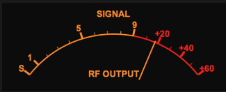

## sCTkSMeter

The `sCTkSMeter` is a standalone, theme-adaptive analog S-Meter/Power Output gauge instrument designed specifically for ham radio transceiver desktop interfaces. Natively inheriting container footprints from `customtkinter.CTkFrame`, it delivers smooth telemetry tracking sweeps without the overhead of extraneous nesting modules.


Dark Mode:  &emsp; &emsp; &emsp; &emsp;
Light Mode:  


---

### 🛠️ Core Gauge Geometry & Scale Mechanics

The instrument face is split mathematically to mirror classic analog transceiver gauge divisions perfectly:
*   **The S-Unit Scale (Ticks 0–9):** Maps incoming telemetry values from `0.0` to `9.0` linearly across the first 60% of the visual arc container, rendered in your high-contrast brand or amber theme palettes.
*   **The Decibel Over S9 Scale (Ticks 9–15):** Maps advanced signal parameters from `9.0` up to `69.0` across the remaining 40% of the dial arc track (where `+20dB` sits at coordinate 29, `+40dB` at 49, and `+60dB` at 69). This region is permanently framed by your crimson/redline alert warning colors.
*   **Unified Pivot Axis Integration:** The inner rendering engines calculate lines, arcs, labels, and needle sweeps using a singular synchronized mathematical pivot point (`center_x = width * 0.48`). This entirely eliminates off-axis tracking drift or floating pointer artifacts when live data streams update.

---

### 📋 API Constructor Reference

```python
sCTkSMeter(master=None, width=250, height=130, state="normal", **kw)
```

| Parameter Name | Data Type | Default Value | Description |
| :--- | :--- | :--- | :--- |
| `master` | `any` | `None` | Reference pointer tracking your root window or parent `sCTkFrame` container layout layer. |
| `width` | `int` | `250` | Panel width in pixels. Supports Pygubu geometry-default reset queries. |
| `height` | `int` | `130` | Panel height in pixels. Supports Pygubu geometry-default reset queries. |
| `state` | `str` | `"normal"` | `"normal"` or `"disabled"`. See [State](#state) below. |

---

### ⚡ Global Object Instance Methods

To drive the needle tracking sweep fluidly inside background receiver threads, automatic VFO frequency scanning loops, or telemetry data parsing hooks, utilize this direct public setter:

#### Update Instrument Needle Position
```python
# Updates pointer positioning dynamically. Expects a float value clamped between 0.0 and 69.0.
smeter.set(value)
```

<a name="state"></a>
### State

| Method | Description |
| :--- | :--- |
| `state(mode=None)` | Getter with no argument; setter with `"normal"` or `"disabled"`. |
| `get_state()` | Equivalent to `state()` with no argument. |
| `configure(state=...)` | Same effect. Both routes are supported. |
| `cget("state")` | Reads the current state. |
| `configure("state")` | Pygubu-style single-argument query. |

**Disabling dims, it does not freeze.** `state("disabled")` changes only the palette. `set()` continues to update the needle, and the gauge keeps tracking live values in the dimmed colours. This is deliberate for an output-only instrument: a meter that held its last reading while greyed out would be indistinguishable from one showing a current value, which on a radio panel is actively misleading. There is no input to lock out — the state exists so a panel can disable every widget it contains uniformly.

The background is deliberately **not** dimmed; the face and needle carry the signal, matching `sCTkScrollableFrame` and the dial family.

---

### 🎨 Centralized Stylesheet Integration (`sCTkThemes.json`)

```json
{
    "sCTkSMeter": {
        "fg_color": ["#F4F7FA", "#0A0A0A"],
        "text_color": ["#1A4375", "#FF9100"],
        "alarm_color": ["#990000", "#FF2200"],
        "needle_color": ["#112A4B", "#FF9100"],
        "font": ["Arial", 10, "bold"],
        "scale_font": ["Arial", 10, "bold"],
        "disabled_map": {
            "text_color": ["#94A3B8", "#4B5563"],
            "alarm_color": ["#CBD5E1", "#4B5563"],
            "needle_color": ["#94A3B8", "#4B5563"]
        }
    }
}
```

**Every key above is required.** Construction raises `KeyError` naming the missing key and whether it belongs at the top level or in `disabled_map`. This replaced a pattern of `.get(key, ("#hex", "#hex"))` throughout the draw code, which silently substituted a plausible guess and made an incomplete theme block look merely slightly-off rather than broken.

`font` is used for the "SIGNAL" and "RF OUTPUT" captions; `scale_font` for the numeric tick labels and the "S" marker. They're separate keys because the widget makes that distinction, even though the default values happen to match.

> **Font size has layout consequences.** Label positions are computed from fixed pixel offsets tuned for 10pt text. A noticeably larger font will overlap the tick marks and the arc — the widget does not measure text and adjust. Change these values in small steps and look at the result.

**Fixed:** the configured `fg_color` never actually rendered. It was popped out of the resolved defaults in the constructor (correctly — the native frame takes it separately) and then read back afterwards from the dictionary it had been removed from, so the background always fell through to a hardcoded value. Light mode is where this was visible.

---

### Implementation Example & Test Harness

Below is a complete, self-contained interactive test execution script demonstrating how to use `sCTkSMeter`.


```python
#!/usr/bin/python3
# =====================================================================
# 🛠️ TESTING HARNESS IMPORTS & SETUP for S Meter
# =====================================================================

import customtkinter as ctk
from scustomtkinter import sCTkFrame, sCTkButtonPrimary, sCTk, sCTkSMeter
import random


if __name__ == "__main__":

    root = sCTk()
    root.title("sCTk Standalone Analog Gauge")
    root.geometry("450x260")
    root.configure(fg_color=("#F1F5F9", "#1C1C1C"))

    dashboard_frame = sCTkFrame(root, fg_color="transparent", border_width=0)
    dashboard_frame.pack(padx=20, pady=20)

    smeter = sCTkSMeter(dashboard_frame, width=340, height=130)
    smeter.pack(padx=10, pady=10)


    class SignalSimulator:
        def __init__(self, root_win, meter):
            self.root, self.meter = root_win, meter
            self.target, self.needle = 6.0, 0.0

        def shift_vfo(self):
            self.target = random.uniform(1.5, 65.0)
            self.root.after(random.randint(2500, 5000), self.shift_vfo)

        def physics_loop(self):
            jitter = random.uniform(-1.5, 1.5)
            sig = max(0.0, min(69.0, self.target + jitter))
            self.needle += (sig - self.needle) * 0.25
            self.meter.set(self.needle)
            self.root.after(25, self.physics_loop)


    sim = SignalSimulator(root, smeter)
    sim.physics_loop()
    sim.shift_vfo()


    def toggle_theme():
        ctk.set_appearance_mode("Light" if ctk.get_appearance_mode() == "Dark" else "Dark")


    sCTkButtonPrimary(root, text="Toggle Theme mode", command=toggle_theme).pack(pady=5)
    root.mainloop()

```
