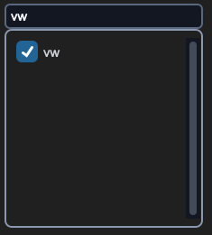

## sCTkSelector

### Table of Contents
* [Overview](#overview)
* [Constructor](#constructor)
* [Methods](#methods)
* [Theming (sCTkThemes.json)](#theming-sctkthemesjson)
* [Example](#example)
* [Known Limitations](#known-limitations)

---

### Overview

`sCTkSelector` is a theme-compliant, scrollable multi-select (or single-select) list of checkboxes, with an optional live-filtering search field. It's built by composing a themed frame, an `sCTkScrollableFrame` for the checkbox list, and one `sCTkCheckBox` per item — not by subclassing a single native CustomTkinter widget.

Dark Mode:  &emsp; &emsp; &emsp; &emsp;
Light Mode: 

This widget inherits `sCTkFrame` directly (rather than raw `ctk.CTkFrame`) — a composition pattern that previously carried a real risk of `ThemeableWidget.__init__` running twice per instance and silently corrupting this widget's own resolved theme data. That risk is now fully closed: `ThemeableWidget` has a run-once guard preventing the double-init, and `sCTkFrame` itself filters its inbound kwargs down to only what native `CTkFrame` actually accepts before its own constructor call. Neither fix required any change to this widget.

---

### Constructor

```python
sCTkSelector(master, items=None, multiple_choices=True, searchBox=True, **kwargs)
```

| Parameter | Type | Default | Description |
|---|---|---|---|
| `master` | widget | — | Parent container. |
| `items` | `list[str]` | `None` | Initial list of checkbox labels. Must not contain duplicates — raises `ValueError` if it does. |
| `multiple_choices` | `bool` | `True` | If `False`, selecting one item automatically deselects any other currently-selected item. |
| `searchBox` | `bool` | `True` | Whether the live-filtering search field is shown above the checkbox list. |
| `**kwargs` | — | — | Any native `CTkFrame` argument, or an override for one of the theme keys listed under [Theming](#theming-sctkthemesjson). |

```python
channel_selector = sCTkSelector(control_panel, items=["Ch 1", "Ch 2", "Ch 3"], multiple_choices=False)
channel_selector.pack(expand=True, fill="both", padx=20, pady=20)
```

---

### Methods

| Method | Returns | Description |
|---|---|---|
| `get_all_items()` | `list[str]` | Every checkbox's label text, regardless of current search filter or selection state. |
| `state(mode=None)` | `str` | Gets or sets the widget's visual state. `"disabled"` locks and dims every checkbox and the search field (routed to the search field's own `"readonly"`, not `"disabled"` — see Known Limitations); anything in `("normal", "enabled", "active")` re-enables both. |
| `get_state()` | `str` | Equivalent to calling `state()` with no argument. |
| `configure(**kwargs)` / `config(**kwargs)` | varies | Standard widget configuration, plus `items`, `multiple_choices`, `searchBox`, `pack_propagate`, `grid_propagate`, and `state` are all handled as first-class properties, matching the constructor. Calling `configure("propname")` with a single property name returns a Tkinter-style query tuple for `state`, `multiple_choices`, `searchBox`, `items`, `pack_propagate`, `grid_propagate`, and `fg_color`/`border_color`/`text_color`. |

---

### Theming (`sCTkThemes.json`)

- **Applied once, at construction** — `fg_color` and `corner_radius` control the outer frame; the checkbox-related keys and `border_color` are validated and applied once at construction time (not repeatedly on every state change).
- **Re-applied on every `state()` change** — the checkbox colors below are recomputed from normal values or `disabled_map` every time you call `state()`.

```json
{
    "sCTkSelector": {
        "fg_color": "transparent",
        "corner_radius": 6,
        "text_color": ["#1F2937", "#F9FAFB"],
        "checkbox_fg_color": ["#1A4375", "#1F6AA5"],
        "checkbox_hover_color": ["#112A4B", "#1A5885"],
        "border_color": ["#94A3B8", "#4B5563"],
        "checkmark_color": ["#FFFFFF", "#FFFFFF"],
        "disabled_map": {
            "text_color": ["#808080", "#666666"],
            "checkbox_fg_color": ["#CBD5E1", "#475569"],
            "border_color": ["#CBD5E1", "#334155"],
            "checkmark_color": ["#F1F5F9", "#94A3B8"]
        }
    }
}
```

**`checkbox_fg_color`/`checkbox_hover_color` are dedicated keys, not reused from `fg_color`.** An earlier version derived each checkbox's accent color from this widget's own `fg_color` — the same key that controls the outer frame's background — falling back to a hardcoded generic blue whenever `fg_color` was `"transparent"` (a common, legitimate choice for a frame, not a theme gap). Reusing one key for two different visual purposes didn't work well; dedicated keys fix that cleanly. All five top-level keys (`text_color`, `checkbox_fg_color`, `checkbox_hover_color`, `border_color`, `checkmark_color`) and four `disabled_map` keys (all but `checkbox_hover_color` — disabled checkboxes reuse `checkbox_fg_color` for hover too, since hover can't meaningfully trigger while disabled) are required; missing any raises immediately at construction.

**`border_color` is also shared with this widget's two internal sub-widgets** (the search field and the checkbox-list frame), passed in once at construction so their *normal*-state border visually matches this widget's own border — confirmed by direct testing that these two sub-widgets' own independent default themes can otherwise visibly mismatch, especially in dark mode. This only establishes the shared normal-state value; each sub-widget's own state-driven color changes (the search field's readonly/disabled coloring in particular) are left completely untouched afterward.

Every color is passed through as a raw `(light, dark)` tuple, letting CustomTkinter's native appearance-mode tracking handle repaints automatically, consistent with the approach used throughout this project.

---

### Example

```python
from scustomtkinter import sCTk, sCTkFrame, sCTkSelector, sCTkButtonPrimary, sCTkLabelPrimary

if __name__ == "__main__":
    root = sCTk()
    root.geometry("400x420")
    root.title("Selector Example")

    base = sCTkFrame(root)
    base.pack(expand=True, fill="both", padx=20, pady=20)

    selector = sCTkSelector(base, items=[f"Item {i}" for i in range(1, 21)])
    selector.pack(expand=True, fill="both", pady=10)

    status = sCTkLabelPrimary(base, text=f"state: {selector.get_state()}")
    status.pack(pady=5)

    def toggle_disabled():
        target = "disabled" if selector.get_state() == "normal" else "normal"
        selector.state(target)
        status.configure(text=f"state: {selector.get_state()}")
        toggle_btn.configure(text="Enable" if target == "disabled" else "Disable")

    toggle_btn = sCTkButtonPrimary(base, text="Disable", command=toggle_disabled)
    toggle_btn.pack(pady=10)

    root.mainloop()
```

---

### Known Limitations

- **Disabling this widget routes the search field to `"readonly"`, not `"disabled"`** — deliberate, so its text remains selectable/copyable, but worth knowing if you expected a uniform `"disabled"` state across every sub-component.
- Calling `configure("fg_color")` (or similar) returns `str(value)` where `value` may itself be a `(light, dark)` tuple rather than a single resolved color. Known gap shared with the wider Pygubu single-argument query investigation set aside elsewhere in this project.
- **`.config()` previously bypassed this widget entirely.** Tkinter binds `.config` to `.configure` as a separate class attribute rather than tracking a subclass's override, and this class had no `config = configure` line — so `.config(...)` skipped the `items`/`searchBox`/`multiple_choices`/`state` handling and landed on `sCTkFrame`'s `configure()` instead. Fixed. Note this widget uses the older `(self, cnf=None, **kwargs)` signature rather than `*args`; that's correct here and is *not* the shape that caused the tuple-comparison bugs found elsewhere in the library, since `cnf` is a real parameter holding the value itself.
- `items` must not contain duplicate labels — `configure(items=[...])` raises `ValueError` if it does, since selection tracking is index-based and duplicate labels would make search filtering ambiguous.

[Return to Table of Contents](#contents)
