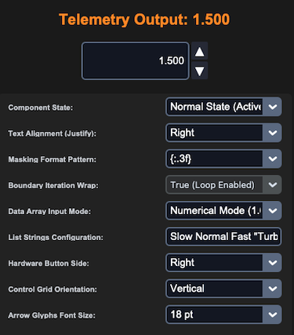
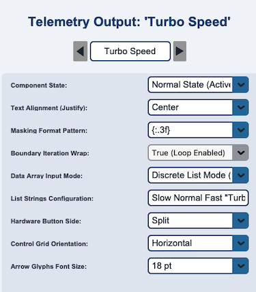

## sCTkSpinbox

### Table of Contents
* [Overview](#overview)
* [Constructor](#constructor)
* [Methods](#methods)
* [Theming (sCTkThemes.json)](#theming-sctkthemesjson)
* [Example](#example)
* [Known Limitations](#known-limitations)

---

### Overview

`sCTkSpinbox` is a theme-compliant subclass of `customtkinter.CTkFrame` that composes an internal `sCTkEntryPrimary` alongside two increment/decrement buttons. It supports two operating modes: stepping a numeric value between `from_` and `to` in increments of `step_size`, or cycling through a fixed list of string values.

Dark Mode:  &emsp; &emsp; &emsp; &emsp;
Light Mode: 

Like `sCTkEntryPrimary`, this widget has a genuine three-state model — normal, readonly, and disabled — matching real `ttk.Spinbox` semantics. The key distinction: in readonly mode, the entry can't be typed into directly, but the increment/decrement buttons stay fully clickable, since they're the intended alternative way to change the value. The buttons themselves only ever report `"normal"` or `"disabled"` — `"readonly"` isn't a real native `CTkButton` concept, and there's no reason for the buttons to look any different in readonly mode, since nothing about their own behavior changes.

Every property this widget forwards to its internal entry (`width`, `height`, `justify`, `show`, `exportselection`, `placeholder_text`, `fg_color`, `border_color`, `text_color`, `state`) has been confirmed valid against CustomTkinter's own real `CTkEntry` source — both its explicit named constructor/configure parameters and its `_valid_tk_entry_attributes` whitelist. There's no risk of this widget sending an unrecognized property to its own entry.

---

### Constructor

```python
sCTkSpinbox(master=None, from_=0.0, to=100.0, step_size=1.0, command=None,
            state="normal", wrap=False, justify="left", show=None,
            placeholder_text=None, exportselection=True, width=140, height=32, **kw)
```

| Parameter | Type | Default | Description |
|---|---|---|---|
| `master` | widget | `None` | Parent container. |
| `from_` | `float` | `0.0` | Lower bound of the numeric range. Ignored in discrete-value mode (see `values` below). |
| `to` | `float` | `100.0` | Upper bound of the numeric range. Ignored in discrete-value mode. |
| `step_size` | `float` | `1.0` | Amount added or subtracted per click of the up/down buttons. |
| `command` | `callable` | `None` | Called with the new value whenever it changes, via either button click or `set()`. |
| `state` | `str` | `"normal"` | Initial state: `"normal"`, `"readonly"`, or `"disabled"`. Any other value is treated as `"normal"`. |
| `wrap` | `bool` | `False` | If `True`, stepping past either bound (or past either end of a discrete value list) wraps around instead of stopping. |
| `justify` | `str` | `"left"` | Text alignment inside the entry: `"left"`, `"center"`, or `"right"`. |
| `show` | `str` | `None` | Character-masking string, e.g. `"*"` for password-style display. |
| `placeholder_text` | `str` | `None` | Placeholder shown when the entry is empty. |
| `exportselection` | `bool` | `True` | Standard Tkinter selection-to-clipboard behavior. |
| `width` / `height` | `int` | `140` / `32` | Overall widget dimensions in pixels. |
| `**kw` | — | — | `button_width`, `button_height`, `button_side` (`"left"`/`"right"`/`"split"`), `orientation` (`"vertical"`/`"horizontal"`), `arrow_font_size`, `format`, `values` — see [Theming](#theming-sctkthemesjson) for where these come from — plus any theme-key override.|

```python
freq_spinbox = sCTkSpinbox(control_panel, from_=88.0, to=108.0, step_size=0.1, placeholder_text="MHz")
freq_spinbox.pack(pady=10)
```

---

### Methods

| Method | Returns | Description |
|---|---|---|
| `get()` | `str` | Current entry text. |
| `set(value)` | `None` | Sets the displayed value (a number, or a string matching one of `values` in discrete mode), and calls `command` if one was given. Temporarily re-enables the entry to update its text if it isn't currently `"normal"`, then restores whatever state it was actually in — including `"readonly"`, not just `"normal"`/`"disabled"`. |
| `set_values(list_of_strings)` | `None` | Switches to discrete-value mode with the given list, or back to numeric mode if given an empty list. |
| `state(mode=None)` | `str` | Gets or sets the widget's normal/readonly/disabled state. The entry receives the full three-way state (routed through its own `state()`); the up/down buttons only ever receive `"normal"` or `"disabled"`. |
| `get_state()` | `str` | Equivalent to calling `state()` with no argument. |
| `configure(**kwargs)` / `config(**kwargs)` | varies | Standard configuration, plus all the constructor's custom keywords (`button_width`, `orientation`, `format`, `values`, etc.) can be changed at runtime the same way. |
| `cget(attribute_name)` | varies | Supports querying `state`, `from_`, `to`, `step_size`, `button_width`, `button_height`, `button_side`, `orientation`, `arrow_font_size`, `format`, `wrap`, and `values` directly, in addition to standard native properties. |

---

### Theming (`sCTkThemes.json`)

```json
{
    "sCTkSpinbox": {
        "font": ["Arial", 15, "normal"],
        "arrow_font": ["Arial", 8, "normal"],
        "arrow_up_char": "▲",
        "arrow_down_char": "▼",
        "arrow_right_char": "▶",
        "arrow_left_char": "◀",
        "border_width": 1.5,
        "corner_radius": 6,
        "entry_color": ["#FFFFFF", "#111827"],
        "border_color": ["#1A4375", "#64748B"],
        "text_color": ["#1F2937", "#F9FAFB"],
        "placeholder_text_color": ["#5A6E7F", "#526071"],
        "button_color": ["#9E9E9E", "#2A2F3D"],
        "button_hover_color": ["#7D7D7D", "#374151"],
        "disabled_map": {
            "entry_color": ["#F3F4F6", "#1F2937"],
            "border_color": ["#CBD5E1", "#475569"],
            "text_color": ["#94A3B8", "#64748B"],
            "button_color": ["#CBD5E1", "#334155"]
        },
        "readonly_map": {
            "entry_color": ["#F8FAFC", "#1F2937"],
            "border_color": ["#64748B", "#94A3B8"],
            "text_color": ["#1F2937", "#F9FAFB"]
        }
    }
}
```

`entry_color`/`border_color`/`text_color` override the internal entry's own colors for all three states, a deliberate design choice: this widget controls its entry's look via its own theme keys rather than the entry's independent defaults. `readonly_map` requires `entry_color`, `border_color`, and `text_color` whenever readonly is actually requested — missing any raises immediately. No readonly-specific `button_color` exists or is needed, since buttons always use normal `button_color`/`button_hover_color` whenever they aren't disabled — they're meant to look completely ordinary in readonly mode.

`arrow_font` is read in full — family, size, and weight — and applied to both increment/decrement buttons. It can also be overridden at runtime via `configure(arrow_font=(...))`, or `configure(arrow_font_size=...)` to change just the size without respecifying the full tuple.

---

### Example

```python
from scustomtkinter import sCTk, sCTkFrame, sCTkSpinbox, sCTkButtonPrimary, sCTkLabelPrimary

if __name__ == "__main__":
    root = sCTk()
    root.geometry("400x250")
    root.title("Spinbox Example")

    base = sCTkFrame(root)
    base.pack(expand=True, fill="both", padx=20, pady=20)

    freq_spinbox = sCTkSpinbox(base, from_=88.0, to=108.0, step_size=0.1, placeholder_text="MHz")
    freq_spinbox.pack(pady=10)

    status = sCTkLabelPrimary(base, text=f"state: {freq_spinbox.get_state()}")
    status.pack(pady=5)

    def cycle_state():
        order = ["normal", "readonly", "disabled"]
        current = freq_spinbox.get_state()
        next_state = order[(order.index(current) + 1) % len(order)]
        freq_spinbox.state(next_state)
        status.configure(text=f"state: {freq_spinbox.get_state()}")

    cycle_btn = sCTkButtonPrimary(base, text="Cycle State", command=cycle_state)
    cycle_btn.pack(pady=10)

    root.mainloop()
```

---

### Known Limitations

- **The disable/enable-cycle cursor-position fix is not independently confirmed for readonly transitions** — the underlying entry inherits this caveat from `sCTkEntryPrimary`; see that widget's docs for the full explanation.
- **`readonly` mode's placeholder behavior follows `sCTkEntryPrimary`'s** — a readonly field showing placeholder text never clears it on focus, since native CustomTkinter deliberately never deactivates a placeholder while `state` is `"readonly"`.
- Calling `configure("propname")` for most single-argument property queries returns a Tkinter-style tuple whose `current` value may be `str()` of a `(light, dark)` color tuple rather than a single resolved color — the same known gap as elsewhere in this project's Pygubu-query investigation.

[Return to Table of Contents](#contents)
