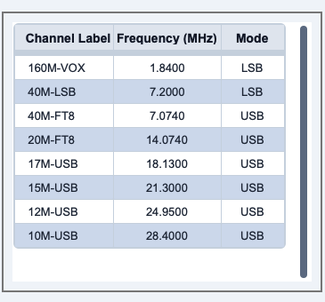

## sCTkTableview

### Table of Contents
* [Overview](#overview)
* [Constructor](#constructor)
* [Methods](#methods)
* [Theming (sCTkThemes.json)](#theming-sctkthemesjson)
* [Example](#example)
* [Known Limitations](#known-limitations)

---

### Overview

`sCTkTableview` is a theme-compliant, scrollable grid of labeled cells — a simple spreadsheet-like table, with optional zebra-striped rows, click and edit callbacks, and in-place cell editing. It's built by inheriting `sCTkScrollableFrame` directly, using its scrolling and label feature, then laying out its own header row and cell grid on top.

  &emsp; &emsp; &emsp; &emsp;
 

This widget inherits `sCTkScrollableFrame` directly — the same composition pattern used by `sCTkSelector` — and previously needed a fragile workaround for it: temporarily overwriting its own `self.__class__.__name__` during construction, to trick `sCTkScrollableFrame`'s internal `ThemeableWidget.__init__` call into reading a harmless theme block instead of corrupting this widget's own. That workaround has been removed entirely. `ThemeableWidget`'s run-once guard now prevents the double-init outright, and `sCTkScrollableFrame` itself filters its inbound kwargs down to only what native `CTkScrollableFrame` actually accepts — confirmed directly against CustomTkinter's source to have no `**kwargs` catch-all at all, so this filtering matters more here than for almost any other widget in this project.

---

### Constructor

```python
sCTkTableview(master, columns=None, width=500, height=300, grid_mode="zebra",
              header_line_width=2, outline_width=1.0, outline_radius=4,
              state="normal", num_columns=3, num_rows=1, show_headers=True,
              cell_bg_color=None, cell_alt_bg_color=None, *args, **kwargs)
```

| Parameter | Type | Default | Description |
|---|---|---|---|
| `master` | widget | — | Parent container. |
| `columns` | `list[str]` or comma-separated `str` | `None` | Column header labels. |
| `width` / `height` | `int` | `500` / `300` | Overall widget dimensions in pixels. |
| `grid_mode` | `"zebra"` / `"grid"` / `"none"` | `"zebra"` | Row background styling. |
| `header_line_width` | `int` | `2` | Header row's bottom border thickness. |
| `outline_width` / `outline_radius` | `float` / `int` | `1.0` / `4` | Outer table border thickness and corner rounding. |
| `state` | `"normal"` / `"disabled"` | `"normal"` | Initial state. |
| `num_columns` / `num_rows` | `int` | `3` / `1` | Initial grid size when `columns` isn't given. |
| `show_headers` | `bool` | `True` | Whether the header row is shown. |
| `cell_bg_color` / `cell_alt_bg_color` | color | `None` | Overrides the theme's cell background colors for this instance specifically — see [Theming](#theming-sctkthemesjson) for how this interacts with the theme file. |
| `**kwargs` | — | — | Any native `CTkScrollableFrame` argument, or an override for one of the other theme keys listed under [Theming](#theming-sctkthemesjson). |

```python
readings_table = sCTkTableview(control_panel, columns=["Time", "Frequency", "Signal"], num_rows=8)
readings_table.pack(expand=True, fill="both", padx=20, pady=20)
```

---

### Methods

| Method | Returns | Description |
|---|---|---|
| `state(mode=None)` / `get_state()` | `str` | Gets or sets `"normal"`/`"disabled"`. |
| `configure(**kwargs)` / `config(**kwargs)` | varies | Standard configuration, plus `state=...` triggers a full color/font re-application across every header and cell. |

---

### Theming (`sCTkThemes.json`)

- **Applied once, at construction** — every key below, plus `cell_bg_color`/`cell_alt_bg_color` (which can also come from the constructor, see below).
- **Re-applied on every `state()` change.**

```json
{
    "sCTkTableview": {
        "header_bg_color": ["#E2E8F0", "#0F172A"],
        "header_text_color": ["#0F172A", "#F8FAFC"],
        "header_font": ["Arial", 14, "bold"],
        "cell_bg_color": ["#FFFFFF", "#111827"],
        "cell_alt_bg_color": ["#D1DCEE", "#222C3A"],
        "cell_text_color": ["#1E293B", "#E2E8F0"],
        "cell_font": ["Arial", 13, "normal"],
        "grid_line_color": ["#CBD5E1", "#334155"],
        "disabled_map": {
            "header_bg_color": ["#CBD5E1", "#1E293B"],
            "header_text_color": ["#94A3B8", "#64748B"],
            "cell_bg_color": ["#F1F5F9", "#1F2937"],
            "cell_alt_bg_color": ["#E2E8F0", "#263241"],
            "cell_text_color": ["#94A3B8", "#64748B"],
            "grid_line_color": ["#E2E8F0", "#293548"]
        }
    }
}
```

All six colors are required both at the top level and in `disabled_map` — missing any raises immediately at construction, naming the exact key. `header_font`/`cell_font` are required only at the top level; no widget in this project uses a disabled-state font variant.

**`cell_bg_color`/`cell_alt_bg_color` are the two exceptions** — they can come from either the theme block *or* the constructor kwarg of the same name, so it's only a hard failure if *neither* provides a value. Whichever one this instance resolves to at construction is remembered and correctly restored on every return to `"normal"` — an earlier version always reverted to the theme's value on re-enable, silently discarding a constructor override after a disable/enable cycle.

Colors are passed through as raw `(light, dark)` tuples, letting CustomTkinter's native appearance-mode tracking handle repaints — an earlier version resolved disabled-state colors to a single fixed string while leaving enabled-state colors as tuples, meaning a disabled table would stop following light/dark mode changes while an enabled one kept working correctly. Both branches are now consistent.

---

### Example

```python
from scustomtkinter import sCTk, sCTkFrame, sCTkTableview, sCTkButtonPrimary

if __name__ == "__main__":
    root = sCTk()
    root.geometry("400x300")
    root.title("Tableview Example")

    base = sCTkFrame(root)
    base.pack(expand=True, fill="both", padx=20, pady=20)

    table = sCTkTableview(base, columns=["Time", "Frequency", "Signal"], num_rows=6)
    table.pack(expand=True, fill="both", pady=10)

    def toggle_disabled():
        target = "disabled" if table.get_state() == "normal" else "normal"
        table.configure(state=target)
        toggle_btn.configure(text="Enable Table" if target == "disabled" else "Disable Table")

    toggle_btn = sCTkButtonPrimary(base, text="Disable Table", command=toggle_disabled)
    toggle_btn.pack(pady=10)

    root.mainloop()
```

---

### Known Limitations

- Missing a required theme key raises `KeyError` at construction, naming exactly which key and whether it's needed at the top level or in `disabled_map` — check the exact message if construction fails after a theme file change.
- Calling `configure("propname")` for most single-argument property queries falls through to the native widget's `configure()`, which doesn't support arbitrary single-argument queries — the same known gap as elsewhere in this project's Pygubu-query investigation.

[Return to Table of Contents](#contents)
