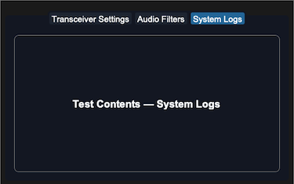
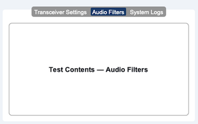

## sCTkTabview

`sCTkTabview` is a themeable multi-page tab container — a subclass of `customtkinter.CTkTabview` with automatic light/dark theme resolution from `sCTkThemes.json`, a disabled state, and Pygubu Designer support.




Its one structural difference from the native widget: `add()` and `tab()` return an **`sCTkFrame`**, not a `ctk.CTkFrame`. See [Tab Pages](#tab-pages).

<a name="contents"></a>
### Table of Contents
* [Constructor](#constructor)
* [Tab Pages](#tab-pages)
* [Pygubu Designer Tab Insertion](#pygubu-designer)
* [Methods](#methods)
* [Theming (sCTkThemes.json)](#stylesheet)
* [Example](#template)
* [Known Limitations](#limitations)

---

<a name="constructor"></a>
### Constructor

```python
tabview = sCTkTabview(master=None, **kw)
```

| Parameter | Type | Default | Description |
| :--- | :--- | :--- | :--- |
| `master` | widget | `None` | Parent container. |
| `state` | `str` | `"normal"` | `"normal"` or `"disabled"`. Also settable via `configure(state=...)` or `state()`. |
| `**kw` | — | — | Any native `CTkTabview` argument, or an override for one of the theme keys listed under [Theming](#stylesheet). |

Construction **raises `KeyError` immediately** if the theme block is incomplete — see [Theming](#stylesheet).

---

<a name="tab-pages"></a>
### Tab Pages

Native `CTkTabview.add()` constructs a plain `ctk.CTkFrame` for each tab and grids it inline, with no hook to substitute a different class. Rather than reimplement `add()` against CustomTkinter's internals — or mutate the created frame's `__class__` at runtime, a fragile pattern deliberately retired elsewhere in this project — this widget embeds an `sCTkFrame` **inside** the native tab frame and hands that back instead.

The native frame stays exactly where `CTkTabview` put it and keeps doing its own show/hide/grid work untouched; it just becomes an invisible outer shell. The wrapper is transparent with no border of its own, so the tab looks identical — the difference is purely structural: everything placed in a tab now has an `sCTk` widget as its parent.

```python
# add() returns the page directly -- no separate tab() call needed.
page = widget.add("Transceiver Settings")

inner_panel = sCTkFrame(page, border_width=1)
inner_panel.pack(expand=True, fill="both", padx=10, pady=10)
```

`tab(name)` returns the same object on every call, and creates the wrapper on first use — so a tab created by any other path (`insert()`, or `CTkTabview`'s own machinery) still comes back correctly wrapped. If you specifically need the native outer shell, `ctk.CTkTabview.tab(widget, name)` still reaches it.

---

<a name="pygubu-designer"></a>
### Pygubu Designer Tab Insertion

Nesting children within the Pygubu Designer layout pane requires adherence to CustomTkinter's native tab allocation slots.

1. **Chassis placement:** Locate the custom widget container on your workbench tree panel and place an instance of `sCTkTabview` into your frame layout.
2. **Tab component selection:** In the Pygubu Designer widget selector tree, expand the CustomTkinter widget set and locate the native element named **`CTkTabview.Tab`**.
3. **Parent nesting assignment:** Drop the **`CTkTabview.Tab`** element directly onto the parent `sCTkTabview` widget slot in your inspector tree layout.
4. **Repeat allocation:** Repeat for each additional page slot. Tabs can then be named individually using the workspace property sidebars.

Note that tabs created this way are native `CTkTabview.Tab` slots. Calling `widget.tab(name)` on one still returns a wrapped `sCTkFrame`, since wrapping happens lazily on first access.

---

<a name="methods"></a>
### Methods

| Method | Returns | Description |
| :--- | :--- | :--- |
| `add(name)` | `sCTkFrame` | Creates a tab and returns its content page. Return type differs from native `CTkTabview.add()`. |
| `tab(name)` | `sCTkFrame` | Returns a tab's content page, creating the wrapper on first use. Stable across calls. |
| `delete(name)` | — | Deletes a tab, tearing down its page wrapper first so no stale entry is left behind. |
| `state()` / `state(mode)` | `str` | Getter with no argument; setter with `"normal"` or `"disabled"`. Dims text, flattens the tab bar, and locks tab selection. |
| `get_state()` | `str` | Equivalent to `state()` with no argument. |
| `configure(**kwargs)` / `config(**kwargs)` | `None` | Standard configuration. Accepts `state` alongside any native option. |
| `configure("state")` | `tuple` | Pygubu-style single-argument query, returning `(name, name, name, default, current)`. |
| `cget(name)` | `Any` | Extended to know about `state`; everything else passes through to the native widget. |

All four state paths — `state()`, `get_state()`, `cget("state")`, and `configure(state=...)` — operate on the same underlying value and agree with each other.

**On `bind()`:** native `CTkTabview.bind()` raises `NotImplementedError`. This widget overrides it to route through `tkinter.Frame.bind` instead, so Pygubu Designer click handling doesn't crash the workspace.

---

<a name="stylesheet"></a>
### Theming (`sCTkThemes.json`)

```json
{
    "sCTkTabview": {
        "font": ["Arial", 15, "normal"],
        "segmented_button_height": 36,
        "fg_color": ["#FFFFFF", "#111827"],
        "text_color": ["#FFFFFF", "#FFFFFF"],
        "segmented_button_fg_color": ["#9E9E9E", "#111827"],
        "segmented_button_selected_color": ["#1A4375", "#2471A3"],
        "segmented_button_selected_hover_color": ["#112A4B", "#1F618D"],
        "segmented_button_unselected_color": ["#9E9E9E", "#1F2937"],
        "segmented_button_unselected_hover_color": ["#7D7D7D", "#374151"],
        "disabled_map": {
            "segmented_button_fg_color": ["#FFFFFF", "#111827"],
            "segmented_button_selected_color": ["#CBD5E1", "#374151"],
            "segmented_button_unselected_color": ["#CBD5E1", "#374151"],
            "text_color": ["#94A3B8", "#64748B"]
        }
    }
}
```

**Every key above is required.** Construction raises `KeyError` naming exactly what's missing, rather than substituting a guessed color. This is the fail-loud principle used across the project — an earlier version fell back to hardcoded literals for all ten colors and the font, and because those guesses looked plausible, a broken or partial theme block was invisible.

The split between the two blocks:

| Keys | Required in |
| :--- | :--- |
| `text_color`, `segmented_button_fg_color`, `segmented_button_selected_color`, `segmented_button_unselected_color` | top level **and** `disabled_map` |
| `segmented_button_selected_hover_color`, `segmented_button_unselected_hover_color`, `font`, `segmented_button_height` | top level only |

The two hover colors deliberately have no `disabled_map` entry. A disabled tab bar must not light up under the cursor, so when disabled, hover collapses to the corresponding non-hover disabled color. There is no meaningful "dimmed hover" distinct from "dimmed", so requiring a separate key would only invite them to drift apart. `font` and `segmented_button_height` are top level only because neither changes with state.

`font` and `segmented_button_height` are both intercepted before native construction and forwarded to the internal segmented button. This is not optional: `CTkTabview` names every parameter explicitly with no `**kwargs` catch-all, so any key it doesn't recognize raises `ValueError` from its constructor. They're applied once rather than on every repaint, since neither varies by state. See [Known Limitations](#limitations) regarding what `segmented_button_height` actually achieves.

**Validation is scoped to direct construction.** A subclass reaches this constructor with `final_kw` built from *its own* theme block — `ThemeableWidget`'s run-once guard means it is never rebuilt — so validating these keys against a subclass's block would raise on every construction. Subclasses own their own theme contract.

---

<a name="template"></a>
### Example

```python
#!/usr/bin/python3
import customtkinter as ctk
from scustomtkinter import sCTkFrame, sCTkButtonPrimary, sCTkLabelPrimary, sCTk, sCTkTabview

if __name__ == "__main__":
    root = sCTk()
    root.geometry("640x480")
    root.title("sCTkTabview Container Validation Bench")
    root.configure(fg_color=("#F1F5F9", "#1C1C1C"))

    base = sCTkFrame(root, border_width=2)
    base.pack(expand=True, fill="both", padx=20, pady=20)

    widget = sCTkTabview(base)
    widget.pack(expand=True, fill="both", padx=10, pady=10)

    for page_name in ["Transceiver Settings", "Audio Filters", "System Logs"]:
        # add() returns the sCTkFrame content page directly.
        page_viewport = widget.add(page_name)

        inner_frame = sCTkFrame(page_viewport, border_width=1, corner_radius=8)
        inner_frame.pack(expand=True, fill="both", padx=10, pady=10)

        test_label = sCTkLabelPrimary(inner_frame, text=f"Test Contents — {page_name}")
        test_label.pack(expand=True, fill="none", padx=20, pady=20)

    def toggle_tab_lock():
        target = "disabled" if widget.state() == "normal" else "normal"
        widget.configure(state=target)
        btn_lock.configure(
            text="Unlock Tabview Navigation" if target == "disabled" else "Lock Tabview (Set 'disabled')")
        print(f"state()={widget.state()}  cget={widget.cget('state')}")

    def toggle_temp_page():
        if "Scratch Pad" in widget._sctk_pages:
            widget.delete("Scratch Pad")
            btn_temp.configure(text="Add Runtime Page")
        else:
            page = widget.add("Scratch Pad")
            sCTkLabelPrimary(page, text="Created at runtime").pack(expand=True, padx=20, pady=20)
            btn_temp.configure(text="Delete Runtime Page")

    def toggle_skin_preference():
        ctk.set_appearance_mode("Light" if ctk.get_appearance_mode() == "Dark" else "Dark")

    control_tray = sCTkFrame(root, fg_color="transparent")
    control_tray.pack(side="bottom", fill="x", padx=20, pady=(0, 15))

    btn_lock = sCTkButtonPrimary(control_tray, text="Lock Tabview (Set 'disabled')", command=toggle_tab_lock)
    btn_lock.pack(side="left", expand=True, padx=4)

    btn_temp = sCTkButtonPrimary(control_tray, text="Add Runtime Page", command=toggle_temp_page)
    btn_temp.pack(side="left", expand=True, padx=4)

    btn_skin = sCTkButtonPrimary(control_tray, text="Toggle UI Light/Dark Appearance", command=toggle_skin_preference)
    btn_skin.pack(side="right", expand=True, padx=4)

    root.mainloop()
```

---

<a name="limitations"></a>
### Known Limitations

- **`segmented_button_height` is currently a no-op, retained for possible future use.** The value is applied to the internal segmented button and `cget("height")` reports it back accurately, but the visible tab strip does **not** grow to match. `CTkTabview` grids the segmented button into a row whose `minsize` comes from its own private spacing constants, and deliberately overlaps the button with the page frame below to produce the connected-tab look. A taller button is clipped by that row rather than expanding it. Confirmed by direct testing: a height of 128 reported back correctly and produced no visible change.

  The key is deliberately kept, and kept **required**, rather than removed. It costs nothing, it keeps the theme contract stable, and it's already wired end-to-end — so if a future CustomTkinter release exposes the strip height, or the internals approach below is revisited, only the application step changes. Do not treat it as broken and delete it; changing the number is expected to do nothing today.

  Making the strip actually taller would mean writing `CTkTabview`'s private `_top_spacing` / `_top_button_overhang` attributes and re-running its `_configure_grid()` — a dependency on CustomTkinter internals that could break on any upstream release. Deliberately not done.

  Note this is a `CTkTabview` layout constraint, **not** a limitation of the segmented button: a standalone `sCTkSegmentedButton` honors `height` normally.
- **Disabling does not cascade to children.** It dims the tab bar and locks tab selection, but widgets placed inside a page are unaffected — disabling them is the caller's responsibility.
- **`add()` and `tab()` return a different type than the native widget.** Code doing an `isinstance` check against `ctk.CTkFrame`, or reaching for CTkFrame-specific internals on a tab page, would notice. `ctk.CTkTabview.tab(widget, name)` still reaches the native shell.
- **The internal segmented button is a native `CTkSegmentedButton`**, not `sCTkSegmentedButton`. It is created inside `CTkTabview.__init__` and re-themed afterwards by pushing colors onto it. Replacing it with the themed variant would let it theme itself and remove most of that code, but the swap hasn't been made.
- **Each tab page carries one extra frame layer** — the native shell plus the `sCTkFrame` wrapper inside it. Transparent and borderless, so invisible, but present in the widget tree.
- **`text_color` is applied by reaching into the segmented button's private `_buttons_dict`**, since CustomTkinter exposes no public way to set per-button text color on a segmented button. This depends on a CustomTkinter internal and could break on a future release.
- **Colors are resolved to a single value** via `_resolve_color()` rather than passed through as raw `(light, dark)` tuples, so appearance-mode changes rely on this widget's own `_set_appearance_mode()` hook re-running the theme pass rather than on CustomTkinter's native tracking.

[Return to Table of Contents](#contents)
